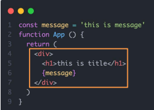

# day01

## React介绍

React由Meta公司研发，是一个用于 构建Web和原生交互界面的库。

相较于传统基于DOM开发的优势：

- 组件化的开发方式 
- 不错的性能

相较于其它前端框架的优势：

- 丰富的生态
- 跨平台支持

#### 搭建环境

create-react-app是一个快速 创建React开发环境的工具，底层由Webpack构建，封装了配置细节，开箱即用。

执行命令： npx create-react-app react-basic 

1. npx Node.js工具命令，查找并执行后续的包命令 
2. create-react-app 核心包（固定写法），用于创建React项目 
3. react-basic React项目的名称（可以自定义）

创建项目的更多方式：https://zh-hans.react.dev/learn/start-a-new-react-project

补充创建方式：

~~~bash
# vite创建
npm create vite@latest
yarn create vite
# pnpm集合了npm和yarn的优点
pnpm create vite
# 可以跟上-t/-template参数指定模板
pnpm create vite -t react
#-t参数：react、vue、vue-ts、react-ts等

# 使用eslint
pnpm i eslint -D
npx eslint --init
~~~

## JSX基础

JSX是JavaScript和XML（HTML）的缩写，表示在JS代码中编写HTML模版结构,它是React中编写 UI模版的方式。

JSX并不是标准的JS语法，它是JS的语法扩展，浏览器本身不能识别，需要通过解析工具做解析之后才能 在浏览器中运行。

优势： 

- HTML的声明式模版写法 
-  JS的可编

#### JS表达式

在JSX中可以通过 大括号语法{} 识别 JavaScript中的表达式，比如常见的变量、函数调用、方法调用等等 

- 使用引号传递字符串 
- 使用JavaScript变量 
- 函数调用和方法调用 
- 使用JavaScript对象

举例：

- 在JSX中可以使用原生JS中的map方法遍历渲染列表
- 可以通过逻辑与运算符&&、三元表达式（?:）实现基础的条件渲染

~~~react
<ul>
  <!-- 需要加上key，提升渲染性能 -->
	{list.map(item =><li key={item.id}>{item}</li>)}
</ul>

{loading ? loading... : this. is span}
~~~

注意：if语句、switch语句、变量声明属于语句，不是表达式，不能出现在{}中

## 事件绑定

语法：on + 事件名称 = { 事件处理程序 }，整体上遵循驼峰命名法

使用事件对象参数：在事件回调函数中设置形参e

传递自定义参数：事件绑定的位置改造成箭头函数的写法，在执行clickHandler实际处理业务函数的时候传递实参（不能直接写函数名并传参，这样的写法它会在进入页面时就执行，并之后执行一次）

~~~react
function App() {
  const clickHandle = (name, e) => {
      console.log('button按钮点击了', name, e)
  }
  {/* 不能写成 onClick={clickHanle('jack')}，这样写会在进入页面时执行一次，之后点击是不会触发该函数的 */}
  return <button onClick={(e) => clickHandle('jack', e)}>click me</button>
}
~~~

## 组件

一个组件就是用户界面的一部分，它可以有自己的逻辑和外观，组件之间可以互相嵌套，也可以复用多次。

在React中，一个组件就是首字母大写的函数，内部存放了组件的逻辑和视图UI, 渲染组件只需要把组件当成标签书写 即可。

~~~react
// 定义组件
function Button () {
  return <button>click me!</button>
}

// 使用组件
function App () {
  return (
 		{/* 自闭和 */} 	 
    <Button/>
    {/* 成对标签 */} 	 
    <Button></Button>
  )
}
~~~

## useState

useState 是一个 React Hook（函数），它允许我们向组件添加一个状态变量, 从而控制影响组件的渲染结果。

本质：和普通JS变量不同的是，状态变量一旦发生变化组件的视图UI也会跟着变化（数据驱动视图）

~~~js
// useState是一个函数，返回值是一个数组
// 数组中的第一个参数是状态变量，第二个参数是set函数用来修改状态变量
// useState的参数将作为count的初始值
const [coutn, setCount] = useState(0)
~~~

### 修改状态的规则

#### 状态不可变

在React中，状态被认为是只读的，我们应该始终替换它而不是修改它，直接修改状态不能引发视图更新

~~~js
count++	// 直接修改，无法引发视图更新
setCount(count + 1)	// 用新值替换旧值，可以引发视图更新

const [form, setForm] = useState({
  age: 12,
  name: 'jack'
})
// 直接修改，无法引发视图更新
const handleChangeName = () => form.name = 'john'
const handleChangeName = () => {
  setForm({
    ...form,
    name: 'john'
  })
}
~~~

#### 修改对象状态

规则：对于对象类型的状态变量，应该始终传给set方法一个全新的对象来进行修改

## 组件的样式处理

React组件基础的样式控制有俩种方式

- 行内样式（不推荐）
- class类名控制

~~~react
// 行内样式（不推荐）

// class类名控制
// index.css 中
.foo {
  color: red;
}
// App.js 中
import './index.css'
function App () {
  return {
    

      
    

  }
}
~~~

补：classnames是一个简单的JS库，可以非常方便的通过条件动态控制class类名的显示

~~~react
// 使用 classNames 后
className={classNames('nav-item', { active: type === item.type, ... })}（类似于vue中的:class）
~~~

# day02

## 受控表单绑定

概念：使用React组件的状态（useState）控制表单的状态

~~~react
// 1.准备一个React状态值
const [value, setValue] = useSate('')
// 2.通过value属性绑定状态，通过onChange属性绑定状态同步的函数
<input type="text" value={value} onChange={e => setValue(e.target.value)}>
</input>
~~~

## 获取DOM

在 React 组件中获取/操作 DOM，需要使用 useRef React Hook钩子函数，分为两步：

~~~js
//1.使用useRef创建 ref 对象，并与 JSX 绑定
const inputRef = useRef(null)
<input type="text" ref={inputRef}/>
//2.通过inputRef.current拿到DOM对象
  console.log(inputRef.current)
~~~

补：

- uuid生成工具：

~~~react
// 安装：npm install uuid
import { v4 as uuidv4 } from 'uuid'	// 导入
uuidv4() // 返回一个生成的uuid
~~~

- 日期格式化工具：

~~~react
// 安装：npm install dayjs
const dayjs = require('dayjs') 
//or
import dayjs from 'dayjs'
dayj(new Date()).format('DD/MM/YYYY')
~~~

## 组件通信

概念：组件通信就是组件之间的数据传递，根据组件嵌套关系的不同，有不同的通信方法。

### 父传子

实现步骤 

- 父组件传递数据 - 在子组件标签上绑定属性 
- 子组件接收数据 - 子组件通过props参数接收数据

~~~react
function Son (props) {
  // props包含了父组件传递过来的所有数据
  console.log(props)	
  return 
父组件传来了：{props.name}

}

function App () {
  const name = 'this is app name'
  return (
    

      <Son name={name}/>
    

  )
}
~~~

说明：

- props可传递任意的数据：数字、字符串、布尔值、数组、对象、函数、JSX
- props是只读对象：子组件只能读取props中的数据，不能直接进行修改, 父组件的数据只能由父组件修改

特殊的prop childre：当我们把内容嵌套在子组件标签中时，父组件会自动在名为children的prop属性中接收该内容

~~~react
function Son (props) {
  // 下面输出结果：父组件传来了：this is span
  return 
父组件传来了：{props.children}

}

// 父组件中
<Son name={appName} age={20}>
  this is span
</Son>
// 子组件中
props: {
  name: 'hello',
  age: 20,
  children: {
    type: 'span',
    props: {
      children: 'this is span'
    },
    ...
  }
}
~~~

### 子传父

核心思路：在子组件中调用父组件中的函数并传递参数

~~~react
function Son () {
  const sonMsg = 'this is son msg'
  return (
    

      <button onClick={() => onGetMsg(sonMSg)}>send</button>
    

  )
}

function App () {
  const getMsg = (msg) => console.log(msg)
  return (
    

      <Son onGetMsg={getMsg}></Son>
    

  )
}
~~~

### 兄弟组件通信

使用状态提升实现兄弟组件通信：借助“状态提升”机制，通过父组件进行兄弟组件之间的数据传递 

- A组件先通过子传父的方式把数据传给父组件App 
- App拿到数据后通过父传子的方式再传递给B组件

### 跨层级组件通信

使用Context机制跨层级组件通信的实现步骤：

- 使用createContext方法创建一个上下文对象Ctx 
- 在顶层组件（App）中通过 Ctx.Provider 组件提供数据 
- 在底层组件（B）中通过 useContext 钩子函数获取消费数据

~~~react
import { createContext, useContext } from 'react'	// 导入
const MsgContext = createContext()	// 创建上下文对象

function A () {
  return (
    

      this is A component
      <B />
    

  )
}

function B () {
  const msg = useContext(MsgContext)
  return (
    

      this is B component,{msg}
    

  )
}

function App () {
  const msg = 'this is app msg'
  return (
    

      {/* 使用Provider提供数据 */}
      <MsgContext.Provider value={msg}>
        this is App
        <A />
      </MsgContext.Provider>
    

  )
}
~~~

## useEffect 的使用

useEffect是一个React Hook函数，用于在React组件中创建不是由事件引起而是由渲染本身引起的操作（副作用）, 比 如发送AJAX请求，更改DOM等等。

比如可以用于在组件渲染完毕之后，需要立刻从服务端获取频道列表数据并显示到页面中的情况。

语法：`useEffect(() => {}, [])`

- 参数1是一个函数，可以把它叫做副作用函数，在函数内部可以放置要执行的操作
- 参数2是一个数组（可选参），在数组里放置依赖项，不同依赖项会影响第一个参数函数的执行，当是一个空数组的时候，副作用函数 只会在组件渲染完毕之后执行一次

接口地址：http://geek.itheima.net/v1_0/channels

#### 参数说明

useEffect副作用函数的执行时机存在多种情况，根据传入依赖项的不同，会有不同的执行表现

| 依赖项         | 副作用函数执行时机                  |
| -------------- | ----------------------------------- |
| 没有依赖项     | 组件初始渲染 + 组件更新时执行       |
| 空数组依赖     | 只在初始渲染时执行一次              |
| 添加特定依赖项 | 组件初始渲染 + 特定依赖项变化时执行 |

#### useEffect 清除副作用

在useEffect中编写的由渲染本身引起的对接组件外部的操作，社区也经常把它叫做副作用操作，比如在useEffect中开 启了一个定时器，我们想在组件卸载时把这个定时器再清理掉，这个过程就是清理副作用。

说明：清除副作用的函数最常见的执行时机是在组件卸载时自动执行 

~~~react
useEffect(() => {
  // 实现副作用操作逻辑
  return () => {
    // 清除副作用逻辑
  }
})
~~~

## 自定义Hook实现

概念：自定义Hook是以 use 打头的函数，通过自定义Hook函数可以用来实现逻辑的封装和复用。

~~~react
// 自定义hook，实现布尔切换的逻辑
function useToggle () {
  const [value, setValue] = useState(true)
  const toggle = () => setValue(!value)      
  return {
    value,
    toggle
  }
}

function App () {
  const { value, toggle } = useToggle()
  return (
    

      {value && 
this is div
}
      <button onClick={toggle}>toggle</button>
    

  )
}
~~~

## Hooks使用规则

使用规则：

- 只能在组件中或者其他自定义Hook函数中调用 
- 只能在组件的顶层调用，不能嵌套在 if、for、其他函数