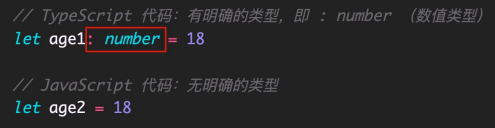

# 1. TS 介绍

## 1.1 TypeScript是什么

TypeScript（简称：TS）是 JavaScript 的**超集**（JS 有的 TS 都有）。 TypeScript = **Type** + JavaScript（在 JS 基础之上，为 JS 添加了**类型支持**）。 TypeScript 是微软开发的开源编程语言，可以在任何运行 JavaScript 的地方运行。



## 1.2 为什么添加类型支持

背景：JS 的类型系统存在“先天缺陷”，JS 代码中绝大部分错误都是类型错误（Uncaught TypeError）。 问题：增加了找 Bug、改 Bug 的时间，严重影响开发效率。


 从编程语言的动静来区分，TypeScript 属于静态类型的编程语言，JS 属于动态类型的编程语言。 静态类型：编译期做类型检查； 动态类型：执行期做类型检查。 

代码编译和代码执行的顺序：1 编译 2 执行。


对于 JS 来说：需要等到代码真正去执行的时候才能发现错误（晚）。 

对于 TS 来说：在代码编译的时候（代码执行前）就可以发现错误（早）。 

并且，配合 VSCode 等开发工具，TS 可以提前到在编写代码的同时就发现代码中的错误，减少找 Bug、改 Bug 时间 。

## 1.3 优势

**TypeScript 相比 JS 的优势**：

1. 更早（写代码的同时）发现错误，减少找 Bug、改 Bug 时间，提升开发效率。 
2. 程序中任何位置的代码都有代码提示，随时随地的安全感，增强了开发体验。 
3. 强大的类型系统提升了代码的可维护性，使得重构代码更加容易。 
4. 支持最新的 ECMAScript 语法，优先体验最新的语法，让你走在前端技术的最前沿。 
5. TS 类型推断机制，不需要在代码中的每个地方都显示标注类型，让你在享受优势的同时，尽量降低了成本。 

除此之外，Vue 3 源码使用 TS 重写、Angular 默认支持 TS、React 与 TS 完美配合，TypeScript 已成为大中型前端 项目的首先编程语言。

# 2. TS 初体验

## 2.1 安装编译 TS 的工具包

问题：为什么要安装编译 TS 的工具包？ 

回答：Node.js/浏览器，只认识 JS 代码，不认识 TS 代码。需要先将 TS 代码转化为 JS 代码，然后才能运行。 

安装命令：npm i -g typescript。 

typescript 包：用来编译 TS 代码的包，提供了 tsc 命令，实现了 TS -> JS 的转化。 

验证是否安装成功：tsc –v（查看 typescript 的版本）。


## 2.2 编译并运行 TS 代码

1. 创建 hello.ts 文件（注意：TS 文件的后缀名为 .ts）。 
2. 将 TS 编译为 JS：在终端中输入命令，tsc hello.ts（此时，在同级目录中会出现一个同名的 JS 文件）。 
3. 执行 JS 代码：在终端中输入命令，node hello.js。


## 2.3 简化运行 TS 的步骤

问题描述：每次修改代码后，都要重复执行两个命令，才能运行 TS 代码，太繁琐。 

简化方式：使用 ts-node 包，直接在 Node.js 中执行 TS 代码。 

安装命令：npm i -g ts-node（ts-node 包提供了 ts-node 命令）。 

使用方式：ts-node hello.ts。 

解释：ts-node 命令在内部偷偷的将 TS -> JS，然后，再运行 JS 代码。

# 3. TS 常用类型

**概述**

TypeScript 是 JS 的超集，TS 提供了 JS 的所有功能，并且额外的增加了：**类型系统**。 

* 所有的 JS 代码都是 TS 代码。 
* JS 有类型（比如，number/string 等），但是 **JS 不会检查变量的类型是否发生变化**。而 **TS 会检查**。 TypeScript 类型系统的主要优势：可以**显示标记出代码中的意外行为**，从而降低了发生错误的可能性。 

1. 类型注解 
2. 常用基础类型

## 3.1 类型注解

实例代码：

~~~typescript
let age: number = 18
~~~

说明：代码中的 : number 就是类型注解。 

作用：为变量添加类型约束。比如，上述代码中，约定变量 age 的类型为 number（数值类型）。 

解释：约定了什么类型，就只能给变量赋值该类型的值，否则，就会报错。


## 3.2 常用基础类型概述

可以将 TS 中的常用基础类型细分为两类：1 JS 已有类型 2 TS 新增类型。 

1. JS 已有类型 
	- 原始类型：number/string/boolean/null/undefined/symbol。 l 
	- 对象类型：object（包括，数组、对象、函数等对象）。 
2. TS 新增类型：联合类型、自定义类型（类型别名）、接口、元组、字面量类型、枚举、void、any 等。

## 3.3 原始类型

原始类型：number/string/boolean/null/undefined/symbol。 

特点：简单。这些类型，完全按照 JS 中类型的名称来书写。

~~~typescript
let age: number = 18
let name: string = '碧落'
let isLoading: boolean = false
~~~

## 3.4 数组类型

对象类型：object（包括，数组、对象、函数等对象）。 

特点：对象类型，在 TS 中更加细化，**每个具体的对象都有自己的类型语法**。 

数组类型的两种写法：（推荐使用 number[] 写法）

~~~typescript
let number: number[] = [1, 3, 5]
let string: Array<string> = ['a', 'b',  'c']

// 如果数组中既有 number 类型，又有 string 类型
let arr: (number | string)[] = [1, 'a', 2, 'b']
~~~

> 解释：| （竖线）在 TS 中叫做联合类型（由两个或多个其他类型组成的类型，表示可以是这些类型中的任意一种）。 
>
> 注意：这是 TS 中联合类型的语法，只有一根竖线，不要与 JS 中的或（||）混淆了。

## 3.5 类型别名

**类型别名**（自定义类型）：为任意类型起别名。 

使用场景：当同一类型（复杂）被多次使用时，可以通过类型别名，简化该类型的使用。

~~~typescript
type MyArray = (number | string)[]
let arr1: MyArray = [1, 'a', 2, 'b']
let arr2: MyArray = [1, 'x', 2, 'y']
~~~

解释： 

	1. 使用 type 关键字来创建类型别名。 
	1. 类型别名（比如，此处的 CustomArray），可以是任意合法的变量名称。 
	1. 创建类型别名后，直接使用该类型别名作为变量的类型注解即可。

## 3.6 函数类型

函数的类型实际上指的是：函数**参数**和**返回值**的类型。 

为函数指定类型的两种方式：1-单独指定参数、返回值的类型；2-同时指定参数、返回值的类型。 

1. 单独指定参数、返回值的类型：

	~~~typescript
	function add(num1: number, num2: number): number {
	    return num1 + num2
	}
	// 箭头函数的形式
	const add = (num1: number, num2: number): number => {
	    return num1 + num2
	}
	~~~

2. 同时指定参数、返回值的类型：

	> 这种方式通常用于将函数的完整类型定义为一个类型别名或接口，然后将其应用于函数。

	~~~typescript
	const add: (num1: number, num2: number) => number = (num1, num2) => {
	    return num1 + num2
	}
	// 先定义类型别名的方式
	type AddType = (num1: number, num2: number) => number
	const add: AddType = (num1, num2) => {
	    return num1 + num2
	}
	~~~

> 解释：当函数作为表达式时，可以通过类似箭头函数形式的语法来为函数添加类型。 
>
> 注意：这种形式只适用于函数表达式。

### void

如果函数没有返回值，那么，函数返回值类型为：void。

~~~typescript
function sayHello(name: string): void {
    console.log(`Hello $name`)
}
~~~

### 可选参数

使用函数实现某个功能时，参数可以传也可以不传。这种情况下，在给函数参数指定类型时，就用到可选参数了。 

比如，数组的 slice 方法，可以 slice() 也可以 slice(1) 还可以 slice(1, 3)。

~~~typescript
function test(n1?: number, n2?: number): void {
    console.log(n1, n2)
}

~~~

> 可选参数：在可传可不传的参数名称后面添加 ?（问号）。 
>
> 注意：可选参数只能出现在参数列表的最后，也就是说可选参数后面不能再出现必选参数。

## 3.7 对象类型

JS 中的对象是由属性和方法构成的，而 TS 中对象的类型就是在描述对象的结构（有什么类型的属性和方法）。

对象类型的写法：

~~~typescript
let student: { name: string; age: number; sayHi(): void } = {
    name: 'biluo',
    age: 19,
    sayHi() {}
}
~~~

> 解释： 
>
> 1. 直接使用 {} 来描述对象结构。属性采用属性名: 类型的形式；方法采用方法名(): 返回值类型的形式。 
> 2. 如果方法有参数，就在方法名后面的小括号中指定参数类型（比如：greet(name: string): void）。 
> 3. 在一行代码中指定对象的多个属性类型时，使用 ;（分号）来分隔。 
> 	* 如果一行代码只指定一个属性类型（通过换行来分隔多个属性类型），可以去掉 ;（分号）。 
> 4. 方法的类型也可以使用箭头函数形式（比如：{ sayHi: () => void }）。

对象的属性或方法，也可以是可选的，此时就用到可选属性了。 

比如，我们在使用 axios({ … }) 时，如果发送 GET 请求，method 属性就可以省略。

~~~typescript
// axios方法的method参数定义类似下方：
function myAxios(config: {
    url: string
    method?: string
}) {...}
~~~

> **可选属性**的语法与函数可选参数的语法一致，都使用 ?（问号）来表示。

## 3.8 接口

当一个对象类型被多次使用时，一般会使用接口（interface）来描述对象的类型，达到**复用**的目的。

~~~typescript
interface IStudent {
    name: string
    age: number
    sayHi(): void
}

let stu: IStudent = {
    name: 'biluo',
    age: 19,
    sayHi() {confirm('Hi')}
}
~~~

> 解释：
>
> 	1. 使用 interface 关键字来声明接口。 
> 	1. 接口名称（比如，此处的 IPerson），可以是任意合法的变量名称。 
> 	1. 声明接口后，直接使用接口名称作为变量的类型。 
> 	1. 因为每一行只有一个属性类型，因此，属性类型后没有 ;（分号）。

interface（接口）和 type（类型别名）的对比： 

- 相同点：都可以给对象指定类型。 
- 不同点： 
	- 接口，只能为对象指定类型。 
	- 类型别名，不仅可以为对象指定类型，实际上可以为任意类型指定别名。

### 继承

如果两个接口之间有相同的属性或方法，可以**将公共的属性或方法抽离出来，通过继承来实现复用**。 

比如，这两个接口都有 x、y 两个属性，重复写两次，可以，但很繁琐。

~~~typescript
interface Point2D { x: number; y: number }
interface Point3D { x: number; y: number; z: number }
// 更好的方式：
interface Point3D extends Point2D { z: number }
~~~

> 1. 使用 extends（继承）关键字实现了接口 Point3D 继承 Point2D。
> 2. 继承后，Point3D 就有了 Point2D 的所有属性和方法（此时，Point3D 同时有 x、y、z 三个属性）。

## 3.9 元组

场景：在地图中，使用经纬度坐标来标记位置信息。 

可以使用数组来记录坐标，那么，该数组中只有两个元素，并且这两个元素都是数值类型。

~~~typescript
let position: number[] = [12.3411, 116.2244]
~~~

使用 number[] 的缺点：不严谨，因为该类型的数组中可以出现任意多个数字。 

更好的方式：元组（Tuple）。 元组类型是另一种类型的数组，它**确切地知道包含多少个元素，以及特定索引对应的类型**。

~~~typescript
let position: [number, number] = [12.3411, 116.2244]
~~~

> 1. 元组类型可以确切地标记出有多少个元素，以及每个元素的类型。 
> 2. 该示例中，元素有两个元素，每个元素的类型都是 number。

## 3.10 类型推论

在 TS 中，某些没有明确指出类型的地方，TS 的**类型推论机制会帮助提供类型**。 

换句话说：由于类型推论的存在，这些地方，类型注解可以省略不写！ 

发生类型推论的 2 种常见场景：

1. 声明变量并初始化时 
2. 决定函数返回值时。


> 注意：这两种情况下，类型注解可以省略不写！ 
>
> 推荐：能省略类型注解的地方就省略（偷懒，充分利用TS类型推论的能力，提升开发效率）。 
>
> 技巧：如果不知道类型，可以通过鼠标放在变量名称上，利用 VSCode 的提示来查看类型。

## 3.11 类型断言

有时候你会比 TS 更加明确一个值的类型，此时，可以使用类型断言来指定更具体的类型。 比如：

~~~html
<a href="http://www.baidu.com/" id="link">百度一下</a>
~~~


注意：getElementById 方法返回值的类型是 HTMLElement，该类型只包含所有标签公共的属性或方法，不包含 a  标签特有的 href 等属性。 

因此，这个类型太宽泛（不具体），无法操作 href 等 a 标签特有的属性或方法。 

解决方式：这种情况下就需要使用类型断言指定更加具体的类型。

~~~typescript
const aLink = document.getElementById('link') as HTMLAnchorElement
// 另一种语法(泛型相关)，使用<>，这种方式不常用了解即可
const aLink = <HTMLAnchorElement>document.getElementById('link')
~~~

> - 使用 as 关键字实现类型断言。 
> - 关键字 as 后面的类型是一个更加具体的类型（HTMLAnchorElement 是 HTMLElement 的子类型）。 
> - 通过类型断言，aLink 的类型变得更加具体，这样就可以访问 a 标签特有的属性或方法了。

技巧：在浏览器控制台，通过 console.dir() 打印 DOM 元素，在属性列表的最后面，即可看到该元素的类型。

## 3.12 字面量类型

思考以下代码，两个变量的类型分别是什么？

~~~typescript
let s1 = 'Hello TS'
let s2 = 'Hello TS'
~~~

通过 TS 类型推论机制，可以得到答案： 

	1. 变量 str1 的类型为：string。 
	1. 变量 str2 的类型为：'Hello TS'。

解释： 

 	1. str1 是一个变量（let），它的值可以是任意字符串，所以类型为：string。 
 	2. str2 是一个常量（const），它的值不能变化，只能是 'Hello TS'，所以，它的类型为：'Hello TS'。

> 注意：此处的 'Hello TS'，就是一个**字面量类型**。也就是说**某个特定的字符串也可以作为 TS 中的类型**。 除字符串外，任意的 JS 字面量（比如，对象、数字等）都可以作为类型使用。

使用模式：字面量类型配合联合类型一起使用。 

使用场景：用来表示一组明确的可选值列表。 比如，在贪吃蛇游戏中，游戏的方向的可选值只能是上、下、左、右中的任意一个。

~~~typescript
function changeDirection(direction: 'up' | 'down' | 'left' | 'right') {
    ...
}
~~~

> 参数 direction 的值只能是 up/down/left/right 中的任意一个。

优势：相比于 string 类型，使用字面量类型更加精确、严谨。

## 3.13 枚举

枚举的功能类似于字面量类型+联合类型组合的功能，也可以**表示一组明确的可选值**。 

枚举：定义一组命名常量。它描述一个值，该值可以是这些命名常量中的一个。

~~~typescript
enum Direction { Up, Down, Left, Right }
function changeDirection(direction: Direction) {
    ...
}
~~~

> 1. 使用 enum 关键字定义枚举。 
> 2. 约定枚举名称、枚举中的值以大写字母开头。 
> 3. 枚举中的多个值之间通过 ,（逗号）分隔。 
> 4. 定义好枚举后，直接使用枚举名称作为类型注解。

注意：形参 direction 的类型为枚举 Direction，那么，实参的值就应该是枚举 Direction 成员的任意一个。

访问枚举成员：

~~~typescript
changeDirection(Direction.Up)
~~~

> 类似于 JS 中的对象，直接通过点（.）语法访问枚举的成员。

问题：我们把枚举成员作为了函数的实参，它的值是什么呢？


解释：通过将鼠标移入 Direction.Up，可以看到枚举成员 Up 的值为 0。 

注意：**枚举成员是有值的**，默认为：**从 0 开始自增的数值**。 

我们把，枚举成员的值为数字的枚举，称为：数字枚举。 

当然，也可以给枚举中的成员初始化值。

~~~typescript
enum Dirction { Up = 10, Down, Left, Right }
// 此时则为从10开始自增的数值，Down=11、Left=12、Right=13

// 也可以都赋上明确的值
enum Dirction { Up = 2, Down = 4, Left = 8, Right = 16}
~~~

**字符串枚举**：枚举成员的值是字符串。

~~~typescript
enum Dirction {
    Up = 'UP', 
    Down = 'Down', 
    Left = 'LEFT', 
    Right = 'RIGHT'
}
~~~

> 注意：字符串枚举没有自增长行为，因此，字符串枚举的每个成员必须有初始值。

枚举是 TS 为数不多的非 JavaScript 类型级扩展（不仅仅是类型）的特性之一。 

因为：其他类型仅仅被当做类型，而枚举不仅用作类型，还提供值（枚举成员都是有值的）。 

也就是说，其他的类型会在编译为 JS 代码时自动移除。但是，枚举类型会被编译为 JS 代码！


> 说明：枚举与前面讲到的字面量类型+联合类型组合的功能类似，都用来表示一组明确的可选值列表。 
>
> 一般情况下，推荐使用字面量类型+联合类型组合的方式，因为相比枚举，这种方式更加直观、简洁、高效。

## 3.14 any 类型

**原则：不推荐使用 any！** 这会让 TypeScript 变为 “AnyScript”（失去 TS 类型保护的优势）。 

因为当值的类型为 any 时，可以对该值进行任意操作，并且不会有代码提示。

~~~typescript
let obj: any = { x: 0 }
obj.y = 1
obj()
const n: number = obj
~~~

> 以上操作都不会有任何类型错误提示，即使可能存在错误！

尽可能的避免使用 any 类型，除非临时使用 any 来“避免”书写很长、很复杂的类型！ 

其他隐式具有 any 类型的情况：

1. 声明变量不提供类型也不提供默认值 
2. 函数参数不加类型。 

注意：因为不推荐使用 any，所以，这两种情况下都应该提供类型！

## 3.15 typeof

众所周知，JS 中提供了 typeof 操作符，用来在 JS 中获取数据的类型。

实际上，TS 也提供了 typeof 操作符：可以在类型上下文中引用变量或属性的类型（类型查询）。 

使用场景：根据已有变量的值，获取该值的类型，来简化类型书写。


> 1. 使用 typeof 操作符来获取变量 p 的类型，结果与第一种（对象字面量形式的类型）相同。 
> 2. typeof 出现在类型注解的位置（参数名称的冒号后面）所处的环境就在类型上下文（区别于 JS 代码）。 
>
> 注意：typeof 只能用来查询变量或属性的类型，无法查询其他形式的类型（比如，函数调用的类型）。

# 4. TS 高级类型

**概述**

TS 中的高级类型有很多，重点学习以下高级类型： 

- class 类 
- 类型兼容性 
- 交叉类型
- 泛型 和 keyof 
- 索引签名类型 和 索引查询类型 
- 映射类型

## 4.1 class 类

TypeScript 全面支持 ES2015 中引入的 class 关键字，并为其添加了类型注解和其他语法（比如，可见性修饰符等）


> - 根据 TS 中的类型推论，可以知道 Person 类的实例对象 p 的类型是 Person。 
> - TS 中的 class，不仅提供了 class 的语法功能，也作为一种类型存在。

实例属性初始化：

~~~typescript
class Stu {
    age: number
    sex = '男'
}
~~~

> - 声明成员 age，类型为 number（没有初始值）。 
> - 声明成员 sex，并设置初始值，此时，可省略类型注解（TS 类型推论 为 string 类型）

构造函数和实例方法：

~~~typescript
class Stu {
    age: number
    sex: string
    
    constructor(age: number, sex: string) {
        this.age = age
        this.sex = sex
    }
    
    sayHi(name: string): void {
        console.log('Hi', name)
    }
}
~~~

> - 成员初始化（比如，age: number）后，才可以通过 this.age 来访问实例成员。 
> - 需要为构造函数指定类型注解，否则会被隐式推断为 any；构造函数不需要返回值类型。
> - 方法的类型注解（参数和返回值）与函数用法相同。

### 类继承

类继承的两种方式：

- extends（继承父类） 
- implements（实现接口）。 

说明：JS 中只有 extends，而 implements 是 TS 提供的

> 子类实现接口意味着，子类中必须提供接口中指定的所有方法和属性。

### 可见性

类成员可见性：可以使用 TS 来控制 class 的方法或属性对于 class 外的代码是否可见。 

可见性修饰符包括：

- public（公有的） 
- protected（受保护的） 
- private（私有的）
- 特殊的：readonly（只读修饰符）

public：表示公有的、公开的，公有成员可以被任何地方访问，默认可见性

~~~typescript
class Stu {
    public sayHi() {
        ...
    }
}
~~~

> 在类属性或方法前面添加 public 关键字，来修饰该属性或方法是共有的。 
>
> 因为 public 是默认可见性，所以，可以直接省略。

protected：表示受保护的，仅对其声明所在类和子类中（非实例对象）可见。

~~~typescript
class Animal {
    protected move() {
        ...
    }
}
class Cat extends Animal {
    bark() {
        console.log('喵！')
        this.move()
    }
}
~~~

> 在类属性或方法前面添加 protected 关键字，来修饰该属性或方法是受保护的。 
>
> 在子类的方法内部可以通过 this 来访问父类中受保护的成员，但是，对实例不可见！

private：表示私有的，只在当前类中可见，对实例对象以及子类也是不可见的。

~~~typescript
class Animal {
    private move() {
        ...
    }
    walk() {
        this.move
    }
}
~~~

> 在类属性或方法前面添加 private 关键字，来修饰该属性或方法是私有的。 
>
> 私有的属性或方法只在当前类中可见，对子类和实例对象也都是不可见的！

除了可见性修饰符之外，还有一个常见修饰符就是：readonly（只读修饰符）。 

readonly：表示只读，用来防止在构造函数之外对属性进行赋值。

~~~typescript
class Stu {
    readonly age: number = 18
    constructor(age: number) {
        this.age = age
    }
}
~~~

> 使用 readonly 关键字修饰该属性是只读的，注意只能修饰属性不能修饰方法。 
>
> 注意：属性 age 后面的类型注解（比如，此处的 number）如果不加，则 age 的类型为 18 （字面量类型）。 
>
> 接口或者 {} 表示的对象类型，也可以使用 readonly

## 4.2 类型兼容性

两种类型系统：

- Structural Type System（结构化类型系统） 
- Nominal Type System（标明类型系统）。 

TS 采用的是结构化类型系统，也叫做 duck typing（鸭子类型），类型检查关注的是值所具有的形状。 也就是说，在结构类型系统中，如果两个对象具有相同的形状，则认为它们属于同一类型。

~~~typescript
class Point { x: number; y: number }
class Point2D { x: number; y: number }

const p: Point = new Point2D()
~~~

> 1. Point 和 Point2D 是两个名称不同的类。 
> 2. 变量 p 的类型被显示标注为 Point 类型，但是，它的值却是 Point2D 的实例，并且没有类型错误。 
> 3. 因为 TS 是结构化类型系统，只检查 Point 和 Point2D 的结构是否相同（相同，都具有 x 和 y 两个属性，属性类型也相同）。 
> 4. 但是，如果在 Nominal Type System 中（比如，C#、Java 等），它们是不同的类，类型无法兼容。

注意：在结构化类型系统中，如果两个对象具有相同的形状，则认为它们属于同一类型，这种说法并不准确。 

更准确的说法：**对于对象类型来说，y 的成员至少与 x 相同，则 x 兼容 y（成员多的可以赋值给少的）**。

~~~typescript
class Point { x: number; y: number }
class Point3D { x: number; y: number; z: number }

const p: Point = new Point3D()
~~~

> Point3D 的成员至少与 Point 相同，则 Point 兼容 Point3D。所以，成员多的 Point3D 可以赋值给成员少的 Point。

除了 class 之外，TS 中的其他类型也存在相互兼容的情况，包括：

- 接口兼容性 
- 函数兼容性
- 等...

### 接口兼容性

接口之间的兼容性，类似于 class。并且，class 和 interface 之间也可以兼容。


### 函数兼容性

函数之间兼容性比较复杂，需要考虑：1 参数个数 2 参数类型 3 返回值类型。

1. 参数个数，参数多的兼容参数少的（或者说，参数少的可以赋值给多的）

	

	> 1. 参数少的可以赋值给参数多的，所以，f1 可以赋值给 f2。 
	>
	> 2. 数组 forEach 方法的第一个参数是回调函数，该示例中类型为：(value: string, index: number, array: string[]) => void。 
	> 3. 在 JS 中省略用不到的函数参数实际上是很常见的，这样的使用方式，促成了 TS 中函数类型之间的兼容性。 
	> 4. 并且因为回调函数是有类型的，所以，TS 会自动推导出参数 item、index、array 的类型。

2. 参数类型，相同位置的参数类型要相同（原始类型）或兼容（对象类型）。

	

	> 函数类型 F2 兼容函数类型 F1，因为 F1 和 F2 的第一个参数类型相同。	

	

	> 注意，此处与前面讲到的接口兼容性冲突。 
	>
	> 技巧：将对象拆开，把每个属性看做一个个参数，则，参数少的（f2）可以赋值给参数多的（f3）。

3. 返回值类型，只关注返回值类型本身即可：

	

	> 如果返回值类型是原始类型，此时两个类型要相同，比如，左侧类型 F5 和 F6。 
	>
	> 如果返回值类型是对象类型，此时成员多的可以赋值给成员少的，比如，右侧类型 F7 和 F8。

## 4.3 交叉类型

交叉类型（&）：功能类似于接口继承（extends），用于组合多个类型为一个类型（常用于对象类型）。 

比如：


> 使用交叉类型后，新的类型 PersonDetail 就同时具备了 Person 和 Contact 的所有属性类型。

交叉类型（&）和接口继承（extends）的对比： 

- 相同点：都可以实现对象类型的组合。 
- 不同点：两种方式实现类型组合时，对于同名属性之间，处理类型冲突的方式不同。


以上代码，接口继承会报错（类型不兼容）；交叉类型没有错误，可以简单的理解为：

~~~typescript
fn: (value: string | number) => string
~~~

## 4.4 泛型

泛型是可以在**保证类型安全**前提下，让函数等**与多种类型一起工作**，从而实现复用，常用于：函数、接口、class 中。

 需求：创建一个 id 函数，传入什么数据就返回该数据本身（也就是说，参数和返回值类型相同）。

~~~typescript
function id(value: number): number { return value }
// 使用any不安全
function id(value: any): any { return value }
~~~

比如，id(10) 调用以上函数就会直接返回 10 本身。但是，该函数只接收数值类型，无法用于其他类型。 

为了能让函数能够接受任意类型，可以将参数类型修改为 any。但是，这样就失去了 TS 的类型保护，类型不安全。

泛型在保证类型安全（不丢失类型信息）的同时，可以让函数等与多种不同的类型一起工作，灵活可复用。 实际上，在 C＃和 Java 等编程语言中，泛型都是用来实现可复用组件功能的主要工具之一。

~~~typescript
// 创建泛型函数
function id<Type>(value: Type): Type { return value }
~~~

> - 语法：在函数名称的后面添加 <>（尖括号），尖括号中添加类型变量，比如此处的 Type。 
> - 类型变量 Type，是一种特殊类型的变量，它处理类型而不是值。 
>
> 该类型变量相当于一个类型容器，能够捕获用户提供的类型（具体是什么类型由用户调用该函数时指定）。 
>
> 因为 Type 是类型，因此可以将其作为函数参数和返回值的类型，表示参数和返回值具有相同的类型。 
>
> 类型变量 Type，可以是任意合法的变量名称。

调用泛型函数：


> 语法：在函数名称的后面添加 <>（尖括号），尖括号中指定具体的类型，比如，此处的 number。 
>
> 当传入类型 number 后，这个类型就会被函数声明时指定的类型变量 Type 捕获到。 
>
> 此时，Type 的类型就是 number，所以，函数 id 参数和返回值的类型也都是 number

简化调用泛型函数：


> 在调用泛型函数时，可以省略 <类型> 来简化泛型函数的调用。 
>
> 此时，TS 内部会采用一种叫做类型参数推断的机制，来根据传入的实参自动推断出类型变量 Type 的类型。 
>
> 比如，传入实参 10，TS 会自动推断出变量 num 的类型 number，并作为 Type 的类型。

推荐：使用这种简化的方式调用泛型函数，使代码更短，更易于阅读。 

说明：当编译器无法推断类型或者推断的类型不准确时，就需要显式地传入类型参数。

### 泛型约束

默认情况下，泛型函数的类型变量 Type 可以代表多个类型，这导致无法访问任何属性。 比如，id('a') 调用函数时获取参数的长度：


> Type 可以代表任意类型，无法保证一定存在 length 属性，比如 number 类型就没有 length。 此时，就需要为泛型添加约束来收缩类型（缩窄类型取值范围）。

添加泛型约束收缩类型，主要有以下两种方式：

1. 指定更加具体的类型 

	~~~typescript
	// 比如将类型修改为 Type[]（Type 类型的数组），因为只要是数组就一定存在 length 属性，因此就可以访问了。
	function id<Type>(value: Type[]): Type[] {
	    console.log(value.length)
	    return value
	}
	~~~

2. 添加约束。

	~~~typescript
	interface ILength { length: number }
	function id<Type extends ILength>(value: Type): Type {
	    console.log(value.length)
	    return value
	}
	~~~

	> 1. 创建描述约束的接口 ILength，该接口要求提供 length 属性。 
	> 2. 通过 extends 关键字使用该接口，为泛型（类型变量）添加约束。 
	>
	> 该约束表示：传入的类型必须具有 length 属性。

泛型的类型变量可以有多个，并且类型变量之间还可以约束（比如，第二个类型变量受第一个类型变量约束）。 

比如，创建一个函数来获取对象中属性的值：

~~~typescript
function getProp<Type, Key extends keyof Type>(obj: Type, key: Key) {
    return obj[key]
}
let persion = { name: 'biluo', age: 18 }
getProp(person, 'name')
~~~

> 添加了第二个类型变量 Key，两个类型变量之间使用（,）逗号分隔。 
>
> keyof 关键字接收一个对象类型，生成其键名称（可能是字符串或数字）的联合类型。 
>
> 本示例中 keyof Type 实际上获取的是 person 对象所有键的联合类型，也就是：'name' | 'age'。 
>
> 类型变量 Key 受 Type 约束，可以理解为：Key 只能是 Type 所有键中的任意一个，或者说只能访问对象中存在的属性。

### 泛型接口

接口也可以配合泛型来使用，以增加其灵活性，增强其复用性。


> 在接口名称的后面添加 <类型变量>，那么，这个接口就变成了泛型接口。 
>
> 接口的类型变量，对接口中所有其他成员可见，也就是接口中所有成员都可以使用类型变量。 
>
> 使用泛型接口时，需要显式指定具体的类型（比如，此处的 IdFunc）。 
>
> 此时，id 方法的参数和返回值类型都是 number；ids 方法的返回值类型是 number[]。

实际上，JS 中的数组在 TS 中就是一个泛型接口。


> 解释：当我们在使用数组时，TS 会根据数组的不同类型，来自动将类型变量设置为相应的类型。
>
> 技巧：可以通过 Ctrl + 鼠标左键（Mac：option + 鼠标左键）来查看具体的类型信息。

### 泛型类

class 也可以配合泛型来使用。

比如，React 的 class 组件的基类 Component 就是泛型类，不同的组件有不同的 props 和 state。


> React.Component 泛型类两个类型变量，分别指定 props 和 state 类型。

创建泛型类：

~~~typescript
class GetNumber<NumType> {
    defaultValue: NumType
    add: (x: NumType, y: NumType) => NumType
}
const num = new GetNumber<number>()
num.defaultValue = 10
~~~

> 类似于泛型接口，在 class 名称后面添加 <类型变量>，这个类就变成了泛型类。 
>
> 此处的 add 方法，采用的是箭头函数形式的类型书写方式。
>
> 使用时，类似于泛型接口，在创建 class 实例时，在类名后面通过 <类型> 来指定明确的类型。

### 泛型工具类型

TS 内置了一些常用的工具类型，来简化 TS 中的一些常见操作。 说明：它们都是基于泛型实现的（泛型适用于多种类型，更加通用），并且是内置的，可以直接在代码中使用。 

这些工具类型有很多，我们主要学习以下几个：

- Partial 
- Readonly 
- Pick 
- Record

泛型工具类型 - **Partial 用来构造（创建）一个类型，将 Type 的所有属性设置为可选**。

~~~typescript
interface Props {
    id: string
    children: number[]
}
type PartialProps = Partial<Props>
~~~

> 构造出来的新类型 PartialProps 结构和 Props 相同，但所有属性都变为可选的。

泛型工具类型 - **Readonly 用来构造一个类型，将 Type 的所有属性都设置为 readonly（只读）**。

~~~typescript
interface Props {
    id: string
    children: number[]
}
type ReadonlyProps = Readonly<Props>
let props: ReadonlyProps = { id: '1', children: [] }
props.id = '2'	// id下面出现红波浪线，编译器会报错
~~~

> 当我们想重新给 id 属性赋值时，就会报错：无法分配到 "id" ，因为它是只读属性。

泛型工具类型 - **Pick 从 Type 中选择一组属性来构造新类型**。

~~~typescript
interface Props {
    id: string
    title: string
    children: number[]
}
type PicklyProps = Pick<Props, 'id' | 'title'>
~~~

> Pick 工具类型有两个类型变量：
>
> 1. 表示选择谁的属性 
> 2. 表示选择哪几个属性。 
>
> 其中第二个类型变量，如果只选择一个则只传入该属性名即可。 
>
> 第二个类型变量传入的属性只能是第一个类型变量中存在的属性。
>
> 构造出来的新类型 PickProps，只有 id 和 title 两个属性类型。

泛型工具类型 - **Record 构造一个对象类型，属性键为 Keys，属性类型为 Type**。

~~~typescript
type RecordObj = Record<'a' | 'b' | 'c', string[]>
let obj: RecordObj = {
    a: ['1'],
    b: ['2'],
    c: ['3']
}
~~~

> Record 工具类型有两个类型变量：
>
> 1. 表示对象有哪些属性 
> 2. 表示对象属性的类型。 
>
> 构建的新对象类型 RecordObj 表示：这个对象有三个属性分别为a/b/c，属性值的类型都是 string[]。

## 4.5 索引签名类型

绝大多数情况下，我们都可以在使用对象前就确定对象的结构，并为对象添加准确的类型。 

使用场景：当**无法确定对象中有哪些属性**（或者说对象中可以出现任意多个属性），此时，就用到索引签名类型了。

~~~typescript
interface AnyObject {
    [key: string]: number
}
let obj: AnyObject = { a: 1, b: 2 }
~~~

> 使用 [key: string] 来约束该接口中允许出现的属性名称。表示只要是 string 类型的属性名称，都可以出现在对象中。 2
>
> 这样，对象 obj 中就可以出现任意多个属性（比如，a、b 等）。 
>
> key 只是一个占位符，可以换成任意合法的变量名称。 
>
> 隐藏的前置知识：JS 中对象（{}）的键是 string 类型的。

在 JS 中数组是一类特殊的对象，特殊在数组的键（索引）是数值类型。

并且，数组也可以出现任意多个元素。所以，在数组对应的泛型接口中，也用到了索引签名类型。

~~~typescript
interface MyArray<T> {
    [n: number]: T
}
let arr: MyArray<number> = [1, 2, 3]
~~~

> MyArray 接口模拟原生的数组接口，并使用 [n: number] 来作为索引签名类型。 
>
> 该索引签名类型表示：只要是 number 类型的键（索引）都可以出现在数组中，或者说数组中可以有任意多个元素。 
>
> 同时这也符合数组索引是 number 类型这一前提。

## 4.6 映射类型

映射类型：**基于旧类型创建新类型（对象类型）**，减少重复、提升开发效率。 

比如，类型 PropKeys 有 x/y/z，另一个类型 Type1 中也有 x/y/z，并且 Type1 中 x/y/z 的类型相同：

~~~typescript
type PropKeys = 'x' | 'y' | 'z'
type Type1 = { x: number; y: number; z: number }
// 这样书写没错，但 x/y/z 重复书写了两次。像这种情况，就可以使用映射类型来进行简化。
type Type2 = { [Key in PropKeys]: number }
~~~

> 映射类型是基于索引签名类型的，所以，该语法类似于索引签名类型，也使用了 []。 
>
> Key in PropKeys 表示 Key 可以是 PropKeys 联合类型中的任意一个，类似于 forin(let k in obj)。 
>
> 使用映射类型创建的新对象类型 Type2 和类型 Type1 结构完全相同。 
>
> 注意：映射类型只能在类型别名中使用，不能在接口中使用。

映射类型除了根据联合类型创建新类型外，还可以根据对象类型来创建：

~~~typescript
type Props = { a: number; b: string; c: boolean }
Type Type3 = { [key in keyof Props]: number }
~~~

> 首先，先执行 keyof Props 获取到对象类型 Props 中所有键的联合类型即，'a' | 'b' | 'c'。 然后，Key in ... 就表示 Key 可以是 Props 中所有的键名称中的任意一个。

实际上，前面讲到的泛型工具类型（比如，Partial）都是基于映射类型实现的。

比如，Partial 的实现：

~~~typescript
type Partial<T> = {
    [P in keyof T]?: T[P]
}
~~~

> keyof T 即 keyof Props 表示获取 Props 的所有键，也就是：'a' | 'b' | 'c'。 
>
> 在 [] 后面添加 ?（问号），表示将这些属性变为可选的，以此来实现 Partial 的功能。 
>
> 冒号后面的 T[P] 表示获取 T 中每个键对应的类型。比如，如果是 'a' 则类型是 number；如果是 'b' 则类型是 string。
>
> 最终，新类型 PartialProps 和旧类型 Props 结构完全相同，只是让所有类型都变为可选了。

### 索引查询类型

刚刚用到的 T[P] 语法，在 TS 中叫做索引查询（访问）类型。 作用：用来查询属性的类型。

~~~typescript
type Props = { a: number; b: string; c: boolean }
type TypeA = Props['a']	// 此时TypeA的类型为number
~~~

> 解释：Props['a'] 表示查询类型 Props 中属性 'a' 对应的类型 number。所以，TypeA 的类型为 number。 
>
> 注意：[] 中的属性必须存在于被查询类型中，否则就会报错。

索引查询类型的其他使用方式：同时查询多个索引的类型

~~~typescript
type Props = { a: number; b: string; c: boolean }
// 使用字符串字面量的联合类型，获取属性 a 和 b 对应的类型，TypeA的类型为：string | number
type TypeA = Props['a' | 'b']
// 使用 keyof 操作符获取 Props 中所有键对应的类型，TypeA的类型为：string | number | boolean
type TypeA = Props[keyof Props]
~~~

# 5. TS 类型声明文件

**概述**

今天几乎所有的 JavaScript 应用都会引入许多第三方库来完成任务需求。 这些第三方库不管是否是用 TS 编写的，最终都要编译成 JS 代码，才能发布给开发者使用。 

我们知道是 TS 提供了类型，才有了代码提示和类型保护等机制。 但在项目开发中使用第三方库时，你会发现它们几乎都有相应的 TS 类型，这些类型是怎么来的呢？--> 类型声明文件 

> 类型声明文件：用来为已存在的 JS 库提供类型信息。 

这样在 TS 项目中使用这些库时，就像用 TS 一样，都会有代码提示、类型保护等机制了。

## 5.1 TS 中的两种文件类型

TS 中有两种文件类型：`ts 文件` 、`.d.ts 文件`。

**.ts 文件**： 

	1. 既包含类型信息又可执行代码。 
	1. 可以被编译为 .js 文件，然后，执行代码。 
	1. 用途：编写程序代码的地方。 

**.d.ts 文件**： 

	1. 只包含类型信息的类型声明文件。 
	1. 不会生成 .js 文件，仅用于提供类型信息。 
	1. 用途：为 JS 提供类型信息。

总结：.ts 是 implementation（代码实现文件）；.d.ts 是 **declaration（类型声明文件）**。如果要为 JS 库提供类型信息，要使用 .d.ts 文件。

## 5.2 类型声明文件的使用说明

在使用 TS 开发项目时，类型声明文件的使用包括以下两种方式： 

	1. 使用已有的类型声明文件 
	1. 创建自己的类型声明文件 

学习顺序：先会用（别人的）再会写（自己的）

### 使用已有的类型声明文件

使用已有的类型声明文件：内置类型声明文件、第三方库的类型声明文件。

**内置类型声明文件：TS 为 JS 运行时可用的所有标准化内置 API 都提供了声明文件。**

比如，在使用数组时，数组所有方法都会有相应的代码提示以及类型信息：


> 实际上这都是 TS 提供的内置类型声明文件。 可以通过 Ctrl + 鼠标左键（Mac：option + 鼠标左键）来查看内置类型声明文件内容。 
>
> 比如，查看 forEach 方法的类型声明，在 VSCode 中会自动跳转到 lib.es5.d.ts 类型声明文件中。 当然，像window、document 等 BOM、DOM API 也都有相应的类型声明（lib.dom.d.ts）。

**第三方库的类型声明文件**：目前，几乎所有常用的第三方库都有相应的类型声明文件。

第三方库的类型声明文件有两种存在形式：库自带类型声明文件、由 DefinitelyTyped 提供。

1. 库自带类型声明文件：比如，axios。

	

	> 这种情况下，正常导入该库，TS 就会自动加载库自己的类型声明文件，以提供该库的类型声明。

2. 由 DefinitelyTyped 提供。

	[DefinitelyTyped ](https://github.com/DefinitelyTyped/DefinitelyTyped/) 是一个 github 仓库，用来提供高质量 TypeScript 类型声明。 

	可以通过 npm/yarn 来下载该仓库提供的 TS 类型声明包，这些包的名称格式为：@types/*。 比如，@types/react、@types/lodash 等。 

	说明：在实际项目开发时，如果你使用的第三方库没有自带的声明文件，VSCode 会给出明确的提示。

	

	> 解释：当安装 @types/* 类型声明包后，TS 也会自动加载该类声明包，以提供该库的类型声明。 
	>
	> 补充：此[页面](https://microsoft.github.io/TypeSearch/)，可以用来查询 @types/* 库。

### 创建自己的类型声明文件

1. 项目内共享类型：如果多个 .ts 文件中都用到同一个类型，此时可以创建 .d.ts 文件提供该类型，实现类型共享。

	操作步骤： 

		1. 创建 index.d.ts 类型声明文件。 
		1. 创建需要共享的类型，并使用 export 导出（TS 中的类型也可以使用 import/export 实现模块化功能）。 
		1. 在需要使用共享类型的 .ts 文件中，通过 import 导入即可（.d.ts 后缀导入时，直接省略）。

2. 为已有 JS 文件提供类型声明。

	1. 在将 JS 项目[迁移]([TypeScript：文档 - 从 JavaScript 迁移 (typescriptlang.org)](https://www.typescriptlang.org/docs/handbook/migrating-from-javascript.html))到 TS 项目时，为了让已有的 .js 文件有类型声明。 

		> 注意：类型声明文件的编写与模块化方式相关，不同的模块化方式有不同的写法。但由于历史原因，JS 模块化的发展 经历过多种变化（AMD、CommonJS、UMD、ESModule 等），而 TS 支持各种模块化形式的类型声明。这就导致 ，类型声明文件[相关内容]([TypeScript: Documentation - Introduction (typescriptlang.org)](https://www.typescriptlang.org/docs/handbook/declaration-files/introduction.html))又多又杂

	2. 成为库作者，创建库给其他人使用。

		> 说明：TS 项目中也可以使用 .js 文件。 
		>
		> 在导入 .js 文件时，TS 会自动加载与 .js 同名的 .d.ts 文件，以提供类型声明。 
		>
		> declare 关键字：用于类型声明，为其他地方（比如，.js 文件）已存在的变量声明类型，而不是创建一个新的变量。 
		>
		> 	对于 type、interface 等这些明确就是 TS 类型的（只能在 TS 中使用的），可以省略 declare 关键字。 
		> 			
		> 	对于 let、function 等具有双重含义（在 JS、TS 中都能用），应该使用 declare 关键字，明确指定此处用于类型声明。

# 补充：装饰器

## 一、简介

1. 装饰器本质是一种特殊的**函数**，它可以对：类、属性、方法、参数进行扩展，同时能让代码更简洁。
2. 装饰器自`2015`年在`ECMAScript-6`中被提出到现在，已将近10年。
3. 截止目前，装饰器依然是实验性特性 ，需要开发者手动调整配置，来开启装饰器支持。
4. 装饰器有 5 种：

1⃣类装饰器
2⃣属性装饰器
3⃣方法装饰器
4⃣访问器装饰器
5⃣参数装饰器

> 备注：虽然`TypeScript5.0`中可以直接使用`**类装饰器**`，但为了确保其他装饰器可用，现阶段使用时，仍建议使用`experimentalDecorators`配置来开启装饰器支持，而且不排除在来的版本中，官方会**进一步调整**装饰器的相关语法！
> 参考：[**《TypeScript 5.0发版公告》**](https://devblogs.microsoft.com/typescript/announcing-typescript-5-0-rc/)

## 二、类装饰器

### 基本语法

:::info
 类装饰器是一个应用在**类声明**上的**函数**，可以为类添加额外的功能，或添加额外的逻辑。
:::

```typescript
/* 
  Demo函数会在Person类定义时执行
  参数说明：
    ○ target参数是被装饰的类，即：Person
*/
function Demo(target: Function) {
  console.log(target)
}

// 使用装饰器
@Demo
class Person { }
```

### 应用举例

:::tips
需求：定义一个装饰器，实现`Person`实例调用`toString`时返回`JSON.stringify`的执行结果。
:::

```typescript
// 使用装饰器重写toString方法 + 封闭其原型对象
function CustomString(target: Function) {
  // 向被装饰类的原型上添加自定义的 toString 方法
  target.prototype.toString = function () {
    return JSON.stringify(this)
  }
  // 封闭其原型对象，禁止随意操作其原型对象
  Object.seal(target.prototype)
}

// 使用 CustomString 装饰器
@CustomString
class Person {
  constructor(public name: string, public age: number) { }
  speak() {
    console.log('你好呀！')
  }
}

/* 测试代码如下 */
let p1 = new Person('张三', 18)
// 输出：{"name":"张三","age":18}
console.log(p1.toString())
// 禁止随意操作其原型对象
interface Person {
  a: any
}
// Person.prototype.a = 100 // 此行会报错：Cannot add property a, object is not extensible
// console.log(p1.a)
```

### 关于返回值

:::info
**类装饰器有返回值**：若类装饰器返回一个新的类，那这个新类将**替换**掉被装饰的类。
**类装饰器无返回值**：若类装饰器无返回值或返回`undefined`，那被装饰的类**不会**被替换。
:::

```typescript
function demo(target:Function){
  // 装饰器有返回值时，该返回值会替换掉被装饰的类
  return class {
    test(){
      console.log(200)
      console.log(300)
      console.log(400)
    }
  }
}

@demo
class Person {
  test(){
    console.log(100)
  }
}

console.log(Person)
```

### 关于构造类型

> 在 TypeScript 中，`Function` 类型所表示的范围十分广泛，包括：普通函数、箭头函数、方法等等。但并非`Function` 类型的函数都可以被 `new` 关键字实例化，例如箭头函数是不能被实例化的，那么 TypeScript 中概如何声明一个构造类型呢？有以下两种方式：

```typescript
/*
  ○ new     表示：该类型是可以用new操作符调用。
  ○ ...args 表示：构造器可以接受【任意数量】的参数。
  ○ any[]   表示：构造器可以接受【任意类型】的参数。
  ○ {}      表示：返回类型是对象(非null、非undefined的对象)。
*/

// 定义Constructor类型，其含义是构造类型
type Constructor = new (...args: any[]) => {};

function test(fn:Constructor){}
class Person {}
test(Person)
```

```typescript
// 定义一个构造类型，且包含一个静态属性 wife
type Constructor = {
  new(...args: any[]): {}; // 构造签名
  wife: string; // wife属性
};

function test(fn:Constructor){}
class Person {
  static wife = 'asd'
}
test(Person)
```

### 替换被装饰的类

对于高级一些的装饰器，不仅仅是覆盖一个原型上的方法，还要有更多功能，例如添加新的方法和状态。
:::tips
需求：设计一个`LogTime`装饰器，可以给实例添加一个属性，用于记录实例对象的创建时间，再添加一个方法用于读取创建时间。
:::

```typescript
// User接口
interface User {
  getTime(): Date
  log(): void
}

// 自定义类型Class
type Constructor = new (...args: any[]) => {}

// 创建一个装饰器，为类添加日志功能和创建时间
function LogTime<T extends Constructor>(target: T) {
  return class extends target {
    createdTime: Date;
    constructor(...args: any[]) {
      super(...args);
      this.createdTime = new Date(); // 记录对象创建时间
    }
    getTime() {
      return `该对象创建时间为：${this.createdTime}`;
    }
  };
}

@LogTime
class User {
  constructor(
    public name: string,
    public age: number
  ) { }
  speak() {
    console.log(`${this.name}说：你好啊！`)
  }
}

const user1 = new User('张三', 13);
user1.speak()
console.log(user1.getTime())
```

## 三、装饰器工厂

装饰器工厂是一个返回装饰器函数的函数，可以为装饰器添加参数，可以更灵活地控制装饰器的行为。  
:::tips
需求**：**定义一个`LogInfo`类装饰器工厂，实现`Person`实例可以调用到`introduce`方法，且`introduce`中输出内容的次数，由`LogInfo`接收的参数决定。
:::

```typescript
interface Person {
  introduce: () => void
}

// 定义一个装饰器工厂 LogInfo，它接受一个参数 n，返回一个类装饰器
function LogInfo(n:number) {
  // 装饰器函数，target 是被装饰的类
  return function(target: Function){
    target.prototype.introduce = function () {
      for (let i = 0; i < n; i++) {
        console.log(`我的名字：${this.name}，我的年龄：${this.age}`)
      }
    }
  }
}

@LogInfo(5)
class Person {
  constructor(
    public name: string,
    public age: number
  ) { }
  speak() {
    console.log('你好呀！')
  }
}

let p1 = new Person('张三', 18)
// console.log(p1) // 打印的p1是：_classThis，转换的JS版本比较旧时，会出现，不必纠结
p1.speak()
p1.introduce()
```

## 四、装饰器组合

装饰器可以组合使用，执行顺序为：先【由上到下】的执行所有的装饰器工厂，依次获取到装饰器，然后再【由下到上】执行所有的装饰器。

```typescript
//装饰器
function test1(target:Function) {
  console.log('test1')
}
//装饰器工厂
function test2() {
  console.log('test2工厂')
  return function (target:Function) { 
    console.log('test2')
  }
}
//装饰器工厂
function test3() {
  console.log('test3工厂')
  return function (target:Function) { 
    console.log('test3')
  }
}
//装饰器
function test4(target:Function) {
  console.log('test4')
}

@test1
@test2()
@test3()
@test4
class Person { }

/*
  控制台打印：
    test2工厂
    test3工厂
    test4
    test3
    test2
    test1
*/
```

```typescript
// 自定义类型Class
type Constructor = new (...args: any[]) => {}

interface Person {
  introduce():void
  getTime():void
}

// 使用装饰器重写toString方法 + 封闭其原型对象
function customToString(target: Function) {
  // 向被装饰类的原型上添加自定义的 toString 方法
  target.prototype.toString = function () {
    return JSON.stringify(this)
  }
  // 封闭其原型对象，禁止随意操作其原型对象
  Object.seal(target.prototype)
}

// 创建一个装饰器，为类添加日志功能和创建时间
function LogTime<T extends Constructor>(target: T) {
  return class extends target {
    createdTime: Date;
    constructor(...args: any[]) {
      super(...args);
      this.createdTime = new Date(); // 记录对象创建时间
    }
    getTime() {
      return `该对象创建时间为：${this.createdTime}`;
    }
  };
}

// 定义一个装饰器工厂 LogInfo，它接受一个参数 n，返回一个类装饰器
function LogInfo(n:number) {
  // 装饰器函数，target 是被装饰的类
  return function(target: Function){
    target.prototype.introduce = function () {
      for (let i = 0; i < n; i++) {
        console.log(`我的名字：${this.name}，我的年龄：${this.age}`)
      }
    }
  }
}

@customToString
@LogInfo(3)
@LogTime
class Person {
  constructor(
    public name: string,
    public age: number
  ) { }
  speak() {
    console.log('你好呀！')
  }
}

const p1 = new Person('张三',18)
console.log(p1.toString())
p1.introduce()
console.log(p1.getTime())
```

## 五、属性装饰器

### 基本语法

```typescript
/* 
  参数说明：
    ○ target: 对于静态属性来说值是类，对于实例属性来说值是类的原型对象。
    ○ propertyKey: 属性名。
*/
function Demo(target: object, propertyKey: string) {
  console.log(target,propertyKey)
}

class Person {
  @Demo name: string
  @Demo age: number
  @Demo static school:string

  constructor(name: string, age: number) {
    this.name = name
    this.age = age
  }
}

const p1 = new Person('张三', 18)
```

### 关于属性遮蔽

> 如下代码中：当构造器中的`this.age = age`试图在实例上赋值时，实际上是调用了原型上`age`属性的`set`方法。

```typescript
class Person {
  name: string
  age: number
  constructor(name: string, age: number) {
    this.name = name
    this.age = age
  }
}

let value = 99
// 使用defineProperty给Person原型添加age属性，并配置对应的get与set
Object.defineProperty(Person.prototype, 'age', {
  get() {
    return value
  },
  set(val) {
    value = val
  }
})

const p1 = new Person('张三', 18)
console.log(p1.age) //18
console.log(Person.prototype.age)//18
```

### 应用举例

:::tips
需求：定义一个`State`属性装饰器，来监视属性的修改。
:::

```typescript
// 声明一个装饰器函数 State，用于捕获数据的修改
function State(target: object, propertyKey: string) {
  // 存储属性的内部值
  let key = `__${propertyKey}`;

  // 使用 Object.defineProperty 替换类的原始属性
  // 重新定义属性，使其使用自定义的 getter 和 setter
  Object.defineProperty(target, propertyKey, {
    get () {
      return this[key]
    },
    set(newVal: string){
      console.log(`${propertyKey}的最新值为：${newVal}`);
      this[key] = newVal
    },
    enumerable: true, 
    configurable: true,
  });
}

class Person {
  name: string;
  //使用State装饰器
  @State age: number;
  school = 'atguigu';
  constructor(name: string, age: number) {
    this.name = name;
    this.age = age;
  }
}

const p1 = new Person('张三', 18);
const p2 = new Person('李四', 30);

p1.age = 80
p2.age = 90

console.log('------------------')
console.log(p1.age) //80
console.log(p2.age) //90
```

## 六、方法装饰器

###  基本语法

```typescript
/* 
  参数说明：
    ○ target: 对于静态方法来说值是类，对于实例方法来说值是原型对象。
    ○ propertyKey:方法的名称。
    ○ descriptor: 方法的描述对象，其中value属性是被装饰的方法。
*/
function Demo(target: object, propertyKey: string, descriptor: PropertyDescriptor){
  console.log(target)
  console.log(propertyKey)
  console.log(descriptor)
}

class Person {
  constructor(
    public name:string,
    public age:number,
  ){}
  // Demo装饰实例方法
  @Demo speak(){
    console.log(`你好，我的名字：${this.name}，我的年龄：${this.age}`)
  }
  // Demo装饰静态方法
  @Demo static isAdult(age:number) {
    return age >= 18;
  }
}

const p1 = new Person('张三',18)
p1.speak()
```

### 应用举例

:::tips
需求：

1. 定义一个`Logger`方法装饰器，用于在方法执行前和执行后，均追加一些额外逻辑。
2. 定义一个`Validate`方法装饰器，用于验证数据。
	:::

```typescript
function Logger(target: object, propertyKey: string, descriptor: PropertyDescriptor){
  // 保存原始方法
  const original = descriptor.value;
  // 替换原始方法
  descriptor.value = function (...args:any[]) {
    console.log(`${propertyKey}开始执行......`)
    const result = original.call(this, ...args)
    console.log(`${propertyKey}执行完毕......`)
    return result;
  }
}

function Validate(maxValue:number){
  return function (target: object, propertyKey: string, descriptor: PropertyDescriptor){
    // 保存原始方法
    const original = descriptor.value;
    // 替换原始方法
    descriptor.value = function (...args: any[]) {
      // 自定义的验证逻辑
      if (args[0] > maxValue) {
        throw new Error('年龄非法！')
      }
      // 如果所有参数都符合要求，则调用原始方法
      return original.apply(this, args);
    };
  }
}

class Person {
  constructor(
    public name:string,
    public age:number,
  ){}
  @Logger speak(){
    console.log(`你好，我的名字：${this.name}，我的年龄：${this.age}`)
  }
  @Validate(120)
  static isAdult(age:number) {
    return age >= 18;
  }
}

const p1 = new Person('张三',18)
p1.speak()
console.log(Person.isAdult(100))
```

## 七、访问器装饰器

### 基本语法

```typescript
/* 
  参数说明：
    ○ target: 
        1. 对于实例访问器来说值是【所属类的原型对象】。
        2. 对于静态访问器来说值是【所属类】。
    ○ propertyKey:访问器的名称。
    ○ descriptor: 描述对象。
*/
function Demo(target: object, propertyKey: string, descriptor: PropertyDescriptor) {
  console.log(target)
  console.log(propertyKey)
  console.log(descriptor)
}

class Person {
  @Demo
  get address(){
    return '北京宏福科技园'
  }
  @Demo
  static get country(){
    return '中国'
  }
}
```

### 应用举例

:::tips
需求：对`Weather`类的`temp`属性的`set`访问器进行限制，设置的最低温度`-50`，最高温度`50`
:::

```typescript
function RangeValidate(min: number, max: number) {
  return function (target: object, propertyKey: string, descriptor: PropertyDescriptor) {
    // 保存原始的 setter 方法，以便在后续调用中使用
    const originalSetter = descriptor.set;

    // 重写 setter 方法，加入范围验证逻辑
    descriptor.set = function (value: number) {
      // 检查设置的值是否在指定的最小值和最大值之间
      if (value < min || value > max) {
        // 如果值不在范围内，抛出错误
        throw new Error(`${propertyKey}的值应该在 ${min} 到 ${max}之间！`);
      }
      
      // 如果值在范围内，且原始 setter 方法存在，则调用原始 setter 方法
      if (originalSetter) {
        originalSetter.call(this, value);
      }
    };
  };
}

class Weather {
  private _temp: number;
  constructor(_temp: number) {
    this._temp = _temp;
  }
  // 设置温度范围在 -50 到 50 之间
  @RangeValidate(-50,50) 
  set temp(value) {
    this._temp = value;
  }
  get temp() {
    return this._temp;
  }
}

const w1 = new Weather(25);
console.log(w1)
w1.temp = 67
console.log(w1)
```

## 八、参数装饰器

### 基本语法

```typescript
/* 
  参数说明：
    ○ target:
      1.如果修饰的是【实例方法】的参数，target 是类的【原型对象】。
      2.如果修饰的是【静态方法】的参数，target 是【类】。
    ○ propertyKey：参数所在的方法的名称。
    ○ parameterIndex: 参数在函数参数列表中的索引，从 0 开始。
*/
function Demo(target: object, propertyKey: string, parameterIndex: number) {
  console.log(target)
  console.log(propertyKey)
  console.log(parameterIndex)
}

// 类定义
class Person {
  constructor(public name: string) { }
  speak(@Demo message1: any, mesage2: any) {
    console.log(`${this.name}想对说：${message1}，${mesage2}`);
  }
}
```

### 应用举例

:::tips
需求：定义方法装饰器`Validate`，同时搭配参数装饰器`NotNumber`，来对`speak`方法的参数类型进行限制。
:::

```typescript
function NotNumber(target: any, propertyKey: string, parameterIndex: number) {
  // 初始化或获取当前方法的参数索引列表
  let notNumberArr: number[] = target[`__notNumber_${propertyKey}`] || [];
  // 将当前参数索引添加到列表中
  notNumberArr.push(parameterIndex);
  // 将列表存储回目标对象
  target[`__notNumber_${propertyKey}`] = notNumberArr;
}

// 方法装饰器定义
function Validate(target: any, propertyKey: string, descriptor: PropertyDescriptor) {
  const method = descriptor.value;
  descriptor.value = function (...args: any[]) {
    // 获取被标记为不能为空的参数索引列表
    const notNumberArr: number[] = target[`__notNumber_${propertyKey}`] || [];
    // 检查参数是否为 null 或 undefined
    for (const index of notNumberArr) {
      if (typeof args[index] === 'number') {
        throw new Error(`方法 ${propertyKey} 中索引为 ${index} 的参数不能是数字！`)
      }
    }
    // 调用原始方法
    return method.apply(this, args);
  };

  return descriptor;
}

// 类定义
class Student {
  name: string;
  constructor(name: string) {
    this.name = name;
  }
  @Validate
  speak(@NotNumber message1: any, mesage2: any) {
    console.log(`${this.name}想对说：${message1}，${mesage2}`);
  }
}

// 使用
const s1 = new Student("张三");
s1.speak(100, 200);
```

