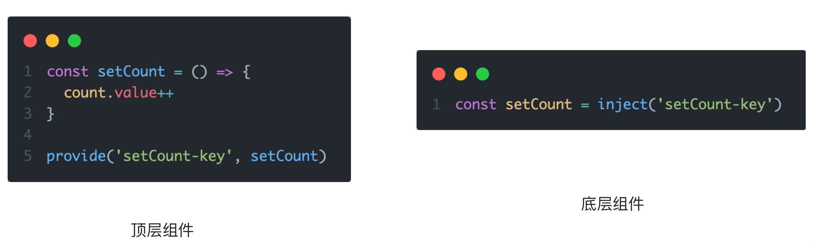
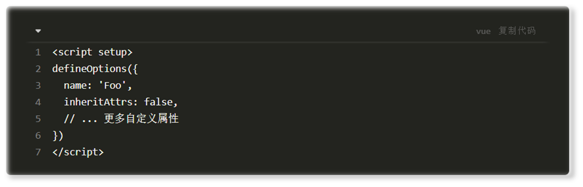
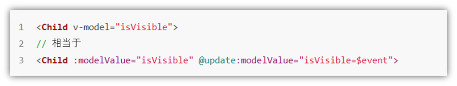

# Vue3

## 认识Vue3

### 1. Vue2 选项式 API vs Vue3 组合式API

```vue
<script>
export default {
  data(){
    return {
      count:0
    }
  },
  methods:{
    addCount(){
      this.count++
    }
  }
}
</script>
```

```vue
<script setup>
import { ref } from 'vue'
const count = ref(0)
const addCount = ()=> count.value++
</script>
```

特点：

1. 代码量变少
2. 分散式维护变成集中式维护
### 2. Vue3的优势


## 使用create-vue搭建Vue3项目
### 1. 认识create-vue
> create-vue是Vue官方新的脚手架工具，底层切换到了 vite （下一代前端工具链），为开发提供极速响应


### 2. 使用create-vue创建项目
> 前置条件 - 已安装16.0或更高版本的Node.js

执行如下命令，这一指令将会安装并执行 create-vue
```bash
npm init vue@latest
```


## 熟悉项目和关键文件


## 组合式API - setup选项
### 1. setup选项的写法和执行时机
写法
```vue
<script>
  export default {
    setup(){
	//这里的this是undefined
    },
    beforeCreate(){
      
    }
  }
</script>
```
执行时机
> 在beforeCreate钩子之前执行，所以this也为undefined


### 2. setup中写代码的特点
> 在setup函数中写的数据和方法需要在末尾以对象的方式return，才能给模版使用

```vue
<script>
  export default {
    setup(){
      const message = 'this is message'
      const logMessage = ()=>{
        console.log(message)
      }
      // 必须return才可以
      return {
        message,
        logMessage
      }
    }
  }
</script>
```
### 3. <script setup>语法糖
> script标签添加 setup标记，不需要再写导出语句，默认会添加导出语句

```vue
<script setup>
  const message = 'this is message'
  const logMessage = ()=>{
    console.log(message)
  }
</script>
```

## 组合式API - reactive和ref函数
### 1. reactive
> 接受对象类型数据的参数传入并返回一个响应式的对象


```vue
<script setup>
 // 导入
 import { reactive } from 'vue'
 // 执行函数 传入参数 变量接收
 const state = reactive({
   msg:'this is msg'
 })
 const setSate = ()=>{
   // 修改数据更新视图
   state.msg = 'this is new msg'
 }
</script>

<template>
  {{ state.msg }}
  <button @click="setState">change msg</button>
</template>
```

### 2. ref
> 接收简单类型或者对象类型的数据传入并返回一个响应式的对象

```vue
<script setup>
 // 导入
 import { ref } from 'vue'
 // 执行函数 传入参数 变量接收
 const count = ref(0)
 const setCount = ()=>{
   // 修改数据更新视图必须加上.value
   count.value++
 }
</script>

<template>
  <button @click="setCount">{{count}}</button>
</template>
```
### 3. reactive 对比 ref

1. 都是用来生成响应式数据
2. 不同点
   1. reactive不能处理简单类型的数据
   2. ref参数类型支持更好，但是必须通过.value做访问修改
   3. ref函数内部的实现依赖于reactive函数
3. 在实际工作中的推荐
   1. 推荐使用ref函数，减少记忆负担，小兔鲜项目都使用ref
## 组合式API - computed
> 计算属性基本思想和Vue2保持一致，组合式API下的计算属性只是修改了API写法

```vue
<script setup>
// 导入
import {ref, computed } from 'vue'
// 原始数据
const count = ref(0)
// 计算属性
const doubleCount = computed(()=>count.value * 2)

// 原始数据
const list = ref([1,2,3,4,5,6,7,8])
// 计算属性list
const filterList = computed(item=>item > 2)
</script>
```
## 组合式API - watch
> 侦听一个或者多个数据的变化，数据变化时执行回调函数，俩个额外参数 immediate控制立刻执行，deep开启深度侦听

### 1. 侦听单个数据
```vue
<script setup>
  // 1. 导入watch
  import { ref, watch } from 'vue'
  const count = ref(0)
  // 2. 调用watch 侦听变化
  watch(count, (newValue, oldValue)=>{
    console.log(`count发生了变化，老值为${oldValue},新值为${newValue}`)
  })
</script>
```
### 2. 侦听多个数据
> 侦听多个数据，第一个参数可以改写成数组的写法

```vue
<script setup>
  // 1. 导入watch
  import { ref, watch } from 'vue'
  const count = ref(0)
  const name = ref('cp')
  // 2. 调用watch 侦听变化
  watch([count, name], ([newCount, newName],[oldCount,oldName])=>{
    console.log(`count或者name变化了，[newCount, newName],[oldCount,oldName])
  })
</script>
```
### 3. immediate
> 在侦听器创建时立即出发回调，响应式数据变化之后继续执行回调


```vue
<script setup>
  // 1. 导入watch
  import { ref, watch } from 'vue'
  const count = ref(0)
  // 2. 调用watch 侦听变化
  watch(count, (newValue, oldValue)=>{
    console.log(`count发生了变化，老值为${oldValue},新值为${newValue}`)
  },{
    immediate: true
  })
</script>
```
### 4. deep
> 通过watch监听的ref对象默认是浅层侦听的，直接修改嵌套的对象属性不会触发回调执行，需要开启deep
>
> 通过watch监听的reactive对象默认是深层侦听的

```vue
<script setup>
  // 1. 导入watch
  import { ref, watch } from 'vue'
  const state = ref({ count: 0 })
  // 2. 监听对象state
  watch(state, ()=>{
    console.log('数据变化了')
  })
  const changeStateByCount = ()=>{
    // 直接修改不会引发回调执行
    state.value.count++
  }
</script>

<script setup>
  // 1. 导入watch
  import { ref, watch } from 'vue'
  const state = ref({ count: 0 })
  // 2. 监听对象state 并开启deep
  watch(state, ()=>{
    console.log('数据变化了')
  },{deep:true})
  const changeStateByCount = ()=>{
    // 此时修改可以触发回调
    state.value.count++
  }
</script>

```
### 4. 精确监听某数据

此时第一个参数为一个回调函数，返回要监听的数据

~~~vue
<script setup>
  // 1. 导入watch
  import { ref, watch } from 'vue'
  const state = ref({ count: 0, age: 16 })
  // 2. 监听对象state中age属性
  watch(() => state.value.age, (newValue, oldValue) => {
    console.log(newValue, oldValue)
  })
  }
</script>
~~~


## 组合式API - 生命周期函数

### 1. 选项式对比组合式

vue3中选项式 API 和 组合式 API 对应的关系，可以把以前写到选项式 API 的代码可以写到对应的组合式 API 里


### 2. 生命周期函数基本使用
> 1. 导入生命周期函数
> 2. 执行生命周期函数，传入回调

```vue
<scirpt setup>
import { onMounted } from 'vue'
onMounted(()=>{
  // 自定义逻辑
})
</script>
```
### 3. 执行多次
> 生命周期函数执行多次的时候，会按照顺序依次执行

```vue
<scirpt setup>
import { onMounted } from 'vue'
onMounted(()=>{
  // 自定义逻辑
})

onMounted(()=>{
  // 自定义逻辑
})
</script>
```
## 组合式API - 父子通信
### 1. 父传子
> 基本思想
> 1. 父组件中给子组件绑定属性
> 2. 子组件内部通过props选项接收数据


### 2. 子传父
> 基本思想
> 1. 父组件中给子组件标签通过@绑定事件
> 2. 子组件内部通过 emit 方法触发事件


## 组合式API - 模版引用
> 概念：通过 ref标识 获取真实的 dom对象或者组件实例对象

### 1. 基本使用
> 实现步骤：
> 1. 调用ref函数生成一个ref对象
> 2. 通过ref标识绑定ref对象到标签
> 2. 获取模板引用的时机是组件挂载完毕后，所以获取ref引用对象的代码可以写到 onMounted 方法里


### 2. defineExpose
> 默认情况下在 <script setup>语法糖下组件内部的属性和方法是不开放给父组件访问的，可以通过defineExpose编译宏指定哪些属性和方法容许访问
> 说明：指定testMessage属性可以被访问到


## 组合式API - provide和inject
### 1. 作用和场景
> 顶层组件向任意的底层组件传递数据和方法，实现跨层组件通信


### 2. 跨层传递普通数据
> 实现步骤
> 1. 顶层组件通过 `provide` 函数提供数据
> 2. 底层组件通过 `inject` 函数提供数据


### 3. 跨层传递响应式数据
> 在调用provide函数时，第二个参数设置为ref对象


### 4. 跨层传递方法
> 顶层组件可以向底层组件传递方法，底层组件调用方法修改顶层组件的数据




## Vue3.3 新特性-defineOptions

背景说明：

有 <script setup> 之前，如果要定义 props, emits 可以轻而易举地添加一个与 setup 平级的属性。 

但是用了 <script setup> 后，就没法这么干了 setup 属性已经没有了，自然无法添加与其平级的属性。

---

为了解决这一问题，引入了 defineProps 与 defineEmits 这两个宏。但这只解决了 props 与 emits 这两个属性。

如果我们要定义组件的 name 或其他自定义的属性，还是得回到最原始的用法——再添加一个普通的 <script> 标签。

这样就会存在两个 <script> 标签。让人无法接受。

---

所以在 Vue 3.3 中新引入了 defineOptions 宏。顾名思义，主要是用来定义 Options API 的选项。可以用 defineOptions 定义任意的选项， props, emits, expose, slots 除外（因为这些可以使用 defineXXX 来做到）




## Vue3.3新特性-defineModel

在Vue3中，自定义组件上使用v-model, 相当于传递一个modelValue属性，同时触发 update:modelValue 事件



我们需要先定义 props，再定义 emits 。其中有许多重复的代码。如果需要修改此值，还需要手动调用 emit 函数。

于是乎 defineModel 诞生了。


生效需要配置 vite.config.js

```jsx
import { fileURLToPath, URL } from 'node:url'

import { defineConfig } from 'vite'
import vue from '@vitejs/plugin-vue'

// https://vitejs.dev/config/
export default defineConfig({
  plugins: [
    vue({
      script: {
        defineModel: true
      }
    }),
  ],
  resolve: {
    alias: {
      '@': fileURLToPath(new URL('./src', import.meta.url))
    }
  }
})
```

# Vue3 状态管理 - Pinia

## 1. 什么是Pinia

Pinia 是 Vue 的专属的最新状态管理库 ，是 Vuex 状态管理工具的替代品


## 2. 手动添加Pinia到Vue项目

后面在实际开发项目的时候，Pinia可以在项目创建时自动添加，现在我们初次学习，从零开始：

1.  使用 Vite 创建一个空的 Vue3项目

```bash
npm init vite@latest
```

2.  按照官方文档安装 pinia 到项目中 


## 3. Pinia基础使用

1. 定义store

   ~~~ js
   import { creatApp } from 'vue'
   import { createPinia } from 'pinia'
   
   const pinia = createPinia()
   // 支持链式编程
   createApp(App).use(pinia).mount('#app')
   ~~~

2. 组件使用store


## 4. getters实现

Pinia中的 getters 直接使用 computed函数 进行模拟, 组件中需要使用需要把 getters return出去


## 5. action异步实现

方式：异步action函数的写法和组件中获取异步数据的写法完全一致

- 接口地址：http://geek.itheima.net/v1_0/channels

- 请求方式：get

- 请求参数：无


需求：在Pinia中获取频道列表数据并把数据渲染App组件的模板中


## 6. storeToRefs工具函数

使用storeToRefs函数可以辅助保持数据（state + getter）的响应式解构


## 7. Pinia的调试

Vue官方的 dev-tools 调试工具 对 Pinia直接支持，可以直接进行调试


## 8. Pinia持久化插件

官方文档：https://prazdevs.github.io/pinia-plugin-persistedstate/zh/

1. 安装插件 pinia-plugin-persistedstate

```jsx
npm i pinia-plugin-persistedstate
```

2. 使用 main.js

```jsx
import persist from 'pinia-plugin-persistedstate'
...
app.use(createPinia().use(persist))
```

3. 配置 store/counter.js

```jsx
import { defineStore } from 'pinia'
import { computed, ref } from 'vue'

export const useCounterStore = defineStore('counter', () => {
  ...
  return {
    count,
    doubleCount,
    increment
  }
}, {
  persist: true
})
```

4. 其他配置，看官网文档即可

#  常用插件

1. ESLint：按eslint规范自动格式化代码（vscode插件）

~~~json
// ESLint & prettier 配置代码风格
// 1、安装了插件 ESlint，开启保存自动修复；禁用了插件 Prettier，并关闭保存自动格式化
// 2、ESlint插件 + Vscode配置 实现自动格式化修复
"editor.codeActionsOnSave": {
    "source.fixAll": true
},
"editor.formatOnSave": false
// 3、 配置.eslintrc.cjs
  rules: {
    'prettier/prettier': [
      'warn',
      {
        singleQuote: true, // 单引号
        semi: false, // 无分号
        printWidth: 80, // 每行宽度至多80字符
        trailingComma: 'none', // 不加对象|数组最后逗号
        endOfLine: 'auto' // 换行符号不限制（win mac 不一致）
      }
    ],
    'vue/multi-word-component-names': [
      'warn',
      {
        ignores: ['index'] // vue组件名称多单词组成（忽略index.vue）
      }
    ],
    'vue/no-setup-props-destructure': ['off'], // 关闭 props 解构的校验
    // 💡 添加未定义变量错误提示，create-vue@3.6.3 关闭，这里加上是为了支持下一个章节演示。
    'no-undef': 'error'
  }
~~~

2. vetur：vue2代码插件（vscode插件）
3. volar：vue3代码插件（vscode插件）
4. any-rule：常用正则表达式（vscode插件）
5. husky ：基于 husky  的代码检查工作流

~~~sh
# husky 是一个 git hooks 工具  ( git的钩子工具，可以在特定时机执行特定的命令 )
pnpm dlx husky-init && pnpm install
# 修改 .husky/pre-commit 文件，改掉原执行命令为：
pnpm lint
# 优化：lint命令是对所有代码进行检查，不论是否已提交过，会有耗时问题和历史代码问题

# lint-staged 配置解决上述问题
pnpm i lint-staged -D
# 配置package.json
{
  // ... 省略 ...
  "lint-staged": {
    "*.{js,ts,vue}": [
      "eslint --fix"
    ]
  }
}

{
  "scripts": {
    // ... 省略 ...
    "lint-staged": "lint-staged"
  }
}
# 修改 .husky/pre-commit 文件，改掉原执行命令为：
pnpm lint-staged
~~~

	6. 自动按需导入组件和模块

~~~sh
pnpm add -D unplugin-vue-components unplugin-auto-import	
# unplugin-vue-components：按需自动引入Vue组件
# unplugin-auto-import：动态地自动导入未声明的模块

# unplugin-auto-import的具体使用方法请百度
~~~

	7. Easy LESS：html、css、js 代码错误自动提示（vscode插件）
	7. tabout：按tab键自动退出引号、括号
	7. live server：可以实现 HTML 内容随代码改变自动更新
	7. IntelliSense for CSS class names：自动提供CSS class名称的智能提示

