vscode 让不同类型的文件有不同的图标：vscode-icon

# day01

## 一、为什么要学习Vue

1.前端必备技能

2.岗位多，绝大互联网公司都在使用Vue

3.提高开发效率

4.高薪必备技能（Vue2+Vue3）


## 二、什么是Vue

概念：Vue (读音 /vjuː/，类似于 view) 是一套 **构建用户界面 ** 的 **渐进式** **框架**

Vue2官网：<https://v2.cn.vuejs.org/>

### 1.什么是构建用户界面

**基于数据**渲染出用户可以看到的**界面**


### 2.什么是渐进式

所谓渐进式就是循序渐进，不一定非得把Vue中的所有API都学完才能开发Vue，可以学一点开发一点

#### Vue的两种开发方式：

1. Vue核心包开发

   场景：局部模块改造

2. Vue核心包&Vue插件&工程化

   场景：整站开发


### 3.什么是框架

所谓框架：就是一套完整的解决方案

**举个栗子**	

如果把一个完整的项目比喻为一个装修好的房子，那么框架就是一个毛坯房。

我们只需要在“毛坯房”的基础上，增加功能代码即可。

提到框架，不得不提一下库。

- 库，类似工具箱，是一堆方法的集合，比如 axios、lodash、echarts等
- 框架，是一套完整的解决方案，实现了大部分功能，我们只需要按照一定的规则去编码即可。

下图是 库 和 框架的对比。


框架的特点：有一套必须让开发者遵守的**规则**或者**约束**

咱们学框架就是学习的这些规则 [官网](https://v2.cn.vuejs.org/)

### 总结：什么是Vue？

Vue是什么：

什么是构建用户界面：

什么是渐进式：

什么是框架：


## 三、创建Vue实例

我们已经知道了Vue框架可以 基于数据帮助我们渲染出用户界面，那应该怎么做呢？


比如就上面这个数据，基于提供好的msg 怎么渲染后右侧可展示的数据呢？

**核心步骤（4步）：**

1. 准备容器
2. 引包（官网） — 开发版本/生产版本
3. 创建Vue实例  new Vue()
4. 指定配置项，渲染数据
   1. el:指定挂载点
   2. data提供数据


**总结：创建Vue实例需要执行哪4步**


## 四、插值表达式 {{}}

插值表达式是一种Vue的模板语法

我们可以用插值表达式渲染出Vue提供的数据


### 1.作用：利用表达式进行插值，渲染到页面中

表达式：是可以被求值的代码，JS引擎会讲其计算出一个结果

以下的情况都是表达式：

```js
money + 100
money - 100
money * 10
money / 10 
price >= 100 ? '真贵':'还行'
obj.name
arr[0]
fn()
obj.fn()
```


### 2.语法

插值表达式语法：{{ 表达式 }}

```js
<h3>{{title}}<h3>

<p>{{nickName.toUpperCase()}}</p>

<p>{{age >= 18 ? '成年':'未成年'}}</p>

<p>{{obj.name}}</p>

<p>{{fn()}}</p>
```


### 3.错误用法

```js
1.在插值表达式中使用的数据 必须在data中进行了提供
<p>{{hobby}}</p>  //如果在data中不存在 则会报错

2.支持的是表达式，而非语句，比如：if   for ...
<p>{{if}}</p>

3.不能在标签属性中使用 {{  }} 插值 (插值表达式只能标签中间使用)
<p title="{{username}}">我是P标签</p>
```


### 4.总结

1.插值表达式的作用是什么

2.语法是什么

3.插值表达式的注意事项


## 五、响应式特性

### 1.什么是响应式？

​	简单理解就是数据变，视图对应变。 


### 2.如何访问 和 修改 data中的数据（响应式演示）

data中的数据, 最终会被添加到实例上

① 访问数据： "实例.属性名"

② 修改数据： "实例.属性名"= "值"


### 3.总结

1.  什么是响应式
2. 如何访问和修改data中的数据呢


## 六、Vue开发者工具安装

1. 通过谷歌应用商店安装（国外网站）
2. 极简插件下载（推荐） <https://chrome.zzzmh.cn/index>

安装步骤：


安装之后可以F12后看到多一个Vue的调试面板


## 七、Vue中的常用指令

**概念：**指令（Directives）是 Vue 提供的带有 **v- 前缀** 的 特殊 标签**属性**。

为啥要学：提高程序员操作 DOM 的效率。

vue 中的指令按照不同的用途可以分为如下 6 大类：

-  内容渲染指令（v-html、v-text）
-  条件渲染指令（v-show、v-if、v-else、v-else-if）
-  事件绑定指令（v-on）
-  属性绑定指令 （v-bind）
-  双向绑定指令（v-model）
-  列表渲染指令（v-for）

指令是 vue 开发中最基础、最常用、最简单的知识点。


## 八、内容渲染指令

内容渲染指令用来辅助开发者渲染 DOM 元素的文本内容。常用的内容渲染指令有如下2 个：

- v-text（类似innerText）


- - 使用语法：`<p v-text="uname">hello</p>`，意思是将 uame 值渲染到 p 标签中
  - 类似 innerText，使用该语法，会覆盖 p 标签原有内容


- v-html（类似 innerHTML）


- - 使用语法：`<p v-html="intro">hello</p>`，意思是将 intro 值渲染到 p 标签中
  - 类似 innerHTML，使用该语法，会覆盖 p 标签原有内容
  - 类似 innerHTML，使用该语法，能够将HTML标签的样式呈现出来。

代码演示：

```js
 
  <div id="app">
    <h2>个人信息</h2>
	// 既然指令是vue提供的特殊的html属性，所以咱们写的时候就当成属性来用即可
    <p v-text="uname">姓名：</p> 
    <p v-html="intro">简介：</p>
  </div> 

<script>
        const app = new Vue({
            el:'#app',
            data:{
                uname:'张三',
                intro:'<h2>这是一个<strong>非常优秀</strong>的boy<h2>'
            }
        })
</script>
```


## 九、条件渲染指令

条件判断指令，用来辅助开发者按需控制 DOM 的显示与隐藏。条件渲染指令有如下两个，分别是：

1. v-show

   1. 作用：  控制元素显示隐藏
   2. 语法：  v-show = "表达式"   表达式值为 true 显示， false 隐藏
   3. 原理：  切换 display:none 控制显示隐藏
   4. 场景：频繁切换显示隐藏的场景

   

2. v-if

   1. 作用：  控制元素显示隐藏（条件渲染）
   2. 语法：  v-if= "表达式"          表达式值 true显示， false 隐藏
   3. 原理：  基于条件判断，是否创建 或 移除元素节点
   4. 场景：  要么显示，要么隐藏，不频繁切换的场景

   

   示例代码：

   ```js
     <div id="app">
       <div class="box">我是v-show控制的盒子</div>
       <div class="box">我是v-if控制的盒子</div>
     </div>

     <script src="https://cdn.jsdelivr.net/npm/vue@2/dist/vue.js"></script>
     <script>
       const app = new Vue({
         el: '#app',
         data: {
           flag: false
         }
       })
     </script>
   ```

3. v-else 和 v-else-if

   1. 作用：辅助v-if进行判断渲染
   2. 语法：v-else  v-else-if="表达式"
   3. 需要紧接着v-if使用

示例代码：

```js
  <div id="app">
    <p>性别：♂ 男</p>
    <p>性别：♀ 女</p>
    <hr>
    <p>成绩评定A：奖励电脑一台</p>
    <p>成绩评定B：奖励周末郊游</p>
    <p>成绩评定C：奖励零食礼包</p>
    <p>成绩评定D：惩罚一周不能玩手机</p>
  </div>
  
  <script src="https://cdn.jsdelivr.net/npm/vue@2/dist/vue.js"></script>
  <script>

    const app = new Vue({
      el: '#app',
      data: {
        gender: 2,
        score: 95
      }
    })
  </script>
```


## 十、事件绑定指令

使用Vue时，如需为DOM注册事件，及其的简单，语法如下：

- <button v-on:事件名="内联语句">按钮</button>
- <button v-on:事件名="处理函数">按钮</button>
- <button v-on:事件名="处理函数(实参)">按钮</button>
- `v-on:` 简写为 **@**

1. 内联语句

   ```js
   <div id="app">
       <button @click="count--">-</button>
       <span>{{ count }}</span>
       <button v-on:click="count++">+</button>
     </div>
     <script src="https://cdn.jsdelivr.net/npm/vue@2/dist/vue.js"></script>
     <script>
       const app = new Vue({
         el: '#app',
         data: {
           count: 100
         }
       })
     </script>
   ```

2. 事件处理函数

   注意：

   - 事件处理函数应该写到一个跟data同级的配置项（methods）中
   - methods中的函数内部的this都指向Vue实例

```js
<div id="app">
    <button>切换显示隐藏</button>
    <h1 v-show="isShow">黑马程序员</h1>
  </div>
  <script src="https://cdn.jsdelivr.net/npm/vue@2/dist/vue.js"></script>
  <script>
    const app = new Vue({
      el: '#app',
      data: {
        isShow: true
      }
    })
  </script>
```

  3.给事件处理函数传参

- 如果不传递任何参数，则方法无需加小括号；methods方法中可以直接使用 e 当做事件对象


- 如果传递了参数，则实参 `$event` 表示事件对象，固定用法。

```js
 <style>
    .box {
      border: 3px solid #000000;
      border-radius: 10px;
      padding: 20px;
      margin: 20px;
      width: 200px;
    }
    h3 {
      margin: 10px 0 20px 0;
    }
    p {
      margin: 20px;
    }
  </style>

 <div id="app">
    <div class="box">
      <h3>小黑自动售货机</h3>
      <button>可乐5元</button>
      <button>咖啡10元</button>
      <button>牛奶8元</button>
    </div>
    <p>银行卡余额：{{ money }}元</p>
  </div>

  <script src="https://cdn.jsdelivr.net/npm/vue@2/dist/vue.js"></script>
  <script>
    const app = new Vue({
      el: '#app',
      data: {
        money: 100
      }
    })
  </script>
```


## 十一、属性绑定指令

1. **作用：**动态设置html的标签属性 比如：src、url、title
2. **语法**：**v-bind:**属性名=“表达式”
3. **v-bind:**可以简写成 =>   **:**

比如，有一个图片，它的 `src` 属性值，是一个图片地址。这个地址在数据 data 中存储。

则可以这样设置属性值：

- ``
- ``   （v-bind可以省略）

```js
  <div id="app">
    
    
  </div>
  <script src="https://cdn.jsdelivr.net/npm/vue@2/dist/vue.js"></script>
  <script>
    const app = new Vue({
      el: '#app',
      data: {
        imgUrl: './imgs/10-02.png',
        msg: 'hello 波仔'
      }
    })
  </script>
```


## 十二、小案例-波仔的学习之旅

需求：默认展示数组中的第一张图片，点击上一页下一页来回切换数组中的图片

实现思路：

1.数组存储图片路径 ['url1','url2','url3'，...]

2.可以准备个下标index 去数组中取图片地址。

3.通过v-bind给src绑定当前的图片地址

4.点击上一页下一页只需要修改下标的值即可

5.当展示第一张的时候，上一页按钮应该隐藏。展示最后一张的时候，下一页按钮应该隐藏

```js
 <div id="app">
    <button>上一页</button>
    <div>
      
    </div>
    <button>下一页</button>
  </div>
  <script src="https://cdn.jsdelivr.net/npm/vue@2/dist/vue.js"></script>
  <script>
    const app = new Vue({
      el: '#app',
      data: {
        list: [
          './imgs/11-00.gif',
          './imgs/11-01.gif',
          './imgs/11-02.gif',
          './imgs/11-03.gif',
          './imgs/11-04.png',
          './imgs/11-05.png',
        ]
      }
    })
  </script>
```


## 十三、列表渲染指令

Vue 提供了 v-for 列表渲染指令，用来辅助开发者基于一个数组来循环渲染一个列表结构。

v-for 指令需要使用 `(item, index) in arr` 形式的特殊语法，其中：

- item 是数组中的每一项
- index 是每一项的索引，不需要可以省略
- arr 是被遍历的数组

此语法也可以遍历**对象和数字**

```js
//遍历对象
<div v-for="(value, key, index) in object">{{value}}</div>
value:对象中的值
key:对象中的键
index:遍历索引从0开始

//遍历数字
<p v-for="item in 10">{{item}}</p>
item从1 开始
```


## 十四、小案例-小黑的书架

需求：

1.根据左侧数据渲染出右侧列表（v-for）

2.点击删除按钮时，应该把当前行从列表中删除（获取当前行的id，利用filter进行过滤）


准备代码：

```js
<div id="app">
    <h3>小黑的书架</h3>
    <ul>
      <li>
        <span>《红楼梦》</span>
        <span>曹雪芹</span>
        <button>删除</button>
      </li>
    </ul>
  </div>
  <script src="https://cdn.jsdelivr.net/npm/vue@2/dist/vue.js"></script>
  <script>
    const app = new Vue({
      el: '#app',
      data: {
        booksList: [
          { id: 1, name: '《红楼梦》', author: '曹雪芹' },
          { id: 2, name: '《西游记》', author: '吴承恩' },
          { id: 3, name: '《水浒传》', author: '施耐庵' },
          { id: 4, name: '《三国演义》', author: '罗贯中' }
        ]
      }
    })
  </script>
```


## 十五、v-for中的key

**语法：** key="唯一值"

**作用：**给列表项添加的**唯一标识**。便于Vue进行列表项的**正确排序复用**。

**为什么加key：**Vue 的默认行为会尝试原地修改元素（**就地复用**）

底层采用了 diff 算法，具体看补充内容。

实例代码：

```js
<ul>
  <li v-for="(item, index) in booksList" :key="item.id">
    <span>{{ item.name }}</span>
    <span>{{ item.author }}</span>
    <button @click="del(item.id)">删除</button>
  </li>
</ul>
```

注意：

1.  key 的值只能是字符串 或 数字类型
2. key 的值必须具有唯一性
3. 推荐使用  id 作为 key（唯一），不推荐使用 index 作为 key（会变化，不对应）


## 十六、双向绑定指令

所谓双向绑定就是：

1. 数据改变后，呈现的页面结果会更新
2. 页面结果更新后，数据也会随之而变

**作用：** 给**表单元素**（input、radio、select）使用，双向绑定数据，可以快速 **获取** 或 **设置** 表单元素内容

**语法：**v-model="变量"

**需求：**使用双向绑定实现以下需求

1. 点击登录按钮获取表单中的内容
2. 点击重置按钮清空表单中的内容

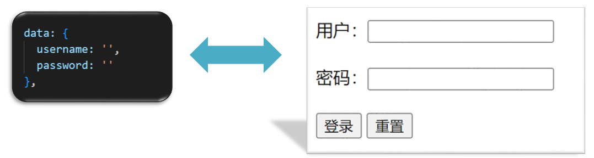


```js
<div id="app">
    账户：<input type="text"> <br><br>
    密码：<input type="password"> <br><br>
    <button>登录</button>
    <button>重置</button>
  </div>
  <script src="https://cdn.jsdelivr.net/npm/vue@2/dist/vue.js"></script>
  <script>
    const app = new Vue({
      el: '#app',
      data: {
        username: '',
        password: ''
      },
    })
  </script>
```


## 十七、综合案例-小黑记事本


**功能需求：**

1. 列表渲染

2. 删除功能

3. 添加功能

4. 底部统计 和 清空

   


# day02

## 一、今日学习目标

### 1.指令补充

1. 指令修饰符
2. v-bind对样式增强的操作
3. v-model应用于其他表单元素

### 2.computed计算属性

1. 基础语法
2. 计算属性vs方法
3. 计算属性的完整写法
4. 成绩案例

### 3.watch侦听器

1. 基础写法
2. 完整写法

### 4.综合案例 （演示）

1. 渲染  /  删除  /  修改数量 / 全选 / 反选 / 统计总价 /  持久化


## 二、指令修饰符

### 1.什么是指令修饰符？

​	所谓指令修饰符就是通过“.”指明一些指令**后缀** 不同的**后缀**封装了不同的处理操作  —> 简化代码

### 2.按键修饰符

- @keyup.enter  —>当点击enter键的时候才触发

代码演示：

```js
  <div id="app">
    <h3>@keyup.enter  →  监听键盘回车事件</h3>
    <input v-model="username" type="text">
  </div>
  <script src="https://cdn.jsdelivr.net/npm/vue@2/dist/vue.js"></script>
  <script>
    const app = new Vue({
      el: '#app',
      data: {
        username: ''
      },
      methods: {
        
      }
    })
  </script>
```

### 3.v-model修饰符

- v-model.trim  —>去除首位空格
- v-model.number —>转数字

### 4.事件修饰符

- @事件名.stop —> 阻止冒泡
- @事件名.prevent  —>阻止默认行为
- @事件名.stop.prevent —>可以连用 即阻止事件冒泡也阻止默认行为

```js
 <style>
    .father {
      width: 200px;
      height: 200px;
      background-color: pink;
      margin-top: 20px;
    }
    .son {
      width: 100px;
      height: 100px;
      background-color: skyblue;
    }
  </style>

 <div id="app">
    <h3>v-model修饰符 .trim .number</h3>
    姓名：<input v-model="username" type="text"><br>
    年纪：<input v-model="age" type="text"><br>

    
    <h3>@事件名.stop     →  阻止冒泡</h3>
    <div @click="fatherFn" class="father">
      <div @click="sonFn" class="son">儿子</div>
    </div>

    <h3>@事件名.prevent  →  阻止默认行为</h3>
    <a @click href="http://www.baidu.com">阻止默认行为</a>
  </div>

  <script src="https://cdn.jsdelivr.net/npm/vue@2/dist/vue.js"></script>
  <script>
    const app = new Vue({
      el: '#app',
      data: {
        username: '',
        age: '',
      },
      methods: {
        fatherFn () {
          alert('老父亲被点击了')
        },
        sonFn (e) {
          // e.stopPropagation()
          alert('儿子被点击了')
        }
      }
    })
  </script>
```


## 三、v-bind对样式控制的增强-操作class

为了方便开发者进行样式控制， Vue 扩展了 v-bind 的语法，可以针对 **class 类名** 和 **style 行内样式** 进行控制 。

### 1.语法：

```html
<div> :class = "对象/数组">这是一个div</div>
```


### 2.对象语法

当class动态绑定的是**对象**时，**键就是类名，值就是布尔值**，如果值是**true**，就有这个类，否则没有这个类

```html
<div class="box" :class="{ 类名1: 布尔值, 类名2: 布尔值 }"></div>
```

​    适用场景：一个类名，来回切换


### 3.数组语法

当class动态绑定的是**数组**时 → 数组中所有的类，都会添加到盒子上，本质就是一个 class 列表

```html
<div class="box" :class="[ 类名1, 类名2, 类名3 ]"></div>
```

   使用场景:批量添加或删除类


### 4.代码练习

```html
 <style>
    .box {
      width: 200px;
      height: 200px;
      border: 3px solid #000;
      font-size: 30px;
      margin-top: 10px;
    }
    .pink {
      background-color: pink;
    }
    .big {
      width: 300px;
      height: 300px;
    }
  </style>


<div id="app">
    <!--绑定对象-->
    <div class="box">黑马程序员</div>
    <!--绑定数组-->
    <div class="box">黑马程序员</div>
  </div>
  <script src="https://cdn.jsdelivr.net/npm/vue@2/dist/vue.js"></script>
  <script>
    const app = new Vue({
      el: '#app',
      data: {

      }
    })
  </script>
```


## 四、京东秒杀-tab栏切换导航高亮

### 1.需求：

​	当我们点击哪个tab页签时，哪个tab页签就高亮

### 2.准备代码:

```html
 <style>
    * {
      margin: 0;
      padding: 0;
    }
    ul {
      display: flex;
      border-bottom: 2px solid #e01222;
      padding: 0 10px;
    }
    li {
      width: 100px;
      height: 50px;
      line-height: 50px;
      list-style: none;
      text-align: center;
    }
    li a {
      display: block;
      text-decoration: none;
      font-weight: bold;
      color: #333333;
    }
    li a.active {
      background-color: #e01222;
      color: #fff;
    }

  </style>

<div id="app">
    <ul>
      <li><a class="active" href="#">京东秒杀</a></li>
      <li><a href="#">每日特价</a></li>
      <li><a href="#">品类秒杀</a></li>
    </ul>
  </div>
  <script src="https://cdn.jsdelivr.net/npm/vue@2/dist/vue.js"></script>
  <script>
    const app = new Vue({
      el: '#app',
      data: {
        list: [
          { id: 1, name: '京东秒杀' },
          { id: 2, name: '每日特价' },
          { id: 3, name: '品类秒杀' }
        ]
      }
    })
  </script>
```

### 3.思路：

1.基于数据，动态渲染tab（v-for）

2.准备一个下标 记录高亮的是哪一个 tab

3.基于下标动态切换class的类名


## 五、v-bind对有样式控制的增强-操作style

### 1.语法

```html
<div class="box" :style="{ CSS属性名1: CSS属性值, CSS属性名2: CSS属性值 }"></div>
```

### 2.代码练习

```html
<style>
    .box {
      width: 200px;
      height: 200px;
      background-color: rgb(187, 150, 156);
    }
 </style>
 <div id="app">
    <div class="box"></div>
  </div>
  <script src="https://cdn.jsdelivr.net/npm/vue@2/dist/vue.js"></script>
  <script>
    const app = new Vue({
      el: '#app',
      data: {

      }
    })
  </script>
```

### 3.进度条案例

```html
 <style>
    .progress {
      height: 25px;
      width: 400px;
      border-radius: 15px;
      background-color: #272425;
      border: 3px solid #272425;
      box-sizing: border-box;
      margin-bottom: 30px;
    }
    .inner {
      width: 50%;
      height: 20px;
      border-radius: 10px;
      text-align: right;
      position: relative;
      background-color: #409eff;
      background-size: 20px 20px;
      box-sizing: border-box;
      transition: all 1s;
    }
    .inner span {
      position: absolute;
      right: -20px;
      bottom: -25px;
    }
  </style>

<div id="app">
    <div class="progress">
      <div class="inner">
        <span>50%</span>
      </div>
    </div>
    <button>设置25%</button>
    <button>设置50%</button>
    <button>设置75%</button>
    <button>设置100%</button>
  </div>

  <script src="https://cdn.jsdelivr.net/npm/vue@2/dist/vue.js"></script>
  <script>
    const app = new Vue({
      el: '#app',
      data: {

      }
    })
  </script>
```


## 六、v-model在其他表单元素的使用

### 1.讲解内容：

常见的表单元素都可以用 v-model 绑定关联  →  快速 **获取** 或 **设置** 表单元素的值

它会根据  **控件类型** 自动选取  **正确的方法** 来更新元素

```js
输入框  input:text   ——> value
文本域  textarea	 ——> value
复选框  input:checkbox  ——> checked
单选框  input:radio   ——> checked
下拉菜单 select    ——> value
...
```

### 2.代码准备

```html
 <style>
    textarea {
      display: block;
      width: 240px;
      height: 100px;
      margin: 10px 0;
    }
  </style>
 <div id="app">
    <h3>小黑学习网</h3>
    姓名：
      <input type="text"> 
      <br><br>
    是否单身：
      <input type="checkbox"> 
      <br><br>
    <!-- 
      前置理解：
        1. name:  给单选框加上 name 属性 可以分组 → 同一组互相会互斥
        2. value: 给单选框加上 value 属性，用于提交给后台的数据
      结合 Vue 使用 → v-model
    -->
    性别: 
      <input type="radio">男
      <input type="radio">女
      <br><br>
    <!-- 
      前置理解：
        1. option 需要设置 value 值，提交给后台
        2. select 的 value 值，关联了选中的 option 的 value 值
      结合 Vue 使用 → v-model
    -->
    所在城市:
      <select>
        <option>北京</option>
        <option>上海</option>
        <option>成都</option>
        <option>南京</option>
      </select>
      <br><br>
    自我描述：
      <textarea></textarea> 
    <button>立即注册</button>
  </div>
  <script src="https://cdn.jsdelivr.net/npm/vue@2/dist/vue.js"></script>
  <script>
    const app = new Vue({
      el: '#app',
      data: {

      }
    })
  </script>
```


## 七、computed计算属性

### 1.概念

基于**现有的数据**，计算出来的**新属性**。 **依赖**的数据变化，**自动**重新计算。

### 2.语法

1. 声明在 **computed 配置项**中，一个计算属性对应一个函数
2. 使用起来和普通属性一样使用  {{ 计算属性名}}  

### 3.注意

1. computed配置项和data配置项是**同级**的
2. computed中的计算属性**虽然是函数的写法**，但他**依然是个属性**
3. computed中的计算属性**不能**和data中的属性**同名**
4. 使用computed中的计算属性和使用data中的属性是一样的用法
5. computed中计算属性内部的**this**依然**指向的是Vue实例**

### 4.案例

比如我们可以使用计算属性实现下面这个业务场景

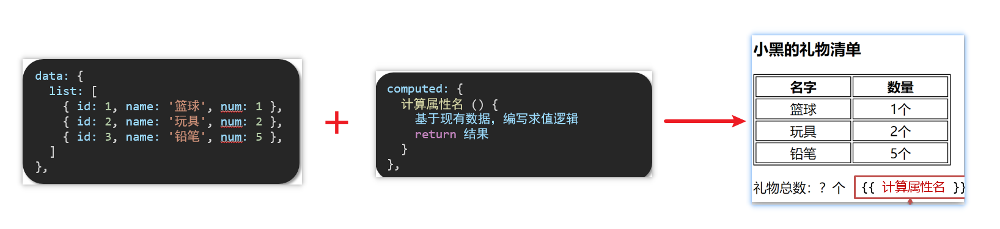

### 5.代码准备

```html
<style>
    table {
      border: 1px solid #000;
      text-align: center;
      width: 240px;
    }
    th,td {
      border: 1px solid #000;
    }
    h3 {
      position: relative;
    }
  </style>

<div id="app">
    <h3>小黑的礼物清单</h3>
    <table>
      <tr>
        <th>名字</th>
        <th>数量</th>
      </tr>
      <tr v-for="(item, index) in list" :key="item.id">
        <td>{{ item.name }}</td>
        <td>{{ item.num }}个</td>
      </tr>
    </table>

    <!-- 目标：统计求和，求得礼物总数 -->
    <p>礼物总数：? 个</p>
  </div>
  <script src="https://cdn.jsdelivr.net/npm/vue@2/dist/vue.js"></script>
  <script>
    const app = new Vue({
      el: '#app',
      data: {
        // 现有的数据
        list: [
          { id: 1, name: '篮球', num: 1 },
          { id: 2, name: '玩具', num: 2 },
          { id: 3, name: '铅笔', num: 5 },
        ]
      }
    })
  </script>
```


## 八、computed计算属性 VS methods方法

### 1.computed计算属性

作用：封装了一段对于**数据**的处理，求得一个**结果**

语法：

1. 写在computed配置项中
2. 作为属性，直接使用
   - js中使用计算属性： this.计算属性
   - 模板中使用计算属性：{{计算属性}}


### 2.methods计算属性

作用：给Vue实例提供一个**方法**，调用以**处理业务逻辑**。

语法：

1. 写在methods配置项中
2. 作为方法调用
   - js中调用：this.方法名()
   - 模板中调用 {{方法名()}}  或者 @事件名=“方法名”


### 3.计算属性的优势

1. 缓存特性（提升性能）

   计算属性会对计算出来的结果缓存，再次使用直接读取缓存，

   依赖项变化了，会自动重新计算 → 并再次缓存

2. methods没有缓存特性

3. 通过代码比较

```html
<style>
    table {
      border: 1px solid #000;
      text-align: center;
      width: 300px;
    }
    th,td {
      border: 1px solid #000;
    }
    h3 {
      position: relative;
    }
    span {
      position: absolute;
      left: 145px;
      top: -4px;
      width: 16px;
      height: 16px;
      color: white;
      font-size: 12px;
      text-align: center;
      border-radius: 50%;
      background-color: #e63f32;
    }
  </style>

<div id="app">
    <h3>小黑的礼物清单🛒<span>?</span></h3>
    <table>
      <tr>
        <th>名字</th>
        <th>数量</th>
      </tr>
      <tr v-for="(item, index) in list" :key="item.id">
        <td>{{ item.name }}</td>
        <td>{{ item.num }}个</td>
      </tr>
    </table>

    <p>礼物总数：{{ totalCount }} 个</p>
  </div>
  <script src="https://cdn.jsdelivr.net/npm/vue@2/dist/vue.js"></script>
  <script>
    const app = new Vue({
      el: '#app',
      data: {
        // 现有的数据
        list: [
          { id: 1, name: '篮球', num: 3 },
          { id: 2, name: '玩具', num: 2 },
          { id: 3, name: '铅笔', num: 5 },
        ]
      },
      computed: {
        totalCount () {
          let total = this.list.reduce((sum, item) => sum + item.num, 0)
          return total
        }
      }
    })
  </script>
```

### 4.总结

1.computed**有缓存特性**，methods**没有缓存**

2.当一个结果依赖其他多个值时，推荐使用计算属性

3.当处理业务逻辑时，推荐使用methods方法，比如事件的处理函数


## 九、计算属性的完整写法

**既然计算属性也是属性，能访问，应该也能修改了？**

1. 计算属性默认的简写，只能读取访问，不能 "修改"
2. 如果要 "修改"  → 需要写计算属性的完整写法


完整写法代码演示

```html
 <div id="app">
    姓：<input type="text" v-model="firstName"> +
    名：<input type="text" v-model="lastName"> =
    <span></span><br><br> 
    <button>改名卡</button>
  </div>
  <script src="https://cdn.jsdelivr.net/npm/vue@2/dist/vue.js"></script>
  <script>
    const app = new Vue({
      el: '#app',
      data: {
 		firstName: '刘',
        lastName: '备'
      },
      computed: {

      },
      methods: {

      }
    })
  </script>
```


## 十、综合案例-成绩案例


功能描述：

1.渲染功能

2.删除功能

3.添加功能

4.统计总分，求平均分


思路分析：

1.渲染功能  v-for  :key  v-bind:动态绑定class的样式

2.删除功能 v-on绑定事件， 阻止a标签的默认行为

3.v-model的修饰符 .trim、 .number、  判断数据是否为空后 再添加、添加后清空文本框的数据

4.使用计算属性computed 计算总分和平均分的值


## 十一、watch侦听器（监视器）

### 1.作用：

​	**监视数据变化**，执行一些业务逻辑或异步操作

### 2.语法：

1. watch同样声明在跟data同级的配置项中

2. 简单写法： 简单类型数据直接监视

3. 完整写法：添加额外配置项

   ```js
   data: { 
     words: '苹果',
     obj: {
       words: '苹果'
     }
   },
   
   watch: {
     // 该方法会在数据变化时，触发执行
     数据属性名 (newValue, oldValue) {
       一些业务逻辑 或 异步操作。 
     },
     '对象.属性名' (newValue, oldValue) {
       一些业务逻辑 或 异步操作。 
     }
   }
   ```

### 3.侦听器代码准备

```html
 <style>
      * {
        margin: 0;
        padding: 0;
        box-sizing: border-box;
        font-size: 18px;
      }
      #app {
        padding: 10px 20px;
      }
      .query {
        margin: 10px 0;
      }
      .box {
        display: flex;
      }
      textarea {
        width: 300px;
        height: 160px;
        font-size: 18px;
        border: 1px solid #dedede;
        outline: none;
        resize: none;
        padding: 10px;
      }
      textarea:hover {
        border: 1px solid #1589f5;
      }
      .transbox {
        width: 300px;
        height: 160px;
        background-color: #f0f0f0;
        padding: 10px;
        border: none;
      }
      .tip-box {
        width: 300px;
        height: 25px;
        line-height: 25px;
        display: flex;
      }
      .tip-box span {
        flex: 1;
        text-align: center;
      }
      .query span {
        font-size: 18px;
      }

      .input-wrap {
        position: relative;
      }
      .input-wrap span {
        position: absolute;
        right: 15px;
        bottom: 15px;
        font-size: 12px;
      }
      .input-wrap i {
        font-size: 20px;
        font-style: normal;
      }
    </style>

 <div id="app">
      <!-- 条件选择框 -->
      <div class="query">
        <span>翻译成的语言：</span>
        <select>
          <option value="italy">意大利</option>
          <option value="english">英语</option>
          <option value="german">德语</option>
        </select>
      </div>

      <!-- 翻译框 -->
      <div class="box">
        <div class="input-wrap">
          <textarea v-model="words"></textarea>
          <span><i>⌨️</i>文档翻译</span>
        </div>
        <div class="output-wrap">
          <div class="transbox">mela</div>
        </div>
      </div>
    </div>
    <script src="https://cdn.jsdelivr.net/npm/vue@2/dist/vue.js"></script>
    <script src="https://cdn.jsdelivr.net/npm/axios/dist/axios.min.js"></script>
    <script>
      // 接口地址：https://applet-base-api-t.itheima.net/api/translate
      // 请求方式：get
      // 请求参数：
      // （1）words：需要被翻译的文本（必传）
      // （2）lang： 需要被翻译成的语言（可选）默认值-意大利
      // -----------------------------------------------
      
      const app = new Vue({
        el: '#app',
        data: {
          words: ''
        },
        // 具体讲解：(1) watch语法 (2) 具体业务实现
      })
    </script>
```


## 十二、翻译案例-代码实现

```js
  <script>
      // 接口地址：https://applet-base-api-t.itheima.net/api/translate
      // 请求方式：get
      // 请求参数：
      // （1）words：需要被翻译的文本（必传）
      // （2）lang： 需要被翻译成的语言（可选）默认值-意大利
      // -----------------------------------------------
      
      const app = new Vue({
        el: '#app',
        data: {
           //words: ''
           obj: {
            words: ''
          },
          result: '', // 翻译结果
          // timer: null // 延时器id
        },
        // 具体讲解：(1) watch语法 (2) 具体业务实现
        watch: {
          // 该方法会在数据变化时调用执行
          // newValue新值, oldValue老值（一般不用）
          // words (newValue) {
          //   console.log('变化了', newValue)
          // }

          'obj.words' (newValue) {
            // console.log('变化了', newValue)
            // 防抖: 延迟执行 → 干啥事先等一等，延迟一会，一段时间内没有再次触发，才执行
            clearTimeout(this.timer)
            this.timer = setTimeout(async () => {
              const res = await axios({
                url: 'https://applet-base-api-t.itheima.net/api/translate',
                params: {
                  words: newValue
                }
              })
              this.result = res.data.data
              console.log(res.data.data)
            }, 300)
          }
        }
      })
    </script>
```

补充：如果属性不是用来做响应式，就尽可能不要写到data里，可以 直接通过 this.属性名 的方式挂载到Vue对象上，如上面例子中的timerId，这样效率也会好一些。

## 十三、watch侦听器

### 1.语法

完整写法 —>添加额外的配置项

1. deep:true 对复杂类型进行深度监听
2. immdiate:true 初始化 立刻执行一次

```js
data: {
  obj: {
    words: '苹果',
    lang: 'italy'
  },
},

watch: {// watch 完整写法
  对象: {
    deep: true, // 深度监视
    immdiate:true,//立即执行handler函数
    handler (newValue) {
      console.log(newValue)
    }
  }
}

```

### 2.需求


- 当文本框输入的时候 右侧翻译内容要时时变化
- 当下拉框中的语言发生变化的时候 右侧翻译的内容依然要时时变化
- 如果文本框中有默认值的话要立即翻译

### 3.代码实现

```js
 <script> 
      const app = new Vue({
        el: '#app',
        data: {
          obj: {
            words: '小黑',
            lang: 'italy'
          },
          result: '', // 翻译结果
        },
        watch: {
          obj: {
            deep: true, // 深度监视
            immediate: true, // 立刻执行，一进入页面handler就立刻执行一次
            handler (newValue) {
              clearTimeout(this.timer)
              this.timer = setTimeout(async () => {
                const res = await axios({
                  url: 'https://applet-base-api-t.itheima.net/api/translate',
                  params: newValue
                })
                this.result = res.data.data
                console.log(res.data.data)
              }, 300)
            }
          } 
        }
      })
    </script>
```

### 4.总结

watch侦听器的写法有几种？

1.简单写法

```js
watch: {
  数据属性名 (newValue, oldValue) {
    一些业务逻辑 或 异步操作。 
  },
  '对象.属性名' (newValue, oldValue) {
    一些业务逻辑 或 异步操作。 
  }
}
```

2.完整写法

```js
watch: {// watch 完整写法
  数据属性名: {
    deep: true, // 深度监视(针对复杂类型)
    immediate: true, // 是否立刻执行一次handler
    handler (newValue) {
      console.log(newValue)
    }
  }
}
```


## 十四、综合案例

购物车案例


需求说明：

1. 渲染功能
2. 删除功能
3. 修改个数
4. 全选反选
5. 统计 选中的 总价 和 总数量 
6. 持久化到本地


实现思路：

1.基本渲染：  v-for遍历、:class动态绑定样式

2.删除功能 ： v-on 绑定事件，获取当前行的id

3.修改个数 ： v-on绑定事件，获取当前行的id，进行筛选出对应的项然后增加或减少

4.全选反选 

1. 必须所有的小选框都选中，全选按钮才选中 → every
2. 如果全选按钮选中，则所有小选框都选中
3. 如果全选取消，则所有小选框都取消选中

声明计算属性，判断数组中的每一个checked属性的值，看是否需要全部选

5.统计 选中的 总价 和 总数量 ：通过计算属性来计算**选中的**总价和总数量

6.持久化到本地： 在数据变化时都要更新下本地存储 watch


# day03

## 一、今日目标

### 1.生命周期

1. 生命周期介绍
2. 生命周期的四个阶段
3. 生命周期钩子
4. 声明周期案例


### 2.综合案例-小黑记账清单

1. 列表渲染
2. 添加/删除
3. 饼图渲染


### 3.工程化开发入门

1. 工程化开发和脚手架
2. 项目运行流程
3. 组件化
4. 组件注册


### 4.综合案例-小兔仙首页

1. 拆分模块-局部注册 
2. 结构样式完善 
3. 拆分组件 – 全局注册


## 二、Vue生命周期

思考：什么时候可以发送初始化渲染请求？（越早越好）什么时候可以开始操作dom？（至少dom得渲染出来）

Vue生命周期：就是一个Vue实例从创建 到 销毁 的整个过程。

生命周期四个阶段：① 创建 ② 挂载 ③ 更新 ④ 销毁

1.创建阶段：创建响应式数据

2.挂载阶段：渲染模板

3.更新阶段：修改数据，更新视图

4.销毁阶段：销毁Vue实例


## 三、Vue生命周期钩子

Vue生命周期过程中，会**自动运行一些函数**，被称为【**生命周期钩子**】→  让开发者可以在【**特定阶段**】运行**自己的代码**


```html
<div id="app">
    <h3>{{ title }}</h3>
    <div>
      <button @click="count--">-</button>
      <span>{{ count }}</span>
      <button @click="count++">+</button>
    </div>
  </div>
  <script src="https://cdn.jsdelivr.net/npm/vue@2/dist/vue.js"></script>
  <script>
    const app = new Vue({
      el: '#app',
      data: {
        count: 100,
        title: '计数器'
      },
      // 1. 创建阶段（准备数据）
      beforeCreate () {
        console.log('beforeCreate 响应式数据准备好之前', this.count)
      },
      created () {
        console.log('created 响应式数据准备好之后', this.count)
        // this.数据名 = 请求回来的数据
        // 可以开始发送初始化渲染的请求了
      },

      // 2. 挂载阶段（渲染模板）
      beforeMount () {
        console.log('beforeMount 模板渲染之前', document.querySelector('h3').innerHTML)
      },
      mounted () {
        console.log('mounted 模板渲染之后', document.querySelector('h3').innerHTML)
        // 可以开始操作dom了
      },

      // 3. 更新阶段(修改数据 → 更新视图)
      beforeUpdate () {
        console.log('beforeUpdate 数据修改了，视图还没更新', document.querySelector('span').innerHTML)
      },
      updated () {
        console.log('updated 数据修改了，视图已经更新', document.querySelector('span').innerHTML)
      },

      // 4. 卸载阶段
      beforeDestroy () {
        console.log('beforeDestroy, 卸载前')
        console.log('清除掉一些Vue以外的资源占用，定时器，延时器...')
      },
      destroyed () {
        console.log('destroyed，卸载后')
      }
    })
  </script>
```

补充：

- 更新阶段中，数据修改后，先执行beforeUpdate函数、再更新视图；更新完视图后，最后执行updated函数
- 卸载阶段可以通过调用 vue.$destory() 方法进入

## 四、生命周期钩子小案例

### 1.在created中发送数据

```html
 <style>
    * {
      margin: 0;
      padding: 0;
      list-style: none;
    }
    .news {
      display: flex;
      height: 120px;
      width: 600px;
      margin: 0 auto;
      padding: 20px 0;
      cursor: pointer;
    }
    .news .left {
      flex: 1;
      display: flex;
      flex-direction: column;
      justify-content: space-between;
      padding-right: 10px;
    }
    .news .left .title {
      font-size: 20px;
    }
    .news .left .info {
      color: #999999;
    }
    .news .left .info span {
      margin-right: 20px;
    }
    .news .right {
      width: 160px;
      height: 120px;
    }
    .news .right img {
      width: 100%;
      height: 100%;
      object-fit: cover;
    }
  </style>

 <div id="app">
    <ul>
      <li class="news">
        <div class="left">
          <div class="title">5G商用在即，三大运营商营收持续下降</div>
          <div class="info">
            <span>新京报经济新闻</span>
            <span>2222-10-28 11:50:28</span>
          </div>
        </div>
        <div class="right">
          
        </div>
      </li>

      <li class="news">
        <div class="left">
          <div class="title">5G商用在即，三大运营商营收持续下降</div>
          <div class="info">
            <span>新京报经济新闻</span>
            <span>2222-10-28 11:50:28</span>
          </div>
        </div>
        <div class="right">
          
        </div>
      </li>

      <li class="news">
        <div class="left">
          <div class="title">5G商用在即，三大运营商营收持续下降</div>
          <div class="info">
            <span>新京报经济新闻</span>
            <span>2222-10-28 11:50:28</span>
          </div>
        </div>
        <div class="right">
          
        </div>
      </li>
    </ul>
  </div>
  <script src="https://cdn.jsdelivr.net/npm/vue@2/dist/vue.js"></script>
  <script src="https://cdn.jsdelivr.net/npm/axios/dist/axios.min.js"></script>
  <script>
    // 接口地址：http://hmajax.itheima.net/api/news
    // 请求方式：get
    const app = new Vue({
      el: '#app',
      data: {
        list: []
      }
    })
  </script>
```


### 2.在mounted中获取焦点

```html
 <style>
    html,
    body {
      height: 100%;
    }
    .search-container {
      position: absolute;
      top: 30%;
      left: 50%;
      transform: translate(-50%, -50%);
      text-align: center;
    }
    .search-container .search-box {
      display: flex;
    }
    .search-container img {
      margin-bottom: 30px;
    }
    .search-container .search-box input {
      width: 512px;
      height: 16px;
      padding: 12px 16px;
      font-size: 16px;
      margin: 0;
      vertical-align: top;
      outline: 0;
      box-shadow: none;
      border-radius: 10px 0 0 10px;
      border: 2px solid #c4c7ce;
      background: #fff;
      color: #222;
      overflow: hidden;
      box-sizing: content-box;
      -webkit-tap-highlight-color: transparent;
    }
    .search-container .search-box button {
      cursor: pointer;
      width: 112px;
      height: 44px;
      line-height: 41px;
      line-height: 42px;
      background-color: #ad2a27;
      border-radius: 0 10px 10px 0;
      font-size: 17px;
      box-shadow: none;
      font-weight: 400;
      border: 0;
      outline: 0;
      letter-spacing: normal;
      color: white;
    }
    body {
      background: no-repeat center /cover;
      background-color: #edf0f5;
    }
  </style>

<div class="container" id="app">
  <div class="search-container">
    
    <div class="search-box">
      <input type="text" v-model="words" id="inp">
      <button>搜索一下</button>
    </div>
  </div>
</div>

<script src="https://cdn.jsdelivr.net/npm/vue@2/dist/vue.js"></script>
<script>
  const app = new Vue({
    el: '#app',
    data: {
      words: ''
    }
  })
</script>
```


## 五、案例-小黑记账清单

### 1.需求图示：


### 2.需求分析

1.基本渲染

2.添加功能

3.删除功能

4.饼图渲染

### 3.思路分析

1.基本渲染  

- 立刻发送请求获取数据 created
- 拿到数据，存到data的响应式数据中
- 结合数据，进行渲染 v-for
- 消费统计  —> 计算属性

2.添加功能

- 收集表单数据 v-model，使用指令修饰符处理数据
- 给添加按钮注册点击事件，对输入的内容做非空判断，发送请求
- 请求成功后，对文本框内容进行清空
- 重新渲染列表

3.删除功能

- 注册点击事件，获取当前行的id
- 根据id发送删除请求
- 需要重新渲染

4.饼图渲染

- 初始化一个饼图 echarts.init(dom)    mounted钩子中渲染
- 根据数据试试更新饼图 echarts.setOptions({...})

### 4.代码准备

```html
 <!-- CSS only -->
    <link
      rel="stylesheet"
      href="https://cdn.jsdelivr.net/npm/bootstrap@5.1.3/dist/css/bootstrap.min.css"
    />
    <style>
      .red {
        color: red!important;
      }
      .search {
        width: 300px;
        margin: 20px 0;
      }
      .my-form {
        display: flex;
        margin: 20px 0;
      }
      .my-form input {
        flex: 1;
        margin-right: 20px;
      }
      .table > :not(:first-child) {
        border-top: none;
      }
      .contain {
        display: flex;
        padding: 10px;
      }
      .list-box {
        flex: 1;
        padding: 0 30px;
      }
      .list-box  a {
        text-decoration: none;
      }
      .echarts-box {
        width: 600px;
        height: 400px;
        padding: 30px;
        margin: 0 auto;
        border: 1px solid #ccc;
      }
      tfoot {
        font-weight: bold;
      }
      @media screen and (max-width: 1000px) {
        .contain {
          flex-wrap: wrap;
        }
        .list-box {
          width: 100%;
        }
        .echarts-box {
          margin-top: 30px;
        }
      }
    </style>


  <div id="app">
      <div class="contain">
        <!-- 左侧列表 -->
        <div class="list-box">

          <!-- 添加资产 -->
          <form class="my-form">
            <input type="text" class="form-control" placeholder="消费名称" />
            <input type="text" class="form-control" placeholder="消费价格" />
            <button type="button" class="btn btn-primary">添加账单</button>
          </form>

          <table class="table table-hover">
            <thead>
              <tr>
                <th>编号</th>
                <th>消费名称</th>
                <th>消费价格</th>
                <th>操作</th>
              </tr>
            </thead>
            <tbody>
              <tr>
                <td>1</td>
                <td>帽子</td>
                <td>99.00</td>
                <td><a href="javascript:;">删除</a></td>
              </tr>
              <tr>
                <td>2</td>
                <td>大衣</td>
                <td class="red">199.00</td>
                <td><a href="javascript:;">删除</a></td>
              </tr>
            </tbody>
            <tfoot>
              <tr>
                <td colspan="4">消费总计： 298.00</td>
              </tr>
            </tfoot>
          </table>
        </div>
        
        <!-- 右侧图表 -->
        <div class="echarts-box" id="main"></div>
      </div>
    </div>
    <script src="https://cdn.jsdelivr.net/npm/echarts@5.4.0/dist/echarts.min.js"></script>
    <script src="https://cdn.jsdelivr.net/npm/vue@2/dist/vue.js"></script>
    <script src="https://cdn.jsdelivr.net/npm/axios/dist/axios.min.js"></script>
    <script>
      /**
       * 接口文档地址：
       * https://www.apifox.cn/apidoc/shared-24459455-ebb1-4fdc-8df8-0aff8dc317a8/api-53371058
       * 
       * 功能需求：
       * 1. 基本渲染
       * 2. 添加功能
       * 3. 删除功能
       * 4. 饼图渲染
       */
      const app = new Vue({
        el: '#app',
        data: {
          
        },
      })
    </script>
```


## 六、工程化开发和脚手架

### 1.开发Vue的两种方式

- 核心包传统开发模式：基于html / css / js 文件，直接引入核心包，开发 Vue。
- **工程化开发模式：基于构建工具（例如：webpack）的环境中开发Vue。**


工程化开发模式优点：

   提高编码效率，比如使用JS新语法、Less/Sass、Typescript等通过webpack都可以编译成浏览器识别的ES3/ES5/CSS等

工程化开发模式问题：

- webpack配置**不简单**
- **雷同**的基础配置
- 缺乏**统一的标准**

为了解决以上问题，所以我们需要一个工具，生成标准化的配置


### 2.脚手架Vue CLI

####   基本介绍：

   Vue CLI 是Vue官方提供的一个**全局命令工具**

   可以帮助我们**快速创建**一个开发Vue项目的**标准化基础架子**。【集成了webpack配置】

####    好处：

1. 开箱即用，零配置
2. 内置babel等工具
3. 标准化的webpack配置

####    使用步骤：

1. 全局安装（只需安装一次即可） yarn global add @vue/cli 或者 npm i @vue/cli -g
2. 查看vue/cli版本： vue --version
3. 创建项目架子：**vue create project-name**(项目名不能使用中文)
4. 启动项目：**yarn serve** 或者 **npm run serve**(命令不固定，找package.json)


## 七、项目目录介绍和运行流程

### 1.项目目录介绍


虽然脚手架中的文件有很多，目前咱们只需人事三个文件即可

1. main.js  入口文件
2. App.vue  App根组件 
3. index.html 模板文件

- index.html

~~~html
<!--下面这行代码作用：给不支持js的浏览器一个提示-->
<noscript>
      <strong>We're sorry but <%= htmlWebpackPlugin.options.title %> doesn't work properly without JavaScript enabled. Please enable it to continue.</strong>
</noscript>
<div id="app">
    工程化开发模式中，这里不直接编写模板语法了，而是通过App.vue提供结构渲染
</div>
~~~

- main.js

```js
//核心作用：导入App.vue，基于App.vue创建结构渲染index.html
import Vue from 'vue'	//导入Vue核心包
import App from './App.vue'	//导入App.vue根组件

//为true时，会提示当前处于什么环境（生产环境或开发环境）
Vue.config.productionTip = false

//Vue实例化，提供render方法 -》 基于App.vue创建结构渲染index.html
new Vue({
  // el: '#app',	//这行代码等价于：.$mount('#app')
  //下面这段方法等价与：render: h => h(App)
  /*render: (createElement) => {
  	createElement(App)  //基于App创建元素结构
  }*/
  render: h => h(App),
}).$mount('#app')
```

### 2.运行流程


## 八、组件化开发

​     组件化：一个页面可以拆分成一个个组件，每个组件有着自己独立的结构、样式、行为。

​     好处：便于维护，利于复用 → 提升开发效率。

​     组件分类：普通组件、根组件。

​      比如：下面这个页面，可以把所有的代码都写在一个页面中，但是这样显得代码比较混乱，难易维护。咱们可以按模块进行组件划分


总结：

组件化的好处是什么？

组件的分类？


## 九、组件和根组件 App.vue

### 1.根组件介绍

整个应用最上层的组件，包裹所有普通小组件


### 2.组件是由三部分构成

- 语法高亮插件


- 三部分构成

  - template：结构 （有且只能一个根元素）
  - script:   js逻辑 
  -  style： 样式 (可支持less，需要装包)

- 让组件支持less

  （1） style标签，lang="less" 开启less功能 

  （2） 装包: yarn add less less-loader -D 或者npm i less less-loader -D

- 组件的组件名：默认是文件名，可以通过配置 name 属性修改组件名。在组件文件名只有一个单词时会有报错，此时可以通过配置组件名来解决此问题

  ~~~vue
  <script>
    export default {
      name: '组件名'
    }
  </script>
  ~~~

  

- 

### 3.总结

App组件包含哪三部分？


## 十、普通组件的注册使用-局部注册

### 1.特点：

只能在注册的组件内使用

### 2.步骤：

1. 创建.vue文件（三个组成部分）
2. 在使用的组件内先导入再注册，最后使用

### 3.使用方式：

当成html标签使用即可  <组件名></组件名>

注：

- 标签名可以为组件名的大驼峰格式，也可以为用 “-” 隔开的小写字母格式（如：HmHeader 或 hm-header）。

- 用第二种方式时先敲个 "<" 会有提示，并且会自动进行局部导入（有提示的前提是导入的组件已经有了vue组件的结构）

### 4.注意：

组件名规范 —> 大驼峰命名法， 如 HmHeader

### 5.语法：

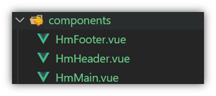

```js
// 导入需要注册的组件
import 组件对象 from '.vue文件路径'
import HmHeader from './components/HmHeader'

export default {  // 局部注册
  components: {
   '组件名': 组件对象,
    HmHeader:HmHeaer,
    HmHeader
  }
}
```


### 6.练习

在App组件中，完成以下练习。在App.vue中使用组件的方式完成下面布局


```vue
<template>
  <div class="hm-header">
    我是hm-header
  </div>
</template>

<script>
export default {

}
</script>

<style>
.hm-header {
  height: 100px;
  line-height: 100px;
  text-align: center;
  font-size: 30px;
  background-color: #8064a2;
  color: white;
}
</style>
```

```vue
<template>
  <div class="hm-main">
    我是hm-main
  </div>
</template>

<script>
export default {

}
</script>

<style>
.hm-main {
  height: 400px;
  line-height: 400px;
  text-align: center;
  font-size: 30px;
  background-color: #f79646;
  color: white;
  margin: 20px 0;
}
</style>
```

```vue
<template>
  <div class="hm-footer">
    我是hm-footer
  </div>
</template>

<script>
export default {

}
</script>

<style>
.hm-footer {
  height: 100px;
  line-height: 100px;
  text-align: center;
  font-size: 30px;
  background-color: #4f81bd;
  color: white;
}
</style>
```

### 7.总结

- A组件内部注册的局部组件能在B组件使用吗
- 局部注册组件的步骤是什么
- 使用组件时 应该按照什么命名法


## 十一、普通组件的注册使用-全局注册

### 1.特点：

全局注册的组件，在项目的**任何组件**中都能使用

### 2.步骤

1. 创建.vue组件（三个组成部分）
2. **main.js**中进行全局注册

### 3.使用方式

当成HTML标签直接使用

> <组件名></组件名>

### 4.注意

组件名规范 —> 大驼峰命名法， 如 HmHeader

### 5.语法

Vue.component('组件名', 组件对象)

例：

```js
// 导入需要全局注册的组件
import HmButton from './components/HmButton'
Vue.component('HmButton', HmButton)
```

### 6.练习

在以下3个局部组件中是展示一个通用按钮

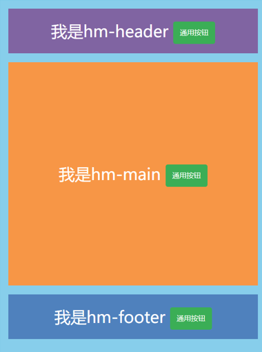

```vue
<template>
  <button class="hm-button">通用按钮</button>
</template>

<script>
export default {

}
</script>

<style>
.hm-button {
  height: 50px;
  line-height: 50px;
  padding: 0 20px;
  background-color: #3bae56;
  border-radius: 5px;
  color: white;
  border: none;
  vertical-align: middle;
  cursor: pointer;
}
</style>
```

### 7.总结

1.全局注册组件应该在哪个文件中注册以及语法是什么？

2.全局组件在项目中的任何一个组件中可不可以使用？


## 十二、综合案例

### 1.小兔仙首页启动项目演示

### 2.小兔仙组件拆分示意图

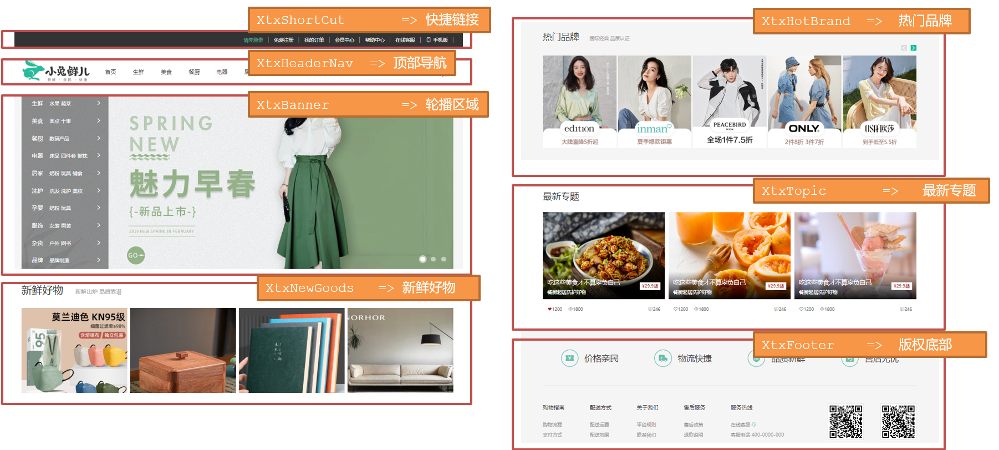


### 3.开发思路

1. 分析页面，按模块拆分组件，搭架子  (局部或全局注册)

2. 根据设计图，编写组件 html 结构 css 样式 (已准备好)

3. 拆分封装通用小组件  (局部或全局注册)

   将来 → 通过 js 动态渲染，实现功能

# day04

## 一、学习目标

### 1.组件的三大组成部分（结构/样式/逻辑）

​    scoped解决样式冲突/data是一个函数

###  2.组件通信

1.  组件通信语法
2. 父传子
3. 子传父
4. 非父子通信（扩展）

### 3.综合案例：小黑记事本（组件版）

1. 拆分组件
2. 列表渲染
3. 数据添加
4. 数据删除
5. 列表统计
6. 清空
7. 持久化

### 4.进阶语法

1. v-model原理
2. v-model应用于组件
3. sync修饰符
4. ref和$refs
5. $nextTick


## 二、scoped解决样式冲突

### **1.默认情况**：

写在组件中的样式会 **全局生效** →  因此很容易造成多个组件之间的样式冲突问题。

1. **全局样式**: 默认组件中的样式会作用到全局，任何一个组件中都会受到此样式的影响


2. **局部样式**: 可以给组件加上**scoped** 属性,可以**让样式只作用于当前组件**

### 2.代码演示

BaseOne.vue

```vue
<template>
  <div class="base-one">
    BaseOne
  </div>
</template>

<script>
export default {

}
</script>
<style scoped>
</style>
```

BaseTwo.vue

```vue
<template>
  <div class="base-one">
    BaseTwo
  </div>
</template>

<script>
export default {

}
</script>

<style scoped>
</style>
```

App.vue

```vue
<template>
  <div id="app">
    <BaseOne></BaseOne>
    <BaseTwo></BaseTwo>
  </div>
</template>

<script>
import BaseOne from './components/BaseOne'
import BaseTwo from './components/BaseTwo'
export default {
  name: 'App',
  components: {
    BaseOne,
    BaseTwo
  }
}
</script>
```

### 3.scoped原理

1. 当前组件内标签都被添加**data-v-hash值** 的属性 
2. css选择器都被添加 [**data-v-hash值**] 的属性选择器

最终效果: **必须是当前组件的元素**, 才会有这个自定义属性, 才会被这个样式作用到 


### 4.总结

1. style的默认样式是作用到哪里的？
2. scoped的作用是什么？
3. style中推不推荐加scoped？


## 三、data必须是一个函数

### 1、data为什么要写成函数

一个组件的 **data** 选项必须**是一个函数**。目的是为了：保证每个组件实例，维护**独立**的一份**数据**对象。

每次创建新的组件实例，都会新**执行一次data 函数**，得到一个新对象。

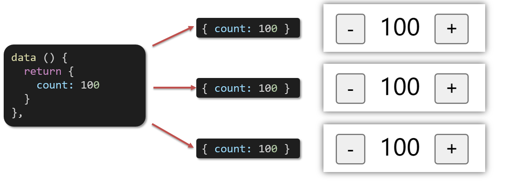

### 2.代码演示

BaseCount.vue

```vue
<template>
  <div class="base-count">
    <button @click="count--">-</button>
    <span>{{ count }}</span>
    <button @click="count++">+</button>
  </div>
</template>

<script>
export default {
  data: function () {
    return {
      count: 100,
    }
  },
}
</script>

<style>
.base-count {
  margin: 20px;
}
</style>
```

App.vue

```vue
<template>
  <div class="app">
    <BaseCount></BaseCount>
  </div>
</template>

<script>
import BaseCount from './components/BaseCount'
export default {
  components: {
    BaseCount,
  },
}
</script>

<style>
</style>
```

### 3.总结

data写成函数的目的是什么？


## 四、组件通信

### 1.什么是组件通信？

组件通信，就是指**组件与组件**之间的**数据传递**

- 组件的数据是独立的，无法直接访问其他组件的数据。
- 想使用其他组件的数据，就需要组件通信

### 2.组件之间如何通信

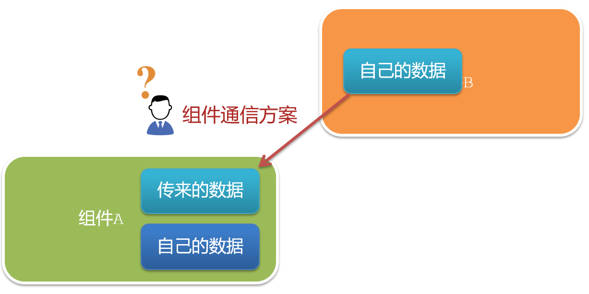

思考：

1. 组件之间有哪些关系？
2. 对应的组件通信方案有哪几类？

### 3.组件关系分类

1. 父子关系
2. 非父子关系


### 4.通信解决方案


### 5.父子通信流程

1. 父组件通过 **props** 将数据传递给子组件
2. 子组件利用 **$emit** 通知父组件修改更新

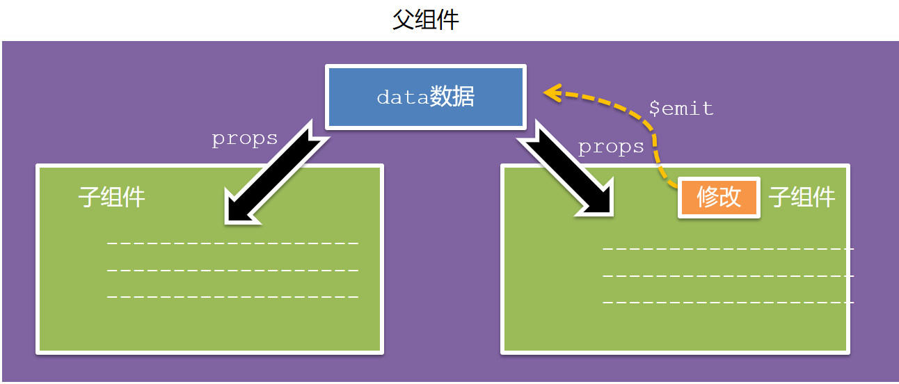


### 6.父向子通信代码示例

父组件通过**props**将数据传递给子组件

父组件App.vue

```vue
<template>
  <div class="app" style="border: 3px solid #000; margin: 10px">
    我是APP组件 
    <Son></Son>
  </div>
</template>

<script>
import Son from './components/Son.vue'
export default {
  name: 'App',
  data() {
    return {
      myTitle: '学前端，就来黑马程序员',
    }
  },
  components: {
    Son,
  },
}
</script>

<style>
</style>
```


子组件Son.vue

```vue
<template>
  <div class="son" style="border:3px solid #000;margin:10px">
    我是Son组件
  </div>
</template>

<script>
export default {
  name: 'Son-Child',
}
</script>

<style>

</style>
```


父向子传值步骤

1. 给子组件以添加属性的方式传值
2. 子组件内部通过props接收
3. 模板中直接使用 props接收的值


### 7.子向父通信代码示例

子组件利用 **$emit** 通知父组件，进行修改更新


子向父传值步骤

1. $emit触发事件，给父组件发送消息通知
2. 父组件监听$emit触发的事件
3. 提供处理函数，在函数的性参中获取传过来的参数

补：原生事件（如click）想在子组件标签上使用，是不能直接使用的，直接使用是无效的。有两种解决方法：

- 子组件中定义 @click=“回调函数” ，在触发的回调函数内 emit 给父组件的 click 事件，此时父组件就可以监听了。
- 使用原生事件：需要加 .native（如 @click.native="回调函数"）

### 8.总结

1. 组件关系分类有哪两种
2. 父子组件通信的流程是什么？
   1. 父向子
   2. 子向父


## 五、什么是props

### 1.Props 定义

组件上 注册的一些  自定义属性

### 2.Props 作用

向子组件传递数据

### 3.特点

1. 可以 传递 **任意数量** 的prop
2. 可以 传递 **任意类型** 的prop


### 4.代码演示

父组件App.vue

```vue
<template>
  <div class="app">
    <UserInfo
      :username="username"
      :age="age"
      :isSingle="isSingle"
      :car="car"
      :hobby="hobby"
    ></UserInfo>
  </div>
</template>

<script>
import UserInfo from './components/UserInfo.vue'
export default {
  data() {
    return {
      username: '小帅',
      age: 28,
      isSingle: true,
      car: {
        brand: '宝马',
      },
      hobby: ['篮球', '足球', '羽毛球'],
    }
  },
  components: {
    UserInfo,
  },
}
</script>

<style>
</style>
```

子组件UserInfo.vue

```vue
<template>
  <div class="userinfo">
    <h3>我是个人信息组件</h3>
    <div>姓名：</div>
    <div>年龄：</div>
    <div>是否单身：</div>
    <div>座驾：</div>
    <div>兴趣爱好：</div>
  </div>
</template>

<script>
export default {
  
}
</script>

<style>
.userinfo {
  width: 300px;
  border: 3px solid #000;
  padding: 20px;
}
.userinfo > div {
  margin: 20px 10px;
}
</style>
```


## 六、props校验

### 1.思考

组件的props可以乱传吗

### 2.作用

为组件的 prop 指定**验证要求**，不符合要求，控制台就会有**错误提示**  → 帮助开发者，快速发现错误

### 3.语法

- **类型校验**
- 非空校验
- 默认值
- 自定义校验


### 4.代码演示

App.vue

```vue
<template>
  <div class="app">
    <BaseProgress :w="width"></BaseProgress>
  </div>
</template>

<script>
import BaseProgress from './components/BaseProgress.vue'
export default {
  data() {
    return {
      width: 30,
    }
  },
  components: {
    BaseProgress,
  },
}
</script>

<style>
</style>
```

BaseProgress.vue

```vue
<template>
  <div class="base-progress">
    <div class="inner" :style="{ width: w + '%' }">
      <span>{{ w }}%</span>
    </div>
  </div>
</template>

<script>
export default {
  props: ['w'],
}
</script>

<style scoped>
.base-progress {
  height: 26px;
  width: 400px;
  border-radius: 15px;
  background-color: #272425;
  border: 3px solid #272425;
  box-sizing: border-box;
  margin-bottom: 30px;
}
.inner {
  position: relative;
  background: #379bff;
  border-radius: 15px;
  height: 25px;
  box-sizing: border-box;
  left: -3px;
  top: -2px;
}
.inner span {
  position: absolute;
  right: 0;
  top: 26px;
}
</style>
```


## 七、props校验完整写法

### 1.语法

```vue
props: {
  校验的属性名: {
    type: 类型,  // Number String Boolean ...
    required: true, // 是否必填
    default: 默认值, // 默认值
    validator (value) {
      // 自定义校验逻辑
      return 是否通过校验
    }
  }
},
```

### 2.代码实例

```vue
<script>
export default {
  // 完整写法（类型、默认值、非空、自定义校验）
  props: {
    w: {
      type: Number,
      //required: true,
      default: 0,
      validator(val) {
        // console.log(val)
        if (val >= 100 || val <= 0) {
          console.error('传入的范围必须是0-100之间')
          return false
        } else {
          return true
        }
      },
    },
  },
}
</script>
```

### 3.注意

1.default和required一般不同时写（因为当时必填项时，肯定是有值的）

2.default后面如果是简单类型的值，可以直接写默认。如果是复杂类型的值，则需要以函数的形式return一个默认值


## 八、props&data、单向数据流

### 1.共同点

都可以给组件提供数据

### 2.区别

- data 的数据是**自己**的  →   随便改  
- prop 的数据是**外部**的  →   不能直接改，要遵循 **单向数据流**

### 3.单向数据流：

父级props 的数据更新，会向下流动，影响子组件。这个数据流动是单向的

### 4.代码演示

App.vue

```vue
<template>
  <div class="app">
    <BaseCount></BaseCount>
  </div>
</template>

<script>
import BaseCount from './components/BaseCount.vue'
export default {
  components:{
    BaseCount
  },
  data(){
  },
}
</script>

<style>

</style>
```

BaseCount.vue

```vue
<template>
  <div class="base-count">
    <button @click="count--">-</button>
    <span>{{ count }}</span>
    <button @click="count++">+</button>
  </div>
</template>

<script>
export default {
  // 1.自己的数据随便修改  （谁的数据 谁负责）
   data () {
     return {
       count: 100,
     }
   },
  // 2.外部传过来的数据 不能随便修改
  //props: {
  //  count: {
  //    type: Number,
  //  }, 
  //}
}
</script>

<style>
.base-count {
  margin: 20px;
}
</style>
```


### 5.口诀

**谁的数据谁负责**


## 九、综合案例-组件拆分

### 1.需求说明

- 拆分基础组件
- 渲染待办任务
- 添加任务
-  删除任务
-  底部合计 和 清空功能
-  持久化存储


### 2.拆分基础组件

咱们可以把小黑记事本原有的结构拆成三部分内容：头部（TodoHeader）、列表(TodoMain)、底部(TodoFooter)


## 十、综合案例-列表渲染

思路分析：

1. 提供数据：提供在公共的父组件 App.vue
2. 通过父传子，将数据传递给TodoMain
3. 利用v-for进行渲染


## 十一、综合案例-添加功能

思路分析：

1. 收集表单数据  v-model
2. 监听时间 （回车+点击 都要进行添加）
3. 子传父，将任务名称传递给父组件App.vue
4. 父组件接受到数据后 进行添加 **unshift**(自己的数据自己负责)


## 十二、综合案例-删除功能

思路分析：

1. 监听时间（监听删除的点击）携带id
2. 子传父，将删除的id传递给父组件App.vue
3. 进行删除 **filter**  (自己的数据自己负责)


## 十三、综合案例-底部功能及持久化存储

思路分析：

1. 底部合计：父组件传递list到底部组件  —>展示合计
2. 清空功能：监听事件 —> **子组件**通知父组件 —>父组件清空
3. 持久化存储：watch监听数据变化，持久化到本地


## 十四、非父子通信-event bus 事件总线

### 1.作用

非父子组件之间，进行简易消息传递。(复杂场景→ Vuex)

### 2.步骤

1. 创建一个都能访问的事件总线 （空Vue实例）

   ```js
   import Vue from 'vue'
   const Bus = new Vue()
   export default Bus
   ```

2. A组件（接受方），监听Bus的 $on事件

   ```vue
   created () {
     Bus.$on('sendMsg', (msg) => {
       this.msg = msg
     })
   }
   ```

3. B组件（发送方），触发Bus的$emit事件

   ```vue
   Bus.$emit('sendMsg', '这是一个消息')
   ```

   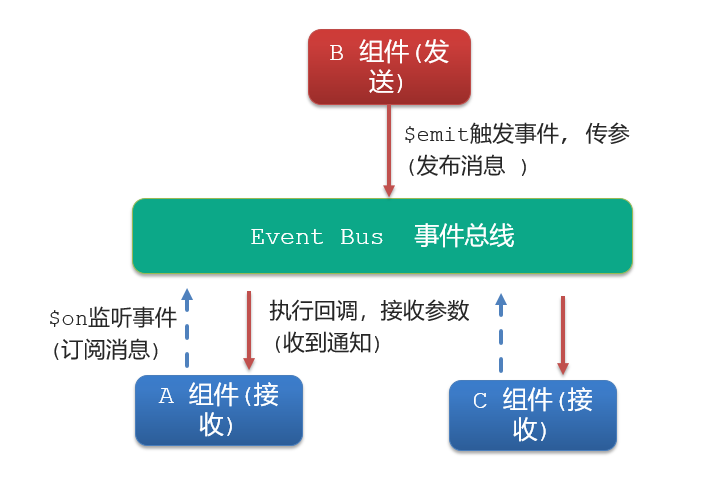

### 3.代码示例

EventBus.js

```js
import Vue from 'vue'
const Bus  =  new Vue()
export default Bus
```

BaseA.vue(接受方)

```vue
<template>
  <div class="base-a">
    我是A组件（接收方）
    <p>{{msg}}</p>  
  </div>
</template>

<script>
import Bus from '../utils/EventBus'
export default {
  data() {
    return {
      msg: '',
    }
  },
}
</script>

<style scoped>
.base-a {
  width: 200px;
  height: 200px;
  border: 3px solid #000;
  border-radius: 3px;
  margin: 10px;
}
</style>
```

BaseB.vue(发送方)

```vue
<template>
  <div class="base-b">
    <div>我是B组件（发布方）</div>
    <button>发送消息</button>
  </div>
</template>

<script>
import Bus from '../utils/EventBus'
export default {
}
</script>

<style scoped>
.base-b {
  width: 200px;
  height: 200px;
  border: 3px solid #000;
  border-radius: 3px;
  margin: 10px;
}
</style>
```

App.vue

```vue
<template>
  <div class="app">
    <BaseA></BaseA>
    <BaseB></BaseB> 
  </div>
</template>

<script>
import BaseA from './components/BaseA.vue'
import BaseB from './components/BaseB.vue' 
export default {
  components:{
    BaseA,
    BaseB
  }
}
</script>

<style>

</style>
```

### 4.总结

1.非父子组件传值借助什么？

2.什么是事件总线

3.发送方应该调用事件总线的哪个方法

4.接收方应该调用事件总线的哪个方法

5.一个组件发送数据，可不可以被多个组件接收


## 十五、非父子通信-provide&inject

### 1.作用

跨层级共享数据

### 2.场景


### 3.语法

1. 父组件 provide提供数据

```js
export default {
  provide () {
    return {
       // 普通类型【非响应式】
       color: this.color, 
       // 复杂类型【响应式】
       userInfo: this.userInfo, 
    }
  }
}
```

2.子/孙组件 inject获取数据

```js
export default {
  inject: ['color','userInfo'],
  created () {
    console.log(this.color, this.userInfo)
  }
}
```

### 4.注意

- provide提供的简单类型的数据不是响应式的，复杂类型数据是响应式。（推荐提供复杂类型数据）
- 子/孙组件通过inject获取的数据，不能在自身组件内修改


## 十六、v-model原理

### 1.原理：

v-model本质上是一个语法糖。例如应用在输入框上，就是value属性 和 input事件 的合写

```vue
<template>
  <div id="app" >
    <input v-model="msg" type="text">

    <input :value="msg" @input="msg = $event.target.value" type="text">
  </div>
</template>

```

### 2.作用：

提供数据的双向绑定

- 数据变，视图跟着变 :value
- 视图变，数据跟着变 @input

### 3.注意

**$event** 用于在模板中，获取事件的形参

### 4.代码示例

```vue
<template>
  <div class="app">
    <input type="text"  />
    <br /> 
    <input type="text" />
  </div>
</template>

<script>
export default {
  data() {
    return {
      msg1: '',
      msg2: '',
    }
  },
}
</script> 
<style>
</style>
```

### 5.v-model使用在其他表单元素上的原理

不同的表单元素， v-model在底层的处理机制是不一样的。比如给checkbox使用v-model

底层处理的是 checked属性和change事件。

**不过咱们只需要掌握应用在文本框上的原理即可**


## 十七、表单类组件封装

### 1.需求目标

实现子组件和父组件数据的双向绑定 （实现App.vue中的selectId和子组件选中的数据进行双向绑定）

实现步骤：

1. 父传子：数据 应该是父组件 props 传递过来的，v-model **拆解** 绑定数据
2. 子传父：监听输入，子传父 传值给父组件修改

### 2.代码演示

App.vue

```vue
<template>
  <div class="app">
    <BaseSelect :cityId="selectId" @changeId="selectId = $event"></BaseSelect>
  </div>
</template>

<script>
import BaseSelect from './components/BaseSelect.vue'
export default {
  data() {
    return {
      selectId: '102',
    }
  },
  components: {
    BaseSelect,
  },
}
</script>

<style>
</style>
```

BaseSelect.vue

```vue
<template>
  <div>
    <select :value="cityId" @change="handleChange">
      <option value="101">北京</option>
      <option value="102">上海</option>
      <option value="103">武汉</option>
      <option value="104">广州</option>
      <option value="105">深圳</option>
    </select>
  </div>
</template>

<script>
export default {
    props: {
        cityId: String
    },
    methods: {
        handleChange(e) {
            this.$emit('changeId', e.target.value)
        }
    }
}
</script>

<style>
</style>
```


## 十八、v-model简化代码

### 1.目标：

父组件通过v-model **简化代码**，实现子组件和父组件数据 **双向绑定**

### 2.如何简化：

v-model其实就是 :value和@input事件的简写

- 子组件：props通过value接收数据，事件触发 input
- 父组件：v-model直接绑定数据

### 3.代码示例

子组件

```vue
<select :value="value" @change="handleChange">...</select>
<script>
    export default {
        props: {
            value: String
        },
        methods: {
            handleChange (e) {
                //把子传父的事件名设置为“input”
                this.$emit('input', e.target.value)
            }
        }
    }
</script>
```

父组件

```vue
<BaseSelect v-model="selectId"></BaseSelect>
```


## 十九、.sync修饰符

### 1.作用

可以实现 **子组件** 与 **父组件数据** 的 **双向绑定**，简化代码

简单理解：**子组件可以修改父组件传过来的props值**

### 2.场景

封装弹框类的基础组件， visible属性 true显示 false隐藏

### 3.本质

.sync修饰符 就是 **:属性名** 和 **@update:属性名** 合写

### 4.语法

父组件

```vue
//.sync写法
<BaseDialog :visible.sync="isShow" />
--------------------------------------
//完整写法
<BaseDialog 
  :visible="isShow" 
  @update:visible="isShow = $event" 
/>
```

子组件

```vue
props: {
  visible: Boolean
},

this.$emit('update:visible', false)
```

### 5.代码示例

App.vue

```vue
<template>
  <div class="app">
    <button @click="isHow = true">退出按钮</button>
    <BaseDialog :visible.sync="isShow"></BaseDialog>
  </div>
</template>

<script>
import BaseDialog from './components/BaseDialog.vue'
export default {
  data() {
    return {
      isShow: false,
    }
  },
  components: {
    BaseDialog,
  },
}
</script>

<style>
</style>
```

BaseDialog.vue

```vue
<template>
  <div class="base-dialog-wrap" v-show="visible">
    <div class="base-dialog">
      <div class="title">
        <h3>温馨提示：</h3>
        <button @click="close" class="close">x</button>
      </div>
      <div class="content">
        <p>你确认要退出本系统么？</p>
      </div>
      <div class="footer">
        <button>确认</button>
        <button>取消</button>
      </div>
    </div>
  </div>
</template>

<script>
export default {
  props: {
    visible: Boolean,
  },
  methods: {
    close(e) {
      this.$emit('update:visible', false)
    }
  }
}
</script>

<style scoped>
.base-dialog-wrap {
  width: 300px;
  height: 200px;
  box-shadow: 2px 2px 2px 2px #ccc;
  position: fixed;
  left: 50%;
  top: 50%;
  transform: translate(-50%, -50%);
  padding: 0 10px;
}
.base-dialog .title {
  display: flex;
  justify-content: space-between;
  align-items: center;
  border-bottom: 2px solid #000;
}
.base-dialog .content {
  margin-top: 38px;
}
.base-dialog .title .close {
  width: 20px;
  height: 20px;
  cursor: pointer;
  line-height: 10px;
}
.footer {
  display: flex;
  justify-content: flex-end;
  margin-top: 26px;
}
.footer button {
  width: 80px;
  height: 40px;
}
.footer button:nth-child(1) {
  margin-right: 10px;
  cursor: pointer;
}
</style>
```


### 6.总结

1.父组件如果想让子组件修改传过去的值 必须加什么修饰符？

2.子组件要修改父组件的props值 必须使用什么语法？


## 二十、ref和$refs

### 1.作用

利用ref 和 $refs 可以用于 获取 dom 元素 或 组件实例

### 2.特点：

查找范围 →  当前组件内(更精确稳定)

### 3.语法

1.给要获取的盒子或组件添加ref属性

```html
<div ref="chartRef">我是渲染图表的容器</div>
<BaseForm ref="baseForm"></BaseForm>
```

2.获取时通过 $refs获取  this.\$refs.chartRef 获取

```html
mounted () {
  console.log(this.$refs.chartRef)
  this.$refs.baseForm.组件方法()
}
```

### 4.注意

之前只用document.querySelect('.box') 获取的是整个页面中的盒子


### 5.代码示例

App.vue

```vue
<template>
  <div class="app">
    <div class="base-chart-box">
        我是一个捣乱的盒子
    </div>
    <BaseChart></BaseChart>
  </div>
</template>

<script>
import BaseChart from './components/BaseChart.vue'
export default {
  components:{
    BaseChart
  }
}
</script>

<style>
</style>
```

BaseChart.vue

```vue
<template>
  <div class="base-chart-box" ref="myChart">子组件</div>
</template>

<script>
// yarn add echarts 或者 npm i echarts
import * as echarts from 'echarts'

export default {
  mounted() {
    // 基于准备好的dom，初始化echarts实例
    //var myChart = echarts.init(document.querySelect('.base-chart-box'))
    var myChart = echarts.init(this.$refs.mychart)
    // 绘制图表
    myChart.setOption({
      title: {
        text: 'ECharts 入门示例',
      },
      tooltip: {},
      xAxis: {
        data: ['衬衫', '羊毛衫', '雪纺衫', '裤子', '高跟鞋', '袜子'],
      },
      yAxis: {},
      series: [
        {
          name: '销量',
          type: 'bar',
          data: [5, 20, 36, 10, 10, 20],
        },
      ],
    })
  },
}
</script>

<style scoped>
.base-chart-box {
  width: 400px;
  height: 300px;
  border: 3px solid #000;
  border-radius: 6px;
}
</style>
```


## 二十一、异步更新 & $nextTick

### 1.需求

编辑标题,  编辑框自动聚焦

1. 点击编辑，显示编辑框
2. 让编辑框，立刻获取焦点

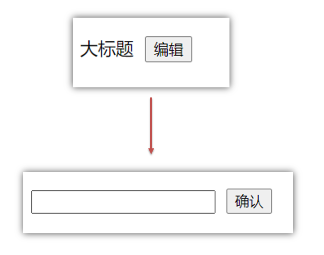

### 2.代码实现

```vue
<template>
  <div class="app">
    <div v-if="isShowEdit">
      <input type="text" v-model="editValue" ref="inp" />
      <button>确认</button>
    </div>
    <div v-else>
      <span>{{ title }}</span>
      <button @click="editFn">编辑</button>
    </div>
  </div>
</template>

<script>
export default {
  data() {
    return {
      title: '大标题',
      isShowEdit: false,
      editValue: '',
    }
  },
  methods: {
    editFn() {
        // 显示输入框
        this.isShowEdit = true  
        // 获取焦点
        this.$refs.inp.focus() 
    }  },
}
</script> 
```


### 3.问题

```js
// 显示输入框
this.isShowEdit = true  
// 获取焦点
this.$refs.inp.focus() 
```

"显示之后"，立刻获取焦点是不能成功的！

原因：Vue 是异步更新DOM  (提升性能)


### 4.解决方案

$nextTick：**等 DOM更新后**,才会触发执行此方法里的函数体

补：用生命周期的构子函数也行（如updated）或 setTimeout，但有 范围太大 或 不精准 等问题

**语法:** this.$nextTick(函数体)

```js
this.$nextTick(() => {
  this.$refs.inp.focus()
})
```

**注意：**$nextTick 内的函数体 一定是**箭头函数**，这样才能让函数内部的this指向Vue实例

# day05


## 一、学习目标

### 1.自定义指令

- 基本语法（全局、局部注册）
- 指令的值
- v-loading的指令封装

### 2.插槽

- 默认插槽
- 具名插槽
- 作用域插槽

### 3.综合案例：商品列表

- MyTag组件封装
- MyTable组件封装

### 4.路由入门

- 单页应用程序
- 路由
- VueRouter的基本使用


## 二、自定义指令

### 1.指令介绍

- 内置指令：**v-html、v-if、v-bind、v-on**... 这都是Vue给咱们内置的一些指令，可以直接使用

- 自定义指令：同时Vue也支持让开发者，自己注册一些指令。这些指令被称为**自定义指令**

  每个指令都有自己各自独立的功能

### 2.自定义指令

概念：自己定义的指令，可以**封装一些DOM操作**，扩展额外的功能

### 3.自定义指令语法

- 全局注册

  ```js
  //在main.js中
  Vue.directive('指令名', {
    //inserted：构子函数，当指令绑定的元素被添加到页面后触发
    "inserted" (el) {
      // 可以对 el 标签，扩展额外功能
      el.focus()
    }
  })
  ```

- 局部注册

  ```js
  //在Vue组件的配置项中
  directives: {
    "指令名": {
      inserted (el) {
        // 可以对 el 标签，扩展额外功能
        el.focus()
      }
    }
  }
  ```

- 使用指令

  注意：在使用指令的时候，一定要**先注册**，**再使用**，否则会报错
  使用指令语法： v-指令名。如：<input type="text"  v-focus/>  

  **注册**指令时**不用**加**v-前缀**，但**使用时**一定要**加v-前缀**

### 4.指令中的配置项介绍

inserted:被绑定元素插入父节点时调用的钩子函数

el：使用指令的那个DOM元素


### 5.代码示例

需求：当页面加载时，让元素获取焦点（**autofocus在safari浏览器有兼容性**）

App.vue

```vue
  <div>
    <h1>自定义指令</h1>
    <input v-focus ref="inp" type="text">
  </div>
```


### 6.总结

1.自定义指令的作用是什么？

2.使用自定义指令的步骤是哪两步？


## 三、自定义指令-指令的值

### 1.需求

实现一个 color 指令 - 传入不同的颜色, 给标签设置文字颜色

### 2.语法

1.在绑定指令时，可以通过“等号”的形式为指令 绑定 具体的参数值

```html
<div v-color="color">我是内容</div>
```

2.通过 binding.value 可以拿到指令值，**指令值修改会 触发 update 函数**

```js
directives: {
  color: {
    inserted (el, binding) {
      el.style.color = binding.value
    },
    update (el, binding) {
      el.style.color = binding.value
    }
  }
}
```

### 3.代码示例

App.vue

```vue
<template>
  <div>
     <!--显示红色--> 
    <h2 v-color="color1">指令的值1测试</h2>
     <!--显示蓝色--> 
    <h2 v-color="color2">指令的值2测试</h2>
     <button>
        改变第一个h1的颜色
    </button>
  </div>
</template>

<script>
export default {
  data () {
    return {
      color1: 'red',
      color2: 'blue'
    }
  }
}
</script>

<style>

</style>
```


## 四、自定义指令-v-loading指令的封装

### 1.场景

实际开发过程中，发送请求需要时间，在请求的数据未回来时，页面会处于**空白状态**  =>  用户体验不好

### 2.需求

封装一个 v-loading 指令，实现加载中的效果

### 3.分析

1.本质 loading效果就是一个蒙层，盖在了盒子上

2.数据请求中，开启loading状态，添加蒙层

3.数据请求完毕，关闭loading状态，移除蒙层

### 4.实现

1.准备一个 loading类，通过伪元素定位，设置宽高，实现蒙层

2.开启关闭 loading状态（添加移除蒙层），本质只需要添加移除类即可

3.结合自定义指令的语法进行封装复用

```css
.loading:before {
  content: "";
  position: absolute;
  left: 0;
  top: 0;
  width: 100%;
  height: 100%;
  background: #fff url("./loading.gif") no-repeat center;
}
```

### 5.准备代码

```html
<template>
  <div class="main">
    <div class="box">
      <ul>
        <li v-for="item in list" :key="item.id" class="news">
          <div class="left">
            <div class="title">{{ item.title }}</div>
            <div class="info">
              <span>{{ item.source }}</span>
              <span>{{ item.time }}</span>
            </div>
          </div>
          <div class="right">
            
          </div>
        </li>
      </ul>
    </div> 
  </div>
</template>

<script>
// 安装axios =>  yarn add axios || npm i axios
import axios from 'axios'

// 接口地址：http://hmajax.itheima.net/api/news
// 请求方式：get
export default {
  data () {
    return {
      list: [],
      isLoading: false,
      isLoading2: false
    }
  },
  async created () {
    // 1. 发送请求获取数据
    const res = await axios.get('http://hmajax.itheima.net/api/news')
    
    setTimeout(() => {
      // 2. 更新到 list 中，用于页面渲染 v-for
      this.list = res.data.data
    }, 2000)
  }
}
</script>

<style>
.loading:before {
  content: '';
  position: absolute;
  left: 0;
  top: 0;
  width: 100%;
  height: 100%;
  background: #fff url('./loading.gif') no-repeat center;
}

.box2 {
  width: 400px;
  height: 400px;
  border: 2px solid #000;
  position: relative;
}


.box {
  width: 800px;
  min-height: 500px;
  border: 3px solid orange;
  border-radius: 5px;
  position: relative;
}
.news {
  display: flex;
  height: 120px;
  width: 600px;
  margin: 0 auto;
  padding: 20px 0;
  cursor: pointer;
}
.news .left {
  flex: 1;
  display: flex;
  flex-direction: column;
  justify-content: space-between;
  padding-right: 10px;
}
.news .left .title {
  font-size: 20px;
}
.news .left .info {
  color: #999999;
}
.news .left .info span {
  margin-right: 20px;
}
.news .right {
  width: 160px;
  height: 120px;
}
.news .right img {
  width: 100%;
  height: 100%;
  object-fit: cover;
}
</style>
```


## 五、插槽-默认插槽

### 1.作用

让组件内部的一些 **结构** 支持 **自定义**


### 2.需求

将需要多次显示的对话框,封装成一个组件

### 3.问题

组件的内容部分，**不希望写死**，希望能使用的时候**自定义**。怎么办

### 4.插槽的基本语法

1. 组件内需要定制的结构部分，改用**<slot></slot>**占位
2. 使用组件时, **<MyDialog></MyDialog>**标签内部, 传入结构替换slot
3. 给插槽传入内容时，可以传入**纯文本、html标签、组件**


### 5.代码示例

MyDialog.vue

```vue
<template>
  <div class="dialog">
    <div class="dialog-header">
      <h3>友情提示</h3>
      <span class="close">✖️</span>
    </div>

    <div class="dialog-content">
      您确定要进行删除操作吗？
    </div>
    <div class="dialog-footer">
      <button>取消</button>
      <button>确认</button>
    </div>
  </div>
</template>

<script>
export default {
  data () {
    return {

    }
  }
}
</script>

<style scoped>
* {
  margin: 0;
  padding: 0;
}
.dialog {
  width: 470px;
  height: 230px;
  padding: 0 25px;
  background-color: #ffffff;
  margin: 40px auto;
  border-radius: 5px;
}
.dialog-header {
  height: 70px;
  line-height: 70px;
  font-size: 20px;
  border-bottom: 1px solid #ccc;
  position: relative;
}
.dialog-header .close {
  position: absolute;
  right: 0px;
  top: 0px;
  cursor: pointer;
}
.dialog-content {
  height: 80px;
  font-size: 18px;
  padding: 15px 0;
}
.dialog-footer {
  display: flex;
  justify-content: flex-end;
}
.dialog-footer button {
  width: 65px;
  height: 35px;
  background-color: #ffffff;
  border: 1px solid #e1e3e9;
  cursor: pointer;
  outline: none;
  margin-left: 10px;
  border-radius: 3px;
}
.dialog-footer button:last-child {
  background-color: #007acc;
  color: #fff;
}
</style>
```

App.vue

```vue
<template>
  <div>
    <MyDialog>
    </MyDialog>
  </div>
</template>

<script>
import MyDialog from './components/MyDialog.vue'
export default {
  data () {
    return {

    }
  },
  components: {
    MyDialog
  }
}
</script>

<style>
body {
  background-color: #b3b3b3;
}
</style>
```

### 6.总结

场景：组件内某一部分结构不确定，想要自定义怎么办

使用：插槽的步骤分为哪几步？


## 六、插槽-后备内容（默认值）

### 1.问题

通过插槽完成了内容的定制，传什么显示什么, 但是如果不传，则是空白


能否给插槽设置 默认显示内容 呢？

### 2.插槽的后备内容

封装组件时，可以为预留的 `<slot>` 插槽提供后备内容（默认内容）。

### 3.语法

在 <slot> 标签内，放置内容, 作为默认显示内容


### 4.效果

- 外部使用组件时，不传东西，则slot会显示后备内容 

  

- 外部使用组件时，传东西了，则slot整体会被换掉

  

### 5.代码示例

App.vue

```vue
<template>
  <div>
    <MyDialog></MyDialog>
    <MyDialog>
      你确认要退出么
    </MyDialog>
  </div>
</template>

<script>
import MyDialog from './components/MyDialog.vue'
export default {
  data () {
    return {

    }
  },
  components: {
    MyDialog
  }
}
</script>

<style>
body {
  background-color: #b3b3b3;
}
</style>
```


## 七、插槽-具名插槽

### 1.需求

一个组件内有多处结构，需要外部传入标签，进行定制 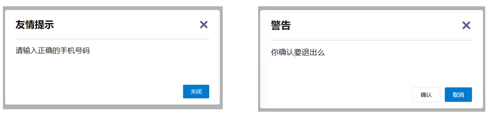

上面的弹框中有**三处不同**，但是**默认插槽**只能**定制一个位置**，这时候怎么办呢?

### 2.具名插槽语法

- 多个slot使用name属性区分名字 

  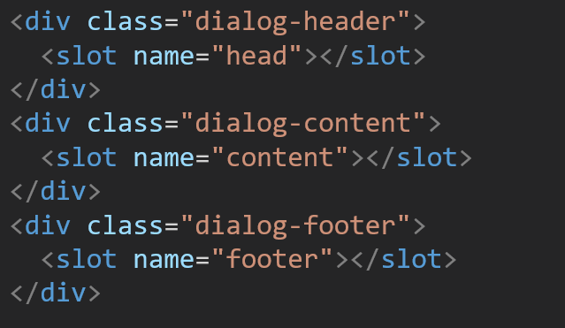

- template配合v-slot:名字来分发对应标签

  

### 3.v-slot的简写

v-slot写起来太长，vue给我们提供一个简单写法 **v-slot —> #**，即：#插槽名

### 4.总结

- 组件内 有多处不确定的结构 怎么办?
- 具名插槽的语法是什么？
- v-slot:插槽名可以简化成什么?


## 八、作用域插槽

### 1.插槽分类

- 默认插槽

- 具名插槽

  插槽只有两种，作用域插槽不属于插槽的一种分类

### 2.作用

定义slot 插槽的同时, 是可以**传值**的。给 **插槽** 上可以 **绑定数据**，将来 **使用组件时可以用**

### 3.场景

封装表格组件


### 4.使用步骤

1. 给 slot 标签, 以 添加属性的方式传值

   ```vue
   <slot :id="item.id" msg="测试文本"></slot>
   ```

2. 所有添加的属性, 都会被收集到一个对象中

   ```vue
   { id: 3, msg: '测试文本' }
   ```

3. 在template中, 通过  ` #插槽名= "obj"` 接收，默认插槽名为 default（obj名称随意，并且此处支持解构）

   ```vue
   <MyTable :list="list">
     <template #default="obj">
       <button @click="del(obj.id)">删除</button>
     </template>
   </MyTable>
   ```

### 5.代码示例

MyTable.vue

```vue
<template>
  <table class="my-table">
    <thead>
      <tr>
        <th>序号</th>
        <th>姓名</th>
        <th>年纪</th>
        <th>操作</th>
      </tr>
    </thead>
    <tbody>
      <tr>
        <td>1</td>
        <td>赵小云</td>
        <td>19</td>
        <td>
          <button>
          	查看    
    	  </button>
        </td>
      </tr>
        <tr>
        <td>1</td>
        <td>张小花</td>
        <td>19</td>
        <td>
          <button>
          	查看    
    	  </button>
        </td>
      </tr>
        <tr>
        <td>1</td>
        <td>孙大明</td>
        <td>19</td>
        <td>
          <button>
          	查看    
    	  </button>
        </td>
      </tr>
    </tbody>
  </table>
</template>

<script>
export default {
  props: {
    data: Array
  }
}
</script>

<style scoped>
.my-table {
  width: 450px;
  text-align: center;
  border: 1px solid #ccc;
  font-size: 24px;
  margin: 30px auto;
}
.my-table thead {
  background-color: #1f74ff;
  color: #fff;
}
.my-table thead th {
  font-weight: normal;
}
.my-table thead tr {
  line-height: 40px;
}
.my-table th,
.my-table td {
  border-bottom: 1px solid #ccc;
  border-right: 1px solid #ccc;
}
.my-table td:last-child {
  border-right: none;
}
.my-table tr:last-child td {
  border-bottom: none;
}
.my-table button {
  width: 65px;
  height: 35px;
  font-size: 18px;
  border: 1px solid #ccc;
  outline: none;
  border-radius: 3px;
  cursor: pointer;
  background-color: #ffffff;
  margin-left: 5px;
}
</style>
```

App.vue

```vue
<template>
  <div>
    <MyTable :data="list"></MyTable>
    <MyTable :data="list2"></MyTable>
  </div>
</template>

<script>
  import MyTable from './components/MyTable.vue'
  export default {
    data () {
      return {
     	list: [
            { id: 1, name: '张小花', age: 18 },
            { id: 2, name: '孙大明', age: 19 },
            { id: 3, name: '刘德忠', age: 17 },
          ],
          list2: [
            { id: 1, name: '赵小云', age: 18 },
            { id: 2, name: '刘蓓蓓', age: 19 },
            { id: 3, name: '姜肖泰', age: 17 },
          ]
      }
    },
    components: {
      MyTable
    }
  }
</script>
```

### 6.总结

1.作用域插槽的作用是什么？

2.作用域插槽的使用步骤是什么？


## 九、综合案例 - 商品列表-MyTag组件抽离

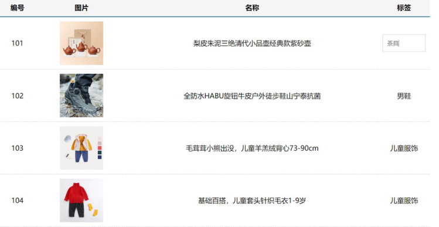

### 1.需求说明

1. **my-tag 标签组件封装**

​    (1) 双击显示输入框，输入框获取焦点

​    (2) 失去焦点，隐藏输入框

​    (3) 回显标签信息

​    (4) 内容修改，回车 → 修改标签信息

2. **my-table 表格组件封装**

​    (1) 动态传递表格数据渲染

​    (2) 表头支持用户自定义

​    (3) 主体支持用户自定义

### 2.代码准备

```vue
<template>
  <div class="table-case">
    <table class="my-table">
      <thead>
        <tr>
          <th>编号</th>
          <th>名称</th>
          <th>图片</th>
          <th width="100px">标签</th>
        </tr>
      </thead>
      <tbody>
        <tr>
          <td>1</td>
          <td>梨皮朱泥三绝清代小品壶经典款紫砂壶</td>
          <td>
            
          </td>
          <td>
            <div class="my-tag">
              <!-- <input 
                class="input"
                type="text"
                placeholder="输入标签"
              /> -->
              <div class="text">
                茶具
              </div>
            </div>
          </td>
        </tr>
        <tr>
          <td>1</td>
          <td>梨皮朱泥三绝清代小品壶经典款紫砂壶</td>
          <td>
            
          </td>
          <td>
            <div class="my-tag">
              <!-- <input
                ref="inp"
                class="input"
                type="text"
                placeholder="输入标签"
              /> -->
              <div class="text">
                男靴
              </div>
            </div>
          </td>
        </tr>
      </tbody>
    </table>
  </div>
</template>

<script>
export default {
  name: 'TableCase',
  components: {},
  data() {
    return {
      goods: [
        {
          id: 101,
          picture:
            'https://yanxuan-item.nosdn.127.net/f8c37ffa41ab1eb84bff499e1f6acfc7.jpg',
          name: '梨皮朱泥三绝清代小品壶经典款紫砂壶',
          tag: '茶具',
        },
        {
          id: 102,
          picture:
            'https://yanxuan-item.nosdn.127.net/221317c85274a188174352474b859d7b.jpg',
          name: '全防水HABU旋钮牛皮户外徒步鞋山宁泰抗菌',
          tag: '男鞋',
        },
        {
          id: 103,
          picture:
            'https://yanxuan-item.nosdn.127.net/cd4b840751ef4f7505c85004f0bebcb5.png',
          name: '毛茸茸小熊出没，儿童羊羔绒背心73-90cm',
          tag: '儿童服饰',
        },
        {
          id: 104,
          picture:
            'https://yanxuan-item.nosdn.127.net/56eb25a38d7a630e76a608a9360eec6b.jpg',
          name: '基础百搭，儿童套头针织毛衣1-9岁',
          tag: '儿童服饰',
        },
      ],
    }
  },
}
</script>

<style lang="less" scoped>
.table-case {
  width: 1000px;
  margin: 50px auto;
  img {
    width: 100px;
    height: 100px;
    object-fit: contain;
    vertical-align: middle;
  }

  .my-table {
    width: 100%;
    border-spacing: 0;
    img {
      width: 100px;
      height: 100px;
      object-fit: contain;
      vertical-align: middle;
    }
    th {
      background: #f5f5f5;
      border-bottom: 2px solid #069;
    }
    td {
      border-bottom: 1px dashed #ccc;
    }
    td,
    th {
      text-align: center;
      padding: 10px;
      transition: all 0.5s;
      &.red {
        color: red;
      }
    }
    .none {
      height: 100px;
      line-height: 100px;
      color: #999;
    }
  }
  .my-tag {
    cursor: pointer;
    .input {
      appearance: none;
      outline: none;
      border: 1px solid #ccc;
      width: 100px;
      height: 40px;
      box-sizing: border-box;
      padding: 10px;
      color: #666;
      &::placeholder {
        color: #666;
      }
    }
  }
}
</style>
```

### 3.my-tag组件封装-创建组件

MyTag.vue

```vue
<template>
  <div class="my-tag">
  <!--  <input
      class="input"
      type="text"
      placeholder="输入标签" 
    /> -->
    <div  
      class="text">
       茶具
    </div>
  </div>
</template>

<script>
export default {
 
}
</script>

<style lang="less" scoped>
.my-tag {
  cursor: pointer;
  .input {
    appearance: none;
    outline: none;
    border: 1px solid #ccc;
    width: 100px;
    height: 40px;
    box-sizing: border-box;
    padding: 10px;
    color: #666;
    &::placeholder {
      color: #666;
    }
  }
}
</style>
```

App.vue

```vue
<template>
  ...
 <tbody>
       <tr>
          ....
          <td>
            <MyTag></MyTag>
          </td>
       </tr>
 </tbody>
 ...
</template>
<script>
import MyTag from './components/MyTag.vue'
export default {
  name: 'TableCase',
  components: {
    MyTag,
  },
 ....
 </script>
```


## 十、综合案例-MyTag组件控制显示隐藏

MyTag.vue

```vue
<template>
  <div class="my-tag">
    <input
      v-if="isEdit"
      v-focus
      ref="inp"
      class="input"
      type="text"
      placeholder="输入标签" 
      @blur="isEdit = false" 
    />
    <div 
      v-else
      @dblclick="handleClick"
      class="text">
       茶具
    </div>
  </div>
</template>

<script>
export default {
  data () {
    return {
      isEdit: false
    }
  },
  methods: {
    handleClick () {
      this.isEdit = true
    }
  }
}
</script> 
```

main.js

```js
// 封装全局指令 focus
Vue.directive('focus', {
  // 指令所在的dom元素，被插入到页面中时触发
  inserted (el) {
    el.focus()
  }
})
```


## 十一、综合案例-MyTag组件进行v-model绑定

App.vue

```vue
<MyTag v-model="tempText"></MyTag>
<script>
    export default {
        data(){
            tempText:'水杯'
        }
    }
</script>
```

MyTag.vue

```
<template>
  <div class="my-tag">
    <input
      v-if="isEdit"
      v-focus
      ref="inp"
      class="input"
      type="text"
      placeholder="输入标签"
      :value="value"
      @blur="isEdit = false"
      @keyup.enter="handleEnter"
    />
    <div 
      v-else
      @dblclick="handleClick"
      class="text">
      {{ value }}
    </div>
  </div>
</template>

<script>
export default {
  props: {
    value: String
  },
  data () {
    return {
      isEdit: false
    }
  },
  methods: {
    handleClick () {
      this.isEdit = true
    },
    handleEnter (e) {
      // 非空处理
      if (e.target.value.trim() === '') return alert('标签内容不能为空')
      this.$emit('input', e.target.value)
      // 提交完成，关闭输入状态
      this.isEdit = false
    }
  }
}
</script> 
```


## 十二、综合案例-封装MyTable组件-动态渲染数据

App.vue

```vue
<template>
  <div class="table-case">
    <MyTable :data="goods"></MyTable>
  </div>
</template>

<script>
import MyTable from './components/MyTable.vue'
export default {
  name: 'TableCase',
  components: { 
    MyTable
  },
  data(){
    return {
        ....
    }
  },
}
</script> 
```

MyTable.vue

```vue
<template>
  <table class="my-table">
    <thead>
      <tr>
        <th>编号</th>
        <th>名称</th>
        <th>图片</th>
        <th width="100px">标签</th>
      </tr>
    </thead>
    <tbody>
      <tr v-for="(item, index) in data" :key="item.id">
       <td>{{ index + 1 }}</td>
        <td>{{ item.name }}</td>
        <td>
          
        </td>
        <td>
          标签内容
         <!-- <MyTag v-model="item.tag"></MyTag> -->
        </td>
      </tr>
    </tbody>
  </table>
</template>

<script>
export default {
  props: {
    data: {
      type: Array,
      required: true
    }
  }
};
</script>

<style lang="less" scoped>

.my-table {
  width: 100%;
  border-spacing: 0;
  img {
    width: 100px;
    height: 100px;
    object-fit: contain;
    vertical-align: middle;
  }
  th {
    background: #f5f5f5;
    border-bottom: 2px solid #069;
  }
  td {
    border-bottom: 1px dashed #ccc;
  }
  td,
  th {
    text-align: center;
    padding: 10px;
    transition: all .5s;
    &.red {
      color: red;
    }
  }
  .none {
    height: 100px;
    line-height: 100px;
    color: #999;
  }
}

</style>
```


## 十三、综合案例-封装MyTable组件-自定义结构

App.vue

```vue
<template>
  <div class="table-case">
    <MyTable :data="goods">
      <template #head>
        <th>编号</th>
        <th>名称</th>
        <th>图片</th>
        <th width="100px">标签</th>
      </template>

      <template #body="{ item, index }">
        <td>{{ index + 1 }}</td>
        <td>{{ item.name }}</td>
        <td>
          
        </td>
        <td>
          <MyTag v-model="item.tag"></MyTag>
        </td>
      </template>
    </MyTable>
  </div>
</template>

<script>
import MyTag from './components/MyTag.vue'
import MyTable from './components/MyTable.vue'
export default {
  name: 'TableCase',
  components: {
    MyTag,
    MyTable
  },
  data () {
    return {
      ....
  }
}
</script>
 
```

MyTable.vue

```vue
<template>
  <table class="my-table">
    <thead>
      <tr>
        <slot name="head"></slot>
      </tr>
    </thead>
    <tbody>
      <tr v-for="(item, index) in data" :key="item.id">
        <slot name="body" :item="item" :index="index" ></slot>
      </tr>
    </tbody>
  </table>
</template>

<script>
export default {
  props: {
    data: {
      type: Array,
      required: true
    }
  }
};
</script>
```


## 十四、单页应用程序介绍

### 1.概念

单页应用程序：SPA【Single Page Application】是指所有的功能都在**一个html页面**上实现

### 2.具体示例

单页应用网站： 网易云音乐  <https://music.163.com/>

多页应用网站：京东  https://jd.com/

### 3.单页应用 VS 多页面应用


单页应用类网站：系统类网站 / 内部网站 / 文档类网站 / 移动端站点

多页应用类网站：公司官网 / 电商类网站 

### 4.总结

1.什么是单页面应用程序?

2.单页面应用优缺点?

3.单页应用场景？


## 十五、路由介绍

### 1.思考

单页面应用程序，之所以开发效率高，性能好，用户体验好

最大的原因就是：**页面按需更新**


比如当点击【发现音乐】和【关注】时，**只是更新下面部分内容**，对于头部是不更新的

要按需更新，首先就需要明确：**访问路径**和 **组件**的对应关系！

访问路径 和 组件的对应关系如何确定呢？ **路由**


### 2.路由的介绍

生活中的路由：设备和ip的映射关系


Vue中的路由：**路径和组件**的**映射**关系


### 3.总结

- 什么是路由
- Vue中的路由是什么


## 十六、路由的基本使用

### 1.目标

认识插件 VueRouter，掌握 VueRouter 的基本使用步骤

### 2.作用

**修改**地址栏路径时，**切换显示**匹配的**组件**

### 3.说明

Vue 官方的一个路由插件，是一个第三方包

### 4.官网

<https://v3.router.vuejs.org/zh/>

### 5.VueRouter的使用（5+2）

固定5个固定的步骤（不用死背，熟能生巧）

1. 下载 VueRouter 模块到当前工程，版本3.6.5

   ```bash
   yarn add vue-router@3.6.5
   ```

2. main.js中引入VueRouter

   ```vue
   import VueRouter from 'vue-router'
   ```

3. 安装注册

   ```vue
   Vue.use(VueRouter)
   ```

4. 创建路由对象

   ```vue
   const router = new VueRouter()
   ```

5. 注入，将路由对象注入到new Vue实例中，建立关联

   ```vue
   new Vue({
     render: h => h(App),
     router:router
   }).$mount('#app')
   
   ```


当我们配置完以上5步之后 就可以看到浏览器地址栏中的路由 变成了 /#/的形式。表示项目的路由已经被Vue-Router管理了


### 6.代码示例

main.js

```vue
// 路由的使用步骤 5 + 2
// 5个基础步骤
// 1. 下载 v3.6.5
// yarn add vue-router@3.6.5
// 2. 引入
// 3. 安装注册 Vue.use(Vue插件)
// 4. 创建路由对象
// 5. 注入到new Vue中，建立关联


import VueRouter from 'vue-router'
Vue.use(VueRouter) // VueRouter插件初始化

const router = new VueRouter()

new Vue({
  render: h => h(App),
  router
}).$mount('#app')
```


### 7.两个核心步骤

1. 创建需要的组件 (views目录)，配置路由规则

   

2.  配置导航，配置路由出口(路径匹配的组件显示的位置)

   App.vue

   ```vue
   <div class="footer_wrap">
     <a href="#/find">发现音乐</a>
     <a href="#/my">我的音乐</a>
     <a href="#/friend">朋友</a>
   </div>
   <div class="top">
     <router-view></router-view>
   </div>
   ```

### 8.总结

1. 如何实现 路径改变，对应组件 切换,应该使用哪个插件?
2. Vue-Router的使用步骤是什么(5+2)?


## 十七、组件的存放目录问题

注意： **.vue文件** 本质无区别

### 1.组件分类

 .vue文件分为2类，都是 **.vue文件（本质无区别）**

- 页面组件 （配置路由规则时使用的组件）
- 复用组件（多个组件中都使用到的组件）


### 2.存放目录

分类开来的目的就是为了 **更易维护**

1. src/views文件夹

   页面组件 - 页面展示 - 配合路由用

2. src/components文件夹

   复用组件 - 展示数据 - 常用于复用


### 3.总结

- 组件分类有哪两类？分类的目的？
- 不同分类的组件应该放在什么文件夹？作用分别是什么？


## 十八、路由的封装抽离

问题：所有的路由配置都在main.js中合适吗？

目标：将路由模块抽离出来。  好处：**拆分模块，利于维护**


路径简写：

**脚手架环境下** @指代src目录，可以用于快速引入组件


总结：

- 路由模块的封装抽离的好处是什么？
- 以后如何快速引入组件？

# day06

## 一、声明式导航-导航链接

### 1.需求

实现导航高亮效果


如果使用a标签进行跳转的话，需要给当前跳转的导航加样式，同时要移除上一个a标签的样式，太麻烦！！！

### 2.解决方案

vue-router 提供了一个全局组件 router-link (取代 a 标签)

- **能跳转**，配置 to 属性指定路径(**必须**) 。本质还是 a 标签 ，**to 无需 #**
- **能高亮**，默认就会提供**高亮类名**，可以直接设置高亮样式

语法： <router-link to="path的值">发现音乐</router-link>

```vue
  <div>
    <div class="footer_wrap">
      <router-link to="/find">发现音乐</router-link>
      <router-link to="/my">我的音乐</router-link>
      <router-link to="/friend">朋友</router-link>
    </div>
    <div class="top">
      <!-- 路由出口 → 匹配的组件所展示的位置 -->
      <router-view></router-view>
    </div>
  </div>
```

### 3.通过router-link自带的两个样式进行高亮

使用router-link跳转后，我们发现。当前点击的链接默认加了两个class的值 `router-link-exact-active`和`router-link-active`

我们可以给任意一个class属性添加高亮样式即可实现功能


### 4.总结

- router-link是什么？
- router-link怎么用？
- router-link的好处是什么？


## 二、声明式导航-两个类名

当我们使用<router-link></router-link>跳转时，自动给当前导航加了**两个类名**

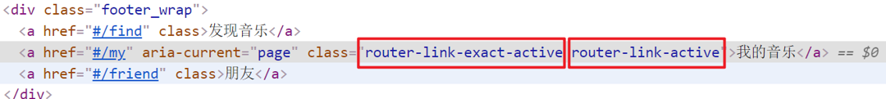


### 1.router-link-active

**模糊匹配（用的多）**

to="/my"  可以匹配 /my    /my/a    /my/b    ....  

只要是以/my开头的路径 都可以和 to="/my"匹配到


### 2.router-link-exact-active

**精确匹配**

to="/my" 仅可以匹配  /my


### 3.在地址栏中输入二级路由查看类名的添加


### 4.总结

- router-link 会自动给当前导航添加两个类名，有什么区别呢？


## 三、声明式导航-自定义类名（了解）

### 1.问题

router-link的**两个高亮类名 太长了**，我们希望能定制怎么办

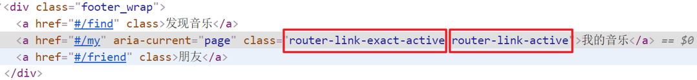

### 2.解决方案

我们可以在创建路由对象时，额外配置两个配置项即可。 `linkActiveClass`和`linkExactActiveClass`

```js
const router = new VueRouter({
  routes: [...],
  linkActiveClass: "类名1",
  linkExactActiveClass: "类名2"
})
```


### 3.代码演示

```js
// 创建了一个路由对象
const router = new VueRouter({
  routes: [
    ...
  ], 
  linkActiveClass: 'active', // 配置模糊匹配的类名
  linkExactActiveClass: 'exact-active' // 配置精确匹配的类名
})
```


### 4.总结

如何自定义router-link的两个**高亮类名**


## 四、声明式导航-查询参数传参

### 1.目标

在跳转路由时，进行传参


比如：现在我们在搜索页点击了热门搜索链接，跳转到详情页，**需要把点击的内容带到详情页**，改怎么办呢？

### 2.跳转传参

我们可以通过两种方式，在跳转的时候把所需要的参数传到其他页面中

- 查询参数传参
- 动态路由传参


### 3.查询参数传参

- 如何传参？

  <router-link to="/path?参数名=值"></router-link>

- 如何接受参数

  固定用法：$router.query.参数名


### 4.代码演示

App.vue

```vue
<template>
  <div id="app">
    <div class="link">
      <router-link to="/home">首页</router-link>
      <router-link to="/search">搜索页</router-link>
    </div>

    <router-view></router-view>
  </div>
</template>

<script>
export default {};
</script>

<style scoped>
.link {
  height: 50px;
  line-height: 50px;
  background-color: #495150;
  display: flex;
  margin: -8px -8px 0 -8px;
  margin-bottom: 50px;
}
.link a {
  display: block;
  text-decoration: none;
  background-color: #ad2a26;
  width: 100px;
  text-align: center;
  margin-right: 5px;
  color: #fff;
  border-radius: 5px;
}
</style>
```

Home.vue

```vue
<template>
  <div class="home">
    <div class="logo-box"></div>
    <div class="search-box">
      <input type="text">
      <button>搜索一下</button>
    </div>
    <div class="hot-link">
      热门搜索：
      <router-link to="">黑马程序员</router-link>
      <router-link to="">前端培训</router-link>
      <router-link to="">如何成为前端大牛</router-link>
    </div>
  </div>
</template>

<script>
export default {
  name: 'FindMusic'
}
</script>

<style>
.logo-box {
  height: 150px;
  background: url('@/vue2Img/logo.jpeg') no-repeat center;
}
.search-box {
  display: flex;
  justify-content: center;
}
.search-box input {
  width: 400px;
  height: 30px;
  line-height: 30px;
  border: 2px solid #c4c7ce;
  border-radius: 4px 0 0 4px;
  outline: none;
}
.search-box input:focus {
  border: 2px solid #ad2a26;
}
.search-box button {
  width: 100px;
  height: 36px;
  border: none;
  background-color: #ad2a26;
  color: #fff;
  position: relative;
  left: -2px;
  border-radius: 0 4px 4px 0;
}
.hot-link {
  width: 508px;
  height: 60px;
  line-height: 60px;
  margin: 0 auto;
}
.hot-link a {
  margin: 0 5px;
}
</style>
```

Search.vue

```vue
<template>
  <div class="search">
    <p>搜索关键字: 黑马程序员</p>
    <p>搜索结果: </p>
    <ul>
      <li>.............</li>
      <li>.............</li>
      <li>.............</li>
      <li>.............</li>
    </ul>
  </div>
</template>

<script>
export default {
  name: 'MyFriend',
  created () {
    // 在created中，获取路由参数
  }
}
</script>

<style>
.search {
  width: 400px;
  height: 240px;
  padding: 0 20px;
  margin: 0 auto;
  border: 2px solid #c4c7ce;
  border-radius: 5px;
}
</style>
```

router/index.js

```js
import Home from '@/views/Home'
import Search from '@/views/Search'
import Vue from 'vue'
import VueRouter from 'vue-router'
Vue.use(VueRouter) // VueRouter插件初始化

// 创建了一个路由对象
const router = new VueRouter({
  routes: [
    { path: '/home', component: Home },
    { path: '/search', component: Search }
  ]
})

export default router
```

main.js

```
...
import router from './router/index'
...
new Vue({
  render: h => h(App),
  router
}).$mount('#app')
```


## 五、声明式导航-动态路由传参

### 1.动态路由传参方式

- 配置动态路由

  > 动态路由后面的参数可以随便起名，但要有语义

  ```js
  const router = new VueRouter({
    routes: [
      ...,
      { 
        path: '/search/:words', 
        component: Search 
      }
    ]
  })
  ```

- 配置导航链接

  to="/path/参数值"

- 对应页面组件**接受参数**

  $route.**params**.参数名

  > params后面的参数名要和动态路由配置的参数保持一致


### 2.查询参数传参 VS 动态路由传参

1.  查询参数传参  (比较适合传**多个参数**) 

   1. 跳转：to="/path?参数名=值&参数名2=值"
   2. 获取：$route.query.参数名

2. 动态路由传参 (**优雅简洁**，传单个参数比较方便)

   1. 配置动态路由：path: "/path/:参数名" 
   2. 跳转：to="/path/参数值"
   3. 获取：$route.params.参数名 

   注意：动态路由也可以传多个参数，但一般只传一个

### 3.总结

声明式导航跳转时, 有几种方式传值给路由页面？

- 查询参数传参（多个参数）
- 动态路由传参（一个参数，优雅简洁）

 

## 六、动态路由参数的可选符(了解)

### 1.问题

配了路由 path:"/search/:words"  为什么按下面步骤操作，会未匹配到组件，显示空白？


### 2.原因

/search/:words  表示，**必须要传参数**。如果不传参数，也希望匹配，可以加个可选符"？"

```js
const router = new VueRouter({
  routes: [
 	...
    { path: '/search/:words?', component: Search }
  ]
})
```


## 七、Vue路由-重定向

### 1.问题

网页打开时， url 默认是 / 路径，未匹配到组件时，会出现空白


### 2.解决方案

**重定向** → 匹配 / 后, 强制跳转 /home 路径


### 3.语法

```js
{ path: 匹配路径, redirect: 重定向到的路径 },
比如：
{ path:'/' ,redirect:'/home' }
```


### 4.代码演示

```
const router = new VueRouter({
  routes: [
    { path: '/', redirect: '/home'},
 	 ...
  ]
})
```


## 八、Vue路由-404

### 1.作用

当路径找不到匹配时，给个提示页面

### 2.位置

404的路由，虽然配置在任何一个位置都可以，但一般都**配置在其他路由规则的最后面**

### 3.语法

path: "*"   (任意路径) – 前面不匹配就命中最后这个

```js
import NotFind from '@/views/NotFind'

const router = new VueRouter({
  routes: [
    ...
    { path: '*', component: NotFind } //最后一个
  ]
})
```

### 4.代码示例

NotFound.vue

```vue
<template>
  <div>
    <h1>404 Not Found</h1>
  </div>
</template>

<script>
export default {

}
</script>

<style>

</style>
```

router/index.js

```js
...
import NotFound from '@/views/NotFound'
...

// 创建了一个路由对象
const router = new VueRouter({
  routes: [
     ...
    { path: '*', component: NotFound }
  ]
})

export default router
```


## 九、Vue路由-模式设置

### 1.问题

路由的路径看起来不自然, 有#，能否切成真正路径形式?

- hash路由(默认)        例如:  http://localhost:8080/#/home
- history路由(常用)     例如: http://localhost:8080/home   (以后上线需要服务器端支持，开发环境webpack给规避掉了history模式的问题)

### 2.语法

```js
const router = new VueRouter({
    mode:'histroy', //默认是hash
    routes:[]
})
```


## 十、编程式导航-两种路由跳转方式

### 1.问题

点击按钮跳转如何实现？


### 2.方案

编程式导航：用JS代码来进行跳转

### 3.语法

两种语法：

- path 路径跳转 （简易方便）
- name 命名路由跳转 (适合 path 路径长的场景)

### 4.path路径跳转语法

特点：简易方便

```js
//简单写法
this.$router.push('路由路径')

//完整写法
this.$router.push({
  path: '路由路径'
  //此方式还可以加查询参数和路径参数
  //query: {},
  //parms: ''
})
```

补充：除了用 push 方法实现跳转，还可以用 replace 方法。

- push：此方式跳转后会有历史记录，可以用 go(num) 方法实现返回或前进 num 个页面。

  history：

  ​	page1 => page2 => page3 => page4（page2跳转到page3）

- replace：此方式会把当前页面替换成参数 url 的页面，不会新增历史记录。

  history：page1 => page3 => page4 （page2跳转到page3）

### 5.代码演示 path跳转方式


### 6.name命名路由跳转

特点：适合 path 路径长的场景

语法：

- 路由规则，必须配置name配置项

  ```js
  { name: '路由名', path: '/path/xxx', component: XXX },
  ```

- 通过name来进行跳转

  ```js
  this.$router.push({
    name: '路由名'
  })
  ```


### 7.代码演示通过name命名路由跳转


### 8.总结

编程式导航有几种跳转方式？


## 十一、编程式导航-path路径跳转传参

### 1.问题

点击搜索按钮，跳转需要把文本框中输入的内容传到下一个页面如何实现？

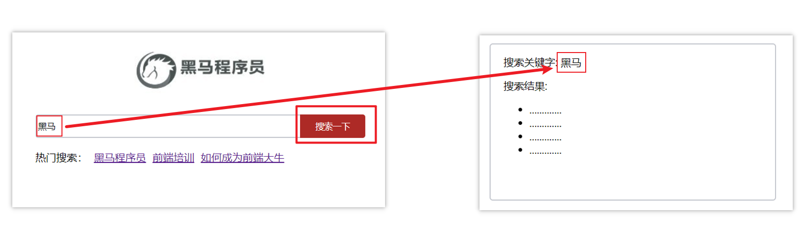

### 2.两种传参方式

1.查询参数 

2.动态路由传参


### 3.传参

两种跳转方式，对于两种传参方式都支持：

① path 路径跳转传参

② name 命名路由跳转传参


### 4.path路径跳转传参（query传参）

```js
//简单写法
this.$router.push('/路径?参数名1=参数值1&参数2=参数值2')
//完整写法
this.$router.push({
  path: '/路径',
  query: {
    参数名1: '参数值1',
    参数名2: '参数值2'
  }
})
```

接受参数的方式依然是：$route.query.参数名

### 5.path路径跳转传参（动态路由传参）

```
//简单写法
this.$router.push('/路径/参数值')
//完整写法
this.$router.push({
  path: '/路径/参数值'
})
```

接受参数的方式依然是：$route.params.参数值

**注意：**path不能配合params使用


## 十二、编程式导航-name命名路由传参

### 1.name 命名路由跳转传参 (query传参)

```js
this.$router.push({
  name: '路由名字',
  query: {
    参数名1: '参数值1',
    参数名2: '参数值2'
  }
})
```

### 2.name 命名路由跳转传参 (动态路由传参)

```js
this.$router.push({
  name: '路由名字',
  params: {
    参数名: '参数值',
  }
})
```

### 3.总结

编程式导航，如何跳转传参？

1.path路径跳转

- query传参

  ```js
  this.$router.push('/路径?参数名1=参数值1&参数2=参数值2')
  this.$router.push({
    path: '/路径',
    query: {
      参数名1: '参数值1',
      参数名2: '参数值2'
    }
  })
  ```

- 动态路由传参

  ```js
  this.$router.push('/路径/参数值')
  this.$router.push({
    path: '/路径/参数值'
  })
  ```

2.name命名路由跳转

- query传参

  ```js
  this.$router.push({
    name: '路由名字',
    query: {
      参数名1: '参数值1',
      参数名2: '参数值2'
    }
  })
  ```

- 动态路由传参 (需要配动态路由)

  ```js
  this.$router.push({
    name: '路由名字',
    params: {
      参数名: '参数值',
    }
  })
  ```

  

## 十三、面经基础版-案例效果分析

### 1.面经效果演示

### 2.功能分析

- 通过演示效果发现，主要的功能页面有两个，一个是**列表页**，一个是**详情页**，并且在列表页点击时可以跳转到详情页
- 底部导航可以来回切换，并且切换时，只有上面的主题内容在动态渲染

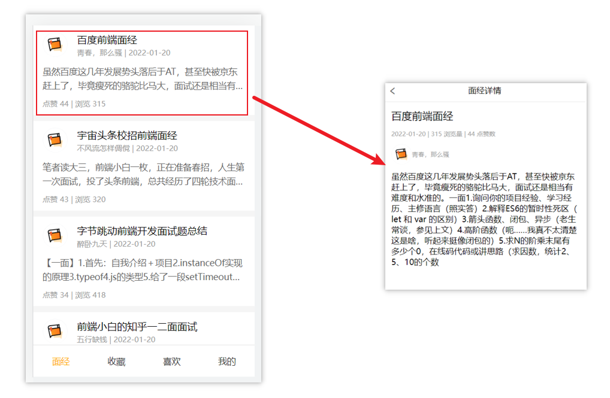

### 3.实现思路分析：配置路由+功能实现

1.配置路由

- 首页和面经详情页，两个一级路由
- 首页内嵌套4个可切换的页面（嵌套二级路由）

2.实现功能

- 首页请求渲染
- **跳转传参** 到 详情页，详情页动态渲染
- 组件缓存，性能优化


## 十四、面经基础版-一级路由配置

1.把文档中准备的素材拷贝到项目中

2.针对router/index.js文件 进行一级路由配置

```js
...
import Layout from '@/views/Layout.vue'
import ArticleDetail from '@/views/ArticleDetail.vue'
...


const router = new VueRouter({
  routes: [
    {
      path: '/',
      component: Layout
    },
    {
      path: '/detail',
      component: ArticleDetail
    }
  ]
})
```


## 十五、面经基础版-二级路由配置

二级路由也叫嵌套路由，当然也可以嵌套三级、四级...

### 1.使用场景

当在页面中点击链接跳转，只是部分内容切换时，我们可以使用嵌套路由

### 2.语法

- 在一级路由下，配置children属性即可
- 配置二级路由的出口


 1.在一级路由下，配置children属性

 **注意**:一级的路由path 需要加 `/`   二级路由的path不需要加 `/`

```js
const router = new VueRouter({
  routes: [
    {
      path: '/',
      component: Layout,
      children:[
        //children中的配置项 跟一级路由中的配置项一模一样 
        {path:'xxxx',component:xxxx.vue},
        {path:'xxxx',component:xxxx.vue},
      ]
    }
  ]
})
```

技巧：二级路由应该配置到哪个一级路由下呢？

**这些二级路由对应的组件渲染到哪个一级路由下，children就配置到哪个路由下边**


2.配置二级路由的出口 <router-view></router-view>

**注意：** 配置了嵌套路由，一定配置对应的路由出口，否则不会渲染出对应的组件

Layout.vue

```vue
<template>
  <div class="h5-wrapper">
    <div class="content">
      <router-view></router-view>
    </div>
  ....
  </div>
</template>
```

### 3.代码实现

router/index.js

```js
...
import Article from '@/views/Article.vue'
import Collect from '@/views/Collect.vue'
import Like from '@/views/Like.vue'
import User from '@/views/User.vue'
...

const router = new VueRouter({
  routes: [
    {
      path: '/',
      component: Layout,
      redirect: '/article',
      children:[
        {
          path:'/article',
          component:Article
        },
        {
          path:'/collect',
          component:Collect
        },
        {
          path:'/like',
          component:Like
        },
        {
          path:'/user',
          component:User
        }
      ]
    },
    ....
  ]
})

```

Layout.vue

```vue
<template>
  <div class="h5-wrapper">
    <div class="content">
      <!-- 内容部分 -->
      <router-view></router-view>
    </div>
    <nav class="tabbar">
      <a href="#/article">面经</a>
      <a href="#/collect">收藏</a>
      <a href="#/like">喜欢</a>
      <a href="#/user">我的</a>
    </nav>
  </div>
</template>
```


## 十六、面经基础版-二级导航高亮

### 1.实现思路

- 将a标签替换成 <router-link></router-link>组件，配置to属性，不用加 #
- 结合高亮类名实现高亮效果 (推荐模糊匹配：router-link-active)

### 2.代码实现

Layout.vue

```vue
....
    <nav class="tabbar">
      <router-link to="/article">面经</router-link>
      <router-link to="/collect">收藏</router-link>
      <router-link to="/like">喜欢</router-link>
      <router-link to="/user">我的</router-link>
    </nav>

<style>
   a.router-link-active {
      color: orange;
    }
</style>
```


## 十七、面经基础版-首页请求渲染

### 1.步骤分析

1.安装axios 

2.看接口文档，确认请求方式，请求地址，请求参数

3.created中发送请求，获取数据，存储到data中

4.页面动态渲染


### 2.代码实现

1.安装axios

`yarn add axios `  `npm i axios`

2.接口文档

```vue
请求地址: https://mock.boxuegu.com/mock/3083/articles
请求方式: get
```

3.created中发送请求，获取数据，存储到data中

```vue
 data() {
    return {
      articelList: [],
    }
  },
  async created() {
    const {  data: { result: { rows } }} = await axios.get('https://mock.boxuegu.com/mock/3083/articles')
    this.articelList = rows
  },
```

4.页面动态渲染

```vue
<template>
  <div class="article-page">
    <div class="article-item" v-for="item in articelList" :key="item.id">
      <div class="head">
        
        <div class="con">
          <p class="title">{{ item.stem }}</p>
          <p class="other">{{ item.creatorName }} | {{ item.createdAt }}</p>
        </div>
      </div>
      <div class="body">
        {{item.content}}
      </div>
      <div class="foot">点赞 {{item.likeCount}} | 浏览 {{item.views}}</div>
    </div>
  </div>
</template>
```


## 十八、面经基础版-查询参数传参

### 1.说明

跳转详情页需要把当前点击的文章id传给详情页，获取数据

- 查询参数传参  this.$router.push('/detail?参数1=参数值&参数2=参数值') 
- 动态路由传参  先改造路由 在传参  this.$router.push('/detail/参数值')


### 2.查询参数传参实现

Article.vue

```vue
<template>
  <div class="article-page">
    <div class="article-item" 
      v-for="item in articelList" :key="item.id" 
      @click="$router.push(`/detail?id=${item.id}`)">
     ...
    </div>
  </div>
</template>
```

ArticleDetail.vue

```vue
  created(){
    console.log(this.$route.query.id)
  }
```


## 十九、面经基础版-动态路由传参

### 1.实现步骤

- 改造路由
- 动态传参
- 在详情页获取参数

### 2.代码实现

改造路由

router/index.js

```js
...
  {
      path: '/detail/:id',
      component: ArticleDetail
  }
```

Article.vue

```vue
<div class="article-item" 
     v-for="item in articelList" :key="item.id" 
     @click="$router.push(`/detail/${item.id}`)">
       ....
 </div>
```

ArticleDetail.vue

```vue
  created(){
    console.log(this.$route.params.id)
  }
```


### 3.额外优化功能点-点击回退跳转到上一页

ArticleDetail.vue

```vue
<template>
  <div class="article-detail-page">
    <nav class="nav"><span class="back" @click="$router.back()">&lt;</span> 面经详情</nav>
     ....
  </div>
</template>
```


## 二十、面经基础版-详情页渲染

### 1.实现步骤分析

- 导入axios
- 查看接口文档
- 在created中发送请求
- 页面动态渲染


### 2.代码实现

接口文档

```vue
 请求地址: https://mock.boxuegu.com/mock/3083/articles/:id
 请求方式: get
```


在created中发送请求

```vue
 data() {
    return {
      articleDetail:{}
    }
  },
  async created() {
    const id = this.$route.params.id
    const {data:{result}} = await axios.get(
      `https://mock.boxuegu.com/mock/3083/articles/${id}`
    )
    this.articleDetail = result
  },
```


页面动态渲染

```vue
<template>
  <div class="article-detail-page">
    <nav class="nav">
      <span class="back" @click="$router.back()">&lt;</span> 面经详情
    </nav>
    <header class="header">
      <h1>{{articleDetail.stem}}</h1>
      <p>{{articleDetail.createAt}} | {{articleDetail.views}} 浏览量 | {{articleDetail.likeCount}} 点赞数</p>
      <p>
        
        <span>{{articleDetail.creatorName}}</span>
      </p>
    </header>
    <main class="body">
      {{articleDetail.content}}
    </main>
  </div>
</template>

```


## 二十一、面经基础版-缓存组件

### 1.问题

从面经列表 点到 详情页，又点返回，数据重新加载了 →  **希望回到原来的位置**

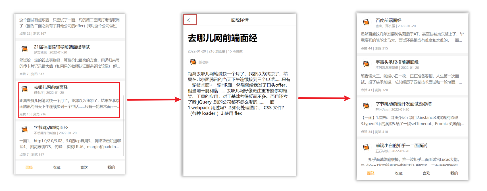

### 2.原因

当路由被**跳转**后，原来所看到的组件就**被销毁**了（会执行组件内的beforeDestroy和destroyed生命周期钩子），**重新返回**后组件又被**重新创建**了（会执行组件内的beforeCreate,created,beforeMount,Mounted生命周期钩子），**所以数据被加载了**


### 3.解决方案

利用keep-alive把原来的组件给缓存下来


### 4.什么是keep-alive

keep-alive 是 Vue 的内置组件，当它包裹动态组件时，**会缓存不活动的组件实例，而不是销毁**它们。

keep-alive 是一个抽象组件：它自身不会渲染成一个 DOM 元素，也不会出现在父组件中。

**优点：**

在组件切换过程中把切换出去的组件保留在内存中，防止重复渲染DOM，减少加载时间及性能消耗，提高用户体验性。

在这里解决了在点击文章跳转到 ArticleDetail 页面后，返回后会重新加载 Article 页面，从而导致又要重新往下滑动的问题。

App.vue

```vue
<template>
  <div class="h5-wrapper">
    <keep-alive>
      <router-view></router-view>
    </keep-alive>
  </div>
</template>
```


**问题：**

缓存了所有被切换的组件，它会缓存当前包裹着的路由视图匹配的所有同级组件。在这里会出现 ArticleDetail 的页面都是同一个问题。


### 5.keep-alive的三个属性

① include  ： 组件名数组，只有匹配的组件**会被缓存**

② exclude ： 组件名数组，任何匹配的组件都**不会被缓存**

③ max       ： 最多可以**缓存多少**组件实例

注：被缓存的组件会多两个**生命周期钩子：actived 和 deactived**，此时该组件在首次进入时会触发 **创建、挂载** 阶段的钩子函数，之后再进入不会触发 **创建、挂载、销毁** 阶段的钩子函数。

App.vue

```vue
<template>
  <div class="h5-wrapper">
    <!-- <keep-alive :include="['组件名']"> -->
    <keep-alive :include="['LayoutPage']"> 
      <router-view></router-view>
    </keep-alive>
  </div>
</template>
```

注意：组件名在没有配置name属性时默认是文件名，但配置了 “export default {name: '组件名'}” 时，组件名为 name 属性对应的值

### 6.额外的两个生命周期钩子

**keep-alive的使用会触发两个生命周期函数（在挂载阶段后）**

**activated** 当组件被激活（使用）的时候触发 →  进入这个页面的时候触发（组件由缓存中激活时，`activated`钩子函数会被调用）

**deactivated** 当组件不被使用的时候触发      →  离开这个页面的时候触发（组件由激活状态转为缓存状态时，`deactivated`钩子函数会被调用）

组件**缓存后**就**不会执行**组件的**created, mounted, destroyed** 等钩子了

所以其提供了**actived 和deactived**钩子，帮我们实现业务需求。


### 7.总结

1.keep-alive是什么

2.keep-alive的优点

3.keep-alive的三个属性 (了解)

4.keep-alive的使用会触发两个生命周期函数(了解)


## 二十二、VueCli 自定义创建项目

1.安装脚手架 (已安装)

```
npm i @vue/cli -g
```

2.创建项目（按空格是选中或取消）

```
vue create hm-exp-mobile
```

+ 选项

```js
Vue CLI v5.0.8
? Please pick a preset:
  Default ([Vue 3] babel, eslint)
  Default ([Vue 2] babel, eslint)
> Manually select features     选自定义
```

+ 手动选择功能
  + Babal：提供语法降级功能


+ 选择vue的版本

```jsx
  3.x
> 2.x
```

+ 是否使用路由的history模式


+ 选择css预处理


+ 选择eslint的风格 （eslint 代码规范的检验工具，检验代码是否符合规范）
+ 比如：const age = 18;   =>  报错！多加了分号！后面有工具，一保存，全部格式化成最规范的样子
+ ESLint + Standard config：无分号规范（最流行和标准化）


+ 选择校验的时机 （直接回车）
  + Lint to save：保存时校验


+ 选择配置文件的生成方式 （直接回车）
  + 把Babel、ESLint 的配置文件生成到哪：放单独文件方便管理


- 是否保存预设，下次直接使用？  =>   不保存，输入 N

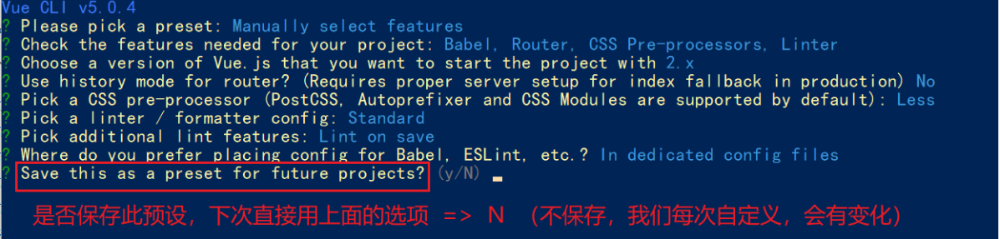

+ 等待安装，项目初始化完成

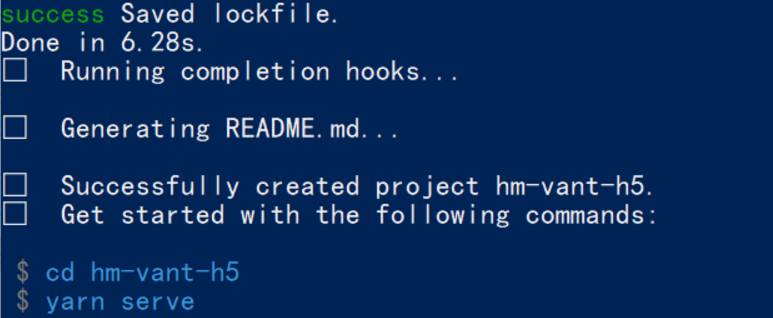

+ 启动项目

```
npm run serve
yarn serve
```


## 二十三、ESlint代码规范及手动修复

代码规范：一套写代码的约定规则。例如：赋值符号的左右是否需要空格？一句结束是否是要加;？... 

>  没有规矩不成方圆  

ESLint:是一个代码检查工具，用来检查你的代码是否符合指定的规则(你和你的团队可以自行约定一套规则)。在创建项目时，我们使用的是 [JavaScript Standard Style](https://standardjs.com/readme-zhcn.html) 代码风格的规则。

#### 1.JavaScript Standard Style 规范说明

建议把：https://standardjs.com/rules-zhcn.html 看一遍，然后在写的时候,  遇到错误就查询解决。

下面是这份规则中的一小部分：

- *字符串使用单引号* – 需要转义的地方除外
- *无分号* – [这](http://blog.izs.me/post/2353458699/an-open-letter-to-javascript-leaders-regarding)[没什么不好。](http://inimino.org/~inimino/blog/javascript_semicolons)[不骗你！](https://www.youtube.com/watch?v=gsfbh17Ax9I)
- *关键字后加空格* `if (condition) { ... }`
- *函数名后加空格* `function name (arg) { ... }`
- 坚持使用全等 `===` 摒弃 `==` 一但在需要检查 `null || undefined` 时可以使用 `obj == null`
- ......

#### 2.代码规范错误

如果你的代码不符合standard的要求，eslint会跳出来刀子嘴，豆腐心地提示你。

下面我们在main.js中随意做一些改动：添加一些空行，空格。

```js
import Vue from 'vue'
import App from './App.vue'

import './styles/index.less'
import router from './router'
Vue.config.productionTip = false

new Vue ( {
  render: h => h(App),
  router
}).$mount('#app')


```

按下保存代码之后：

你将会看在控制台中输出如下错误：


> eslint 是来帮助你的。心态要好，有错，就改。


#### 3.手动修正

根据错误提示来一项一项手动修正。

如果你不认识命令行中的语法报错是什么意思，你可以根据错误代码（func-call-spacing, space-in-parens,.....）去 ESLint 规则列表中查找其具体含义。

打开 [ESLint 规则表](https://zh-hans.eslint.org/docs/latest/rules/)，使用页面搜索（Ctrl + F）这个代码，查找对该规则的一个释义。


## 二十四、通过eslint插件来实现自动修正

> 1. eslint会自动高亮错误显示
> 2. 通过配置，eslint会自动帮助我们修复错误

+ 如何安装


+ 如何配置

```js
// 当保存的时候，eslint自动帮我们修复错误
"editor.codeActionsOnSave": {
    "source.fixAll": true
},
// 保存代码，不自动格式化
"editor.formatOnSave": false
```

+ 注意：eslint的配置文件必须在根目录下，这个插件才能才能生效。打开项目必须以根目录打开，一次打开一个项目
+ 注意：使用了eslint校验之后，把vscode带的那些格式化工具全禁用了 Beatify

settings.json 参考

```jsx
{
    "window.zoomLevel": 2,
    "workbench.iconTheme": "vscode-icons",
    "editor.tabSize": 2,
    "emmet.triggerExpansionOnTab": true,
    // 当保存的时候，eslint自动帮我们修复错误
    "editor.codeActionsOnSave": {
        "source.fixAll": true
    },
    // 保存代码，不自动格式化
    "editor.formatOnSave": false
    
    //一下内容都是补充：可以针对文件类型进行配置：
    "[javascript]": {
        //取消回车时格式化代码
        "editor.formatOnType": false,
        //取消保存时格式化代码
        "editor.formatOnSave": false,
        "editor.tabSize": 2,
        "editor.suggest.insertMode": "replace"
    },
    "[vue]": {
        "editor.codeActionsOnSave": {
        "source.fixAll": true
	    },
        //取消回车时格式化代码
        "editor.formatOnType": false,
        //取消保存时格式化代码
        "editor.formatOnSave": false,
        "editor.tabSize": 2,
        "editor.suggest.insertMode": "replace"
    }
}
```

# day07

## 一、[Vuex](https://vuex.vuejs.org/zh/) 概述 

目标：明确[Vuex](https://vuex.vuejs.org/zh/)是什么，应用场景以及优势

### 1.是什么

Vuex 是一个 Vue 的 状态管理工具，状态就是数据。

大白话：Vuex 是一个插件，可以帮我们管理 Vue 通用的数据 (多组件共享的数据)。例如：购物车数据   个人信息数


### 2.使用场景

- 某个状态 在 很多个组件 来使用 (个人信息)


- 多个组件 共同维护 一份数据 (购物车)


### 3.优势

- 共同维护一份数据，**数据集中化管理**
-  **响应式变化**
- 操作简洁 (vuex提供了一些辅助函数)


### 4.注意：

官方原文：

- 不是所有的场景都适用于vuex，只有在必要的时候才使用vuex
- 使用了vuex之后，会附加更多的框架中的概念进来，增加了项目的复杂度  （数据的操作更便捷，数据的流动更清晰）

Vuex就像《近视眼镜》, 你自然会知道什么时候需要用它~

 

## 二、需求: 多组件共享数据

目标：基于脚手架创建项目，构建 vuex 多组件数据共享环境


效果是三个组件共享一份数据:

- 任意一个组件都可以修改数据
- 三个组件的数据是同步的

### 1.创建项目

```
vue create vuex-demo
```

### 2.创建三个组件, 目录如下

```
|-components
|--Son1.vue
|--Son2.vue
|-App.vue
```

### 3.源代码如下

`App.vue`在入口组件中引入 Son1 和 Son2 这两个子组件

```html
<template>
  <div id="app">
    <h1>根组件</h1>
    <input type="text">
    <Son1></Son1>
    <hr>
    <Son2></Son2>
  </div>
</template>

<script>
import Son1 from './components/Son1.vue'
import Son2 from './components/Son2.vue'

export default {
  name: 'app',
  data: function () {
    return {

    }
  },
  components: {
    Son1,
    Son2
  }
}
</script>

<style>
#app {
  width: 600px;
  margin: 20px auto;
  border: 3px solid #ccc;
  border-radius: 3px;
  padding: 10px;
}
</style>

```

`main.js`

```js
import Vue from 'vue'
import App from './App.vue'

Vue.config.productionTip = false

new Vue({
  render: h => h(App)
}).$mount('#app')
```

`Son1.vue`

```html
<template>
  <div class="box">
    <h2>Son1 子组件</h2>
    从vuex中获取的值: <label></label>
    <br>
    <button>值 + 1</button>
  </div>
</template>

<script>
export default {
  name: 'Son1Com'
}
</script>

<style lang="css" scoped>
.box{
  border: 3px solid #ccc;
  width: 400px;
  padding: 10px;
  margin: 20px;
}
h2 {
  margin-top: 10px;
}
</style>

```

`Son2.vue`

```html
<template>
  <div class="box">
    <h2>Son2 子组件</h2>
    从vuex中获取的值:<label></label>
    <br />
    <button>值 - 1</button>
  </div>
</template>

<script>
export default {
  name: 'Son2Com'
}
</script>

<style lang="css" scoped>
.box {
  border: 3px solid #ccc;
  width: 400px;
  padding: 10px;
  margin: 20px;
}
h2 {
  margin-top: 10px;
}
</style>
```


## 三、vuex 的使用 - 创建仓库


### 1.安装 vuex

安装vuex与vue-router类似，vuex是一个独立存在的插件，如果脚手架初始化没有选 vuex，就需要额外安装。

```bash
yarn add vuex@3 或者 npm i vuex@3
```

### 2.新建 `store/index.js` 专门存放 vuex

​	为了维护项目目录的整洁，在src目录下新建一个store目录其下放置一个index.js文件。 (和 `router/index.js` 类似)

​	

### 3.创建仓库 `store/index.js` 

```jsx
// 导入 vue
import Vue from 'vue'
// 导入 vuex
import Vuex from 'vuex'
// vuex也是vue的插件, 需要use一下, 进行插件的安装初始化
Vue.use(Vuex)

// 创建仓库 store
const store = new Vuex.Store()

// 导出仓库
export default store
```

### 4 在 main.js 中导入挂载到 Vue 实例上

```js
import Vue from 'vue'
import App from './App.vue'
import store from './store'

Vue.config.productionTip = false

new Vue({
  render: h => h(App),
  store
}).$mount('#app')
```

此刻起, 就成功创建了一个 **空仓库!!**

### 5.测试打印Vuex

App.vue

```js
created(){
  console.log(this.$store)
}
```


## 四、核心概念 - state 状态

### 1.目标

明确如何给仓库 提供 数据，如何 使用 仓库的数据

### 2.提供数据

State提供唯一的公共数据源，所有共享的数据都要统一放到Store中的State中存储。

打开项目中的store.js文件，在state对象中可以添加我们要共享的数据。

```jsx
// 创建仓库 store
const store = new Vuex.Store({
  // state 状态, 即数据, 类似于vue组件中的data,
  // 区别：
  // 1.data 是组件自己的数据, 
  // 2.state 中的数据整个vue项目的组件都能访问到
  state: {
    count: 101
  }
})
```

### 3.访问Vuex中的数据

问题: 如何在组件中获取count?

1. 通过$store直接访问  —>  {{  $store.state.count  }}
2. 通过辅助函数mapState 映射计算属性  —>  {{ count  }}


### 4.通过$store访问的语法

```js
获取 store：
 1.Vue模板中获取 this.$store
 2.js文件中获取 import 导入 store


模板中：     {{ $store.state.xxx }}
组件逻辑中：  this.$store.state.xxx
JS模块中：   store.state.xxx
```


### 5.代码实现

#### 5.1模板中使用

组件中可以使用  **$store** 获取到vuex中的store对象实例，可通过**state**属性属性获取**count**， 如下

```vue
<h1>state的数据 - {{ $store.state.count }}</h1>
```

#### 5.2组件逻辑中使用

将state属性定义在计算属性中 https://vuex.vuejs.org/zh/guide/state.html

```js
<h1>state的数据 - {{ count }}</h1>

// 把state中数据，定义在组件内的计算属性中
  computed: {
    count () {
      return this.$store.state.count
    }
  }
```

#### 5.3 js文件中使用

```vue
//main.js

import store from "@/store"

console.log(store.state.count)
```

每次都像这样一个个的提供计算属性, 太麻烦了,我们有没有简单的语法帮我们获取state中的值呢？


## 五、通过辅助函数  - mapState获取 state中的数据

>mapState是辅助函数，帮助我们把store中的数据映射到 组件的计算属性中, 它属于一种方便的用法

用法 ：

 

### 1.第一步：导入mapState (mapState是vuex中的一个函数)

```js
import { mapState } from 'vuex'
```

### 2.第二步：采用数组形式引入state属性

```js
mapState(['count']) 
```

> 上面代码的最终得到的是 **类似于**

```js
count () {
    return this.$store.state.count
}
```

### 3.第三步：利用**展开运算符**将导出的状态映射给计算属性

```js
  computed: {
    ...mapState(['count'])
  }
```

```vue
 <div> state的数据：{{ count }}</div>
```


## 六、开启严格模式及Vuex的单项数据流

### 1.目标

明确 vuex 同样遵循单向数据流，组件中不能直接修改仓库的数据

### 2.直接在组件中修改Vuex中state的值


Son1.vue

```vue
button @click="handleAdd">值 + 1</button>


methods:{
	 handleAdd (n) {
      // 错误代码(vue默认不会监测，监测需要成本)
       this.$store.state.count++
      // console.log(this.$store.state.count) 
    },
}
```

### 3.开启严格模式

通过 `strict: true` 可以开启严格模式,开启严格模式后，直接修改state中的值会报错；不开启严格模式修改仓库中的数据，vue不会报错，而且也能修改成功，但这是错误的写法（不规范），这很不利于项目的维护。

但开启严格模式会消耗性能，所以上线时要关闭

> **state数据的修改只能通过mutations，并且mutations必须是同步的**


## 七、核心概念-mutations

### 1.定义mutations

```js
const store  = new Vuex.Store({
  state: {
    count: 0
  },
  // 定义mutations
  mutations: {
     
  }
})
```

### 2.格式说明

mutations是一个对象，对象中存放修改state的方法

```js
mutations: {
    // 方法里参数 第一个参数是当前store的state属性
    // payload 载荷 运输参数 调用mutaiions的时候 可以传递参数 传递载荷
    addCount (state) {
      state.count += 1
    }
  },
```

### 3.组件中提交 mutations

```jsx
this.$store.commit('addCount')
```

### 4.练习

1.在mutations中定义个点击按钮进行 +5 的方法

2.在mutations中定义个点击按钮进行 改变title 的方法

3.在组件中调用mutations修改state中的值

### 5.总结

通过mutations修改state的步骤

1.定义 mutations 对象，对象中存放修改 state 的方法

2.组件中提交调用 mutations(通过$store.commit('mutations的方法名'))


## 八、带参数的 mutations

### 1.目标：

掌握 mutations 传参语法

### 2.语法

看下面这个案例，每次点击不同的按钮，加的值都不同，每次都要定义不同的mutations处理吗？


提交 mutation 是可以传递参数的  `this.$store.commit('xxx',  参数)`

#### 2.1 提供mutation函数（带参数）

```js
mutations: {
  ...
  addCount (state, count) {
    state.count = count
  }
},
```

#### 2.2 提交mutation

```jsx
handle ( ) {
  this.$store.commit('addCount', 10)
}
```

**小tips: 提交的参数只能是一个, 如果有多个参数要传, 可以传递一个对象**

```jsx
this.$store.commit('addCount', {
  count: 10
})
```


## 九、练习-mutations的减法功能

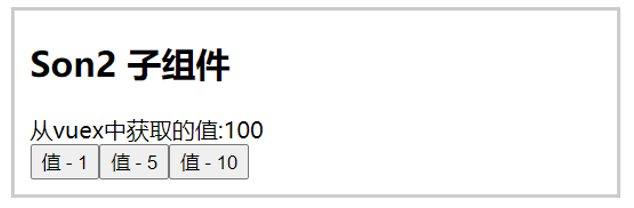

### 1.步骤

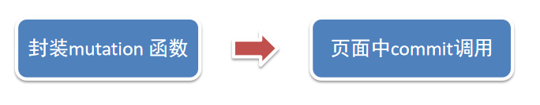

### 2.代码实现

Son2.vue

```vue
    <button @click="subCount(1)">值 - 1</button>
    <button @click="subCount(5)">值 - 5</button>
    <button @click="subCount(10)">值 - 10</button>

    export default {
        methods:{
             subCount (n) { 
                this.$store.commit('addCount', n)
        },
        }
    }
```

store/index.js

```js
mutations:{
    subCount (state, n) {
      state.count -= n
    },
}
```


## 十、练习-Vuex中的值和组件中的input双向绑定

### 1.目标

实时输入，实时更新，巩固 mutations 传参语法


### 2.实现步骤


### 3.代码实现

App.vue

```vue
<input :value="count" @input="handleInput" type="text">

export default {
  methods: {
    handleInput (e) {
      // 1. 实时获取输入框的值
      const num = +e.target.value
      // 2. 提交mutation，调用mutation函数
      this.$store.commit('changeCount', num)
    }
  }
}
```

store/index.js

```js
mutations: { 
   changeCount (state, newCount) {
      state.count = newCount
   }
},
```


## 十一、辅助函数- mapMutations

> mapMutations和mapState很像，它把位于mutations中的方法提取了出来，我们可以将它导入

```js
import  { mapMutations } from 'vuex'
methods: {
    ...mapMutations(['addCount'])
}
```

> 上面代码的含义是将mutations的方法导入了methods中，等价于

```js
methods: {
      // commit(方法名, 载荷参数)
      addCount () {
          this.$store.commit('addCount')
      }
 }
```

此时，就可以直接通过this.addCount调用了

```jsx
<button @click="addCount">值+1</button>
```

但是请注意： Vuex中mutations中要求不能写异步代码，如果有异步的ajax请求，应该放置在actions中


## 十二、核心概念 - actions

> state是存放数据的，mutations是同步更新数据 (便于监测数据的变化, 更新视图等, 方便于调试工具查看变化)，
>
> actions则负责进行异步操作

**说明：mutations必须是同步的**

**需求: 一秒钟之后, 要给一个数 去修改state**


### **1.定义actions**

```js
mutations: {
  changeCount (state, newCount) {
    state.count = newCount
  }
}


actions: {
  setAsyncCount (context, num) {
    // 一秒后, 给一个数, 去修改 num
    setTimeout(() => {
      context.commit('changeCount', num)
    }, 1000)
  }
},
```

### **2.组件中通过dispatch调用** 

```js
setAsyncCount () {
  this.$store.dispatch('setAsyncCount', 666)
}
```


## 十三、辅助函数 -mapActions

1.目标：掌握辅助函数 mapActions，映射方法

> mapActions 是把位于 actions中的方法提取了出来，映射到组件methods中

Son2.vue

```js
import { mapActions } from 'vuex'
methods: {
   ...mapActions(['changeCountAction'])
}

//mapActions映射的代码 本质上是以下代码的写法
//methods: {
//  changeCountAction (n) {
//    this.$store.dispatch('changeCountAction', n)
//  },
//}
```

直接通过 this.方法 就可以调用

```vue
<button @click="changeCountAction(200)">+异步</button>
```


## 十四、核心概念 - getters

> 除了state之外，有时我们还需要从state中**筛选出符合条件的一些数据**，这些数据是依赖state的，此时会用到getters

例如，state中定义了list，为1-10的数组，

```js
state: {
    list: [1, 2, 3, 4, 5, 6, 7, 8, 9, 10]
}
```

组件中，需要显示所有大于5的数据，正常的方式，是需要list在组件中进行再一步的处理，但是getters可以帮助我们实现它

### 1.定义getters

```js
getters: {
    // getters函数的第一个参数是 state，第二个参数是getters
    // 必须要有返回值
    filterList:  state =>  state.list.filter(item => item > 5),
	filterList2 (state, getters) {
        return getters.filterList.filter(item => item < )
    }
}
```

### 2.使用getters

#### 2.1原始方式-$store

```vue
<div>{{ $store.getters.filterList }}</div>
```

#### 2.2辅助函数 - mapGetters

```js
computed: {
    ...mapGetters(['filterList'])
}
```

```vue
 <div>{{ filterList }}</div>
```

## 十五、使用小结

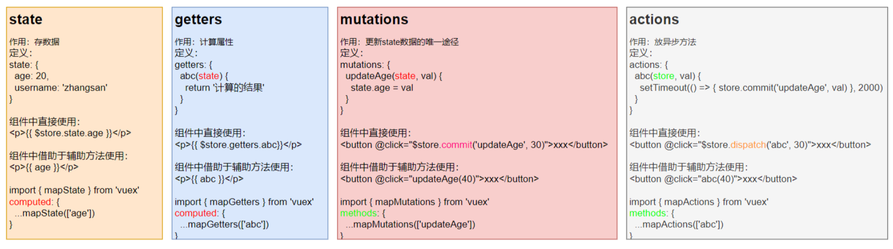

## 十六、核心概念 - module

### 1.目标

掌握核心概念 module 模块的创建

### 2.问题

由于使用**单一状态树**，应用的所有状态**会集中到一个比较大的对象**。当应用变得非常复杂时，store 对象就有可能变得相当臃肿。

这句话的意思是，如果把所有的状态都放在state中，当项目变得越来越大的时候，Vuex会变得越来越难以维护

由此，又有了Vuex的模块化

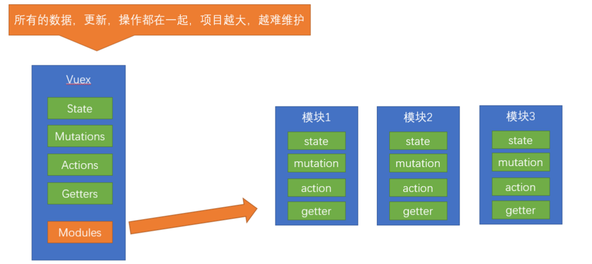


### **3.模块定义** - 准备 state

定义两个模块   **user** 和  **setting**

user中管理用户的信息状态  userInfo  `modules/user.js`

```jsx
const state = {
  userInfo: {
    name: 'zs',
    age: 18
  }
}

const mutations = {}

const actions = {}

const getters = {}

export default {
  state,
  mutations,
  actions,
  getters
}

```

setting中管理项目应用的  主题色 theme，描述 desc， `modules/setting.js`

```jsx
const state = {
  theme: 'dark'
  desc: '描述真呀真不错'
}

const mutations = {}

const actions = {}

const getters = {}

export default {
  state,
  mutations,
  actions,
  getters
}
```

在`store/index.js`文件中的modules配置项中，注册这两个模块

```js
import user from './modules/user'
import setting from './modules/setting'

const store = new Vuex.Store({
    modules:{
        user,
        setting
    }
})
```

使用模块中的数据,  可以直接通过模块名访问 `$store.state.模块名.xxx`  =>  `$store.state.setting.desc`

也可以通过 mapState 映射


## 十七、获取模块内的state数据

### 1.目标：

掌握模块中 state 的访问语法

尽管已经分模块了，但其实子模块的状态，还是会挂到根级别的 state 中，属性名就是模块名


### 2.使用模块中的数据

1.  直接通过模块名访问 $store.state.模块名.xxx
2.  通过 mapState 映射：
   1.  默认根级别的映射  mapState([ 'xxx' ])     
   2. 子模块的映射 ：mapState('模块名', ['xxx'])  -  需要开启相应模块的命名空间 **namespaced:true**

`modules/user.js`

```jsx
const state = {
  userInfo: {
    name: 'zs',
    age: 18
  },
  myMsg: '我的数据'
}

const mutations = {
  updateMsg (state, msg) {
    state.myMsg = msg
  }
}

const actions = {}

const getters = {}

export default {
  namespaced: true,
  state,
  mutations,
  actions,
  getters
}
```

### 3.代码示例

$store直接访问

```js
$store.state.user.userInfo.name
```

mapState辅助函数访问

```js
...mapState('user', ['userInfo']),
...mapState('setting', ['theme', 'desc']),
```


## 十八、获取模块内的getters数据

### 1.目标：

掌握模块中 getters 的访问语

### 2.语法：

使用模块中 getters 中的数据： 

1. 直接通过模块名访问` $store.getters['模块名/xxx ']`
2. 通过 mapGetters 映射      
   1. 默认根级别的映射  `mapGetters([ 'xxx' ]) `
   2. 子模块的映射  `mapGetters('模块名', ['xxx'])` -  需要开启命名空间

### 3.代码演示

`modules/user.js`

```js
const getters = {
  // 分模块后，state指代子模块的state
  UpperCaseName (state) {
    return state.userInfo.name.toUpperCase()
  }
}
```

Son1.vue 直接访问getters

```html
<!-- 测试访问模块中的getters - 原生 -->
<div>{{ $store.getters['user/UpperCaseName'] }}</div>
```

Son2.vue 通过命名空间访问

```js
computed:{
  ...mapGetters('user', ['UpperCaseName'])
}
```


## 十九、获取模块内的mutations方法

### 1.目标：

掌握模块中 mutation 的调用语法

### 2.注意：

默认模块中的 mutation 和 actions 会被挂载到全局，**需要开启命名空间**，才会挂载到子模块。

### 3.调用方式：

1. 直接通过 store 调用   $store.commit('模块名/xxx ',  额外参数)（当开启命名空间时，会被挂载到全局，此时调用不需要“模块名/”）
2. 通过 mapMutations 映射    
   1. 默认根级别的映射  mapMutations([ 'xxx' ])     
   2. 子模块的映射 mapMutations('模块名', ['xxx'])  -  需要开启命名空间

### 4.代码实现

`modules/user.js`

```js
const mutations = {
  setUser (state, newUserInfo) {
    state.userInfo = newUserInfo
  }
}
```

`modules/setting.js`

```js
const mutations = {
  setTheme (state, newTheme) {
    state.theme = newTheme
  }
}
```

Son1.vue

```vue
<button @click="updateUser">更新个人信息</button> 
<button @click="updateTheme">更新主题色</button>


export default {
  methods: {
    updateUser () {
      // $store.commit('模块名/mutation名', 额外传参)
      this.$store.commit('user/setUser', {
        name: 'xiaowang',
        age: 25
      })
    }, 
    updateTheme () {
      this.$store.commit('setting/setTheme', 'pink')
    }
  }
}
```


Son2.vue

```vue
<button @click="setUser({ name: 'xiaoli', age: 80 })">更新个人信息</button>
<button @click="setTheme('skyblue')">更新主题</button>

methods:{
// 分模块的映射
...mapMutations('setting', ['setTheme']),
...mapMutations('user', ['setUser']),
}
```


## 二十、获取模块内的actions方法

### 1.目标：

掌握模块中 action 的调用语法 (同理 - 直接类比 mutation 即可)

### 2.注意：

默认模块中的 mutation 和 actions 会被挂载到全局，**需要开启命名空间**，才会挂载到子模块。

### 3.调用语法：

1. 直接通过 store 调用   $store.dispatch('模块名/xxx ',  额外参数)
2. 通过 mapActions 映射     
   1.  默认根级别的映射  mapActions([ 'xxx' ])     
   2. 子模块的映射 mapActions('模块名', ['xxx'])  -  需要开启命名空间

### 4.代码实现

需求：

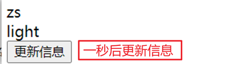


`modules/user.js`

```js
const actions = {
  setUserSecond (context, newUserInfo) {
    // 将异步在action中进行封装
    setTimeout(() => {
      // 调用mutation   context上下文，默认提交的就是自己模块的action和mutation
      context.commit('setUser', newUserInfo)
    }, 1000)
  }
}
```

Son1.vue  直接通过store调用

```vue
<button @click="updateUser2">一秒后更新信息</button>

methods:{
    updateUser2 () {
      // 调用action dispatch
      this.$store.dispatch('user/setUserSecond', {
        name: 'xiaohong',
        age: 28
      })
    },
}
```


Son2.vue mapActions映射

```js
<button @click="setUserSecond({ name: 'xiaoli', age: 80 })">一秒后更新信息</button>

methods:{
  ...mapActions('user', ['setUserSecond'])
}
```

## 二十一、Vuex模块化的使用小结

### 1.直接使用

1. state --> $store.state.**模块名**.数据项名
2. getters --> $store.getters['**模块名**/属性名']
3. mutations --> $store.commit('**模块名**/方法名', 其他参数)
4. actions --> $store.dispatch('**模块名**/方法名', 其他参数)

### 2.借助辅助方法使用

1.import { mapXxxx, mapXxx } from 'vuex'

computed、methods: {

​     // **...mapState、...mapGetters放computed中；**

​    //  **...mapMutations、...mapActions放methods中；**

​    ...mapXxxx(**'模块名'**, ['数据项|方法']),

​    ...mapXxxx(**'模块名'**, { 新的名字: 原来的名字 }),

}

2.组件中直接使用 属性 `{{ age }}` 或 方法 `@click="updateAge(2)"`


## 二十二、综合案例 - 创建项目

1. 脚手架新建项目 (注意：**勾选vuex**)      

   版本说明：

   vue2   vue-router3   vuex3               

   vue3  vue-router4  vuex4/pinia

```
vue create vue-cart-demo
```

2. 将原本src内容清空，替换成教学资料的《vuex-cart-准备代码》


需求：

1. 发请求动态渲染购物车，数据存vuex （存cart模块， 将来还会有user模块，article模块...）
2. 数字框可以修改数据
3. 动态计算总价和总数量


## 二十三、综合案例-构建vuex-cart模块

1. 新建 `store/modules/cart.js`

```jsx
export default {
  namespaced: true,
  state () {
    return {
      list: []
    }
  },
}
```

2. 挂载到 vuex 仓库上 `store/cart.js`

```jsx
import Vuex from 'vuex'
import Vue from 'vue'

import cart from './modules/cart'

Vue.use(Vuex)

const store = new Vuex.Store({
  modules: {
    cart
  }
})

export default store
```


## 二十四、综合案例-准备后端接口服务环境(了解)

1. 安装全局工具 json-server （全局工具仅需要安装一次）

```
yarn global add json-server(这种安装会有问题，用npm安装) 或 npm i json-server  -g
```

2. 代码根目录新建一个 db 目录
3. 将资料 index.json 移入 db 目录
4. 进入 db 目录，执行命令，启动后端接口服务 (使用--watch 参数 可以实时监听 json 文件的修改)

```
json-server --watch  index.json
```


## 二十五、综合案例-请求动态渲染数据

### 1.目标

请求获取数据存入 vuex, 映射渲染


1. 安装 axios

```jsx
yarn add axios
```

2. 准备actions 和 mutations

```jsx
import axios from 'axios'

export default {
  namespaced: true,
  state () {
    return {
      list: []
    }
  },
  mutations: {
    updateList (state, payload) {
      state.list = payload
    }
  },
  actions: {
    async getList (ctx) {
      const res = await axios.get('http://localhost:3000/cart')
      ctx.commit('updateList', res.data)
    }
  }
}
```

3. `App.vue`页面中调用 action,  获取数据

```jsx
import { mapState } from 'vuex'

export default {
  name: 'App',
  components: {
    CartHeader,
    CartFooter,
    CartItem
  },
  created () {
    this.$store.dispatch('cart/getList')
  },
  computed: {
    ...mapState('cart', ['list'])
  }
}
```

4. 动态渲染

```jsx
<!-- 商品 Item 项组件 -->
<cart-item v-for="item in list" :key="item.id" :item="item"></cart-item>
```

`cart-item.vue`

```jsx
<template>
  <div class="goods-container">
    <!-- 左侧图片区域 -->
    <div class="left">
      
    </div>
    <!-- 右侧商品区域 -->
    <div class="right">
      <!-- 标题 -->
      <div class="title">{{item.name}}</div>
      <div class="info">
        <!-- 单价 -->
        <span class="price">￥{{item.price}}</span>
        <div class="btns">
          <!-- 按钮区域 -->
          <button class="btn btn-light">-</button>
          <span class="count">{{item.count}}</span>
          <button class="btn btn-light">+</button>
        </div>
      </div>
    </div>
  </div>
</template>

<script>
export default {
  name: 'CartItem',
  props: {
    item: Object
  },
  methods: {

  }
}
</script>
```


## 二十六、综合案例-修改数量


1. 注册点击事件

```jsx
<!-- 按钮区域 -->
<button class="btn btn-light" @click="onBtnClick(-1)">-</button>
<span class="count">{{item.count}}</span>
<button class="btn btn-light" @click="onBtnClick(1)">+</button>
```

2. 页面中dispatch action

```jsx
onBtnClick (step) {
  const newCount = this.item.count + step
  if (newCount < 1) return

  // 发送修改数量请求
  this.$store.dispatch('cart/updateCount', {
    id: this.item.id,
    count: newCount
  })
}
```

3. 提供action函数

```jsx
async updateCount (ctx, payload) {
  await axios.patch('http://localhost:3000/cart/' + payload.id, {
    count: payload.count
  })
  ctx.commit('updateCount', payload)
}
```

4. 提供mutation处理函数

```jsx
mutations: {
  ...,
  updateCount (state, payload) {
    const goods = state.list.find((item) => item.id === payload.id)
    goods.count = payload.count
  }
},
```


## 二十七、综合案例-底部总价展示

1. 提供getters

```jsx
getters: {
  total(state) {
    return state.list.reduce((p, c) => p + c.count, 0);
  },
  totalPrice (state) {
    return state.list.reduce((p, c) => p + c.count * c.price, 0);
  },
},
```

2. 动态渲染

```jsx
<template>
  <div class="footer-container">
    <!-- 中间的合计 -->
    <div>
      <span>共 {{total}} 件商品，合计：</span>
      <span class="price">￥{{totalPrice}}</span>
    </div>
    <!-- 右侧结算按钮 -->
    <button class="btn btn-success btn-settle">结算</button>
  </div>
</template>

<script>
import { mapGetters } from 'vuex'
export default {
  name: 'CartFooter',
  computed: {
    ...mapGetters('cart', ['total', 'totalPrice'])
  }
}
</script>
```

# 补充

## diff算法

snabbdom 是著名的虚拟dom库，是diff算法的鼻祖，vue源码借鉴了snabbdom。这里基于这个库来分析 diff 算法的流程。

虚拟DOM：指用js对象来描述DOM的层次结构。DOM中的一切实现都在虚拟DOM中有对应的属性。

### 要点

- diff 是发生在虚拟DOM上的
- 新虚拟DOM和老虚拟DOM进行 diff （精细化比较），从而最小量更新，最后反映到真正的DOM上
- DOM如何变为虚拟DOM，属于模板编译原理范畴，这里的分析只不涉及该内容
- 研究点
  - 虚拟DOM如何被渲染函数（h函数）产生
  - difff 算法原理
  - 虚拟DOM如何通过diff变成真正的DOM

### 流程

1. 通过 h 函数把 dom节点 转换为 虚拟dom节点（vnode）
2. 使用 patch 函数进行新旧 dom 节点的比较和更新
3. 

### 总结

- 只有是同一个虚拟节点，才会进行精细化比较
- 选择器相同（标签相同）且 key 相同的节点才是同一个节点
- 只进行同层比较，不进行跨层比较
- 如果不是同一个节点（或跨层），即使内部有相同的节点，也不会继续比较了，会直接**暴力删除旧的、插入新的**
- 实际开发中一般不会遇到节点改变或加减层级，所以实际 diff 算法即使没有那么无微不至，但也不怎么影响效率

~~~vue
<template>
<!-- 不是同一个节点的情况：实际一般不会这么写代码 -->
	<ol v-if="flag">
  	<li>1</li>
		<li>2</li>
    <li>3</li>
	</ol>
	<ul v-else>
    <li>1</li>
    <li>2</li>
    <li>3</li>
  </ul>
</template>

<template>
<!-- 跨层的情况：实际一般不会这么写代码 -->
	<ol v-if="flag">
  	<li>1</li>
		<li>2</li>
    <li>3</li>
	</ol>
	<div v-else>
    <ol>
      <li>3</li>
      <li>4</li>
      <li>5</li>
  </ol>
  </div>
</template>
~~~


## 小技巧

- 把一个不是boolean类型（如number、string等）的转换为布尔：`!!value`（第一个!取反，第二个!再取反就是真正的值了）
