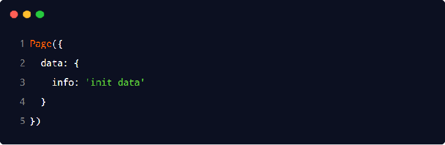
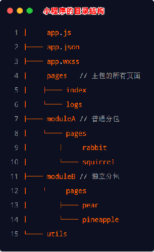

# 简介,组成,宿主环境

## 小程序简介

1、小程序与普通网页开发的区别

- 运行环境不同：网页运行在浏览器环境中
  小程序运行在微信环境中
- API 不同：由于运行环境的不同，所以小程序中，无法调用 DOM 和 BOM 的 API。但是，小程序中可以调用微信环境提供的各种 API，例如：地理定位、扫码、支付
- 开发模式不同：网页的开发模式：浏览器 + 代码编辑器。小程序有自己的一套标准开发模式：
  - 申请小程序开发账号
  - 安装小程序开发者工具
  - 创建和配置小程序项目

## 小程序代码的构成

### 项目结构

#### 1、基本组成结构

- ages 用来存放所有小程序的页面
- utils 用来存放工具性质的模块（例如：格式化时间的自定义模块）
- app.js 小程序项目的入口文件
- app.json 小程序项目的全局配置文件
- app.wxss 小程序项目的全局样式文件
- project.config.json 项目的配置文件
- sitemap.json 用来配置小程序及其页面是否允许被微信索引

#### 2、小程序页面的组成部

小程序官方建议把所有小程序的页面，都存放在 pages 目录中，以单独的文件夹存在。

其中，每个页面由 4 个基本文件组成，它们分别是：

-  .js 文件（页面的脚本文件，存放页面的数据、事件处理函数等）
-  .json 文件（当前页面的配置文件，配置窗口的外观、表现等）
-  .wxml 文件（页面的模板结构文件）
-  .wxss 文件（当前页面的样式表文件）

#### JSON 配置文件的作用

JSON 是一种数据格式，在实际开发中，JSON 总是以配置文件的形式出现。小程序项目中也不例外：通过不同的 .json 配置文件，可以对小程序项目进行不同级别的配置。

小程序项目中有 4 种 json 配置文件，分别是：

1、项目根目录中的 app.json 配置文件

​	app.json 是当前小程序的全局配置，包括了小程序的所有页面路径、窗口外观、界面表现、底部 tab 等。组成部分如下：

- pages：用来记录当前小程序所有页面的路径
- window：全局定义小程序所有页面的背景色、文字颜色等
- style：全局定义小程序组件所使用的样式版本
- sitemapLocation：用来指明 sitemap.json 的位置

2、项目根目录中的 project.config.json 配置文件

​	用来记录我们对小程序开发工具所做的个性化配置，例如：

- setting 中保存了编译相关的配置
- projectname 中保存的是项目名称
- appid 中保存的是小程序的账号 ID

3、项目根目录中的 sitemap.json 配置文件

​	微信现已开放小程序内搜索，效果类似于 PC 网页的 SEO。sitemap.json 文件用来配置小程序页面是否允许微信索引。

​	当开发者允许微信索引时，微信会通过爬虫的形式，为小程序的页面内容建立索引。当用户的搜索关键字和页面的索引匹配成功的时候，小程序的页面将可能展示在搜索结果中。

注意：sitemap 的索引提示是默认开启的，如需要关闭 sitemap 的索引提示，可在小程序项目配置文件 project.config.json 的 setting 中配置字段 checkSiteMap 为 false

4、每个页面文件夹中的 .json 配置文件

​	小程序中的每一个页面，可以使用 .json 文件来对本页面的窗口外观进行配置，页面中的配置项会覆盖 app.json 的 window 中相同的配置项

#### 新建小程序页面

只需要在 app.json -> pages 中新增页面的存放路径，小程序开发者工具即可帮我们自动创建对应的页面文件

#### 修改项目首页

只需要调整 app.json -> pages 数组中页面路径的前后顺序，即可修改项目的首页。小程序会把排在第一位的页面，当作项目首页进行渲染

### WXML 模板

WXML（WeiXin Markup Language）是小程序框架设计的一套标签语言，用来构建小程序页面的结构，其作用类似于网页开发中的 HTML。

#### WXML 和 HTML 的区别

标签名称不同

- HTML （div, span, img, a）
- WXML（view, text, image, navigator）

属性节点不同

- <a href="#">超链接</a>
- <navigator url="/pages/home/home"></navigator>

提供了类似于 Vue 中的模板语法

- 数据绑定
- 列表渲染
- 条件渲染

### WXSS 样式

WXSS (WeiXin Style Sheets)是一套样式语言，用于描述 WXML 的组件样式，类似于网页开发中的 CSS。

#### WXSS 和 CSS 的区别

新增了 rpx 尺寸单位

- CSS 中需要手动进行像素单位换算，例如 rem
- WXSS 在底层支持新的尺寸单位 rpx，在不同大小的屏幕上小程序会自动进行换算

提供了全局的样式和局部样式

- 项目根目录中的 app.wxss 会作用于所有小程序页面
- 局部页面的 .wxss 样式仅对当前页面生效

WXSS 仅支持部分 CSS 选择器

- .class 和 #id
- element
- 并集选择器、后代选择器
- ::after 和 ::before 等伪类选择器

### JS 逻辑交互

一个项目仅仅提供界面展示是不够的，在小程序中，我们通过 .js 文件来处理用户的操作。例如：响应用户的点击、获取用户的位置等等。

小程序中的 JS 文件分为三大类，分别是：

- app.js：是整个小程序项目的入口文件，通过调用 App() 函数来启动整个小程序
- 页面的 .js 文件：是页面的入口文件，通过调用 Page() 函数来创建并运行页面
- 普通的 .js 文件：是普通的功能模块文件，用来封装公共的函数或属性供页面使用

## 程序的宿主环境

宿主环境（host environment）指的是程序运行所必须的依赖环境。例如：
	Android 系统和 iOS 系统是两个不同的宿主环境。安卓版的微信 App 是不能在 iOS 环境下运行的，所以，Android 是安卓软件的宿主环境，脱离了宿主环境的软件是没有任何意义的！

手机微信是小程序的宿主环境，小程序借助宿主环境提供的能力，可以完成许多普通网页无法完成的功能，例如：
微信扫码、微信支付、微信登录、地理定位、etc…

### 小程序宿主环境包含的内容

通信模型
运行机制
组件
API

#### 通信模型

1、通信的主体

​	小程序中通信的主体是渲染层和逻辑层，其中：
WXML 模板和 WXSS 样式工作在渲染层
JS 脚本工作在逻辑层

2、小程序的通信模型

​	小程序中的通信模型分为两部分：

- 渲染层和逻辑层之间的通信
  - 由微信客户端进行转发
- 逻辑层和第三方服务器之间的通信
  - 由微信客户端进行转发

#### 运行机制

1、小程序启动的过程

- 把小程序的代码包下载到本地
- 解析 app.json 全局配置文件
- 执行 app.js 小程序入口文件，调用 App() 创建小程序实例
- 渲染小程序首页
- 小程序启动完成

2、页面渲染的过程

- 加载解析页面的 .json 配置文件
- 加载页面的 .wxml 模板和 .wxss 样式
- 执行页面的 .js 文件，调用 Page() 创建页面实例
- 页面渲染完成

#### 组件

##### 1、小程序中组件的分类

小程序中的组件也是由宿主环境提供的，开发者可以基于组件快速搭建出漂亮的页面结构。官方把小程序的组件分为了 9 大类，分别是：

- 视图容器
- 基础内容
- 表单组件
- 导航组件
- 媒体组件
- map 地图组件
- canvas 画布组件
- 开放能力
- 无障碍访问

##### 2、常用的视图容器类组件

- view
  - 普通视图区域
  - 类似于 HTML 中的 div，是一个块级元素
  - 常用来实现页面的布局效果
- scroll-view
  - 可滚动的视图区域
  - 常用来实现滚动列表效果
- swiper 和 swiper-item
  - 轮播图容器组件 和 轮播图 item 组件
  - swiper 组件的常用属性

| **属性**               | **类型** | **默认值**        | **说明**             |
| ---------------------- | -------- | ----------------- | -------------------- |
| indicator-dots         | boolean  | false             | 是否显示面板指示点   |
| indicator-color        | color    | rgba(0, 0, 0, .3) | 指示点颜色           |
| indicator-active-color | color    | #000000           | 当前选中的指示点颜色 |
| autoplay               | boolean  | false             | 是否自动切换         |
| interval               | number   | 5000              | 自动切换时间间隔     |
| circular               | boolean  | false             | 是否采用衔接滑动     |

##### 常用的基础内容组件

- text
  - 文本组件
  - 类似于 HTML 中的 span 标签，是一个行内元素
  - 通过 text 组件的 selectable 属性，实现长按选中文本内容的效果
- rich-text
  - 富文本组件
  - 支持把 HTML 字符串渲染为 WXML 结构
  - 通过 rich-text 组件的 nodes 属性节点，把 HTML 字符串渲染为对应的 UI 结构

##### 其它常用组件

- button
  - 按钮组件
  - 功能比 HTML 中的 button 按钮丰富
  - 通过 open-type 属性可以调用微信提供的各种功能（客服、转发、获取用户授权、获取用户信息等）
- image
  - 图片组件
  - image 组件默认宽度约 300px、高度约 240px
  - image 组件的 mode 属性用来指定图片的裁剪和缩放模式，常用的 mode 属性值如下

| **mode** **值** | **说明**                                                     |
| --------------- | ------------------------------------------------------------ |
| scaleToFill     | （默认值）缩放模式，不保持纵横比缩放图片，使图片的宽高完全拉伸至填满 image 元素 |
| aspectFit       | 缩放模式，保持纵横比缩放图片，使图片的长边能完全显示出来。也就是说，可以完整地将图片显示出来。 |
| aspectFill      | 缩放模式，保持纵横比缩放图片，只保证图片的短边能完全显示出来。也就是说，图片通常只在水平或垂直方向是完整的，另一个方向将会发生截取。 |
| widthFix        | 缩放模式，宽度不变，高度自动变化，保持原图宽高比不变         |
| heightFix       | 缩放模式，高度不变，宽度自动变化，保持原图宽高比不变         |

- navigator（后面课程会专门讲解）
  - 页面导航组件
  - 类似于 HTML 中的 a 链接

### API

小程序中的 API 是由宿主环境提供的，通过这些丰富的小程序 API，开发者可以方便的调用微信提供的能力，例如：获取用户信息、本地存储、支付功能等。

#### 小程序 API 的 3 大分类

- 事件监听 API
  - 特点：以 on 开头，用来监听某些事件的触发
  - 举例：wx.onWindowResize(function callback) 监听窗口尺寸变化的事件
- 同步 API
  - 特点1：以 Sync 结尾的 API 都是同步 API
  - 特点2：同步 API 的执行结果，可以通过函数返回值直接获取，如果执行出错会抛出异常
  - 举例：wx.setStorageSync('key', 'value') 向本地存储中写入内容
- 异步 API
  - 特点：类似于 jQuery 中的 $.ajax(options) 函数，需要通过 success、fail、complete 接收调用的结果
  - 举例：wx.request() 发起网络数据请求，通过 success 回调函数接收数据

### 协同工作和发布

没写，自己看黑马的ppt吧

# 基本语法,配置,请求

## WXML 模板语法

### 数据绑定

#### 数据绑定的基本原则

1. 在 data 中定义数据
2. 在 WXML 中使用数据

#### 在 data 中定义页面的数据

在页面对应的 .js 文件中，把数据定义到 data 对象中即可：

#### Mustache 语法的格式

把data中的数据绑定到页面中渲染，使用 Mustache 语法（双大括号）将变量包起来即可。（类似vue中的插值表达式）语法格式为： 

#### Mustache 语法的应用场景

Mustache 语法的主要应用场景如下：

- 绑定内容
- 绑定属性
- 运算（三元运算、算术运算等）

#### 动态绑定内容

页面的数据如下：

页面的结构如下：

#### 动态绑定属性

页面的数据如下：

页面的结构如下：

### 事件绑定

#### 什么是事件

事件是渲染层到逻辑层的通讯方式。通过事件可以将用户在渲染层产生的行为，反馈到逻辑层进行业务的处理

#### 小程序中常用的事件

| **类型** | **绑定方式**              | **事件描述**                                    |
| -------- | ------------------------- | ----------------------------------------------- |
| tap      | bindtap 或 bind:tap       | 手指触摸后马上离开，类似于 HTML 中的 click 事件 |
| input    | bindinput 或 bind:input   | 文本框的输入事件                                |
| change   | bindchange 或 bind:change | 状态改变时触发                                  |

#### 事件对象的属性列表

当事件回调触发的时候，会收到一个事件对象 event，它的详细属性如下表所示：

| **属性**       | **类型** | **说明**                                     |
| -------------- | -------- | -------------------------------------------- |
| type           | String   | 事件类型                                     |
| timeStamp      | Integer  | 页面打开到触发事件所经过的毫秒数             |
| target         | Object   | 触发事件的组件的一些属性值集合               |
| currentTarget  | Object   | 当前组件的一些属性值集合                     |
| detail         | Object   | 额外的信息                                   |
| touches        | Array    | 触摸事件，当前停留在屏幕中的触摸点信息的数组 |
| changedTouches | Array    | 触摸事件，当前变化的触摸点信息的数组         |

#### target 和 currentTarget 的区别

target 是触发该事件的源头组件，而 currentTarget 则是当前事件所绑定的组件。举例如下：

点击内部的按钮时，点击事件以冒泡的方式向外扩散，也会触发外层 view 的 tap 事件处理函数。此时，对于外层的 view 来说：

- e.target 指向的是触发事件的源头组件，因此，e.target 是内部的按钮组件
- e.currentTarget 指向的是当前正在触发事件的那个组件，因此，e.currentTarget 是当前的 view 组件

#### bindtap 的语法格式

在小程序中，不存在 HTML 中的 onclick 鼠标点击事件，而是通过 tap 事件来响应用户的触摸行为。

1. 通过 bindtap，可以为组件绑定 tap 触摸事件
2. 在页面的 .js 文件中定义对应的事件处理函数，事件参数通过形参 event（一般简写成 e） 来接收

#### 在事件处理函数中为 data 中的数据赋值

过调用 this.setData(dataObject) 方法，可以给页面 data 中的数据重新赋值（会重新渲染页面，该方法调用过多，会影响性能）

也可以用 this.data.属性名 = 属性值，但该方式修改js中的值，不会重新渲染页面（性能更高）

对于不需要在页面显示的数据，可以用 this.data. 的方式直接赋值；而对于需要在页面实时显示的数据，则必须用 setData 方法重新赋值

#### 事件传参

小程序中的事件传参比较特殊，不能在绑定事件的同时为事件处理函数传递参数。因为小程序会把 bindtap 的属性值，统一当作事件名称来处理

可以为组件提供 data-* 自定义属性传参，其中 * 代表的是参数的名字，示例代码如下：

- info 会被解析为参数的名字 
- 数值 2 会被解析为参数的值
- 在事件处理函数中，通过 event.target.dataset.参数名 即可获取到具体参数的值

### 条件渲染

#### wx:if

在小程序中，使用 wx:if="{{condition}}" 来判断是否需要渲染该代码块，也可以用 wx:elif 和 wx:else 来添加 else 判断（相当于vue中的v-if）

#### 结合 block 使用 wx:if

如果要一次性控制多个组件的展示与隐藏，可以使用一个 block 标签将多个组件包装起来，并在<block> 标签上使用 wx:if 控制属性

注意： <block> 并不是一个组件，它只是一个包裹性质的容器，不会在页面中做任何渲染（相当于vue中的template）

#### hidden

在小程序中，直接使用 hidden="{{ condition }}" 也能控制元素的显示与隐藏（相当于vue中的v-show）

#### wx:if 与 hidden 的对比

- 运行方式不同
  - wx:if 以动态创建和移除元素的方式，控制元素的展示与隐藏
  - hidden 以切换样式的方式（display: none/block;），控制元素的显示与隐藏
- 使用建议
  - 频繁切换时，建议使用 hidden
  - 控制条件复杂时，建议使用 wx:if 搭配 wx:elif、wx:else 进行展示与隐藏的切换

### 列表渲染

#### wx:for

通过 wx:for 可以根据指定的数组，循环渲染重复的组件结构

默认情况下，当前循环项的索引用 index 表示；当前循环项用 item 表示

#### 动指定索引和当前项的变量名

- 使用 wx:for-index 可以指定当前循环项的索引的变量名
- 使用 wx:for-item 可以指定当前项的变量名

#### wx:key 的使用

类似于 Vue 列表渲染中的 :key，小程序在实现列表渲染时，也建议为渲染出来的列表项指定唯一的 key 值，从而提高渲染的效率。

注意：wx:key中不需要使用 mustache 语法

## WXSS 模板样式

1、什么是 WXSS

WXSS (WeiXin Style Sheets)是一套样式语言，用于美化 WXML 的组件样式，类似于网页开发中的 CSS。

2、WXSS 和 CSS 的关系

WXSS 具有 CSS 大部分特性，同时，WXSS 还对 CSS 进行了扩充以及修改，以适应微信小程序的开发。与 CSS 相比，WXSS 扩展的特性有：

-  rpx 尺寸单位
-  @import 样式导入

### rpx

rpx（responsive pixel）是微信小程序独有的，用来解决屏适配的尺寸单位。

rpx 的实现原理非常简单：鉴于不同设备屏幕的大小不同，为了实现屏幕的自动适配，rpx 把所有设备的屏幕，在宽度上等分为 750 份（即：当前屏幕的总宽度为 750rpx）。

- 在较小的设备上，1rpx 所代表的宽度较小
- 在较大的设备上，1rpx 所代表的宽度较大

小程序在不同设备上运行的时候，会自动把 rpx 的样式单位换算成对应的像素单位来渲染，从而实现屏幕适配

在 iPhone6 上，屏幕宽度为375px，共有 750 个物理像素，等分为 750rpx。则：
	750rpx = 375px = 750 物理像素
    1rpx = 0.5px  = 1物理像素

官方建议：开发微信小程序时，设计师可以用 iPhone6 作为视觉稿的标准。
开发举例：在 iPhone6 上如果要绘制宽100px，高20px的盒子，换算成rpx单位，宽高分别为 200rpx 和 40rpx。

### 样式导入

使用 WXSS 提供的 @import 语法，可以导入外联的样式表。

@import 后跟需要导入的外联样式表的相对路径，用 ; 表示语句结束

### 全局样式和局部样式

定义在 app.wxss 中的样式为全局样式，作用于每一个页面。

在页面的 .wxss 文件中定义的样式为局部样式，只作用于当前页面。

注意：

- 当局部样式和全局样式冲突时，根据就近原则，局部样式会覆盖全局样式
- 当局部样式的权重大于或等于全局样式的权重时，才会覆盖全局的样式

## 全局配置

### 全局配置文件及常用的配置项

小程序根目录下的 app.json 文件是小程序的全局配置文件。常用的配置项如下：

- pages：记录当前小程序所有页面的存放路径
- window：全局设置小程序窗口的外观
- tabBar：设置小程序底部的  tabBar 效果
- style：是否启用新版的组件样式

### window

#### 小程序窗口的组成部分

#### 解 window 节点常用的配置项

| **属性名**                   | **类型** | **默认值** | **说明**                                       |
| ---------------------------- | -------- | ---------- | ---------------------------------------------- |
| navigationBarTitleText       | String   | 字符串     | 导航栏标题文字内容                             |
| navigationBarBackgroundColor | HexColor | #000000    | 导航栏背景颜色，如 #000000                     |
| navigationBarTextStyle       | String   | white      | 导航栏标题颜色，仅支持 black / white           |
| backgroundColor              | HexColor | #ffffff    | 窗口的背景色                                   |
| backgroundTextStyle          | String   | dark       | 下拉 loading 的样式，仅支持 dark / light       |
| enablePullDownRefresh        | Boolean  | false      | 是否全局开启下拉刷新                           |
| onReachBottomDistance        | Number   | 50         | 页面上拉触底事件触发时距页面底部距离，单位为px |

### tabBar

tabBar 是移动端应用常见的页面效果，用于实现多页面的快速切换。小程序中通常将其分为：

- 底部 tabBar
- 顶部 tabBar

注意：

- tabBar中只能配置最少 2 个、最多 5 个 tab 页签
- 当渲染顶部 tabBar 时，不显示 icon，只显示文本

#### tabBar 的 6 个组成部分

- 
- backgroundColor：tabBar 的背景色
- selectedIconPath：选中时的图片路径
- borderStyle：tabBar 上边框的颜色
- iconPath：未选中时的图片路径
- selectedColor：tab 上的文字选中时的颜色
- color：tab 上文字的默认（未选中）颜色

#### tabBar 节点的配置项

| **属性**        | **类型** | **必填** | **默认值** | **描述**                                 |
| --------------- | -------- | -------- | ---------- | ---------------------------------------- |
| position        | String   | 否       | bottom     | tabBar 的位置，仅支持 bottom/top         |
| borderStyle     | String   | 否       | black      | tabBar 上边框的颜色，仅支持 black/white  |
| color           | HexColor | 否       |            | tab 上文字的默认（未选中）颜色           |
| selectedColor   | HexColor | 否       |            | tab 上的文字选中时的颜色                 |
| backgroundColor | HexColor | 否       |            | tabBar 的背景色                          |
| list            | Array    | 是       |            | tab 页签的列表，最少 2 个、最多 5 个 tab |

#### 每个 tab 项的配置选项

| **属性**         | **类型** | **必填** | **描述**                                              |
| ---------------- | -------- | -------- | ----------------------------------------------------- |
| pagePath         | String   | 是       | 页面路径，页面必须在 pages 中预先定义                 |
| text             | String   | 是       | tab 上显示的文字                                      |
| iconPath         | String   | 否       | 未选中时的图标路径；当 postion 为 top 时，不显示 icon |
| selectedIconPath | String   | 否       | 选中时的图标路径；当 postion 为 top 时，不显示 icon   |

## 页面配置

小程序中，每个页面都有自己的 .json 配置文件，用来对当前页面的窗口外观、页面效果等进行配置。

小程序中，app.json 中的 window 节点，可以全局配置小程序中每个页面的窗口表现。
如果某些小程序页面想要拥有特殊的窗口表现，此时，“页面级别的 .json 配置文件”就可以实现这种需求。
注意：当页面配置与全局配置冲突时，根据就近原则，最终的效果以页面配置为准。

#### 页面配置中常用的配置项

| **属性**                     | **类型** | **默认值** | **描述**                                         |
| ---------------------------- | -------- | ---------- | ------------------------------------------------ |
| navigationBarBackgroundColor | HexColor | #000000    | 当前页面导航栏背景颜色，如 #000000               |
| navigationBarTextStyle       | String   | white      | 当前页面导航栏标题颜色，仅支持 black / white     |
| navigationBarTitleText       | String   |            | 当前页面导航栏标题文字内容                       |
| backgroundColor              | HexColor | #ffffff    | 当前页面窗口的背景色                             |
| backgroundTextStyle          | String   | dark       | 当前页面下拉 loading 的样式，仅支持 dark / light |
| enablePullDownRefresh        | Boolean  | false      | 是否为当前页面开启下拉刷新的效果                 |
| onReachBottomDistance        | Number   | 50         | 页面上拉触底事件触发时距页面底部距离，单位为 px  |

## 网络数据请求

出于安全性方面的考虑，小程序官方对数据接口的请求做出了如下两个限制：

- 只能请求 HTTPS 类型的接口
- 必须将接口的域名添加到信任列表中

将自己的域名添加到信任列表中，需要到微信小程序管理后台去修改 request 合法域名

注意事项：

- 域名只支持 https 协议
- 域名不能使用 IP 地址或 localhost
- 域名必须经过 ICP 备案
- 服务器域名一个月内最多可申请 5 次修改

注：可以在开发环境下跳过 request 合法域名校验，如果后端程序员仅仅提供了 http 协议的接口、暂时没有提供 https 协议的接口。
此时为了不耽误开发的进度，我们可以在微信开发者工具中，临时开启「开发环境不校验请求域名、TLS 版本及 HTTPS 证书」选项，跳过 request 合法域名的校验。

### 发起 GET/POST 请求

在很多情况下，我们需要在页面刚加载的时候，自动请求一些初始化的数据。此时需要在页面的 onLoad 事件中调用获取数据的函数

### 关于跨域和 Ajax 的说明

​	跨域问题只存在于基于浏览器的 Web 开发中。由于小程序的宿主环境不是浏览器，而是微信客户端，所以小程序中不存在跨域的问题。
​	Ajax 技术的核心是依赖于浏览器中的 XMLHttpRequest 这个对象，由于小程序的宿主环境是微信客户端，所以小程序中不能叫做“发起 Ajax 请求”，而是叫做“发起网络数据请求”。

# 导航,事件,生命周期

## 页面导航

页面导航指的是页面之间的相互跳转。例如，浏览器中实现页面导航的方式有如下两种：

- <a> 链接
- location.href

### 小程序中实现页面导航的两种方式

- 声明式导航
  - 在页面上声明一个 <navigator> 导航组件
  - 通过点击 <navigator> 组件实现页面跳转
-  编程式导航
  - 调用小程序的导航 API，实现页面的跳转

#### 声明式导航

##### 导航到 tabBar 页面

tabBar 页面指的是被配置为 tabBar 的页面。
在使用 <navigator> 组件跳转到指定的 tabBar 页面时，需要指定 url 属性和 open-type 属性，其中：

- url 表示要跳转的页面的地址，必须以 / 开头
- open-type 表示跳转的方式，必须为 switchTab

##### 导航到非 tabBar 页面

非 tabBar 页面指的是没有被配置为 tabBar 的页面。
在使用 <navigator> 组件跳转到普通的非 tabBar 页面时，则需要指定 url 属性和 open-type 属性，其中：

- url 表示要跳转的页面的地址，必须以 / 开头
- open-type 表示跳转的方式，必须为 navigate
- "navigate" 属性可以省略，open-type 默认值为 navigate

##### 后退导航

如果要后退到上一页面或多级页面，则需要指定 open-type 属性和 delta 属性，其中：

- open-type 的值必须是 navigateBack，表示要进行后退导航
- delta 的值必须是数字，表示要后退的层级
- 只后退一页，可以省略 delta 属性，因为其默认值就是 1

#### 编程式导航

##### 导航到 tabBar 页面

调用 wx.switchTab(Object object) 方法，可以跳转到 tabBar 页面。其中 Object 参数对象的属性列表如下

| **属性** | **类型** | **是否必选** | **说明**                                         |
| -------- | -------- | ------------ | ------------------------------------------------ |
| url      | string   | 是           | 需要跳转的 tabBar 页面的路径，路径后不能带参数   |
| success  | function | 否           | 接口调用成功的回调函数                           |
| fail     | function | 否           | 接口调用失败的回调函数                           |
| complete | function | 否           | 接口调用结束的回调函数（调用成功、失败都会执行） |

##### 导航到非 tabBar 页面

调用 wx.navigateTo(Object object) 方法，可以跳转到非 tabBar 的页面。其中 Object 参数对象的属性列表如下：

| **属性** | **类型** | **是否必选** | **说明**                                           |
| -------- | -------- | ------------ | -------------------------------------------------- |
| url      | string   | 是           | 需要跳转到的非 tabBar 页面的路径，路径后可以带参数 |
| success  | function | 否           | 接口调用成功的回调函数                             |
| fail     | function | 否           | 接口调用失败的回调函数                             |
| complete | function | 否           | 接口调用结束的回调函数（调用成功、失败都会执行）   |

##### 后退导航

调用 wx.navigateBack(Object object) 方法，可以返回上一页面或多级页面。其中 Object 参数对象可选的属性列表如下：

| **属性** | **类型** | **默认值** | **是否必选** | **说明**                                              |
| -------- | -------- | ---------- | ------------ | ----------------------------------------------------- |
| delta    | number   | 1          | 否           | 返回的页面数，如果 delta 大于现有页面数，则返回到首页 |
| success  | function |            | 否           | 接口调用成功的回调函数                                |
| fail     | function |            | 否           | 接口调用失败的回调函数                                |
| complete | function |            | 否           | 接口调用结束的回调函数（调用成功、失败都会执行）      |

### 导航传参

1、声明式导航传参

​	navigator 组件的 url 属性用来指定将要跳转到的页面的路径。同时，路径的后面还可以携带参数：

- 参数与路径之间使用 ? 分隔
- 参数键与参数值用 = 相连
- 不同参数用 & 分隔

2、编程式导航传参

​	调用 wx.navigateTo(Object object) 方法跳转页面时，也可以携带参数，直接在 url 加上参数即可

#### 在 onLoad 中接收导航参数

通过声明式导航传参或编程式导航传参所携带的参数，可以直接在 onLoad 事件中直接获取到

## 页面事件

### 下拉刷新事件

下拉刷新是移动端的专有名词，指的是通过手指在屏幕上的下拉滑动操作，从而重新加载页面数据的行为。

启用下拉刷新有两种方式：

- 全局开启下拉刷新
  - 在 app.json 的 window 节点中，将 enablePullDownRefresh 设置为 true
- 局部开启下拉刷新
  - 在页面的 .json 配置文件中，将 enablePullDownRefresh 设置为 true

在实际开发中，推荐使用第 2 种方式，为需要的页面单独开启下拉刷新的效果。

#### 配置下拉刷新窗口的样式

在全局或页面的 .json 配置文件中，通过 backgroundColor 和 backgroundTextStyle 来配置下拉刷新窗口的样式，其中：

- backgroundColor 用来配置下拉刷新窗口的背景颜色，仅支持16 进制的颜色值
-  backgroundTextStyle 用来配置下拉刷新 loading 的样式，仅支持 dark 和 light

#### 监听页面的下拉刷新事件

在页面的 .js 文件中，通过 onPullDownRefresh() 函数即可监听当前页面的下拉刷新事件

#### 停止下拉刷新的效果

当处理完下拉刷新后，下拉刷新的 loading 效果会一直显示，不会主动消失，所以需要手动隐藏下拉刷新的 loading 效果。此时，调用 wx.stopPullDownRefresh() 可以停止当前页面的下拉刷新

注：模拟调试会自动结束loading效果，但实际在真机环境下回一直显示

### 上拉触底事件

上拉触底是移动端的专有名词，通过手指在屏幕上的上拉滑动操作，从而加载更多数据的行为。

##### 监听页面的上拉触底事件

在页面的 .js 文件中，通过 onReachBottom() 函数即可监听当前页面的上拉触底事件

##### 配置上拉触底距离

上拉触底距离指的是触发上拉触底事件时，滚动条距离页面底部的距离。
可以在全局或页面的 .json 配置文件中，通过 onReachBottomDistance 属性来配置上拉触底的距离。
小程序默认的触底距离是 50px，在实际开发中，可以根据自己的需求修改这个默认值。

##### 节流

可以自己调用一个布尔变量 isLoading 来控制请求的次数，让用户在上一次请求没有完成时，无法进行新的请求。

也可以在调用 wx.showLoading 方法中添加值：mask: true，它可以控制是否显示透明蒙层，防止触摸穿透，让用户无法再去上拉

~~~js
wx.showLoading({
  title: '数据加载中...',
  mask: true
})
~~~

##### 上拉触底案例

- 定义获取随机颜色的方法
- 在页面加载时获取初始数据
- 渲染 UI 结构并美化页面效果
- 在上拉触底时调用获取随机颜色的方法
- 添加 loading 提示效果
- 对上拉触底进行节流处理

特别的：对上拉触底进行节流处理

- 在 data 中定义 isloading 节流阀

  - false 表示当前没有进行任何数据请求

  - true 表示当前正在进行数据请求

- 在 getColors() 方法中修改 isloading 节流阀的值
  - 在刚调用 getColors 时将节流阀设置 true
  - 在网络请求的 complete 回调函数中，将节流阀重置为 false
- 在 onReachBottom 中判断节流阀的值，从而对数据请求进行节流控制
  - 如果节流阀的值为 true，则阻止当前请求
  - 如果节流阀的值为 false，则发起数据请求

~~~js
// wxml
<view wx:for="{{colorList}}" wx:key="index" class="num-item" style="background-color: rgba({{item}});">
  {{item}}
</view>

// wxss
.num-item {
  margin: 15rpx;
  height: 400rpx;
  text-align: center;
  line-height: 400rpx;
  border-radius: 20rpx;
  text-shadow: 0 0 5rpx #fff;
  box-shadow: 10rpx 10rpx 6rpx #aaa;
}

// js
  data: {
    colorList: []	// rgba数组
    isLoading： false	// 节流阀
  },

  // 获取rgba颜色数组
  getColors() {
    this.setData({
      isLoading: true // 表示当前正在发送网络请求
    })
    // 显示loading效果
    wx.showLoading({
      title: '数据加载中...',
    })
    wx.request({
      url: 'https://applet-base-api-t.itheima.net/api/color',
      method: 'GET',
      // 对result中的data属性结构，并把结构出的值赋给变量res
      success: ({ data: res }) => {
        this.setData({
          colorList: [...this.data.colorList, ...res.data]
        })
      },
      complete: () => {
        wx.hideLoading()  // 关闭loading效果
        this.setData({
          isLoading: false  // 表示网络请求已结束
        })
      }
    })
  },
      
  /**
   * 页面上拉触底事件的处理函数
   */
  onReachBottom() {
    // 如果当前请求还未结束，就不重复再发请求了
    if (this.data.isLoading) return
    this.getColors()
  },
~~~

### 扩展：自定义编译模式

在普通编译右边，有个下拉框。选择 添加编译模式，可以指定每次编译后默认进入的页面，还可以指定启动参数（进入页面时的默认参数）

## 生命周期

生命周期（Life Cycle）是指一个对象从创建 -> 运行 -> 销毁的整个阶段，强调的是一个时间段。

- 程序的启动，表示生命周期的开始
- 小程序的关闭，表示生命周期的结束
- 中间小程序运行的过程，就是小程序的生命周期

### 生命周期的分类

- 应用生命周期
  - 特指小程序从启动 -> 运行 -> 销毁的过程
-  页面生命周期
  - 特指小程序中，每个页面的加载 -> 渲染 -> 销毁的过程

其中，页面的生命周期范围较小，应用程序的生命周期范围较大

### 生命周期函数

生命周期函数：是由小程序框架提供的内置函数，会伴随着生命周期，自动按次序执行。

生命周期函数的作用：允许程序员在特定的时间点，执行某些特定的操作。例如，页面刚加载的时候，可以在 onLoad 生命周期函数中初始化页面的数据。

注意：生命周期强调的是时间段，生命周期函数强调的是时间点。

生命周期函数分为两类：

- 应用的生命周期函数：特指小程序从启动 -> 运行 -> 销毁期间依次调用的那些函数
-  页面的生命周期函数：特指小程序中，每个页面从加载 -> 渲染 -> 销毁期间依次调用的那些函数

#### 应用的生命周期函数

小程序的应用生命周期函数需要在 app.js 中进行声明

~~~js
App({
  // 小程序初始化完成时，执行此函数，全局只触发远程，可以做一些初始化的工作
  onLaunch: function(options) {},
  // 小程序启动，或从后台进入前台显示时触发
  onShow: function(options) {},
  // 小程序从前台进入后台时触发
  onHide: function() {}
})
~~~

#### 页面的生命周期函数

小程序的页面生命周期函数需要在页面的 .js 文件中进行声明

~~~js
Page({
  onLoad(options) {},	// 监听页面加载，一个页面只调用一次
  onShow() {},	   	  	// 监听页面显示
  onReady() {}		  	// 监听页面初次渲染完成，一个页面只调用一次
  onHide() {},			// 监听页面隐藏
  onUnload() {}			// 监听页面卸载，一个页面只调用一次
})
~~~

### WXS 脚本

WXS（WeiXin Script）是小程序独有的一套脚本语言，结合 WXML，可以构建出页面的结构。

wxml 中无法调用在页面的 .js 中定义的函数，但是，wxml 中可以调用 wxs 中定义的函数。因此，小程序中 wxs 的典型应用场景就是“过滤器”。

wxs 和 JavaScript 的关系：

虽然 wxs 的语法类似于 JavaScript，但是 wxs 和 JavaScript 是完全不同的两种语言：

- wxs 有自己的数据类型
  -  number 数值类型、string 字符串类型、boolean 布尔类型、object 对象类型、
  -  function 函数类型、array 数组类型、    date 日期类型、      regexp 正则
- wxs 不支持类似于 ES6 及以上的语法形式
  -  不支持：let、const、解构赋值、展开运算符、箭头函数、对象属性简写、etc...
  -  支持：var 定义变量、普通 function 函数等类似于 ES5 的语法
- wxs 遵循 CommonJS 规范
  -  module 对象
  -  require() 函数
  -  module.exports 对象

#### 基础语法

##### 内嵌 wxs 脚本

wxs 代码可以编写在 wxml 文件中的 <wxs> 标签内，就像 Javascript 代码可以编写在 html 文件中的 <script> 标签内一样。
wxml 文件中的每个 <wxs></wxs> 标签，必须提供 module 属性，用来指定当前 wxs 的模块名称，方便在 wxml 中访问模块中的成员：

##### 定义外联的 wxs 脚本

wxs 代码还可以编写在以 .wxs 为后缀名的文件内，就像 javascript 代码可以编写在以 .js 为后缀名的文件中一样。示例代码如下：

##### 使用外联的 wxs 脚本

在 wxml 中引入外联的 wxs 脚本时，必须为 <wxs> 标签添加 module 和 src 属性，其中：

- module 用来指定模块的名称
- src 用来指定要引入的脚本的路径，且必须是相对路径

##### WXS 的特点

- 与 JavaScript 不同

​	为了降低 wxs（WeiXin Script）的学习成本， wxs 语言在设计时借大量鉴了 JavaScript 的语法。但是本质上，wxs 和 JavaScript 是完全不同的两种语言

- 不能作为组件的事件回调

​	wxs 典型的应用场景就是“过滤器”，经常配合 Mustache 语法进行使用；但是，在 wxs 中定义的函数不能作为组件的事件回调函数。

- 隔离性

​	隔离性指的是 wxs 的运行环境和其他 JavaScript 代码是隔离的。体现在如下两方面：

1. wxs 不能调用 js 中定义的函数
2. wxs 不能调用小程序提供的 API

##### 性能好

- 在 iOS 设备上，小程序内的 WXS 会比 JavaScript 代码快 2 ~ 20 倍
- 在 android 设备上，二者的运行效率无差异

# 组件

## 组件的创建与引用

### 创建组件

在项目的根目录中，鼠标右键，创建 components -> test 文件夹
在新建的 components -> test 文件夹上，鼠标右键，点击“新建 Component”
键入组件的名称之后回车，会自动生成组件对应的 4 个文件，后缀名分别为 .js，.json， .wxml 和 .wxss

注意：为了保证目录结构的清晰，建议把不同的组件，存放到单独目录中

### 引用组件

组件的引用方式分为“局部引用”和“全局引用”，顾名思义：

- 局部引用：组件只能在当前被引用的页面内使用

  在页面的 .json 配置文件中引用组件的方式，叫做“局部引用”

  ~~~json
  {
    "usingComponents": {
      "组件名": "组件路径",
      其他组件...
    }
  }
  ~~~

- 全局引用：组件可以在每个小程序页面中使用

  在 app.json 全局配置文件中引用组件的方式，叫做“全局引用”

  ~~~json
  {
    "pages": [...],
    "window": {...},
    "usingComponents": {
      "组件名": "组件路径",
      ....
    }
  }
  ~~~

#### 全局引用 VS 局部引用

根据组件的使用频率和范围，来选择合适的引用方式：

- 如果某组件在多个页面中经常被用到，建议进行“全局引用”
- 如果某组件只在特定的页面中被用到，建议进行“局部引用”

组件和页面的区别

### 组件和页面的区别

从表面来看，组件和页面都是由 .js、.json、.wxml 和 .wxss 这四个文件组成的。但是，组件和页面的 .js 与 .json 文件有明显的不同：

- 组件的 .json 文件中需要声明 "component": true 属性
- 组件的 .js 文件中调用的是 Component() 函数
- 组件的事件处理函数需要定义到 methods 节点中

## 样式

### 组件样式隔离

默认情况下，自定义组件的样式只对当前组件生效，不会影响到组件之外的 UI 结构。

好处：

- 防止外界的样式影响组件内部的样式
- 防止组件的样式破坏外界的样式

注意：

- app.wxss 中的全局样式对组件无效
- 只有 class 选择器会有样式隔离效果，id 选择器、属性选择器、标签选择器不受样式隔离的影响

建议：在组件和引用组件的页面中建议使用 class 选择器，不要使用 id、属性、标签选择器！

### 修改组件的样式隔离选项

默认情况下，自定义组件的样式隔离特性能够防止组件内外样式互相干扰的问题。但有时，我们希望在外界能够控制组件内部的样式，此时，可以通过 styleIsolation 修改组件的样式隔离选项

~~~js
// 方式一：在组件的 .js 中新增以下配置
Components({
  options: {
    styleIsolation: 'isolated'
  }
})

// 方式二：在组件的 .json 中新增以下配置
{
  "styleIsolation": "isolated"
}
~~~

styleIsolation 的可选值：

| **可选值**   | **默认值** | **描述**                                                     |
| ------------ | ---------- | ------------------------------------------------------------ |
| isolated     | 是         | 表示启用样式隔离，在自定义组件内外，使用 class 指定的样式将不会相互影响 |
| apply-shared | 否         | 表示页面 wxss 样式将影响到自定义组件，但自定义组件 wxss 中指定的样式不会影响页面 |
| shared       | 否         | 表示页面 wxss 样式将影响到自定义组件，自定义组件 wxss 中指定的样式也会影响页面和其他设置了 apply-shared 或 shared 的自定义组件 |

## 数据、方法和属性

- data 数据：用于组件模板渲染的私有数据，需要定义到 data 节点中

- methods 方法：事件处理函数和自定义方法需要定义到 methods 节点中
- properties 属性：properties 是组件的对外属性，用来接收外界传递到组件中的数据（类似vue中的 props 属性）

### properties属性

#### data 和 properties 的区别：

​	在小程序的组件中，properties 属性和 data 数据的用法相同，它们都是可读可写的，只不过：

- data 更倾向于存储组件的私有数据
- properties 更倾向于存储外界传递到组件中的数据
- 传递过来的基本类型数据是复制过来的，与原数据没有关系
- 传递过来的数据是复杂类型时，内存地址指向一样
- this.data === this.properties

#### 修改 properties 的值

由于 data 数据和 properties 属性在本质上没有任何区别，因此 properties 属性的值也可以用于页面渲染

使用 setData 为 properties 中的属性重新赋值（用于页面渲染）

使用 this.data.属性名 = 值（不用于页面渲染）

## 数据监听器

数据监听器用于监听和响应任何属性和数据字段的变化，从而执行特定的操作。它的作用类似于 vue 中的 watch 侦听器。

如果某个对象中需要被监听的属性太多，为了方便，可以使用通配符 ** 来监听对象中所有属性的变化。

~~~js
Component({
  observers: {
    '属性1, 属性2': function(属性1的新值, 属性2的新值) {
      ......
    },
    // 下面此函数在属性A、B的值发生变化时会触发；但在对 obj 赋值时，也会被触发
    'obj.属性A, obj.属性B': function(属性A的新值, 属性B的新值) {},
    // 监听对象上所有属性
    'obj.**': function(变化后的obj) {}
  }
})
    
~~~

## 纯数据字段

纯数据字段指的是那些不用于界面渲染的 data 字段。

应用场景：例如有些情况下，某些 data 中的字段既不会展示在界面上，也不会传递给其他组件，仅仅在当前组件内部使用。带有这种特性的 data 字段适合被设置为纯数据字段。

好处：纯数据字段有助于提升页面更新的性能。

在 Component 构造器的 options 节点中，指定 pureDataPattern 为一个正则表达式，字段名符合这个正则表达式的字段将成为纯数据字段。

~~~js
Component({
  options: {
	// 指定所有以_开头的数据字段为纯数据字段
	pureDataPattern: /^_/
  },
  data: {
	a: true,	// 普通字段
	_b: true	// 纯数据字段
  }
})
~~~

## 组件的生命周期

| **生命周期函数** | **参数**     | **描述说明**                             |
| ---------------- | ------------ | ---------------------------------------- |
| created          | 无           | 在组件实例刚刚被创建时执行               |
| attached         | 无           | 在组件实例进入页面节点树时执行           |
| ready            | 无           | 在组件在视图层布局（渲染）完成后执行     |
| moved            | 无           | 在组件实例被移动到节点树另一个位置时执行 |
| detached         | 无           | 在组件实例被从页面节点树移除时执行       |
| error            | Object Error | 每当组件方法抛出错误时执行               |

### 组件主要的生命周期函数

在小程序组件中，最重要的生命周期函数有 3 个，分别是 created、attached、detached。它们各自的特点如下：

- 组件实例刚被创建好的时候，created 生命周期函数会被触发
  - 此时还不能调用 setData
  - 通常在这个生命周期函数中，只应该用于给组件的 this 添加一些自定义的属性字段
-  在组件完全初始化完毕、进入页面节点树后， attached 生命周期函数会被触发
  - 此时， this.data 已被初始化完毕
  - 这个生命周期很有用，绝大多数初始化的工作可以在这个时机进行（例如发请求获取初始数据）
-  在组件离开页面节点树后， detached 生命周期函数会被触发
  - 退出一个页面时，会触发页面内每个自定义组件的 detached 生命周期函数
  - 此时适合做一些清理性质的工作

### lifetimes 节点

在小程序组件中，生命周期函数可以直接定义在 Component 构造器的第一级参数中，可以在 lifetimes 字段内进行声明（这是推荐的方式，其优先级最高）

~~~js
Component({
  lifetimes: {
    attached() {},
    detached() {},
  }
  // 以下是旧式的定义方式
  attached() {},
  detached() {}
})
~~~

## 组件所在页面的生命周期

有时，自定义组件的行为依赖于页面状态的变化，此时就需要用到组件所在页面的生命周期。
例如：每当触发页面的 show 生命周期函数的时候，我们希望能够重新生成一个随机的 RGB 颜色值。
在自定义组件中，组件所在页面的生命周期函数有如下 3 个

| **生命周期函数** | **参数**    | **描述**                     |
| ---------------- | ----------- | ---------------------------- |
| show             | 无          | 组件所在的页面被展示时执行   |
| hide             | 无          | 组件所在的页面被隐藏时执行   |
| resize           | Object Size | 组件所在的页面尺寸变化时执行 |

### pageLifetimes 节点

组件所在页面的生命周期函数，需要定义在 pageLifetimes 节点中

~~~js
Component({
  pageLifetimes: {
    show: function() {},	// 页面被展示
    hide: function() {},	// 页面被隐藏
    resize: function() {}	// 页面尺寸变化
  }
})
~~~

## 插槽

在自定义组件的 wxml 结构中，可以提供一个 <slot> 节点（插槽），用于承载组件使用者提供的 wxml 结构。

### 单个插槽

在小程序中，默认每个自定义组件中只允许使用一个 <slot> 进行占位，这种个数上的限制叫做单个插槽。

### 多个插槽

在小程序的自定义组件中，需要使用多 <slot> 插槽时，可以在组件的 .js 文件中，通过如下方式进行启用。

~~~js
Component({
  options: {
    multipleSlots: true	// 在组件定义时的选项中启用多slot支持
  },
  roperties: {},
  methods: {}
})
~~~

可以在组件的 .wxml 中使用多个 <slot> 标签，以不同的 name 来区分不同的插槽。

在使用带有多个插槽的自定义组件时，需要用 slot 属性来将节点插入到不同的 <slot> 中。

~~~html
<!-- 组件模板 -->
<view class="wrapper">
  <!-- name 为 before 的第一个 slot 插槽 -->
  <slot name="before"></slot>
  <view>这是一段固定的文本内容</view>
  <slot name="after"></slot>
</view>

<!-- wxml中使用 -->
<my-compenent>
  <view slot="before">这是填充的内容</view>
  <view slot="after">这是填充的内容</view>
</my-compenent>
~~~

## 父子组件之间的通信

### 父子组件之间通信的 3 种方式

- 属性绑定
  - 用于父组件向子组件的指定属性设置数据，仅能设置 JSON 兼容的数据

- 事件绑定
  - 用于子组件向父组件传递数据，可以传递任意数据
- 获取组件实例
  - 父组件还可以通过 this.selectComponent() 获取子组件实例对象
  - 这样就可以直接访问子组件的任意数据和方法

#### 属性绑定

属性绑定用于实现父向子传值，而且只能传递普通类型的数据，无法将方法传递给子组件；子组件在 properties 节点中声明对应的属性并使用。

~~~js
// 父组件的 data 节点
data: {
  count: 0
}

// 父组件的 wxml 结构
<my-component count="{{count}}"></my-component>

// 子组件
Component({
  properties: {
    count: Number
    // 以对象形式接收，可以配置更多内容
    count: {
      type: Number,
      default: 0
    }
  }
})
~~~

#### 事件绑定

事件绑定用于实现子向父传值，可以传递任何类型的数据，使用步骤如下：

1. 在父组件的 js 中，定义一个函数，这个函数即将通过自定义事件的形式，传递给子组件
2. 在父组件的 wxml 中，通过自定义事件的形式，将步骤 1 中定义的函数引用，传递给子组件
3. 在子组件的 js 中，通过调用 this.triggerEvent('自定义事件名称', { /* 参数对象 */ }) ，将数据发送到父组件
4. 在父组件的 js 中，通过 e.detail 获取到子组件传递过来的数据

~~~js
// 父组件中定义函数
syncCount(e) {
  console.log(e.detail)
}

// 父组件的wxml中，通过自定义事件的形式，传递给子组件
// 用 bind:sync（推荐） 或 bindsync 的方式
<my-component 
  count="{{count}}" 
  bind:sync="syncCount">
</my-component>

// 子组件中调用 this.triggerEvent() 发送数据到父组件
methods: {
  addCount() {
    setData({
      count: this.data.count + 1
    })
    this.triggerEvent('sync', {value: this.properties.count})
  }
}

// 在父组件中获取数据
syncCount(e) {
  this.setData({
    count: e.detail.value
  })
}
~~~

#### 获取组件实例

可在父组件里调用 this.selectComponent("id或class选择器") ，获取子组件的实例对象，从而直接访问子组件的任意数据和方法。调用时需要传入一个选择器，例如 this.selectComponent(".my-component")。

~~~js
// 父组件wxml中
<my-component 
  count="{{count}}" bind:sync="syncCount" 
  class="my-component">
</my-component>
<button bind:tap="getChild">+1</button>

// 父组件 js 中
getChild() {
  const child = this.selectComponent('.my-component')
  // 通过调用子组件的setData方法更新count的值
  //child.setData({ count: child.properties.count + 1 })
  // 通过调用子组件的addCount方法更新count的值
  // 该方法中会通过 triggerEvent 触发父组件的 syncCount 方法，让子组件更新的数据同步到父组件中
  child.addCount()
}
~~~

## behaviors

behaviors 是小程序中，用于实现组件间代码共享的特性，类似于 Vue.js 中的 “mixins”。

### behaviors 的工作方式

每个 behavior 可以包含一组属性、数据、生命周期函数和方法。组件引用它时，它的属性、数据和方法会被合并到组件中。
每个组件可以引用多个 behavior，behavior 也可以引用其它 behavior。

### behavior的使用

调用 Behavior(Object object) 方法即可创建一个共享的 behavior 实例对象，供所有的组件使用。

在组件中，使用 require() 方法导入需要的 behavior，挂载后即可访问 behavior 中的数据或方法。

~~~js
// my-behavior.js 中
module.exports = Behavior({
  // 属性节点
  properties: {},
  // 私有数据节点
  data: {},
  // 事件处理函数和自定义函数节点
  methods: {},
  //...其他节点
})

// 其他 js 中导入并使用
const myBehavior = require('../../behaviors/my-behavior')
Component({
  behaviors: [myBehavior, ...]
})
~~~

### behavior 中所有可用的节点

| **可用的节点** | **类型**     | **是否必填** | **描述**            |
| -------------- | ------------ | ------------ | ------------------- |
| properties     | Object Map   | 否           | 同组件的属性        |
| data           | Object       | 否           | 同组件的数据        |
| methods        | Object       | 否           | 同自定义组件的方法  |
| behaviors      | String Array | 否           | 引入其它的 behavior |
| created        | Function     | 否           | 生命周期函数        |
| attached       | Function     | 否           | 生命周期函数        |
| ready          | Function     | 否           | 生命周期函数        |
| moved          | Function     | 否           | 生命周期函数        |
| detached       | Function     | 否           | 生命周期函数        |

### 同名字段的覆盖和组合规则

组件和它引用的 behavior 中可以包含同名的字段，此时可以参考如下 3 种同名时的处理规则：

- 同名的数据字段 (data)
  - 如果同名的是对象类型，会进行对象的合并
  - 其余情况覆盖，覆盖规则：组件 > behavior > 子behavior、数组中靠后的behavior > 靠前的behavior
- 同名的属性 (properties) 或方法 (methods)
  - 组件中有，组件覆盖behavior的
  - 其余情况，靠后的behavior覆盖靠前的、父behavior覆盖子behavior
- 同名的生期函数
  - 组件中无，按组件生命周期函数的执行顺序执行
  - 组件中有，behavior 优先于组件执行、子behavior 优先于 父 behavior 执行、靠前的 behavior 优先于靠后的 behavior 执行
  - 如果同一个 behavior 被一个组件多次引用，它定义的生命周期函数只执行一次

关于详细的覆盖和组合规则，大家可以参考微信小程序官方文档给出的说明：

https://developers.weixin.qq.com/miniprogram/dev/framework/custom-component/behaviors.html

# npm包,全局数据共享,分包

## 使用npm包 

目前，小程序中已经支持使用 npm 安装第三方包，从而来提高小程序的开发效率。但是，在小程序中使用 npm 包有如下 3 个限制：

- 不支持依赖于 Node.js 内置库的包
- 不支持依赖于浏览器内置对象的包
- 不支持依赖于 C++ 插件的包

总结：虽然 npm 上的包有千千万，但是能供小程序使用的包却“为数不多”。

### Vant Weapp

Vant Weapp 是有赞前端团队开源的一套小程序 UI 组件库，助力开发者快速搭建小程序应用。它所使用的是 MIT 开源许可协议，对商业使用比较友好。
官方文档地址 https://youzan.github.io/vant-weapp

#### 使用 Vant 组件库

先在当前界面打开终端，生成package.json

~~~bash
npm init -y	or yarn init --yes
~~~

根据官方提供的快速上手教程安装 Vant 库

https://youzan.github.io/vant-weapp/#/quickstart#an-zhuang

安装完 Vant 组件库之后，可以在 app.json 的 usingComponents 节点中引入需要的组件，即可在 wxml 中直接使用组件

~~~json
"usingComponents": {
  "van-button": "@vant/weapp/button/index"
}

// 页面的 .wxml 结构
<vant-utton type="primary">按钮</van-button>
~~~

#### 定制全局主题样式

Vant Weapp 使用 CSS 变量来实现定制主题。 关于 CSS 变量的基本用法，请参考 MDN 文档：
https://developer.mozilla.org/zh-CN/docs/Web/CSS/Using_CSS_custom_properties

在 app.wxss 中，写入 CSS 变量，即可对全局生效：

~~~css
page {
  <!-- 设置vant-button的危险按钮的样式 -->
  --button-danger-background-color: #c00000;
  --button-danger-border-color: #d60000;
}
~~~

### API Promise化

#### 基于回调函数的异步 API 的缺点

默认情况下，小程序官方提供的异步 API 都是基于回调函数实现的，例如，网络请求的 API 需要按照如下的方式调用，缺点：容易造成回调地狱的问题，代码的可读性、维护性差

~~~js
wx.request({
  url: '',
  method: '',
  data: {},
  success: () => {},
  fail: () => {},
  complete: () => {}
})
~~~

#### API Promise 化

API Promise化，指的是通过额外的配置，将官方提供的、基于回调函数的异步 API，升级改造为基于 Promise 的异步 API，从而提高代码的可读性、维护性，避免回调地狱的问题。

在小程序中，实现 API Promise 化主要依赖于 miniprogram-api-promise 这个第三方的 npm 包。它的安装和使用步骤如下：

~~~js
npm install --save miniprogram-api-promise@1.0.4
# 安装后记得重新构建 npm

// 在 app.js，只需调用一次 promisefyAll 方法，即可实现异步 API 的 promise 化
import { promisifyAll } from 'minoprogram-api-promise'
const wxp = wx.p = {}
promisifyAll(wx, wxp)

// 页面的 .wxml 
<van-button type="danger" bind:tap="getInfo">vant按钮</van-button>

// 页面的 .js，定义对应的 tap 事件处理函数
async getInfo() {
  const { data: res } = await wx.p.reqeust({
    method: 'GET',
    url: 'https://www.escook.cn/api/get',
    data: { name: 'zs', age: 20 }
  })
  console.log(res)
}
~~~

## 全局数据共享

全局数据共享（又叫做：状态管理）是为了解决组件之间数据共享的问题。
开发中常用的全局数据共享方案有：Vuex、Redux、MobX 等。

在小程序中，可使用 mobx-miniprogram 配合 mobx-miniprogram-bindings 实现全局数据共享。其中：

- mobx-miniprogram 用来创建 Store 实例对象
- mobx-miniprogram-bindings 用来把 Store 中的共享数据或方法，绑定到组件或页面中使用

### MobX

#### 安装Mobx

~~~bash
npm install --save mobx-miniprogram@4.13.2 mobx-miniprogram-bindings@1.2.1
~~~

注意：MobX 相关的包安装完毕之后，记得删除 miniprogram_npm 目录后，重新构建 npm。

#### 创建 Store 实例

~~~js
// 根目录下的 store 目录下的 store.js
import { action, observable } from 'mobx-miniprogram'

export const store = observable({
  // 数据字段
  numA: 1,
  numB: 2,
  // 计算属性
  get sum() {
    return this.numA + this.numB
  },
  // actions 函数
  updateNumA: action(function(step) {
    this.numA += step
  }),
  // 可以用箭头函数，但会改变 this 的指向，无法获得numB
  updateNumB: action(function(step) {
    this.numB += step
  })
})
~~~

#### 在页面上使用store

##### 导入store

~~~js
// 再页面的 .js 文件中
import { createStoreBindings } from 'mobx-miniprogram-bindings'
import { store } from '../../store/store'

Page({
  // 生命周期函数--监听页面加载
  onLoad(options) {
    // 给this添加个属性 storeBindings
    // 并将指定的数据、方法绑定到当前页面的Page对象（this）上
    this.storeBindings = createStoreBindings(this, {
      store,  // 仓库对象
      // 想改用别的变量名可以用对象的形式挂载
      // 指定的数据字段和计算属性会被挂载到 this.data 上
      fields: ['numA', 'numB', 'sum'], // 仓库对象中的数据字段和计算属性
      // 指定的action函数会被挂载到 this 上
      actions: ['updateNumA', 'unpdateNumB'] // 仓库的action函数
    })
  },
  
  // 生命周期函数--监听页面卸载
  onUnload() {
    // 销毁该属性
	this.storeBindings.destroyStoreBindings()
  },
})
~~~

##### 使用Store

~~~js
// wxml 中
<view>
  <van-button type="danger" bind:tap="num1Add" data-count="1">让第一个数+1</van-button>
  <van-button type="danger" bind:tap="num2Add" data-count="{{1}}">让第二个数+1</van-button>
  <view>{{numA}} + {{numB}} = {{sum}}</view>
</view>

// 页面 js 中
num1Add(e) {
  // e.taget.dataset的属性默认是字符串，需要转成Number
  // 可以在传参是用 {{num}} 的形式，这样 num 就是Number
  this.updateNumA(+e.target.dataset.count)
},

num2Add(e) {
  this.updateNumB(e.target.dataset.count)
},
~~~

#### 在组件中使用store

~~~js
// 在组件的 js 中
import { storeBindingsBehavior } from 'mobx-miniprogram-bindings'
import { store } from '../../store/store'

Component({
  // 通过 storeBindingsBehavior 实现自动绑定
  behaviors: [storeBindingsBehavior],
  storeBindings: {
    store,
    // 用数组也行，想改用别的变量名就用对象
    //fields: ['numA'],
    fields: {
      numA: () => store.numA, // 绑定字段的第一种方式
      numB: (store) => store.numB,  // 绑定字段的第二张方式
      sum: 'num'
    },
    // actions: ['updateNumA']
    actions: {
      updateNumA: 'updateNumA'
    }
  },
  methods: {
    num1Add(e) {
      this.updateNumA(e.target.dataset.count)
    }
  }
    
// 组件的 wxml 中
<view>
  <van-button type="danger" bind:tap="num1Add" data-count="{{1}}">让第一个数+1</van-button>
  <view>{{numA}} + {{numB}} = {{sum}}</view>
</view>
~~~

## 分包

分包指的是把一个完整的小程序项目，按照需求划分为不同的子包，在构建时打包成不同的分包，用户在使用时按需进行加载。

对小程序进行分包的好处主要有以下两点：

- 可以优化小程序首次启动的下载时间：用户使用小程序时不需要一次性下载，可以根据加载的页面下载部分包
- 在多团队共同开发时可以更好的解耦协作

#### 基础概念

##### 分包前后项目的构成

分包前，小程序项目中所有的页面和资源都被打包到了一起，导致整个项目体积过大，影响小程序首次启动的下载时间。

分包后，小程序项目由 1 个主包 + 多个分包组成：

- 主包：一般只包含项目的启动页面或 TabBar 页面、以及所有分包都需要用到的一些公共资源
- 分包：只包含和当前分包有关的页面和私有资源

##### 分包的加载规则和体积限制

在小程序启动时，默认会下载主包并启动主包内页面

- tabBar 页面需要放到主包中

当用户进入分包内某个页面时，客户端会把对应分包下载下来，下载完成后再进行展示

- 非 tabBar 页面可以按照功能的不同，划分为不同的分包之后，进行按需下载

目前，小程序分包的大小有以下两个限制：

- 整个小程序所有分包大小不超过 16M（主包 + 所有分包）
- 单个分包/主包大小不能超过 2M
- 注：这个限制是2021年的，现在可能变了，实际限制要看帮助文档

#### 使用方法

##### 配置方法

##### 打包原则

- 小程序会按 subpackages 的配置进行分包，subpackages 之外的目录将被打包到主包中
- 主包也可以有自己的 pages（即最外层的 pages 字段）
- tabBar 页面必须在主包内
- 分包之间不能互相嵌套

##### 引用原则

- 主包无法引用分包内的私有资源
- 分包之间不能相互引用私有资源
- 分包可以引用主包内的公共资源

#### 独立分包

独立分包本质上也是分包，只不过它比较特殊，可以独立于主包和其他分包而单独运行。

##### 独立分包和普通分包的区别

最主要的区别：是否依赖于主包才能运行

- 普通分包必须依赖于主包才能运行
- 独立分包可以在不下载主包的情况下，独立运行

##### 独立分包的应用场景

开发者可以按需，将某些具有一定功能独立性的页面配置到独立分包中。原因如下：

- 当小程序从普通的分包页面启动时，需要首先下载主包
- 而独立分包不依赖主包即可运行，可以很大程度上提升分包页面的启动速度

注意：一个小程序中可以有多个独立分包。

##### 配置方法

##### 引用原则

独立分包和普通分包以及主包之间，是相互隔绝的，不能相互引用彼此的资源！例如：

- 主包无法引用独立分包内的私有资源
- 独立分包之间，不能相互引用私有资源
- 独立分包和普通分包之间，不能相互引用私有资源
- 特别注意：独立分包中不能引用主包内的公共资源

#### 分包预下载

分包预下载指的是：在进入小程序的某个页面时，由框架自动预下载可能需要的分包，从而提升进入后续分包页面时的启动速度。

注意：同一个分包中的页面享有共同的预下载大小限额 2M

预下载分包的行为，会在进入指定的页面时触发。在 app.json 中，使用 preloadRule 节点定义分包的预下载规则，示例代码如下：

## 自定义tabBar

自定义 tabBar 分为 3 大步骤，分别是：

- 配置信息
- 添加 tabBar 代码文件
- 编写 tabBar 代码

详细步骤，可以参考小程序官方给出的文档：

https://developers.weixin.qq.com/miniprogram/dev/framework/ability/custom-tabbar.html
