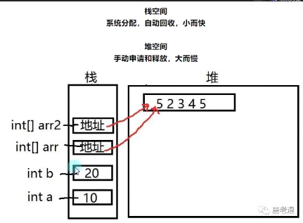
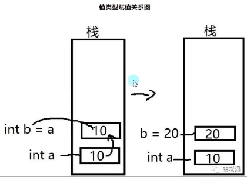
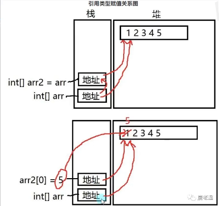
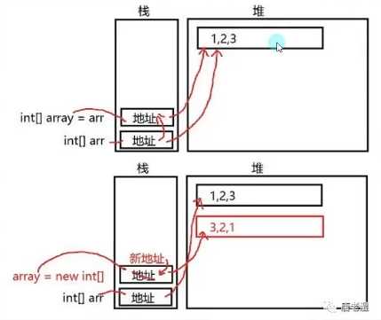
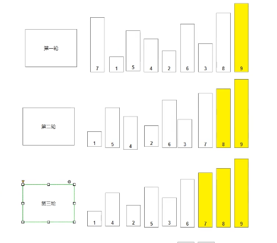
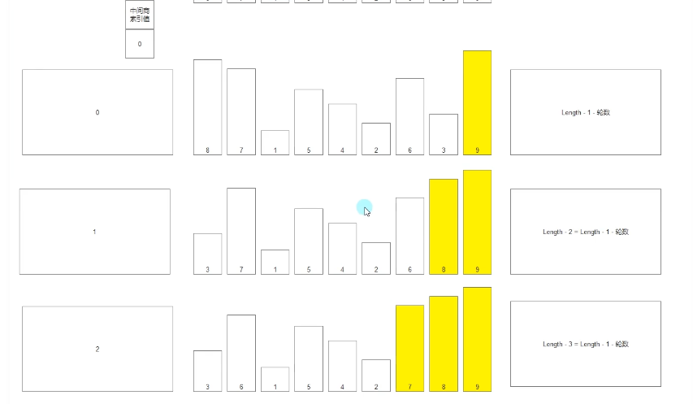

> `#region` 是一个**预处理指令**，用于**代码折叠**和**组织代码结构**，使代码更清晰易读。它通常与 `#endregion` 配对使用，用于定义一个可折叠的代码块。
>
> ~~~c#
> #region 描述性名称
>     // 代码...
> #endregion
> ~~~

# 枚举

## 语法

枚举就相当于自己定于一个变量。

可声明范围：在`NameSpace`、`class`、`struct`语句块。

在函数语句中使用。

- 声明枚举：创建一个自定义的枚举类型。
- 声明枚举变量：使用声明自定义的枚举类型 创建一个枚举变量。

```

    enum E_自定义枚举名
    { 
        自定义枚举项名字1,
        自定义枚举项名字2,
        自定义枚举项名字3,
        自定义枚举项名字4,
    }

```

## 枚举和switch：

他们通常配合使用，像unity的标签，能用于判断状态和类型

```

using System;

namespace Lesson_1
{

    //被命名的整形常量的集合
    //一般用来表示 状态 类型 等
    //声明枚举
    enum E_MonsterType
    { 
        Normal,
        Boss,
    }

    enum E_playerType
    { 
        Main,
        Other,
    }

    class Program
    {
        static void Main(string[] args)
        {
            //声明枚举变量
            //自定义的枚举类型 变量名 = 自定义枚举类型.枚举项
            E_playerType PlayerType = E_playerType.Main;
            switch (PlayerType)
            {
                case E_playerType.Main:
                    Console.WriteLine("主玩家逻辑");
                    break;

                case E_playerType.Other:
                    Console.WriteLine("其他玩家逻辑");
                    break;

                default:
                    Console.WriteLine("无法判断玩家");
                    break;
            }
        }
    }
}

```

## 枚举类型的转换

> Parse后的第一个参数是你要转换的是哪一个枚举类型  第二个参数为用于转换的对应的枚举项的字符串。转换完成后，是一个通用的类型，我们需要用括号强转为我我们想要的目标类型

```

//枚举和int转换 括号强转
int i = (int)PlayerType;
Console.WriteLine(i);
//枚举和string转换
string j = PlayerType.ToString();
//把string转换成枚举
PlayerType = (E_playerType)Enum.Parse(typeof(E_playerType), "Other");

```

# 数组

## 一维数组

### 数组的声明

```

// 数组的声明方式
//只是声明并未占用内存
int[] arr1;

//声明了数组长度 默认值均为0
int[] arr2 = new int[5];

//声明了 数组长度 并且初始化了
int[] arr3 = new int[5] { 1, 2, 3, 4, 5, };

//声明并初始化了 数组长度依据{}中填入的元素个数
int[] arr4 = new int[] { 1, 2, 3, 4, 5, 6, 7 };

//与4相同 简化了
int[] arr5 = { 1, 2, 3, 4, 5 };

```

 

### 基操

```

//获取数组长度
//数组.Length
int[] array = { 1, 2, 3, 4, 5 };
int arrayLength = array.Length;
Console.WriteLine(arrayLength);
//打印结果为5

//修改数组的元素
//数组名[索引号]=值;
array[0] = 90;
Console.WriteLine(array[0]);
//打印结果为90

```

### 遍历数组

通过循环快速获取数组中的每一个元素

```

//遍历数组
//范围是 0~Length-1
int[] array = { 1, 2, 3, 4, 5 };
for (int i = 0; i \< array.Length; i++)
{
    Console.WriteLine(array[i]);
}

```

### 增加和减少数组中的元素

数组初始化之后是不能直接添加新元素的
只能声明一个新数组来重新存储
增加就是大的装小的 减少就是少的装多的

```

//增加数组中的元素
int[] array = { 1, 2, 3, 4, 5 };
int[] array1 = new int[10];
for (int i = 0; i < array.Length; i++)
{
    array1[i] = array[i];
}
array = array1;

//遍历打印array结果为
//1，2，3，4，5，0，0，0，0，0

```

```

//j减少数组中的元素
int[] array = {1,2,3,4,5,6,7,8,9,10};
int[] array2 = new int[5];
for (int i = 0; i < array2.Length; i++)
{
    array2[i] = array[i];
}
array = array2;

//遍历打印array结果为
//1，2，3，4，5

```

### 查找数组的元素

使用循环遍历查找

```

//查找数组中的元素
int[] array = { 1, 2, 3, 4, 5 };
for (int i = 0; i < array.Length; i++)
{
    if (array[i]==3)
    {
        Console.WriteLine("查找到{0} 数组{1}号索引",array[i],i);
    }
}

```

## 二维数组

### 数组的声明

```

int[,] arr;

int[,] arr2 = new int[3, 3];

int[,] arr3 = new int[3, 3] {{1,2,3 },
                             {4,5,6 },
                             {7,8,9 }};

int[,] arr4 = new int[,]    {{1,2,3 },
                             {4,5,6 },
                             {7,8,9 }};

int[,] arr5 = { {1,2,3 },
               {4,5,6 },
               {7,8,9 } };

```

### 基操

```

//获取二维数组长度（行列）
//数组名.GetLength(0); 0是行 1是列
int arr2Row = arr2.GetLength(0);
int arr2Columm = arr2.GetLength(1);
Console.WriteLine("行" + arr2Row + "列"+arr2Columm);

//获取数组中的元素
int arrDeta = arr2 [1,1];
//修改数组中的元素
arr2 [1,1] = 90;

```

### 遍历数组

```

int[,] a = new int[5, 2] {{0,0}, 
                          {1,2}, 
                          {2,4}, 
                          {3,6}, 
                          {4,8} };

int i, j;

/\* 输出数组中每个元素的值 \*/
for (i = 0; i < 5; i++)
{
    for (j = 0; j < 2; j++)
    {
        //a[i,j];
        Console.WriteLine(a[i,j]);
    }

}

打印结果：
a[0,0]: 0
a[0,1]: 0
a[1,0]: 1
a[1,1]: 2
a[2,0]: 2
a[2,1]: 4
a[3,0]: 3
a[3,1]: 6
a[4,0]: 4
a[4,1]: 8

```

### 增加和减少数组中的元素

使用两个for循环嵌套 来代表行列
大的装小的 ：for条件是小的数组长度
小的装大的：for条件是小的数组长度

```

//增加二维数组元素
int[,] arr5 = new int [3,3] { {1,2,3 },
                              {4,5,6 },
                              {7,8,9 } };

int[,] arr5add = new int[4, 3];

for (int i = 0; i < arr5.GetLength(0); i++)
{
    for (int j = 0; j < arr5.GetLength(1); j++)
    {
        arr5add[i, j] = arr5[i, j];
    }
}
arr5 = arr5add;

```

```

//减少二维数组元素
int[,] arr5 = new int [3,3] { {1,2,3 },
                              {4,5,6 },
                              {7,8,9 } };

int[,] arr5sub = new int[2, 3];

for (int i = 0; i < arr5sub.GetLength(0); i++)
{
    for (int j = 0; j < arr5sub.GetLength(1); j++)
    {
        arr5sub[i, j] = arr5[i, j];
    }
}
arr5 = arr5sub;

```

### 查找数组中的元素

遍历数组的基础上 增加一个if语句判断

```

int[,] arr5 = new int [3,3] { {1,2,3 },
                              {4,5,6 },
                              {7,8,9 } };

for (int i = 0; i < arr5.GetLength(0); i++)
{
    for (int j = 0; j < arr5.GetLength(1); j++)
    {
        if (arr5[i, j]==2)
        {
            Console.WriteLine("2为数组中的{0}行{1}列",i,j);
        }

    }
}

```

## 交错数组

行列可以不一样
很少使用 了解即可

```c#
//可以行列不一样
//声明方式
//变量类型[][] 数组名;
int[][] arr;
//变量类型[][] 数组名 = new 变量类型[行数][];
int[][] arr2 = new int[3][];
//可以行列不一样
int[][] arr3 = new int[3][] { new int[] { 1,2,3},
                              new int[] { 4,5},
                              new int[] { 1}    };

//获取交错数组长度
//行数和二维数组获取方式一样
int i = arr3.GetLength(0);
//列只能获取某一行的列数
int j = arr3[0].Length;

//获取和修改交错数组中的元素
int arr3Deta = arr3[1][1];
arr3[1][1] = 99;

//遍历交错数组
//与二维数组一样使用两个for循环
for (int ii = 0; ii < arr3.GetLength(0); ii++)
{
    for (int jj = 0; jj < arr3[ii].Length; jj++)
    {
        Console.Write(arr3[ii][jj]+" ");
    }
    Console.WriteLine(); //用于空行识别列长
}

//增加交错数组元素
int[][] arr3Add = new int[4][] { new int []{ 0,0,0},
                                 new int []{ 0,0,0},
                                 new int []{ 0,0,0},
                                 new int []{ 0,0,0} };
for (int iii = 0; iii < arr3.GetLength(0); iii++)
{
    for (int jjj = 0; jjj < arr3[iii].Length; jjj++)
    {
        arr3Add[iii][jjj] = arr3[iii][jjj];
    }
}
//遍历查看
for (int ii = 0; ii < arr3Add.GetLength(0); ii++)
{
    for (int jj = 0; jj < arr3Add[ii].Length; jj++)
    {
        Console.Write(arr3Add[ii][jj]+" ");
    }
    Console.WriteLine();
}
```

# 值和引用类型

引用类型：数组，字符串，类
值类型：有符号，无符号，浮点，字符，布尔，结构体

## 赋值规律

值类型在相互赋值时 是把内容拷贝给了对方 他变我不变
引用类型在相互赋值时 是把指针指向同一内存地址 他变我也变

> 由于引用类型在相互赋值的时候，将arr的指向堆的地址赋给了arr2，但是修改值的时候是修改arr在堆中的值，所以“他变我也变”。

## 值类型和引用类型存储的区域不同

值类型储存在 栈空间 —— 系统分配，自动回收，小而快
引用类型储存在 堆空间 ——手动申请和释放，大而慢







## new实例化

通过关键字new 可以开一个新内存地址（在堆中新开一个房间）
这时候由于他们使用的不是同一个内存地址，自然赋值就不会牵扯到之前的数据



## 代码演示

```

//值类型
int a = 10;
//引用类型
int[] array = new int {1,2,3,4,5};

//声明了一个b与其相等
int b = a;
//声明了一个array2让其等于之前的array
int[] array2 = array;
//打印结果
//a=10 b=10
//array=1,2,3,4,5 array2=1,2,3,4,5

b= 20;
array2={5,4,3,2,1};
//打印结果
//a=10 b=20
//array= 5,4,3,2,1 array2= 5,4,3,2,1
//由于引用类型 指向的内存地址是同一个所以相同

array2=new int[] {6,7,8,9};
//打印结果
//array= 5,4,3,2,1 array2= 6,7,8,9
//array2用new新开了一个内存地址 所以不会牵扯到之前的array

```

## 特殊的引用类型string

string在c#中进行了处理使其具有值类型的特征
虽然方便，但是频繁的改变 string 重新赋值会产生内存垃圾

```

string str1 = "123";
string str2 = str1;
str2 = "321";
//打印结果
//str1 = "123"
//str2 = "321"
//虽是引用类型，但是具有的是值类型的特征 他变我不变

```

# 函数

## 基本概念

函数（方法）：是封装代码进行重复使用的一种机制，可以提升复用率，既可以是具体的行为，也可以是抽象行为。

函数在 class，struct 中声明
关键字：static(静态的)，void(无返回值)
函数的命名：每一个首单词大写
返回类型 可以是任意变量类型
参数不是必须的 参数类型也可以是任意类型
参数默认值/可选参数：当参数给定默认值时，使用函数时不传入参数就会使用参数默认值来进行计算
可以嵌套使用

return可以提前结束函数逻辑，直接返回到函数外部
与for，while中的break有些相似

```c#
// static 返回类型 函数名 （参数，参数，....）
//{
// 代码逻辑
// return 返回值; (有返回类型才选)
//}

static int Function (int a ,int b)
{
    int c = a\*b;
    return c;
}
```

## 基本语法

```

//⭕1.无参无返回值函数
static void SayHellow()
{
    Console.WriteLien("你好世界");
}

//⭕2.有参无返回值函数
static void SayYourName (string name)
{
    Console.WriteLien("你的名字是{0}",name);
}

//⭕3.无参有返回值函数
static string WhatYouName ()
{
    return "唐老师";
}

//⭕4.有参有返回值函数
static int Multiply (int a ,int b)
{
    int c = a\*b;
    return c;
}

//⭕5.有参数多返回值函数
//传入两个数 然后计算两数的和以及平均数 得出结果返回
//函数返回值默认是不能返回多个变量，可以使用数组来储存
static int[] Calc (int a ,int b)
{
    int sum = a+b;
    int avg = (a+b)/2;
    int[] array = {sum,avg};
    return array;
}

//⭕6.return可以直接不执行之后的代码，直接返回到函数外部
static void Speak (string str)
{
    //如果说脏话就不打印
    if(str == "傻逼")
    {
        return "";
    }
    Console.WriteLien(str);
}

```

## ref和out的作用

他们使用的方式和效果都是一样，在参数前添加
使传入的参数 在函数外也能修改
相当于直接使用这个传入参数，而不是声明一个参数去替代
在函数中new 传入数组的时候 ，真正的new了
ref和out的区别：

1. ref传入的变量(参数) 必须初始化，out不用。
2. out传入的变量必须在内部赋值，ref不用。

```c#
static void ChangeValue (int a)
{
    a=20;
}

int b = 10;
ChangeValue(b);
//打印b还是为10

//参数前添加 ref 修饰符
static void ChangeValue (ref int a)
{
    a=20;
}
int b = 10;
ChangeValue(ref b);
//打印b为20 在函数内修改传入参数 传入的参数在外部也会修改
```

## params 变长参数

可以输入不定的多个参数，并把这些参数存入数组。

> params后面必须是数组。

```c#
//例子求和输入的参数
static int Sum(params int[] arr)
{
    int sum = 0;
    for (int i = 0; i < arr.Length; i++)
    {
        sum += arr[i];
    }
    return sum;
}

int sum = Sum(1,2,3,4,5,6);
//打印sum为21
```

> 在函数参数中只能最多出现一个params关键字 且一定在最后一组参数。

## 函数重载

在同一语句块（class或struct）中函数名相同 参数的数量or类型or顺序不同。
系统根据 参数:数量,类型,顺序 的不同来重载不同的函数。
与返回值类型无关 返回值类型可以是任意类型

作用：命名一组功能类似的函数，减少函数名的数量，避免命名空间的污染，提升程序的可读性

```c#
static int CalcSum(int a ,int b)
{
    return a+b;
}

//参数数量不同
static int CalcSum(int a ,int b,int c)
{
    return a+b+c;
}

//参数类型不同
static float CalcSum(float a ,float b)
{
    return a+b;
}

//参数顺序不同
static float CalcSum(int a , float b)
{
    return a+b;
}
static float CalcSum(float b ，int a )
{
    return b+a;
}

//ref和out
static float CalcSum(ref float b ，int a )
{
    return b+a;
}
//----------------------------------------------------

//虽然函数名相同，但系统根据 参数:数量,类型,顺序 的不同来重载不同的函数。
CalcSum(1,2);
CalcSum(1,2,3);
CalcSum(1.11f,2.22f);
CalcSum(1,2.22f);
CalcSum(2.22f,1);
```

## 递归函数

让函数自己调用自己
必须有结束调用的条件
比较难且实际开发用的不多，面试客户端会有

```

//用递归函数打印 0~10
static void Function(int a)
{
    //第四步：结束条件
    if (a>10)
    {
        return;
    }
    //第二部：完成要求 打印
    Console.WriteLine(a);
    //第三步：完成一个 递归的变化 作为条件判断
    ++a;
    //第一步：构造一个递归
    Function(a);
}
//-----------------------------------------
int a =0;
Function(a);

```

# 结构体

## 基础概念

在namespact(命名空间)中声明结构体
命名规范：首字母大写
变量和函数的集合 用来表示特定的数据集合
封装逻辑和行为
可以实例化很多个 实现复用
## 访问修饰符

public 公开的 可以被外部访问
private 私有的 只能内部使用
没有添加时默认是private 的
## 构造函数

没有返回值，函数名和结构名相同，主要用于快速初始化结构体对象的
结构体中构造函数和函数也是可以重载的

## 代码演示

```c#

using System;

namespace Lesson_4_结构体
{
    struct Student
    {
        //访问修饰符
        //public 公开的 可以被外部访问
        //private 私有的 只能内部使用
        //要让外部调用 就必须加public

        //🔴变量
        //声明结构体的变量 不能直接初始化

        //年龄
        public int age;
        //性别
        public bool sex;
        //学号
        public int number;
        //姓名
        public string name;

        //🔴构造函数
        //没有返回值
        //函数名必须和结构体相同
        //必须有参数
        //如果声明了构造函数 那么必须在其中对所有变量数据初始化
        //构造函数一般是用于在外部方便初始化的
        public Student(int age, bool sex, int number, string name)
        {
            //新的关键字this
            //代表自己
            this.age = age;
            this.sex = sex;
            this.number = number;
            this.name = name;

        }

        //🔴函数方法
        //表现这个数据结构的行为
        //结构体中的函数不需要加static关键字
        public void Speak()
        {
            //函数中可以直接使用结构体内部的变量
            Console.WriteLine("我的名字是{0}，我今年{1}岁", name, age);
        }
    }

    class Program
    {
        static void Main(string[] args)
        {
            //结构体的使用
            Student s1;
            s1.name = "苏先生";
            s1.age = 20;
            s1.number = 123321123;
            s1.sex = true;
            s1.Speak();

            //可以再次实例化 复用
            Student s2;
            s2.name = "苏小姐";
            s2.age = 20;
            s2.number = 123371524;
            s2.sex = false;
            s2.Speak();

            //使用构造函数初始化 可以比上面简便
            Student s3 = new Student(18, true, 2, "小红");
            s3.Speak();
        }
    }
}

```

# 排序

给定一个数组，进行有规律排序(比较大小)
## 冒泡排序



两两相邻
不停比较
不停交换
比较m轮

两层循环
外层轮数
内层比较
两值比较
满足交换

优化：比过的不比，加入bool

```

int[] array = { 9, 5, 7, 6, 3, 8, 2, 1, 4 };

bool isSort = false;
//有几个数就比较几轮
for (int m = 0; m \< array.Length; m++)
{
    isSort = false;
    //进一次循环就换一轮 确定了一轮后最大值已经放到了对应位置 所以-m轮
    for (int n = 0; n < array.Length - 1-m; n++)
    {
        //如果第n个数比第n+1个数要大 那就交换位置
        if (array[n] > array[n + 1])
        {
            isSort = true;
            int temp = array[n];
            array[n] = array[n + 1];
            array[n + 1] = temp;
        }
    }
    //当一轮结束过后 如果isSort这个标识还是false
    //那就意味着 排序没有交换过位置 已经是最终序列了 不需要再判断了
    if (!isSort)
    {
        break;
    }
}

for (int i = 0; i < array.Length; i++)
{
    Console.WriteLine(array[i]);
}

```

## 选择排序

新建中间商
依次比较
找出极值
放入目标位置
比较n轮

两层循环
外层轮数
内层寻找
初始索引
记录极值
内存循环外交换



```

int[] array = { 9, 5, 7, 6, 3, 8, 2, 1, 4 };
for (int m = 0; m < array.Length; m++)
{
    //声明中间商
    int index = 0;
    //比较一轮
    for (int n = 0; n < array.Length-m; n++)
    {
        //找出极值的索引
        if (array[index] < array[n])
        {
            index = n;
        }
    }
    //放入目标位置
    //Length-1-轮数
    if (index != array.Length-1-m)
    {
        int temp = array[index];
        array[index] = array[array.Length - 1 - m];
        array[array.Length - 1 - m] = temp;
    }
}

for (int i = 0; i < array.Length; i++)
{
    Console.WriteLine(array[i]);
}

```
