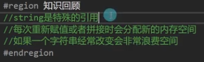
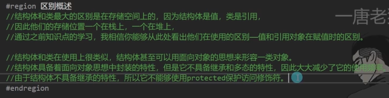

# 面向对象的三大特性

封装 : 用程序语言来形容对象
继承 ：复用封装对象的代码；儿子继承父亲，复用现成代码
多态：同样行为的不同表现，儿子继承父亲基因但是有不同的行为表现
类（class关键词）

# 封装

## 类和对象

### 基本概念

一般在namespace中声明，命名所以 首字母大小具相同特征，相同行为，一类事物的抽象，类是对象的模板，可以通过类创建对象。

关键词：class

类的声明和类对象声明是两个概念
类的声明 类似枚举和结构体的声明 类的声明相当于是声明了一个自定义的变量类型，用来抽象现实实物的
对象是类创建出来的 是用来表象现实中的对象个体
对象的声明相当于声明一个指定类的变量
类创建对象的过程 称之为实例化对象
类 对象 都是引用类型的
null ：空 引用类型为null的时候指的是内存堆没有分配

| 修饰符      | 适用场景                       | 顶级类默认 | 嵌套类默认 |
| ----------- | ------------------------------ | ---------- | ---------- |
| `public`    | 跨程序集访问                   | 需显式声明 | 需显式声明 |
| `internal`  | 当前程序集内访问               | ✅默认      | 需显式声明 |
| `private`   | 仅包含类内访问（仅嵌套类）     | ❌          | ✅默认      |
| `protected` | 包含类及其子类访问（仅嵌套类） | ❌          | 需显式声明 |

```c#
class 类名
{
    //特征——成员变量
    //行为——成员方法
    //保护特征——成员属性

    //构造函数和析构函数
    //索引器
    //运算符重载
    //静态成员
}
```

### 实例化对象的基本语法

用new来完成实例化

```c#
//类名 变量名； (没用分配堆内存)
//类名 变量名 = null； (没用分配堆内存)
//类名 变量名 = new 类名； (在堆中新开了个房间)
```

```c#
namespace Les
{
    class Person
    {

    }

    class Machine
    {

    }
    class Program
    {
        static void Main(string[] args)
        {
            //类名 变量名； (没用分配堆内存)
            Person p 
            //类名 变量名 = null； (没用分配堆内存)
            Person p2 = null;
            //类名 变量名 = new 类名； (在堆中新开了个房间)
            Person p3 = new Person; 
        }
    }
}
```

## 成员变量和访问修饰符

### 成员变量

用于描述对象的特征
可以是任意变量类型（枚举，结构体，类对象）
是否赋值根据需求而定

```c#
class Person
{
    //特征——成员变量
    //行为——成员方法
    //保护特征——成员属性

    //构造函数和析构函数
    //索引器
    //运算符重载
    //静态成员
}
```

如果要声明一个和自己相同类型的成员变量时，不能对他进行实例化（会死循环！！）

```

//不能这么做，会死循环
class Person
{
    Person boy = new Person();
}

```

### 成员变量的使用和初始值

默认的初始值，对值类型来说都是0（bool为false），引用类型来说都是null
default(变量); //可以得到一个变量的默认值

```

class Person
{
    public int a;
    public float b;
    public char c;
    public bool d;
}

//--------------------------------
Person r = new Person();
//点出来使用，和结构体一样
int a =r. a;
Console.WriteLine(default(int));

```

### 访问修饰符

public: 公开的，所有对象都能访问和使用
private: 私有的，只有自己内部才能访问和使用， 变量前不写默认为该状态
protected: 只有自己内部和子类才能访问和使用，继承的时候用到

| 修饰符               | 说明                                 |
| -------------------- | ------------------------------------ |
| `private`            | 只能在 `OuterClass` 内部访问（默认） |
| `protected`          | 只能在 `OuterClass` 及其子类中访问   |
| `internal`           | 只能在当前程序集访问                 |
| `public`             | 可以在任何地方访问                   |
| `internal protected` | 当前程序集 **或** 派生类可访问       |

```

class Person
{
    public  int a;
    private int b;
    protected int c;
}

```

## 成员方法

和结构体中函数的声明使用差不多
用来描述对象的行为,在类中声明
受访问修饰符的影响
不需要加static关键字
成员方法需要实例化才能使用

```c#
class Person
{
    //特征——成员变量
    public bool sex;
    public string nanme;
    public float high;
    public int age;
    public Person[] friend;

    //行为——成员方法
    ///    /// 扩容friend数组
    ///
    /// 
    public void AddFriend(Person p)
    {
        if (friend ==null)
        {
            friend = new Person[] { p };
        }
        else
        {
            //数组扩容+1
            Person[] newFriend = new Person[friend.Length + 1];
            for (int i = 0; i \< friend.Length; i++)
            {
                newFriend[i] = friend[i];
            }

            //将新成员p存在新数组的最后一个索引
            newFriend[newFriend.Length - 1] = p;
        }
    }

}
```

## 构造函数

在实例化对象时会调用的用于初始化的函数，如果不写就默认存在一个无参构造函数
和结构体中构造函数的写法一致，（类允许自己申明一个无参构造函数 结构体是不允许的）
无返回值，函数名和类名必须相同，一般都是public，可以重载构造函数
声明有参构造函数之前最好一起声明一个无参构造函数，声明有参构造时默认的无参构造就不存在了，要手动声明

```c#
class Person
{
    //特征——成员变量
    public bool sex;
    public string nanme;
    public float high;
    public int age;
    public Person[] friend;

    //构造函数 实现对象实例化时 初始化
    //构造函数可以重载
    //无参构造函数
    public Person()
    {
        nanme = "苏同学";
        age = 18;
        sex = true;
        high = 180;
    }

    //有参构造函数
    public Person(string name, int age,bool sex,float high)
    {
        this.name = name;
        this.age = age;
        this.sex = sex;
        this.high = high;

    }

}

//----------------------------------------------
//在main主函数中 使用构造函数初始化对象
Person p = new Person("苏同学",18,true,180f);
Person p1 = new Person("李同学", 18, false, 171f);
```

特殊写法 （构造函数的继承）较少使用
在构造函数后添加 `:this(指定的重载参数)`
可以实现执行该构造函数前执行this指定的构造函数

```c#
//无参构造函数
public Person()
{
    nanme = "苏同学";
    age = 18;
    sex = true;
    high = 180;
}

//有参构造函数，this指定了先执行无参
public Person(string name, int age,bool sex,float high):this()
{
    this.name = name;
    this.age = age;
    this.sex = sex;
    this.high = high;

}
```

## 析构函数

当引用类型的堆内存被回收时，会调用该函数
对于需要手动管理内存的语言（比如c++），需要在析构函数中做一些内存回收处理
c#中有自动垃圾回收机制gc，所以几乎不使用析构函数

```

class Person
{
     ~Person()
    {

    }
}

```

## 垃圾回收机制


手动垃圾回收

```c#
CG.Collect();
```

## 成员属性

### 基础概念

用于保护成员变量
为成员属性的获取和赋值添加逻辑处理
解决3p（private、public、protected）局限性问题
get,set可以写一个（起到保护作用）

```c#
private string name;

public string Name
{
  get
  {
       //可以在返回之前添加逻辑规则
       //意味着这个属性可以获取的内容
       return name;
  }
  set
  {
      //可以在设置前添加逻辑规则
      // value 关键字 用于表示外部传入的值
      name = value;
  }
}
```

### 数值保护和加密处理

```c#
public float High
{
  get
  {
    //可以在返回之前添加逻辑规则
    //意味着这个属性可以获取的内容
    //解密处理
    return High - 5;
  }
  set
  {
    //可以在设置前添加逻辑规则
    if (High < 0)
    {
      high = 0;
      Console.WriteLine("身高不能为负数，已设置为0");
    }
    // value 关键字 用于表示外部传入的值
    //加密处理
    High = value + 5;
  }
}
```

### get和set前可加访问修饰符

private
默认不加 会使用属性声明时的访问权限
加的访问修饰符要低于属性的访问权限
不能让get和set的访问权限都低于属性的权限

```c#
private string name;

public string Name
{
  get
  {
       return name;
  }
  //只能get不能set，保护作用
  private set
  {
      name = value;
  }
}
```

### 自动属性

它一种**自动实现的属性（Auto-Implemented Property）**，它结合了**公共读取（`public get`）**和**私有写入（`private set`）**的访问控制，是C# 3.0（及更高版本）引入的语法糖。

```c#
//自动属性 很少使用
public int Money
{
    get;
    private set;
}
```

编译器会自动生成一个**私有字段**（如`<Money>k__BackingField`）来存储实际值，并生成对应的`get`和`set`方法。等效代码如下：

~~~c#
private int _money; // 编译器自动生成的私有字段
public int Money
{
    get { return _money; }
    private set { _money = value; } // 仅类内部可调用
}
~~~


## 索引器

**索引器（Indexer）**允许类的实例像数组一样通过索引（如`obj[index]`）访问其内部数据，而无需显式暴露底层集合。索引器增强了对象的封装性，并提供类似数组的语法糖。
**特性**

- **语法类似属性**：使用`this`关键字定义，支持`get`和`set`访问器。
- **支持任意参数类型**：索引可以是整数、字符串或其他类型（如日期）。
- **多索引器重载**：一个类可以定义多个索引器，通过参数类型区分。

**用法举例**

- 封装集合或数组 

```c#
class Person
{
    public string;
    public Person friends[];

    public Person this[int index]
    {
        get
        {
            return friends[index];
        }
        set 
        {
            if (friends==null)
            {
                friends = new Person[]{value};
            }
            friends[index] = value
        }
    }
}

//---------------------------------------
Person p = new Person();
p[0] = new Person;

// 集合
public class StringList
{
    private List<string> _items = new List<string>();
 
    public string this[int index]
    {
        get => _items[index];
        set => _items.Insert(index, value);
    }
}
```

- 字典式访问

~~~c#
public class HttpHeaders
{
    private Dictionary<string, string> _headers = new Dictionary<string, string>();
 
    public string this[string key]
    {
        get => _headers.TryGetValue(key, out var value) ? value : null;
        set => _headers[key] = value;
    }
}
 
// 使用
var headers = new HttpHeaders();
headers["Content-Type"] = "application/json";
Console.WriteLine(headers["Content-Type"]);
~~~

- 多维索引器

> **`int[,]`**
> 声明一个**二维数组**（矩形数组），每个元素是 `int` 类型。
>
> - `[,]` 是二维数组的语法符号（一维数组是 `[]`，三维是 `[,,]`，以此类推）。

~~~c#
public class Matrix
{
    private int[,] _matrix = new int[3, 3];
 
    public int this[int row, int col]
    {
        get => _matrix[row, col];
        set => _matrix[row, col] = value;
    }
}
 
// 使用
var matrix = new Matrix();
matrix[1, 1] = 99;
~~~

> 结构体也支持索引器

**索引器 vs 属性**

| **特性**     | **索引器**                     | **属性**                         |
| ------------ | ------------------------------ | -------------------------------- |
| **用途**     | 通过索引访问数据（如`obj[0]`） | 通过名称访问数据（如`obj.Name`） |
| **参数**     | 可接受参数（如`int index`）    | 无参数                           |
| **重载**     | 支持参数类型/数量不同的重载    | 不能重载                         |
| **典型场景** | 集合、字典、多维数据           | 单个值的封装                     |

## 静态成员

static关键字修饰的成员变量，成员方法，成员属性等
特点：不用new一个，可以直接类名点出来
静态成员和程序同生共死
静态函数中不能使用非静态成员（生命周期的差异）


作用：常用变量的申明，常用的唯一的方法声明 如：同规则的数学计算相关函数

```c#
class MyCalss
{
    public static float PI = 3.1415926f;

    public static float AreaOfCircle (float r)
    {
        return Person.PI \* r \* r;
    }
}

//\*\*\*\*\*\*\*\*\*\*\*\*\*\*\*\*\*\*\*\*\*\*\*\*\*\*\*\*\*\*\*\*\*\*\*\*\*\*\*\*\*\*\*\*\*\*
float areaCircle =  MyCalss.AreaOfCircle(7);
```

## 常量和静态变量


补充 设计模式：单例模式（线程安全相关）；

## 静态类

使用static关键字修饰的类
只能包含静态成员
不能被实例化 具有唯一性 适合用作工具类（计算公式 等）

## 静态构造函数

使用static关键字修饰的构造函数
无访问修饰符 无参数 自动调用一次
作用： 主要用于初始化静态成员、
静态类和普通类中的静态构造函数功能一样，调用类时都会优先执行静态构造函数进行初始化
与构造函数（针对实例对象）不同的是，静态构造函数（针对类）只执行一次，并且是在第一个实例对象创建前被调用，所以它可以用于那些只需要执行一次的操作；而且它不允许有public等修饰符，由程序自动调用，不能被外界调用。
总结：静态构造函数用于初始化任何静态数据，或者用于执行仅需执行一次的操作；在创建第一个实例对象或者引用任何静态变量之前，将自动调用静态构造函数
所以一般静态构造函数用来为静态成员初始化，或者作为单件模式中创建对象的唯一入口。


~~~c#
public class MyClass
{
    // 静态字段
    public static int StaticField;
 
    // 静态构造函数
    static MyClass()
    {
        StaticField = 42; // 初始化静态字段
        Console.WriteLine("静态构造函数被调用");
    }
}
~~~


## 拓展方法

### 基本概念

**扩展方法（Extension Methods）** 允许你为现有的类型（包括内置类型、自定义类、接口等）**添加新的方法**，而无需修改原始类型的代码或继承它。扩展方法通过静态类实现，但调用时像实例方法一样使用。

**特点：**

- **静态类 + 静态方法**：扩展方法必须定义在静态类中，且本身是静态方法。
- **`this` 关键字**：第一个参数使用 `this` 修饰目标类型，表示扩展哪个类型。
- **调用方式**：像实例方法一样调用，但实际是静态方法。
- **作用域**：需要引入命名空间才能使用（通过 `using`）。

```c#
// 1. 定义一个静态类
public static class StringExtensions
{
    // 2. 定义一个静态方法，第一个参数用 `this` 修饰目标类型
    public static bool IsNullOrEmpty(this string str)
    {
        return string.IsNullOrEmpty(str);
    }
}

string text = "Hello";
bool isEmpty = text.IsNullOrEmpty(); // 像实例方法一样调用
Console.WriteLine(isEmpty); // False
```

## 运算符重载

**运算符重载（Operator Overloading）** 允许你为自定义类型（类或结构体）定义或重载内置运算符（如 `+`、`-`、`==` 等），使其支持类似内置类型的运算行为。运算符重载通过在类或结构体中定义特殊的 `static` 方法（名为 `operator`）来实现。

**规则**

1. **必须是 `static` 方法**：运算符重载是静态方法。
2. **至少一个参数是自定义类型**：至少一个参数必须是包含该运算符重载的类或结构体类型。
3. **不能创建新运算符**：只能重载已有的运算符（如 `+`、`-`、`==` 等）。
4. **不能改变运算符优先级**：重载后运算符的优先级不变。
5. **部分运算符必须成对重载**：如 `==` 和 `!=`、`<` 和 `>`、`<=` 和 `>=`。

**基本语法**

```c#
public static 返回类型 operator 运算符(参数1, 参数2, ...)
{
    // 实现运算符逻辑
    return 结果;
}
```

**可重载的运算符**

| **可以重载的运算符**                                         | **不能重载的运算符**                                     |
| ------------------------------------------------------------ | -------------------------------------------------------- |
| 一元运算符（`+`, `-`, `!`, `~`, `++`, `--`, `true`, `false`） | `&&`, `||`, `()`, `[]`, `.`                              |
| 二元运算符（`+`, `-`, `*`, `/`, `%`, `&`, `, ^, <<, >>）     | 空条件运算符`?.`, 空合并运输符`??`, 条件运算符`?:`       |
| 比较运算符（`==`, `!=`, `<`, `>`, `<=`, `>=`）               | Lambda 表达式（`=>`）                                    |
| 索引器（`[]`）**（通过索引器模拟）**                         | `new`, `sizeof`, `typeof`, `nameof`, `await`, `yield` 等 |

## 内部类和分布类

不常使用做了解即可
### 内部类

**内部类**（嵌套类）是定义在另一个类内部的类，它可以访问外部类的成员（包括 `private` 成员），但默认情况下是 `private` 的（除非显式指定访问修饰符）。

```c#
class Person
{
    //人
    public int age;
    public string name;
    public Body body;

    public class Body
    {
        //身体
        Arm leftArm;
        public class Arm
        {
            //手臂
        }
    }
}
```

### 分布类

**分部类**允许将一个类的定义拆分到多个文件中，编译器会将它们合并成一个完整的类。常用于：

- **代码分离**：如 UI 设计器自动生成的代码（`Form1.Designer.cs`）和用户编写的代码（`Form1.cs`）。
- **团队协作**：不同开发者可以同时修改同一个类的不同部分。

**特点**

- 必须使用 `partial` 关键字。
- 所有部分必须具有相同的访问修饰符（如 `public`、`internal`）。
- 可以拆分到多个文件中，甚至可以拆分方法和属性。
- 常用于 **WinForms**、**WPF** 或 **ASP.NET Core** 的自动生成代码。

```c#
partial class Student
{
    public bool sex;
    public string name;
}
partial class Student
{
    public int number;
    public float high;
}
```

### 分布方法

**分部方法（Partial Methods）** 是 **分部类（Partial Classes）** 的一个特性，允许在同一个类的不同部分中声明和（可选）实现方法。如果分部方法没有实现，编译器会**静默移除**该方法及其所有调用，不会产生运行时开销。

**特点**

- **声明与实现分离**：可以在一个部分声明方法，在另一个部分实现它。
- **可选实现**：如果没有提供实现，编译器会移除该方法及其调用。
- **仅适用于 `partial` 类**：必须在 `partial class` 或 `partial struct` 中定义。
- **返回类型必须是 `void`**：不能返回其他类型（因为无法保证方法一定会被实现）。
- **默认是 `private`**：不能显式指定访问修饰符（如 `public`、`protected`）。
- **不能有 `out` 参数**：但可以有 `ref` 或普通参数。

~~~c#
partial void MyPartialMethod(int value); // 只有声明，没有实现

// 实现分部方法
partial void MyPartialMethod(int value)
{
    Console.WriteLine($"Value: {value}");
}

// 调用
public void CallPartialMethod()
{
    MyPartialMethod(42); // 如果未实现，这行代码会被编译器移除
}
~~~


# 继承

## 继承的基本规则

### 基本概念

**继承（Inheritance）** 是面向对象编程（OOP）的核心概念之一，允许一个类（**派生类/子类**）继承另一个类（**基类/父类**）的成员（字段、属性、方法等），从而实现代码复用和层次化设计。

**特点**

**(1) 单继承**

- C# **不支持多继承**（一个类不能直接继承多个类）。
- 但可以通过 **接口（Interface）** 实现类似多继承的效果。

**(2) 访问权限**

- 派生类可以访问基类的 **`public`、`protected`、`internal`** 成员。
- 不能访问基类的 **`private`** 成员。

**(3) 构造函数**

- 派生类的构造函数必须调用基类的构造函数（显式或隐式）。
- 使用 `base()` 调用基类构造函数。

### 基本语法

```c#
class 类名 : 被继承的类名 {}
```

```c#
class Teacher
{
  //名字
  public string name;
  //工号
  public int number;
  //介绍名字
  public void SpeakName()
  {
    Console.WriteLine(name);
  }
}

//继承Teacher类
class TeachingTeacher : Teacher
{
  //科目
  public string subject;
  //介绍科目
  public void SpeakSubject()
  {
    Console.WriteLine(subject+"老师");
  }
}
```

## 继承中的构造函数

### 基本概念

先执行父类的构造函数再执行子类构造函数
子类实例化时 默认调用无参 父类没有无参构造就会报错


1.始终保持申明一个无参构造
2.通过base调用指定父类构造 （注意和this的区别）
### base调用指定父类构造

```

class Father 
{
    int a 
    public Father (int a)
    {
        this a = a;
    }
}

class Son : Father
{
    public Son (int a) : base(a)
    {

    }
}

//\*\*\*\*\*\*\*\*\*\*\*\*\*\*\*\*\*\*\*\*\*\*\*\*\*\*\*\*\*\*\*
Son s = new Son(1);

```

## 万物之父&装箱拆箱

### 基本概念

关键词：object
是一个基类 可以装任何东西


### 使用方式

引用类型和里氏替换原则一样用is和as
值类型使用括号强转

```

class Sb
{
    public Speak()
    {
        Console.WriteLine("傻逼");
    }
}
//\*\*\*\*\*\*\*\*\*\*\*\*\*\*\*\*\*\*\*\*\*\*\*\*\*\*
//装引用类型 和使用 ——里氏替换
object o = new Sb();
if(o is Sb)
{
    (o as Sb).Speak;
}
//装值类型 和使用 ——括号强转
object o2 = 10;
int a = (int)o2;
//装特殊类型 string
object o3 = "你好呀";
string str = o3.ToString;//也可以使用引用类型的 o3 as string
//装特殊类型 数组
object o4 = new int[10];
int[] arr = (int[])o4;//也可以使用引用类型的 o4 as int[]

```

### 装箱拆箱

值类型和object之间发生的
装箱：把值类型用引用类型存储 栈内存移到堆内存中
拆箱：把引用类型存储的值类型取出来 堆内存移到栈内存中


```

int a =10;
//装箱
object o = a;
//拆箱
int b = (int)o;

```

### 密封类

关键字：sealed
作用是让类无法被继承 结扎
保证程序的规范性，安全性

```

sealed class Father 
{

}

```


# 多态

## Vob

### 基本概念

关键词：virtual（虚函数） override（重写） base（父类）
在执行同一方法时有不同的表现
重写的方法 输入参数的类型和数量要一致（也复合面向对象）
多层继承中也可以使用 层层重写回到父类

作用：其实多态的作用就是把不同的子类对象都当作父类来看，可以屏蔽不同子类对象之间的差异，写出更通用的程序。


### 基本语法

```c#
class GameObeject
{
  //虚函数 virtual
  public virtual void Atk()
  {
    Console.WriteLine("游戏对象进行攻击");
  }
}

class Player : GameObeject
{
  //重写
  public override void Atk()
  {
    //base可以保留父类的方法
    //base.Atk();
    Console.WriteLine("玩家对象进行攻击");
  }
}

class Monster : GameObeject
{
  //重写
  public override void Atk()
  {
    //base可以保留父类的方法
    //base.Atk();
    Console.WriteLine("怪物对象进行攻击");
  }
}

//\*\*\*\*\*\*\*\*\*\*\*\*\*\*\*\*\*\*\*\*\*\*\*\*\*\*\*\*\*\*\*\*\*\*\*\*\*\*\*\*\*\*\*\*\*\*
GameObeject p = new Player();
p.Atk();

GameObeject m = new Monster();
m.Atk();
```

## 抽象类和抽象方法

### 抽象类

关键字：abstract
不能被实例化 可以包含抽象方法 遵循里氏替换


```c#
abstract class Fruits {}
```

如何选择普通类还是抽象类
不希望实例化的对象 相对抽象的类可以使用 如 ：人person 水果fruit
父类中的行为不太需要被实现 只希望子类去定义具体的规则
整体框架设计时会使用 让基类更安全
### 抽象函数

又叫纯虚方法
关键字：abstract
特点：
1.只能在抽象类中声明
2.没有方法体
3.不能是私有的
4.继承后必须要override重写

```c#
abstract class Fruits
{
    public string name;
    public abstract  void Bad ();
}

class Apple : Fruits
{
    public override void Bad ()
    {
        Console.WriteLine("苹果坏了");
    }
}
//\*\*\*\*\*\*\*\*\*\*\*\*\*\*\*\*\*\*\*\*\*\*\*\*\*\*\*\*\*\*\*\*\*\*\*\*\*\*\*\*
//遵循里氏替换 父类装子类
Fruits f = new Apple();
f.Bad();
```

虚方法（vritual）和纯虚方法（abstract）的区别
虚方法可以在抽象类和非抽象类中声明 纯虚方法只能在抽象类中声明
虚方法可以由子类选择性实现 纯虚方法必须实现重写。虚方法有方法体可实现逻辑
他们都可以被子类用override重写 可以多层重写 子子类重写子类重写父类

## 接口

### 基本概念


### 基本语法

接口的声明
接口时抽象行为的基类


```c#
interface IFly
{
    //方法
    void Fly();

    //属性
    string Name
    {
        get;
        set;
    }

    //索引器
    int this[int index]
    {
        get;
        set;
    }

    //事件 c#进阶讲
    event Action doSomthing;
}
```

接口的使用


```

//声明接口
interface IFly
{
    //方法
    void Fly();

    //属性
    string Name
    {
        get;
        set;
    }

    //索引器
    int this[int index]
    {
        get;
        set;
    }

    //事件 c#进阶讲
    event Action doSomthing;
}

//实现接口
class Animal{}

class Persom : Animal,IFly
{
    //实现的接口函数 可以加virtual再在子类中重写
    public virtual void Fly()
    {

    }

    public string Name
    {
        get;
        set;
    }

    public int this[int index]
    {
        get
        {
            return 0 
        }
        set;
    }

    public event Action doSomthing;
}

//\*\*\*\*\*\*\*\*\*\*\*\*\*\*\*\*\*\*\*\*\*\*\*\*\*\*\*\*\*\*\*\*\*\*\*\*\*\*\*\*\*\*\*\*\*\*\*\*\*\*\*
//接口遵循里氏替换 父类装子类
IFly f = new Persom1();

```

### 接口可以继承接口

相当于行为合并
接口继承接口时 不需要实现
待类继承接口后 类去实现所有内容


### 显式实现接口

**显式实现接口（Explicit Interface Implementation）** 是一种让类或结构体为特定接口提供独立实现的方式。显式接口实现的成员**只能通过接口引用调用**，而不能通过类实例直接调用。这种方式常用于解决接口成员名称冲突或隐藏接口成员。

~~~c#
public interface IMyInterface
{
    void MyMethod();
}
 
public class MyClass : IMyInterface
{
    // 显式实现接口方法
    void IMyInterface.MyMethod()
    {
        Console.WriteLine("Explicitly implemented MyMethod()");
    }
}

IMyInterface obj = new MyClass();
obj.MyMethod(); // 正确：调用显式实现的接口方法

// 会报错
MyClass obj = new MyClass();
obj.MyMethod(); // 错误：MyMethod() 是显式实现，无法直接访问
~~~

| **特性**       | **显式实现**               | **隐式实现**                 |
| -------------- | -------------------------- | ---------------------------- |
| **语法**       | `void IInterface.Method()` | `public void Method()`       |
| **调用方式**   | 只能通过接口引用调用       | 可以通过类实例或接口引用调用 |
| **访问修饰符** | 不能显式指定               | 可以指定                     |
| **用途**       | 解决冲突、隐藏成员         | 默认实现方式                 |

### 接口的作用和总结

作用
抽象行为
把行为抽象出来供子类继承。个别功能独立在基类外，子类需要时继承。
提高程序复用性
总结
继承类：是对象间的继承，包括特征行为等。
接口继承：是行为间的继承，继承接口的行为规范，按照规范去实现内容。
接口也是遵循里氏替换，所以可以用接口容器装对象，
实现装载毫无关系但是却有相同行为的对象。
接口包含：成员方法，属性，索引器，事件，且都不实现 都没有访问修饰符
接口继承接口相当于行为合并

## 密封方法

不太重要
关键字：sealed 修饰重写函数
让虚方法或者抽象方法不能再被重写 结扎
和override一同出现

# 命名空间

## 基本概念

是用来组织和复用代码的
像一个工具包 类就是工具都声明在命名空间中 （文件夹装文件）
命名空间可以分开写
同命名空间中类的名字不可以重复，不同命名空间的类可以同名

> 若当前文件内容都写在同一个命名空间，在文件第一行写上`namespace 名称;`即可，无需括号。

```c#
namespace Mygame
{
    class Gameobject
    {

    }
}

//命名空间可以分开写
namespace Mygame
{
    //属于同一命名空间 可以正常继承
    class Player:Gameobject
    {

    }
}
```

## 不同命名空间中相互使用 需引用命名空间

两种方法 1.using关键字 2.点出来引用

```c#
using System
using Mygame
//使用Mygame命名空间的Gameobject类
Gameobject g = new Gameobject();
```

```c#
//使用Mygame命名空间的Gameobject类
Mygame.Gameobject g = new Mygame.Gameobject();

//也可以应对不同命名空间中 同名类的引用标识
using Mygame
using Mygame2
Mygame.Gameobject g = new Mygame.Gameobject();
Mygame2.Gameobject g2 = new Mygame2.Gameobject();
```

## 命名空间可以包裹命名空间

工具包的小工具包

```c#
namespace MyGame
{
    namespace UI
    {
        class Image
        {

        }
    }

    namespace Game
    {
        class Image
        {

        }
    }
}
//\*\*\*\*\*\*\*\*\*\*\*\*\*\*\*\*\*\*\*\*\*\*\*\*\*\*\*\*\*\*\*\*\*\*\*\*\*\*\*\*
//通过命名空间依次点出其中的类来使用
MyGame.UI.Image img = new MyGame.UI.Image();
MyGame.Game.Image img2 = new MyGame.Game.Image();
//或者引用命名空间时点出
using MyGame.UI;
using MyGame.Game;
```

# 万物之父中的方法


## 静态方法：Equals


值类型判断 对比两个对象是否相等
引用类型判断 对比的是两个对象 是否指向同一内存地址，并不是判断是否是相同类型

## 静态方法：ReferenceEquals

比较两个对象是否相同的引用，主要是用来比较引用类型的对象。不能用来比值 很少用

## 成员方法：GetType

反射相关知识，c#进阶讲


## 成员方法：MemberwiseClone


浅拷贝：值类型直接复制过来，引用类型复制的是内存地址。所以改变拷贝后的值类型变量与拷贝前的值类型变量无关，改变拷贝后的引用类型变量 拷贝前的引用类型变量也会跟着改变

## 虚方法：Equals

可以重写该方法定义自己的比较相等


## 虚方法：GetHashCode

极少用


## 虚方法：Tostring


```

class Test
{
    public override string ToString()
    {
        return "苏老师声明的Test类"
    }
}
//\*\*\*\*\*\*\*\*\*\*\*\*\*\*\*\*\*\*\*\*\*\*\*\*\*\*\*\*\*\*\*\*\*\*\*\*\*
Test t = new Test();
Console.WriteLine(t.ToString);
//打印结果为"苏老师声明的Test类"

```

[hr卡片内容]

# string 的常用方法

```

//字符串本质是char数组
string str = "苏同学";
Console.WriteLine(str[0]);
//打印结果为"苏"

//⭕转为char数组
char[] chars = str.ToCharArray();

//⭕获取字符长度
str.Length

//⭕字符串拼接
str = string.Format("{0}{1}",1,222);

//⭕正向查找字符位置
str = "我是苏同学？";
int index = str.IndexOf("苏");
//返回 2 字符串的索引 , 找不到就会返回-1

//⭕反向查找字符位置
str = "我是苏同学苏同学？";
index = str.LastIndexOf("苏同学");
//返回 5 从后面开始查找词组就返回第一个字的索引，找不到就返回-1

//⭕移除指定位置后的字符
str = "我是苏同学苏同学";
str = str.Remove(4);
//返回 "我是苏同"

//⭕执行两个参数进行移除 参数1开始的位置 参数2字符个数
str = "我是苏同学陈同学";
str = str.Remove(3,3);
//返回"我是陈同学"

//⭕替换指定字符串
str = "我是苏同学陈同学";
str = str.Replace("苏同学","李同学");
//返回"我是李同学陈同学"

//⭕大小写转换
str = "abcdefg";
str = str.ToUpper();
//返回"ABCDEFG"
str = str.ToLower();
//返回"abcdefg"

//⭕字符串截取 截取从指定位置开始之后的字符串
str = "苏同学陈同学";
str = str.Substring(3);
//返回 "陈同学"
//重载 参数1开始位置 参数2指定个数
str = "苏同学陈同学苏同学";
str = str.Substring(3,3);
//返回 "陈同学"

//⭕⭕⭕字符串切割 指定切割符号来切割字符串
str = "1|2|3|4|5|6|7|8";
string[] strs = str.Split("|");
//返回 string[]{1,2,3,4,5,6,7,8}

```

[hr卡片内容]

# StringBuilder

解决多次修改string性能消耗问题




引用命名空间：System.Text
关键字：StringBuilder
容量问题 每次增加时都会自动扩容
无法直接重新赋值 要先清空再增加
完全具有引用类型的特征，没有值类型特征了

```

StringBuilder strBui = new StringBuilder("123123123");
//获得容量
int a = strBui.Capacity;
//默认为16现在已经用了9 自动扩容会x2 变成32 64 128....

```

增删查改替换

```

StringBuilder strBui = new StringBuilder("123123123");

//⭕增
strBui.Append("444");
//结果为 "123123123444"
strBui.AppendFormat("{0}{1}",555,666);
//结果为 "123123123444555666"

//⭕插入 参数1插入的位置 参数2插入的内容
strBui.Insert(0,"苏同学");
//结果为 "苏同学123123123444555666"

//⭕删 参数1删除开始的位置 参数2删除的个数
strBui.Remove(0,3);
//结果为 "123123123444555666"

//⭕清空
strBui.Clear();
//结果为 ""

//⭕重新赋值 先清空再增加
strBui.Clear();
strBui.Append("苏同学");

//⭕查 和数组一样
strBui[1];
//结果为 "同"

//⭕改 和数组一样
strBui[0]='李';
//strBui结果为 "李同学"

//⭕替换 参数1被替换的字符 参数2要替换的内容
strBui.Replace("同学","老师");
//strBui结果为 "李老师"

//⭕判断是否相等
strBui.Equals("李老师");
//返回为 true

```


# 结构体和类的区别

结构体：值，存储在栈内

类：引用，存储在堆




结构体可以继承接口 因为接口是行为的抽象


# 抽象类和接口的区别


# 面向对象七大原则

开闭原则，依赖倒转原则，里氏替换原则，单一职责原则，接口隔离原则，合成复用原则，迪米特法则。
