# 简单的数据结构类

数据结构学的是增删查改
## ArrayList

追加命名空间：System.Collections
本质是object[ ]类（所以也可以存类）
型的数组，可以存储任何类型数据

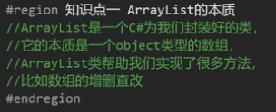

### 增删查改

```c#
ArrayList array = new ArrayList();
//⭕增
//1.单个增加 Add
array.Add(1);
array.Add("数据");
array.Add(3.1415926f);
int[] a = new int[]{1,2,3,4,5,6,7};
//2.范围增加 AddRange 相当于拼接数组
array.AddRange(a);
//现在array中储存的元素为{1,"数据",3.1415926f,1,2,3,4,5,6,7}

//⭕插入 参数1插入的位置 参数2插入的数据
array.Insert(1,"1234567");
//现在array中储存的元素为{1,"1234567","数据",3.1415926f,1,2,3,4,5,6,7}

//⭕删
//1.移除指定元素 从头开始遍历
array.Remove(1);
//2.移除指定位置的元素
array.RemoveAt(2);
//3.清空
array.Clear();

//⭕查
//1.得到指定位置的元素 [] 与数组访问同理
for (int i = 0; i < array.Count; i++)
{
    Console.WriteLine(array[i]);
}
//2.查看元素是否存在
array.Add("123");
array.Add(1);
array.Add(true);
array.Add(1);
if (array.Contains("123"))
{
    Console.WriteLine("元素 \"123 \"在");
}
//打印结果为"元素 \"123 \"在"
//3.正向查找元素位置 找到返回值是位置 找不到返回-1
Console.WriteLine(array.IndexOf(1));
//打印结果为1
//4.反向查找元素位置
Console.WriteLine(array.LastIndexOf(1));
//打印结果为3

//⭕改
array[0]="999";

//⭕遍历
//长度 Count
//容量 Capacity
for (int i = 0; i < array.Count; i++)
{
    Console.WriteLine(array[i]);
}
//打印结果为 "999" 1 true 1
//⭕迭代器遍历
foreach (object item in array)
{
    Console.WriteLine(item);
}
//打印结果为 "999" 1 true 1
```

### 装箱拆箱

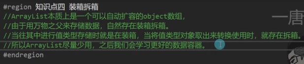

```

int i = 1;
array[0] = i;  //装箱 把存在栈上的变量存到堆上
i = (int)array[0] //拆箱 把存在堆上的变量存回栈上

```

## Stack（栈）

追加命名空间：System.Collections
本质是object[ ]数组

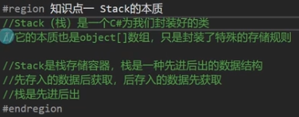

存储规则： 先进后出

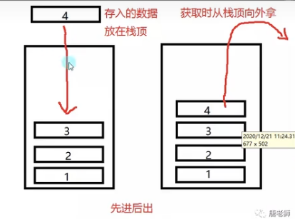

### 增取查改

```c#
//声明
Stack sta = new Stack(); 

//⭕增 压栈 一个一个放
sta.Push(1);
sta.Push(true);
sta.Push("你好");

//⭕取 弹栈 一个一个取
object o = sta.Pop();
//返回 "你好"
o = sta.Pop();
//返回  true

//⭕查 栈无法查看指定位置的元素 
//1.只能查看栈顶的内容 且不弹出
o = sta.Peek();
//返回 1
//2.查看元素是否存在栈中
if (sta.Contains(1))
{
    Console.WriteLine("元素 \"1\" 存在栈中 ");
}
//打印结果为： 元素 "1" 存在栈中

//⭕改 栈无法改变其中的元素 只能压弹 要修改只能清空再压栈
sta.Clear();

sta.Push(1);
sta.Push("你你你");
sta.Push(3.1415926f);

//⭕遍历 栈没有办法使用for循环遍历 使用foreach
//长度 Count
Console.WriteLine(sta.Count);
//打印结果为 3
//循环出来的顺序也是从栈顶到栈底
foreach (object item in sta)
{
    Console.WriteLine(item);
}
//打印结果为 3.1415926f "你你你" 1
Console.WriteLine(sta.Count);
//长度还是为 3

//⭕转数组后遍历 
//栈转换为object数组
object[] arr = sta.ToArray();
for (int i = 0; i < arr.Length; i++)
{
    Console.WriteLine(arr[i]);
}
//打印结果为 3.1415926f "你你你" 1

//⭕⭕循环弹栈
Console.WriteLine(sta.Count);
//打印结果为 3
while ( sta.Count>0 )
{
    o = sta.Pop();
    Console.WriteLine(o);
}
//打印结果为 3.1415926f "你你你" 1
Console.WriteLine(sta.Count);
//打印结果为 0
```

```c#
//写一个方法计算一个数的二进制 用栈存储
Stack ToTwo(int a)
{
    Stack gen = new Stack();

    while (a > 0)
    {
        gen.Push(a % 2);
        a = a / 2; //老商被2整除 且隐转int取整
    }

    return gen;
}


Stack fen = ToTwo(20);
while (fen.Count > 0)
{
    Console.Write(fen.Pop());
}
//打印结果为 10100
```

### 装箱拆箱

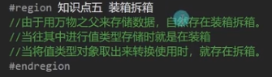

```c#
int a = 10;
sta.Push(a); //装箱
a = sta.Pop(); //拆箱
```

## Queue（队列）

追加命名空间：System.Collections
本质是object[ ] 数组
与Stack（栈）的概念非常相似，一个是先进后出 一个是先进先出

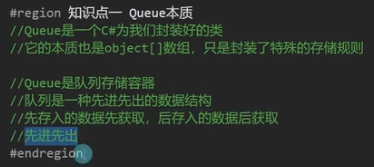

先进先出

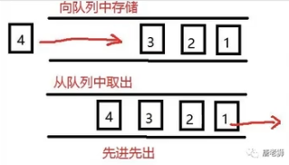

### 增取查改

```c#
//⭕增
que.Enqueue(1);
que.Enqueue("这是字符串");
que.Enqueue(3.14159f);
que.Enqueue(true);
que.Enqueue(new MyClass());

//⭕取 取出先加入的对象
object o2 = que.Dequeue();
//返回 1

//⭕查
//1.查看队列头部元素 但不移除
o2 = que.Peek();
//返回 "这是字符串"
//2.查看元素是否存在队列中
if(que.Contains(3.14159f))
{
    Console.WriteLine("3.14159f 在队列中");
}
//打印结果为 3.14159f 在队列中

//⭕改 队列无法修改元素 只能清除重新Enqueue
que.Clear();
que.Enqueue(1);
que.Enqueue(2);
que.Enqueue(3);

//⭕遍历
//长度 Count
o2 = que.Count;
//返回 3
foreach (object item in que)
{
    Console.WriteLine(item);
}
//打印结果为 1 2 3
//⭕将队列转为object数组后遍历
object[] arr = que.ToArray();
for (int i = 0; i < arr.Length; i++)
{
    Console.WriteLine(arr[i]);
}
//打印结果为 1 2 3

//⭕⭕循环出列
Console.WriteLine(que.Count);
//打印结果为 3
while ( que.Count>0 )
{
    o2 = que.Dequeue();
    Console.WriteLine(o2);
}
//打印结果为 1 2 3
Console.WriteLine(que.Count);
//打印结果为 0
```

### 装箱拆箱

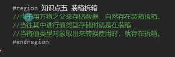

```

int a = 10;
que.Enqueue(a); //装箱
a = que.Dequeue(); //拆箱

```

## Hashtalbe

追加命名空间：System.Collections
通过键去找值

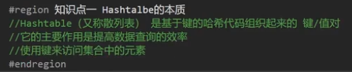

键值对 一个key（键）对应一个value（值）
key1------>value1
key2------>value2
key3------>value3

### 增删查改

```c#
Hashtable hash = new Hashtable();
//⭕增 参数1为键 参数2为值 都是object类所以什么类型数据都能存
//不能存相同的键
hash.Add(1, "数据1");
hash.Add("二", "数据2");
hash.Add(2.34f, "数据3");
hash.Add(true, 123312);

//⭕删 通过键去删除
hash.Remove(1);
//或者全部清空
//hash.Clear();

//⭕查 
//1.通过键查看值 找不到则返回空
Console.WriteLine( hash["二"]);
//打印结果为 "数据二"
//2.查看键是否存在  Contains/ContainsKey
if(hash.Contains(2.34f))
{
    Console.WriteLine("存在键为2.34f");
}
//打印结果为 存在键为2.34f
//3.查看值是否存在  ContainsValue
if(hash.ContainsValue(123312))
{
    Console.WriteLine("存在值为123312");
}
//打印结果为 存在值为123312

//⭕改
//只能改 键对应的值的内容 无法修改键
hash[true] = "正确";
Console.WriteLine(hash[true]);
//打印结果为 正确

//得到键值对对数
//hash.Count; 

//⭕遍历
//1.遍历所有键
foreach(object item in hash.Keys)
{
    Console.Write("键:"+item);
    Console.WriteLine("值:"+hash[item]);
}
//打印结果为： 键:2.34  值:数据3
//			  键:二    值:数据2
//			  键:True  值:正确

//2.遍历所有值
foreach(object item in hash.Values)
{
    Console.WriteLine("值:"+item);
}
//打印结果为： 数据3 数据2 正确

//3.键值对一起遍历
foreach(DictionaryEntry item in hash)
{
    Console.WriteLine("键:"+item.Key+"值:"+item.Value);
}
//打印结果为： 键:2.34  值:数据3
//			  键:二    值:数据2
//			  键:True  值:正确

//4.迭代器遍历法
IDictionaryEnumerator myEnumerator = hash.GetEnumerator();
bool flag = myEnumerator.MoveNext();
while (flag)
{
    Console.WriteLine("键:" + myEnumerator.Key + "值:" + myEnumerator.Value);
    flag = myEnumerator.MoveNext();
}
//打印结果为： 键:2.34  值:数据3
//			  键:二    值:数据2
//			  键:True  值:正确
```

### 装箱拆箱

```

int a = 10;
hash["二"] = a; //装箱
a = hash["二"]; //拆箱

```


# 泛型

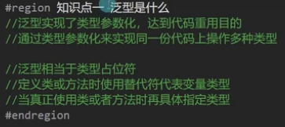

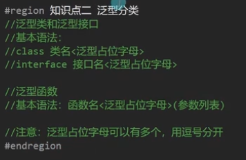

## 泛型接口&泛型类

```c#
class MyClass<T>
{
    public T value;
}
//泛型占位字母有多个
class MyClass2<T1,T2,K,M>
{
    public T1 value1;
    public T2 value2;
    public K value3;
    public M value4;
}

//****************主函数***********************
MyClass<int> t = new MyClass<int>();
t.value = 10;
MyClass<string> t2 = new MyClass<string>();
t2.value = "参数";

MyClass2 <int, string, float, MyClass<int>> 
t3 = new MyClass2<int, string, float, MyClass<int>>();
```

```c#
interface MyInterface<T>
{
    T Value
    {
        get;
        set;
    }
}

class Myclass3:MyInterface<int>
{
    public int Value
    {
        get;
        set;
    }
}
```

## 泛型方法

```c#
//普通类中泛型方法
class MyClass4
{
    public void MyFun <T> (T value)
    {
        Console.WriteLine(value);
    }
}
//****************主函数***********************
MyClass4 t4 = new MyClass4();
t4.MyFun<string>("你好");
```

```c#
class MyClass4<T>
{
    public T value;
    public void MyFun <Y> (Y value)
    {
        Console.WriteLine(value);
    }
}
//****************主函数***********************
MyClass4<int> t5 = new MyClass4<int>();
t5.MyFun<string>("你好世界");
```

## 泛型的作用

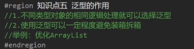

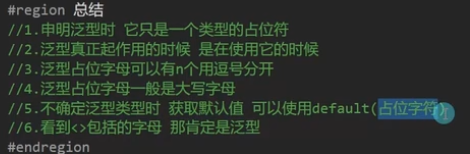


```c#
class ArrayList<T>
{
    private T[] array;
        
    public void Add(T t)
    {

    }

    public void Remove(T t)
    {

    }
}
```

## 泛型约束

语法：where 泛型字母 : (约束的类型)
约束的类型：struct，class，new()，类名，接口名，另一个泛型字母
泛型约束可以组合使用
多个泛型约束 用where连接

**泛型约束类型**

- `where T : class`：引用类型。
- `where T : struct`：值类型。
- `where T : new()`：有无参构造函数。
- `where T : BaseClass`：继承自特定基类。
- `where T : Interface`：实现特定接口。
- `where T : E`：继承自特定泛型

```c#
//1.值类型约束
class Test1<T> where T:struct
{
    public T value;
    public void Fun<K>(K k)where K:struct
    {

    }
}
//2.引用类型约束
class Test2<T> where T:class
{
    public T value;
    public void Fun<K>(K k)where K:class
    {

    }
}
//3.存在无参公共构造函数
class Test3<T> where T:new()
{
    public T value;
    public void Fun<K>(K k)where K:new()
    {

    }
}
//4.某个类本身或其派生类（子类）
class Father {}
class Son:Father {}
class Test4<T> where T:Father
{
    public T value;
    public void Fun<K>(K k)where K:Father
    {

    }
}
//5.某个接口的派生类型
interface IFly {}
class Player:IFly {}
class Test5<T> where T:IFly
{
    public T value;
    public void Fun<K>(K k)where K:IFly
    {

    }
}
//6.另一个泛型类型本身或者派生类型  类型一致或者是其派生类
class Test6<T,U> where T : U
{
    public T value;
    public void Fun<K,J>(K k,J j) where K : J
    {

    }
}
//7.泛型的组合使用
class Test7<T> where T:class,new()
{
    public T value;
}
//8.多个泛型有约束
class Test8<T,K> where T: class where K:struct
{
    public T value;
    public K value2;
}
//****************主函数***********************
//1.<>内只能填值类型了
Test1<int> test1 = new Test1<int>();
test1.Fun<float>(2.6f);
//2.<>内只能填引用类型了
Test2<Random> test2 = new Test2<Random>();
test2.Fun<Random>(new Random());
//3.<>内只能填 具有无参且公共的构造函数的类型 且非抽象类
Test3<Random> test3 = new Test3<Random>();
test3.Fun<Random>(new Random());
//4.<>内只能填指定的类或其子类
Test4<Father> test4 = new Test4<Father>();
test4.Fun<Son>(new Son());
//5.<>内只能填继承指定接口的派生类
Test5<Player> test5 = new Test5<Player>();
test5.Fun<Player>(new Player());
//6.<>1内只能填<>2相同的类型或者其派生类
Test6<Son, Father> test6 = new Test6<Son, Father>();
//7.<>内只能填引用类型 且是存在无参公共的构造函数
Test7<Son> test7 = new Test7<Son>();
//8.<>1内只能引用类型<>2只能值类型
Test8<Son, int> test8 = new Test8<Son, int>();
```

泛型实现单例：

[bookmarkInline卡片内容]

# 常用泛型数据结构类

## List

追加命名空间：using System.Collections.Generic;

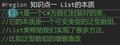

### 增删查改

```c#
//声明
List<int> list = new List<int>();
List<string> list2 = new List<string>();
List<string> list3 = new List<string>();

//⭕增 和ArrayList一样 
list.Add(1);
list.Add(2);
list.Add(3);
list2.Add("你好");
list3.Add("世界");
//范围增加
list2.AddRange(list3);
//list2为 你好世界

//⭕插 参数1插入的位置 参数2插入的数据
list.Insert(0,99);

//⭕删
//1.移除指定元素
list.Remove(1);
//2.移除指定位置元素
list.RemoveAt(0);
//3.清空
list.Clear();

list.Add(1);
list.Add(2);
list.Add(3);
list.Add(2);

//⭕查
//1.得到元素指定位置
Console.WriteLine(list[0]);
//2.查看元素是否存在
if (list.Contains(2))
{
    Console.WriteLine("list中元素2存在");
}
//3.正向查找
int index = list.IndexOf(2);
//返回 1
//4.反向查找
index = list.LastIndexOf(2);
//返回 3

//⭕改
list[0]=99;

//⭕遍历
//长度Count
//容量Capacity
for (int i = 0; i < list.Count; i++)
{
    Console.WriteLine(list[i]);
}

foreach (int item in list)
{
    Console.WriteLine(item);
}
```

## Dictionary

追加命名空间：using System.Collections.Generic;
与Hashtable比起来 键值对类型变为可以自己定义的泛型

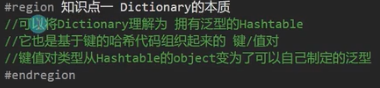

### 增删查改

```c#
//声明
Dictionary<int, string> dictionary = new Dictionary<int, string>();

//⭕增
dictionary.Add(1,"你好");
dictionary.Add(2,"世界");
dictionary.Add(3,"Hello");

//⭕删
//1.通过键去删除 键值对会一起被删除
dictionary.Remove(1);
//2.清空
//dictionary.Clear();

//⭕查 找不到会报错
//1.通过键查看值
Console.WriteLine(dictionary[2]);
//2.查看是否存在
if (dictionary.ContainsKey(2))
{
    Console.WriteLine("存在键为2的键值对");
}
if (dictionary.ContainsValue("世界"))
{
    Console.WriteLine("存在值为 \"世界\" 的键值对");
}

//⭕改
dictionary[3]="同学";

//⭕遍历
//1.遍历所有键
foreach (int item in dictionary.Keys)
{
    Console.WriteLine(item);
    Console.WriteLine(dictionary[item]);
}
//2.遍历所有值
foreach (string item in dictionary.Values)
{
    Console.WriteLine(item);
}
//3.键值对一起遍历
foreach (KeyValuePair<int,string> item in dictionary)
{
    Console.WriteLine(item.Key+item.Value);
}
```

```c#
try
{
    while (true)
    {
        Console.WriteLine("请输入不超过三位的数字");
        Dictionary<char, string> DaXie = new Dictionary<char, string>();
        DaXie.Add('1', "壹");
        DaXie.Add('2', "贰");
        DaXie.Add('3', "叁");
        DaXie.Add('4', "肆");
        DaXie.Add('5', "伍");
        DaXie.Add('6', "陆");
        DaXie.Add('7', "柒");
        DaXie.Add('8', "捌");
        DaXie.Add('9', "玖");
        DaXie.Add('0', "拾");

        string input = Console.ReadLine();
        char[] arrayInput = input.ToCharArray();
        if (arrayInput.Length <= 3)
        {
            for (int i = 0; i < arrayInput.Length; i++)
            {
                Console.Write(DaXie[arrayInput[i]]);
            }
            Console.WriteLine();
        }
        else
        {
            Console.WriteLine("请输入不超过三位的数字!!!!");
            Console.ReadKey();
            Console.Clear();
        }
    }
}
catch
{
    Console.WriteLine("请输入合法数字");
}
```

## 顺序存储&链式存储

### 数据结构是什么

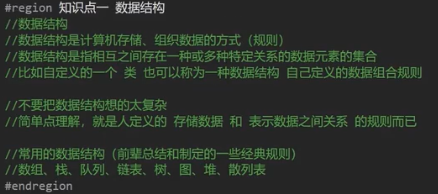

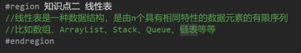

### 顺序存储和链式存储的优缺点

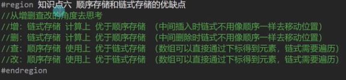

### 顺序存储

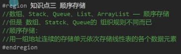

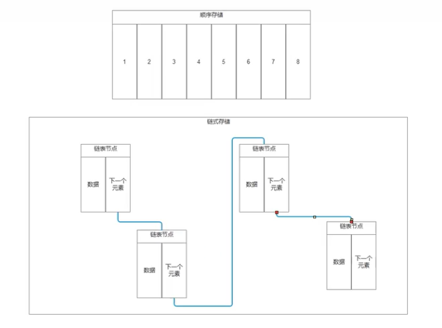

### 链式存储

每次添加的时候不会存在垃圾产生（对比顺序存储）

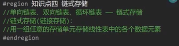


#### 单向链表

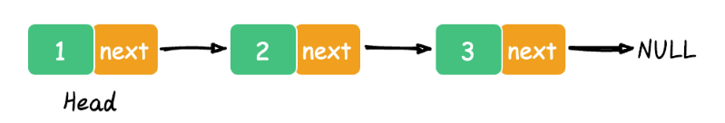

```c#
class LinkedNode<T>
{
    public T value;
    //这个存储下一个元素是谁 
    public LinkedNode<T> nextNode;

    public LinkedNode(T value)
    {
        this.value = value;
    }
}
//***********主函数*************
LinkedNode<int> node = new LinkedNode<int>(111);
LinkedNode<int> node2 = new LinkedNode<int>(222);
node.nextNode = node2;
node2.nextNode = new LinkedNode<int>(333);
node2.nextNode.nextNode = new LinkedNode<int>(444);
Console.WriteLine("Hello World!");
```

实现单向链表

```c#
//单项列表节点
class LinkedNode<T>
{
    public T value;
    //这个存储下一个元素是谁 
    public LinkedNode<T> nextNode;

    public LinkedNode(T value)
    {
        this.value = value;
    }
}
//单向链表类
class LinkedList <T>
{
    public LinkedNode<T> head;
    public LinkedNode<T> last;

    public void Add(T value)
    {
        //新节点开房
        LinkedNode<T> node = new LinkedNode<T>(value);
        //如果头节点是空则头和尾都是该节点
        if (head == null)
        {
            head = node;
            last = node;
        }
        //如果头节点不为空则将该节点加到尾节点后
        //并使该节点为尾节点
        else
        {
            last.nextNode = node;
            last = node;
        }
    }

    public void Remove(T value)
    {
        //如果头节点是空则返回
        if (head == null)
        {
            return;
        }
        //如果头节点的元素与要移除的元素一致
        //使头节等于头节点的下一个节点
        if (head.value.Equals(value))
        {
            head = head.nextNode;
            //如果头节点被移除后为空
            //证明只有一个节点 那尾节点也要为空
            if (head == null)
            {
                last = null; 
            }
            return;
        }


        //如果中节点的元素与要移除的元素一致
        LinkedNode<T> node = head; //声明一个临时变量用于计算
        while (node.nextNode!=null)
        {
            if(node.nextNode.value.Equals(value))
            {
                //让当前找到的这个元素的上一个节点
                //指向自己的下一个节点
                node.nextNode = node.nextNode.nextNode;
                break;
            }
            node = node.nextNode;
        }
    }
}
//***********主函数*************
LinkedList<int> linkedList = new LinkedList<int>();
linkedList.Add(111);
linkedList.Add(222);
linkedList.Add(333);
linkedList.Add(444);
linkedList.Remove(444);
//遍历查看
LinkedNode<int> node = linkedList.head;
while (node != null)
{
    Console.WriteLine(node.value);
    node = node.nextNode;
}
//打印结果为 111 222 333
```

#### 双向链表

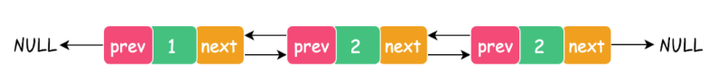

#### 循环链表

单向循环


双向循环

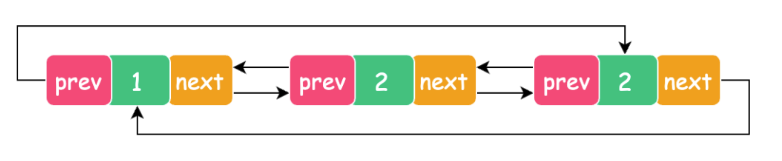

## Linkedlist

追加命名空间：using System.Collections.Generic;

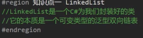

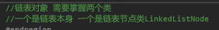

### 增删查改

Previous Next Value
增：AddLast AddFirst AddAfter AddBefore
删：RemoveFirst RemoveLast Remove Clear
查：First Last Find
改：Value

```c#
//⭕增
//1.在链表尾部添加元素
linkedList.AddLast(111);
linkedList.AddLast(222);
//2.在链表头部添加元素
linkedList.AddFirst(999);
//3.在某一个节点之后添加一个节点
//在值为111的节点后加一个值为112的节点
linkedList.AddAfter(linkedList.Find(111), 112);
//4.在某一个节点之前添加一个节点
linkedList.AddBefore(linkedList.Last, 221);

//⭕遍历
//1.从头到尾
LinkedListNode<int> nowNode = linkedList.First;
while (nowNode!=null)
{
    Console.WriteLine(nowNode.Value);
    nowNode = nowNode.Next;
}
//打印结果为： 999 111 112 221 222

//2.从尾到头
nowNode = linkedList.Last;
while (nowNode != null)
{
    Console.WriteLine(nowNode.Value);
    nowNode = nowNode.Previous;
}
//打印结果为：222 221 112 111 999

//3.foreach遍历
foreach (int item in linkedList)
{
    Console.WriteLine(item);
}
//打印结果为： 999 111 112 221 222

//⭕删
//1.移除头节点
linkedList.RemoveFirst();
//2.移除尾节点
linkedList.RemoveLast();
//3.移除指定节点
linkedList.Remove(222);
//4.清空
linkedList.Clear();

linkedList.AddLast(111);
linkedList.AddLast(222);
linkedList.AddLast(333);
linkedList.AddLast(444);


//⭕查
//1.头节点
LinkedListNode<int> frist = linkedList.First;
//2.尾节点
LinkedListNode<int> last = linkedList.Last;
//3.找到指定值的节点
LinkedListNode<int> node = linkedList.Find(222);
//4.判断是否存在
if (linkedList.Contains(111))
{
    Console.WriteLine("链表中存在111");
}

//⭕改
//先得再改
linkedList.First.Value = 100;
(linkedList.Find(222)).Value = 200;
//linkedList中元素为： 100 200 333 444
```

## 泛型 Stack(栈) & Queue(队列)

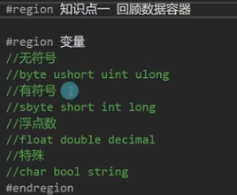

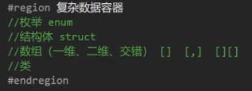

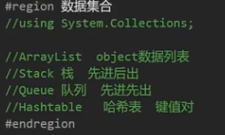

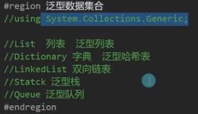

追加命名空间：using System.Collections.Generic;
声明后 使用方式与 栈和队列一模一样

```c#
Stack <int> stake = new Stack<int>();
Queue <object> queue = new Queue<object>();
```


# 委托&事件

## 委托

委托变量是函数的容器 装载传递函数的容器
存储行为 观察者设计模式
委托支持泛型

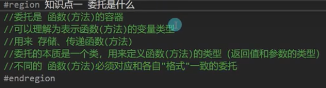

### 基本语法

关键字：delegate

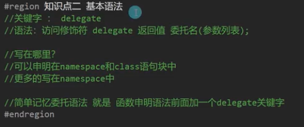

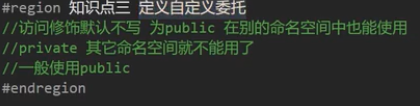

```c#

namespace Func
{
    public delegate void MyDel();//声明一个自定义委托
    class Program
    {
        static void Main(string[] args)
        {
            //两种声明方式
            MyDel say1 = SayHi;
            MyDel say2 = new MyDel(SayHi);
            //使用委托
            say1();
            say2();
        }
        static void SayHi()
        {
            Console.WriteLine("hi");
        }
    }
}
```

扩展

```c#

namespace Func
{
    public delegate int MyDel(int num);//声明一个自定义委托
    class Program
    {
        static int Add1(int a)
        {
            int b = 10 + a;
            Console.WriteLine("——Add1———");
            return b;
 
        }
 
        static int Add2(int a)
        {
            int b = 10 - a;
            Console.WriteLine("——Add2———");
            return b;
 
        }
 
        static void Calculate(MyDel ex, int a)
        {
            int result = ex(a);
            Console.WriteLine(result + "\n");
        }
 
        static void Main(string[] args)
        {
            Calculate(Add1, 1);
            Calculate(Add2, 10);
            Console.ReadKey();
        }
    }

}
```

### 多播委托

使用+=运算符 为委托新增方法
使用-=运算符 为委托移除方法
使用=null 为委托清空方法

```c#

namespace Func
{
    public delegate int MyDel(int num);//声明一个自定义委托
    class Program
    {
 
        static int Add1(int a)
        {
            int b = 10 + a;
            Console.WriteLine("——Add1———");
            return b;
 
        }
 
        static int Add2(int a)
        {
            int b = 10 - a;
            Console.WriteLine("——Add2———");
            return b;
 
        }
 
        static void Calculate(MyDel ex, int a)
        {
            int result = ex(a);
            Console.WriteLine(result + "\n");
        }
 
        static void Main(string[] args)
        {
            //Calculate(Add1, 1);
            //Calculate(Add2, 10);
            MyDel myDel = Add1;
            myDel += Add2;
            Calculate(myDel, 10);
            //这样就会依次执行Add1 Add2
            Console.ReadKey();
        }
    }
}
```

### 系统常用的委托

Action 无参无返
Action\<,> 有参无返 可以传多个参数
Func<> 无参有返
Func\<,> 有参有反 可以传多个参数 最后一个是返回值

```c#
using System;
namespace Func
{
    class Program
    {

        static int Add1(int a)
        {
            int b = 10 + a;
            Console.WriteLine("——Add1———");
            return b;

        }
        
        static void Calculate(Func<int,int> ex, int a)
        {
            int result = ex(a);
            Console.WriteLine(result + "\n");
        }

        static void Main(string[] args)
        {
            //使用系统自带的 有参有返委托
            Func<int, int> myDel = Add1;
            Calculate(myDel, 10);
            Console.ReadKey();
        }
    }
}
```


## 事件

关键字：event
事件相当于对委托进行了一次封装 让其不能被外部置空和调用 更安全

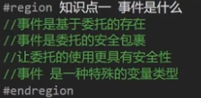

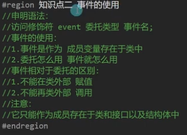

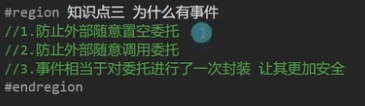

```c#
namespace Lesson_07_事件
{
    class Test
    {
        //委托成员变量 用于存储函数
        public Action myFun;
        //事件成员变量 用于存储函数
        public event Action myEvent;
        
        public void TestFun()
        {
            Console.WriteLine("1111111111");
        }
        public Test()
        {
            //事件和委托的使用 一模一样
            myFun = TestFun;
            myFun += TestFun;
            myFun -= TestFun;
            myFun();
            myFun.Invoke();
            myFun = null;

            myEvent = TestFun;
            myEvent += TestFun;
            myEvent -= TestFun;
            myEvent();
            myEvent.Invoke();
            myEvent = null;
        }
        
        //事件要在外部使用 要先在类的内部封装调用
        public void DoEvent()
        {
            myEvent();
        }
        
    }
    class Program
    {
        static void TestFun2()
        {
            Console.WriteLine("1111111111");
        }

        static void Main(string[] args)
        {
            Test t = new Test();

            //委托可以在外部赋值
            t.myFun = null;
            t.myFun = TestFun2;
            //事件不可以在外部赋值
            //t.myEvent = null; ❌❌❌
            //t.myEvent = TestFun2; ❌❌❌
            //虽然不能直接赋值但是可以+= -=
            t.myEvent += TestFun2;
            t.myEvent -= TestFun2;
            
            //委托可以在外部调用
            t.myFun();
            t.myFun.Invoke();
            //事件不可以在外部调用
            //t.myEvent();        ❌❌❌
            //t.myEvent.Invoke(); ❌❌❌
            //只能在类的内部封装调用
            t.DoEvent();
            
            //委托 可以作为临时变量在函数中使用的
            Action a = TestFun2;
            //事件 是不能作为临时变量在函数中使用的
            //event Action ae = TestFun2; ❌❌❌
        }
    }
}
```


## 匿名函数

关键字：delegate

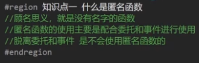

### 基本语法

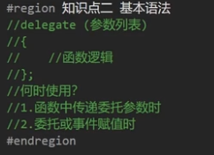

```c#
class Program
{
    static void Main(string[] args)
    {
        //匿名函数
        //1.⭕无参无返
        Action action = delegate ()
        {
            Console.WriteLine("匿名函数逻辑");
        };
        
        //2.⭕有参
        Action<int, string> action2 = delegate (int x, string s)
        {
            Console.WriteLine(x);
            Console.WriteLine(s);
        };
        
        //3.⭕有返回值
        Func<int> func = delegate ()
        {
            Console.WriteLine("匿名函数逻辑");
            return 10;
        };

        //4.⭕一般情况作为参数传递 或者 作为函数返回值
        Test t = new Test();
        //参数传递
        Action ac = delegate ()
        {
            Console.WriteLine("随参数传入的匿名函数逻辑");
        };
        t.Dosomthing(50, ac);
            //一部到位写法
        t.Dosomthing(100, delegate ()
        {
            Console.WriteLine("随参数传入的匿名函数逻辑");
        });
        
        //返回值
        Action ac2 = t.GetFun();
        ac2();
            //一部到位写法
        t.GetFun()();
    }
}

class Test
{
    public Action action1;

    //作为参数传递时
    public void Dosomthing(int a,Action fun)
    {
        Console.WriteLine(a);
        fun();
    }
    //作为返回值
    public Action GetFun()
    {
        return delegate ()
        {
            Console.WriteLine("函数内部返回的匿名函数逻辑");
        };
    }
}
```

作业


```c#
class Program
{
    static void Main(string[] args)
    {
        //写法1
        int mul = InIntOutFun(10)(20);
        //写法2
        mul = InIntOutFun(10).Invoke(20);
        
        Console.WriteLine(mul); 
    }

    //写一个函数传入一个整数，返回一个函数
    //之后执行这个函数时传入一个整数和之前那个函数传入的数相乘
    //返回结果
    static Func<int,int> InIntOutFun (int a)
    {
        return delegate (int b)
        {
            return a * b;
        };
    }
}
```

### 匿名函数的缺点

添加到委托或事件容器后 不记录 无法单独移除（因为没有名字）


## Lambda表达式

关键字：lambda
用法和匿名函数一样

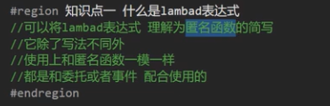

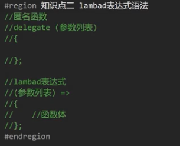

### 基本语法

```c#
//1.无参无返回
Action a = () =>
{
    Console.WriteLine("无参无返回值的lambda表达式");
};
a();
//2.有参
Action<int> a2 = (int value) =>
{
    Console.WriteLine("有参的lambda表达式");
};
a2(10);
//3.有参 省略参数类型的写法
Action<int> a3 = (value) =>
{
    Console.WriteLine("省略参数类型的写法");
};
a3(300);
//4.有返回值
Func<string, int> a4 = (value) =>
{
    Console.WriteLine("有返回值的lambda表达式");
    return 20;

};
Console.WriteLine(a4("1"));
```

### 闭包

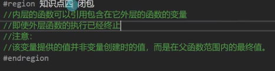

委托中的方法引用了包含在他外面的函数的临时变量时 临时变量就会存进堆里
一直都不会释放 生命周期被改变了
临时变量被包裹进事件函数存起来了

```c#
//闭包
class Test
{
    public event Action action;

    public Test()
    {
        int value = 10;
        //这里就形成闭包
        //当构造函数执行完毕时 
        //其中申明的临时变量value的生命周期被改变了
        action = () =>
        {
            //内层函数可以引用包含在他外层的函数
            //引用了外层函数的a
            Console.WriteLine(value);
        };
        action();

        for (int i = 0; i < 10; i++)
        {
            action += () =>
            {
                Console.WriteLine(i);
            };
        }
        action();
        //最终会打印10 10 10 10 10 10 10 10 10 10 10
        
        for (int i = 0; i < 10; i++)
        {
            //每次循环都会实例一个index 
            //所以会实例十个index
            int index = i;
            action += () =>
            {
                Console.WriteLine(index);
            };
        }
        action();
        //最终会打印 0 1 2 3 4 5 6 7 8 9 
    }
}
```

作业


```c#
static Action aaa()
{
    Action aaaaa;
    aaaaa = () => { };
    for (int i = 1; i < 11; i++)
    {
        int innnt = i;
        aaaaa += () =>
        {
            Console.WriteLine(innnt);
        };
    }
    return aaaaa;
}

aaa()();
```

# List排序

关键字：Sort
系统自带的变量一般都可以直接Sort
自定义类Sort有两种方式
●在类中继承接口 IComparable
●在Sort中传入委托函数
## 系统默认的排序方法

一般只能排序int float double

```c#

List list = new List();
list.Add(4);
list.Add(3);
list.Add(5);
list.Add(2);
list.Add(1);
list.Add(6);

//List提供的排序方法
list.Sort();
for (int i = 0; i \< list.Count; i++)
{
    Console.WriteLine(list[i]);
}
//打印结果为 1 2 3 4 5 6
//ArrayList中也有Sort排序方法

```

## 自定义类的排序1

通过继承IComparable接口排序

```c#
class Item :IComparable<Item>
{
    public int money;

    public Item (int money)
    {
        this.money = money;
    }

    //要实现类排序必须继承IComparable接口实现其方法
    public int CompareTo(Item other)
    {
        //返回值的含义
        //小于0：放在传入对象的前面
        //等于0：保持当前位置不变
        //大于0：放在传入对象的后面

        //可以简单理解为 传入对象的位置就是0
        //如果返回负数 就放在它的左边（前面 升序）
        //如果返回正数 就放在它的右边 （后面 降序）
        if (this.money>other.money)
        {
            return 1;
        }
        else
        {
            return -1;
        }
    }
}
class Program
{
    static void Main(string[] args)
    {
        //自定义类的排序
        List<Item> itemList = new List<Item>();
        itemList.Add(new Item(100));
        itemList.Add(new Item(54));
        itemList.Add(new Item(345));
        itemList.Add(new Item(23));
        itemList.Add(new Item(11));
        itemList.Add(new Item(77));
        //排序方法 在类中要继承IComparable接口
        itemList.Sort();
        for (int i = 0; i < itemList.Count; i++)
        {
            Console.WriteLine(itemList[i].money);
        }
    }
}
```

## 自定义类的排序2

通过委托函数进行排序

```c#
class ShopItem
{
    public int id;

    public ShopItem(int id)
    {
        this.id = id;
    }
}

class Program
{
    static void Main(string[] args)
    {
        List<ShopItem> shopItemsList = new List<ShopItem>();
        shopItemsList.Add(new ShopItem(3));
        shopItemsList.Add(new ShopItem(5));
        shopItemsList.Add(new ShopItem(6));
        shopItemsList.Add(new ShopItem(2));
        shopItemsList.Add(new ShopItem(1));
        shopItemsList.Add(new ShopItem(4));
        //通过传入函数的排序方法
        shopItemsList.Sort(SortShopItems);
        //或者通过lambda表达式或者匿名函数和三目运算符的简便写法省去声明函数
        //shopItemsList.Sort((a, b) =>{return a.id > b.id ? 1 : -1;});
    
        for (int i = 0; i < shopItemsList.Count; i++)
        {
            Console.WriteLine(shopItemsList[i].id);
        }
        //打印结果为 1 2 3 4 5 6 
    }
    
    //Sort规定的委托函数写法
    static int SortShopItems(ShopItem a,ShopItem b)
    {
        //传入的两个对象为列表中的两个对象
        //进行两两比较 用左边的条件 和右边的条件比较
        //返回规则 0做标准 负数在左（前升序） 正数在右（右后降序）
        if (a.id>b.id)
        {
            return 1;
        }
        else
        {
            return -1;
        }
    }
}
```

作业

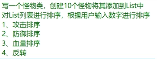

```c#
class Monsther
{
    public string name;
    public int atk;
    public int def;
    public int hp;
        
    public Monsther(string name ,int atk,int def ,int hp)
    {
        this.name = name;
        this.atk = atk;
        this.def = def;
        this.hp = hp;
    }
}

class Program
{
    static void Main(string[] args)
    {
        //声明并初始化怪物类列表
        List<Monsther> monsthersList = new List<Monsther>();
        monsthersList.Add(new Monsther("怪物01",99, 20, 50));
        monsthersList.Add(new Monsther("怪物02", 70, 50, 60));
        monsthersList.Add(new Monsther("怪物03", 10, 50, 90));
        monsthersList.Add(new Monsther("怪物04", 90, 90, 10));
        monsthersList.Add(new Monsther("怪物05", 70, 50, 40));
        monsthersList.Add(new Monsther("怪物06",30, 30, 30));
        monsthersList.Add(new Monsther("怪物07", 90, 90, 90));
        monsthersList.Add(new Monsther("怪物08", 70, 80, 90));
        monsthersList.Add(new Monsther("怪物09", 10, 10, 10));
        monsthersList.Add(new Monsther("怪物10", 20, 10, 50));
        
        //打印方法
        void Print()
        {
            for (int i = 0; i < monsthersList.Count; i++)
            {
                Console.WriteLine("{0}：攻击力{1}，防御力{2}，血量{3}",
                monsthersList[i].name,
                monsthersList[i].atk,
                monsthersList[i].def,
                monsthersList[i].hp);
            }
        }
        try
        {
            while (true)
            {
                Print();
                Console.WriteLine("********请输入排序方式*********\n 1为攻击排序 2为防御排序 3为血量排序 4为反转当前排序");
                //检测输入
                int SortIndex = int.Parse(Console.ReadLine());
                Console.Clear();
                //对应输入对应逻辑
                switch (SortIndex)
                {
                    case 1:
                        monsthersList.Sort((a, b) => { return a.atk>b.atk ? -1:1 ;});
                        Print();
                        break;
                    case 2:
                        monsthersList.Sort((a, b) => { return a.def > b.def ? -1 : 1; });
                        Print();
                        break;
                    case 3:
                        monsthersList.Sort((a, b) => { return a.hp > b.hp ? -1 : 1; });
                        Print();
                        break;
                    case 4:
                        //使用栈的特性来反转排序
                        Stack<Monsther> monsthersStack = new Stack<Monsther>();
                        for (int i = 0; i < monsthersList.Count; i++)
                        {
                            monsthersStack.Push(monsthersList[i]);
                        }
                        for (int i = 0; i < monsthersList.Count; i++)
                        {
                            monsthersList[i]=monsthersStack.Pop();
                        }
                        Print();
                        break;
                    default:
                        Console.WriteLine("请输入合法数字 1为攻击排序 2为防御排序 3为血量排序 4为反转当前排序");
                        break;
                }
            }
        }
        catch
        {

            Console.WriteLine("请输入合法数字 1为攻击排序 2为防御排序 3为血量排序 4为反转当前排序");
        }
            
    }
}
```


# 协变逆变

关键字：out （协变） in（逆变）
用于修饰泛型替代符**只能修饰接口和委托中的泛型**

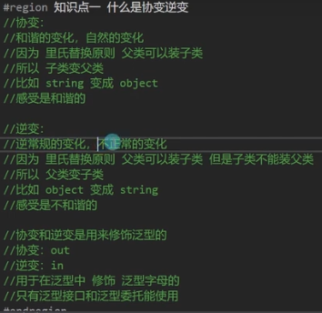

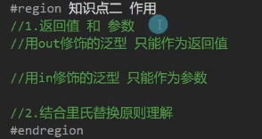

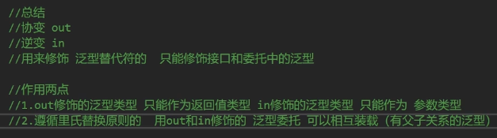

返回值和参数
●out修饰的泛型 只能作为返回值
●in修饰的泛型 只能作为参数

```c#
//⭕out修饰的泛型 只能作为返回值
delegate T TestOut<out T>();
//⭕in修饰的泛型 只能作为参数
delegate void TestIn<in T>(T t);  
```

结合里氏替换 少用
●协变：用父类泛型委托装子类泛型委托
●逆变：用子类泛型委托装父类泛型委托

```c#
delegate T TestOut<out T>();
delegate void TestIn<in T>(T t);

class Father { }
class Son:Father { }

class Program
{
    static void Main(string[] args)
    {
        //协变 父类能替代子类（输出类型向上转换）
        TestOut<Son> os = () =>
        {
            return new Son();
        };
        TestOut<Father> of = os;
        Father f = of(); //实际返回的是os里转的函数 返回的是Son

        //逆变 子类能替代父类（输入类型向下转换）
        //看起来像是father——>son 明明是传父类 但却传子类 不和谐的
        TestIn<Father> inf = (value) =>
        {

        };
        TestIn<Son> ins = inf;
        ins(new Son()); //实际上调用的是inf
        Console.WriteLine("Hello World!");
    }
}
```


# 多线程

追加命名空间：using System.Threading;
关键字：Thread

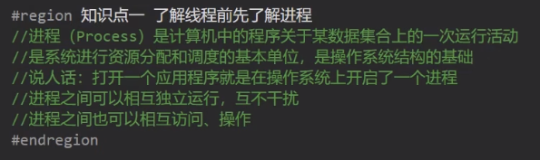

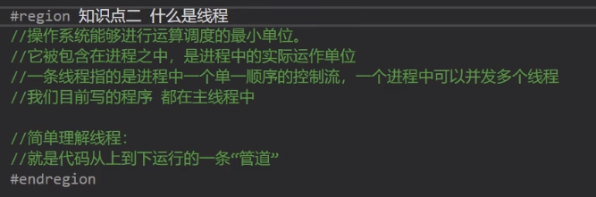

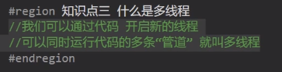

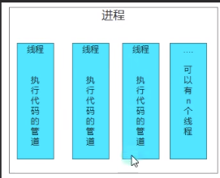

## 基本语法

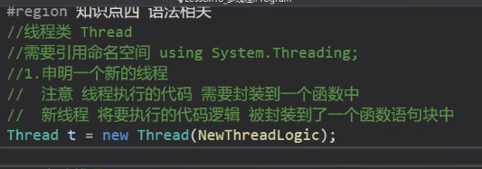


```c#
static bool isRuning = true;

static void Main(string[] args)
{
    //1.声明一个新线程
    //新线程要执行的逻辑封装在一个函数中传入
    Thread t = new Thread(NewThreadLogic);

    //2.启动线程
    t.Start();

    //3.设置为后台线程
    t.IsBackground = true;

    //4.关闭线程如果不是死循环不用刻意管 t=null
    //死循环中bool标识
    Console.ReadKey();
    isRuning = false;
    Console.ReadKey();
    //通过提供的方法 控制台这个版本会报错
    //t.Abort();

    //5.线程休眠
    //让当前线程(Main) 休眠 毫秒
    //Thread.Sleep(1000);


}

static void NewThreadLogic ()
{
    while (isRuning)
    {
        //5.线程休眠
        //让当前线程(Main) 休眠 毫秒
        Thread.Sleep(1000);
        Console.WriteLine("新线程逻辑");
    }

}
```


```c#
static object obj = new object();

static void Main(string[] args)
{
    //1.声明一个新线程
    Thread t = new Thread(NewThreadLogic);
    //2.启动线程
    t.Start();
    //3.设置为后台线程
    t.IsBackground = true;

    while (true)
    {
        lock(obj)
        {
            Console.SetCursorPosition(0, 0);
            Console.ForegroundColor = ConsoleColor.Red;
            Console.Write("▲");
        }
    }
}

static void NewThreadLogic ()
{
    while (true)
    {
        lock (obj)
        {
            Console.SetCursorPosition(10, 5);
            Console.ForegroundColor = ConsoleColor.Yellow;
            Console.Write("■");
        }
    }
}
```

## 线程的作用

改善性能 尽可能地利用 CPU 资源，充分利用 CPU ，从而提高性能。


# 预处理器指令

在实际编译之前开始对信息进行预处理
在unity中会进行一些版本或平台的判断
关键字：
●#define
●#undef
●#region #endregion
●#if
●#elif
●#else
●#endif


```c#
//定义一个符号
#define Unity4
#define IOS
#define Android
//取消定义一个符号
#undef Android

//折叠代码
#region 命名空间
using System;
using System.Threading;
#endregion

namespace Lesson_预处理器指令
{
    class Program
    {
        static void Main(string[] args)
        {
//如果定义了Unity4和IOS则执行以下代码
#if Unity4 && IOS
            Console.WriteLine("版本为Unity4 IOS");
            //警告
            #warning 这个版本不合法
            //报错
            #error 这个版本不准执行
#endif
        }
    }
}
```


# 反射&特性


## 反射

追加命名空间：using System.Reflection;


可以在程序编译后获得信息


### Type

访问元数据


```c#
using System;
using System.Reflection;

namespace Lesson_13_反射和特性
{
    class Test
    {
        private int i = 1;
        public int j = 10;
        public string str = "你是";

        public Test ()
        {

        }
        public Test (int i)
        {
            this.i = i;
        }
        public Test (int i,string str): this(i)
        {
            this.str = str;
        }
        public void Spek()
        {
            Console.WriteLine(i);
        }
    }

    class Program
    {
        static void Main(string[] args)
        {
            //🔴Type(类的信息类)//它是反射功能的基础!
            //它是访问元数据的主要方式。
            //使用Type的成员获取有关类型声明的信息
            //有关类型的成员(如构造函数、方法、字段、属性和类的事件)
            //1.万物之父object中GetType()可以获取对象的Type
            int a = 42;
            Type type = a.GetType();
            Console.WriteLine(type);
            //2.通过typeof关键字 传入类名也可以得到对象的Type
            Type type2 = typeof(int);
            Console.WriteLine(type2);
            //3.通过类名 获取类型 要包含命名空间
            Type type3 = Type.GetType("System.Int32");
            Console.WriteLine(type3);

            //得到类的程序集
            Console.WriteLine(type.Assembly);

            //获取类中的所有公共成员
            Type t = typeof(Test);
            MemberInfo[] infos = t.GetMembers();
            for (int i = 0; i < infos.Length; i++)
            {
                Console.WriteLine(infos[i]);
            }

            //🔴获取类的公共 构造函数并调用
            //1.获取所有构造函数
            ConstructorInfo[] ctors = t.GetConstructors();
            for (int i = 0; i < ctors.Length; i++)
            {
                Console.WriteLine(ctors[i]);
            }
            //2.获取其中一个构造函数 并执行
            //得构造函数传入 Type数组 数组中内容按顺序是参数类型
            //执行构造函数传入 object数组 表示按顺序传入的参数
            //2-1得到无参构造
            ConstructorInfo info = t.GetConstructor(new Type[0]);
            //执行无参构造 无参传null
            Test obj =info.Invoke(null) as Test;
            Console.WriteLine(obj.j);
            //2-2得到有参构造 (int)
            ConstructorInfo info2 = 
                t.GetConstructor(new Type[] { typeof(int) });
            obj = info2.Invoke(new object[] {2}) as Test;
            Console.WriteLine(obj.str);
            //得到有参构造 (int,string)
            ConstructorInfo info3 = 
                t.GetConstructor(new Type[] { typeof(int), typeof(string) });
            obj = info3.Invoke(new object[] { 10, "你好世界" }) as Test;
            Console.WriteLine(obj.str);


            //🔴获取类的公共成员 变量
            //1.得到所有成员
            FieldInfo[] fieldInfos = t.GetFields();
            for (int i = 0; i < fieldInfos.Length; i++)
            {
                Console.WriteLine(fieldInfos[i]);
            }
            //2.得到指定名称的公共变量成员
            FieldInfo info4 = t.GetField("j");
            Console.WriteLine(info4);
            //3.通过反射获取和设置对象的值
            // 3-1通过反射 获取对象的某个变量的值
            Test test = new Test();
            test.j = 99;
            test.str = "苏苏苏";
            Console.WriteLine(info4.GetValue(test));
            // 3-2通过反射 设置指定对象的某个变量的值
            info4.SetValue(test, 999);
            Console.WriteLine(info4.GetValue(test));

            //🔴获取类的公共成员 方法
            Type strType = typeof(string);
            //1.得到所有成员
            MethodInfo[] methods = strType.GetMethods();
            for (int i = 0; i < methods.Length; i++)
            {
                Console.WriteLine(methods[i]);
            }
            //2.得到指定方法
            MethodInfo info5 = strType.GetMethod("Substring",
                new Type[] {typeof(int),typeof(int) });
            //3.调用方法
            //注意：如果是静态方法 Incoke中的第一个参数传null即可
            string str = "Hello，World!";
            object result =info5.Invoke(str, new object[] { 6, 5 });
            Console.WriteLine(result);
            
            //🔴获取类的事件
            //🔴获取属性
            //🔴获取接口
            //🔴获取枚举
        }
    }
}
```

### Activator

快速实例化一个对象
Activator.CreateInstance


```c#
using System;
using System.Reflection;

namespace Lesson_13_反射和特性
{
    class Test
    {
        private int i = 1;
        public int j = 10;
        public string str = "你是";

        public Test ()
        {

        }
        public Test (int i)
        {
            this.i = i;
        }
        public Test (int i,string str): this(i)
        {
            this.str = str;
        }
        public void Spek()
        {
            Console.WriteLine(i);
        }
    }

    class Program
    {
        static void Main(string[] args)
        {
            //Activator
            //用于将Type对象快捷实例化为对象
            Type testType = typeof(Test);
            //1.无参构造
            Test testObj = Activator.CreateInstance(testType) as Test;
            Console.WriteLine(testObj.str);
            //2.有参构造
            testObj = Activator.CreateInstance(testType, 99) as Test;

            testObj = Activator.CreateInstance(testType, 888,"你好你好") as Test;
            Console.WriteLine(testObj.str);
        }
    }
}
```

### Assembly

加载程序集
Assembly.LoadFrom


```c#
namespace Lesson_13_反射测试对象
{
    class MyClass
    {
        private int a;
        private int b;

        public MyClass(int a,int b)
        {
            this.a = a;
            this.b = b;
        }

        public void Print()
        {
            Console.WriteLine("a的值为{0}\nb的值为{1}",a,b);
        }
    }
    class Program
    {
        static void Main(string[] args)
        {
            MyClass myClass = new MyClass(10, 20);
            myClass.Print();
            Console.WriteLine("Hello World!");
        }
    }
}
```

```c#
namespace Lesson_13_反射和特性
{
    class Porgram
    {
        static void Main(string[] args)
        {
            //1.先加载一个指定的程序集
            Assembly assembly = Assembly.LoadFrom
            (@"C:\Users\suxia\Desktop\CSharp进阶\Lesson_13_反射测试对象
            \bin\Debug\netcoreapp3.1\Lesson_13_反射测试对象");
            Type[] types = assembly.GetTypes();
            for (int i = 0; i < types.Length; i++)
            {
                Console.WriteLine(types[i]);
            }
            //2.再加载程序集中的一个类对象 之后才能使用反射
            Type myClass = assembly.GetType("Lesson_13_反射测试对象.MyClass");
            //快速实例化对象
            object myClassObj= Activator.CreateInstance(myClass, 999, 888);
            //得到对象的方法
            MethodInfo print = myClass.GetMethod("Print");
            //调用对象
            print.Invoke(myClassObj, null);
        }
    }
}
```


## 特性

关键字：Attribute


```c#
//特性的声明
//继承基类 Attribute
class MyClustomAttribute :Attribute
{
    //特性中的成员 
    public string info;
    public MyClustomAttribute(string info)
    {
        this.info = info;
    }

    public void TestFun()
    {
        Console.WriteLine("特性的方法");
    }
}

//特性的声明 可以在类前 变量前 方法前 等
[MyClustom("这是一个类")]
[MyCustom2()]
class MyClass
{
    [MyClustom("成员变量")]
    int value;

    [MyClustom("成员方法")]
    public void MyFun([MyClustom("函数参数")] int a)
    {

    }
}

#region 限制自定义特性的使用范围
//通过为特性类添加特性限制其使用范围
[AttributeUsage(AttributeTargets.Class|AttributeTargets.Struct,
                AllowMultiple =true,Inherited =true)]
//参数1 AttributeTargets  特性能用在哪个地方
//参数2 AllowMultiple     是否允许多个特性用在同一目标
//参数3 Inherited         特性是否能被派生类和重写成员继承
public class MyCustom2Attribute : Attribute
{

}
#endregion

class Program
{
    static void Main(string[] args)
    {
        //特性的使用
        //获取Type
        Type t = typeof(MyClass);
        //判断是否使用了某个特性
        //参数1特性的类型  参数2是否搜索继承链（属性和事件忽略此参数）
        if (t.IsDefined(typeof(MyClustomAttribute),false))
        {
            Console.WriteLine("该类型应用了MyClustom特性");
        }

        //获取Type元数据中所有特性 
        object[] aeeay= t.GetCustomAttributes(true);
        //通过遍历查找特性
        for (int i = 0; i < aeeay.Length; i++)
        {
            if (aeeay[i] is MyClustomAttribute)
            {
                //找到了 里氏替换后使用
                Console.WriteLine((aeeay[i] as MyClustomAttribute).info);
                (aeeay[i] as MyClustomAttribute).TestFun();
            }
        }
    }
}
```

过时特性


调用者信息特性


条件编译特性


~~~c#
#define Fun

using System.Diagnostics;

namespace test
{

    class Test
    {

        static void Main(string[] args)
        {
            fun();	// 该方法只有使用#define定义了 Fun 才会调用
        }

        [Conditional("Fun")]
        static void fun()
        {
            Console.WriteLine("fun");
        }
    }
}
~~~


外部Dll包函数特性


# 迭代器


## 标准迭代器实现方法


```c#
//继承IEnumerable接口
class CustomList : IEnumerable ,IEnumerator
{
    private int[] list;
    //光标从-1开始 用于表示数据得到了哪个位置 
    private int pos = -1;

    public CustomList()
    {
        list = new[] { 1, 2, 3, 4, 5, 6, 7, 8 };
    }

    public IEnumerator GetEnumerator()
    {
        //重置光标
        Reset();
        //得到自身的类
        return this;
    }

    public object Current
    {
        get
        {
            return list[pos];
        }
    }
    public bool MoveNext()
    {
        //移动光标
        ++pos;
        //是否溢出
        return pos < list.Length;
    }
    //重置光标位置 用于第一次重置光标位置
    public void Reset()
    {
        pos = -1;
    }
}

class Program
{
    static void Main(string[] args)
    {
        CustomList customList = new CustomList();
        //foreach的本质
        //1.先获取in后面这个对象的 IEnumerator
        // 会调用对象其中的GetEnumerator方法获取
        //2.执行得到这个IEnumerator对象中MoveNext方法
        //3.只要MoveNext方法返回值是true 就会得到Current（光标）
        // 然后赋值给 item
        foreach (int item in customList)
        {
            Console.WriteLine(item);
        }
            
    }
}
```

## yield return实现迭代器


```c#
//yield return实现迭代器
class CustomList2 : IEnumerable
{
    private int[] list;
    public CustomList2()
    {
        list = new int[] { 1, 2, 3, 4, 5, 6, 7, 8 };
    }
    public IEnumerator GetEnumerator()
    {
        for (int i = 0; i < list.Length; i++)
        {
            //yield关键词 配合迭代器使用
            //暂时返回保留当前的状态
            yield return list[i];
        }
    }
}

class Program
{
    static void Main(string[] args)
    {
        CustomList2 customList2 = new CustomList2();
        foreach (int item in customList2)
        {
            Console.WriteLine(item);
        }
            
    }
}
```

yield return为泛型类实现迭代器

```c#
//yield return为泛型类实现迭代器
class CustomList3<T> : IEnumerable
{
    private T[] array;
    public CustomList3(params T[] array)
    {
        this.array = array;
    }
    public IEnumerator GetEnumerator()
    {
        for (int i = 0; i < array.Length; i++)
        {
            yield return array[i];
        }
    }
}

class Program
{
    static void Main(string[] args)
    {
        CustomList3<string> customList3 = 
            new CustomList3<string>("你","好","世","界");
        foreach (string item in customList3)
        {
            Console.WriteLine(item);
        }
            
    }
}
```


# 特殊语法

var隐式类型


```

var i = 10;
var s = "你好i世界";
var array = new int[] { 1, 2, 3, 4 };

```

设置对象初始值


```c#
class Person
{
    private int money;
    public bool sex;
    public string Name
    {
        get;
        set;
    }
    public int Age
    {
        get;
        set;
    }
    public Person(int money)
    {
        this.money = money;
    }
}
//*******************************
//声明对象时 直接写大括号初始化公共成员变量和属性
Person person = 
    new Person (99) { sex = true, Name = "苏同学", Age = 20 };
```

设置集合的初始值


```

//声明集合对象时 直接通过大括号初始化内部属性
List listInt = new List() { 1, 2, 3, 4, 5, 6 };
//套娃上一个设置对象初始值
List listPerson = new List()
{
    new Person(100),
    new Person(230){ Age=10},
    new Person(999){Name="苏同学",sex=true}
};
//字典也可以
Dictionary dic = new Dictionary()
{
    { 1,"你"},
    { 2,"好"},
    { 3,"世"},
    { 4,"界"}
};

```

匿名类型
var 变量可以声明为自定义的匿名类
匿名类中只能有成员变量，不能有函数

```

//匿名类型
//var 变量可以声明为自定义的匿名类型
var v = new { name="苏同学", money = 999 };
Console.WriteLine(v.money);

```

可空类型

```c#
//1.值类型不能赋值为空
//int c = null;
//2.声明时在值类型后面加 ? 可赋值为空
int? c = null;
//3.判断是否为空
if (c.HasValue)
{
    Console.WriteLine(c);
    Console.WriteLine(c.Value);
}
//4.安全获取可空类型值
//如果为空 返回值类型的默认值
Console.WriteLine(c.GetValueOrDefault());
//如果为空 返回指定默认值
Console.WriteLine(c.GetValueOrDefault(100));

//⭕引用类型的特殊用法
object o = null;
if(o != null)
{
    o.ToString();
}
//等价上面的简便写法
o?.ToString();

//⭕委托的特殊用法
Action action = null;
if(action != null)
{
    action();
}
//等价上面的简便写法
action?.Invoke();
```

空合并操作符

```c#
//空合并操作符
//左边值 ?? 右边值
//如果左边值为null 就返回右边值 否则返回左边值
int? intV = null;
int intI = intV == null ? 100 : intV.Value;
//等价上面的简便写法
intI = intV ?? 100;
```

内插字符串

```c#
//关键字: $
//用$来构造字符串 让字符串可以拼接变量
string name = "苏同学";
int age =18;
Console.WriteLine($"昏昏欲睡{name},今年{age}");
```

单据逻辑简略写法
逻辑中只有单行代码 才能省去大括号

```c#
//单句逻辑的简略写法
if(true) Console.WriteLine("1111111111");
for (int j=0; j<10; j++) Console.WriteLine("1111111111");
```

```c#
//在属性中的单据简略写法
class Test
{
    private string name = "";
    public string Name
    {
        get => name;
        set => name=value;
    }
}
```

```c#
//在函数中的简略写法
public int Add (int x,int y) => x+y;
public void Speek (string str) => Console.WriteLine(str);
```


# 值类型和引用类型


