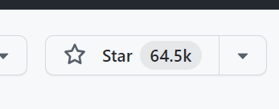
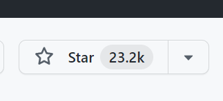
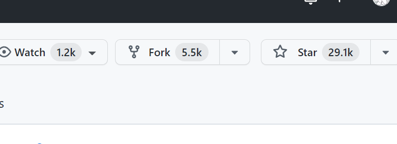
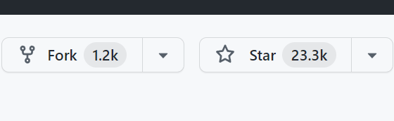
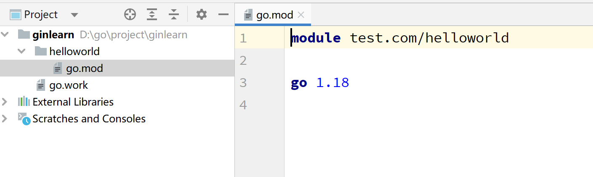
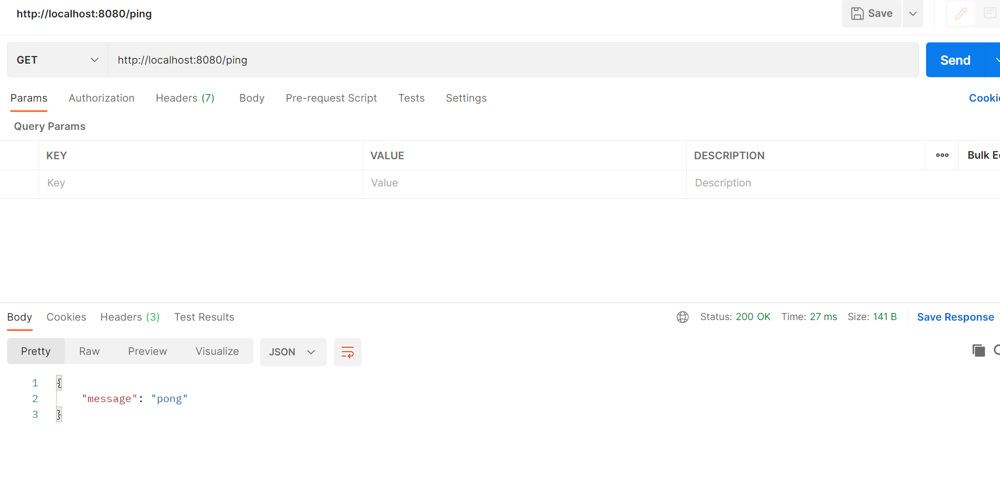
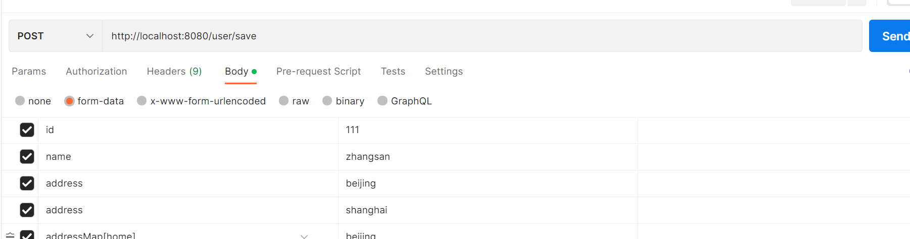

# 认识gin

框架是一系列工具的集合，能让开发变的便捷。

学习框架的目的就是为了提供项目的开发效率，使我们更加专注业务，而不是和业务无关的底层代码。

## 1. go流行的web框架

如果学习过其他语言，可能知道Java用的比较多的是Spring框架，PHP用的比较多的是Laravel，python用的多的是Django，都在各自的语言中具有强大的统治力。

`go`从诞生之初就带有浓重的开源属性，其原生库已经很强大，即使不依赖框架，也能进行高性能开发，又因为其语言并没有一定的设计标准，所以较为灵活，也就诞生了众多的框架，各具有特色，满足不同的喜好。

### 1.1 Gin

地址：https://github.com/gin-gonic/gin



号称最快的go语言web框架，目前是go官方的推荐框架（https://go.dev/doc/tutorial/）。

### 1.2 iris

地址：https://github.com/kataras/iris



性能比gin高一些，支持MVC，但这款框架评价不太好，使用上问题较多，近些年很少去选择使用

### 1.3 Beego

地址：https://github.com/beego/beego



国人开发，最早的go web框架之一，工具集比较完善，性能较差，据传言作者是php转行，所以框架带有浓厚的php特色，早期国内使用的多，目前少有人选择

### 1.4 fiber

地址：https://github.com/gofiber/fiber



2020年发布的框架，发展迅速，建立在fasthttp之上，性能目前最高，受Express启发，比较简洁，上手较快，和gin类似。

> 当然还有其他一些框架，但从star数上，以及流行程度上看，gin一骑绝尘，gin的好处在于其简洁，扩展性，稳定性以及性能都比较出色。

**go的框架其实是可以理解为库，并不是用了某一个框架就不能用别的框架，可以选择性的使用各个库中的优秀组件，进行组合**

## 2. gin介绍

特性：

**快速**

基于 Radix 树的路由，小内存占用。没有反射。可预测的 API 性能。

**支持中间件**

传入的 HTTP 请求可以由一系列中间件和最终操作来处理。 例如：Logger，Authorization，GZIP，最终操作 DB。

**Crash 处理**

Gin 可以 catch 一个发生在 HTTP 请求中的 panic 并 recover 它。这样，你的服务器将始终可用。例如，你可以向 Sentry 报告这个 panic！

**JSON 验证**

Gin 可以解析并验证请求的 JSON，例如检查所需值的存在。

**路由组**

更好地组织路由。是否需要授权，不同的 API 版本…… 此外，这些组可以无限制地嵌套而不会降低性能。

**错误管理**

Gin 提供了一种方便的方法来收集 HTTP 请求期间发生的所有错误。最终，中间件可以将它们写入日志文件，数据库并通过网络发送。

**内置渲染**

Gin 为 JSON，XML 和 HTML 渲染提供了易于使用的 API。

**可扩展性**

新建一个中间件非常简单。

## 3. 快速入门

go版本需求：go1.23及以上

环境：windows 10

```cmd
# 运行下面的命令 或 使用golang等IDE直接创建一个go项目
go mod init gin-test
```

使用goland（vscode）打开



```bash
# 直接在代码中导入Gin，Go在构建时会自动下载
import "github.com/gin-gonic/gin"
```

示例程序：

```go
package main

import "github.com/gin-gonic/gin"

func main() {
	r := gin.Default()
	r.GET("/ping", func(c *gin.Context) {
		c.JSON(200, gin.H{
			"message": "pong",
		})
	})
	r.Run() // 监听并在 0.0.0.0:8080 上启动服务
}
```

运行后，postman进行测试



**简单的代码就实现了一个http的服务**

# 路由

路由是URI到函数的映射。

一个URI含: `http://localhost:8080/user/find?id=11`

- 协议，比如http，https等
- ip端口或者域名，比如127.0.0.1:8080或者`www.test.com`
- path，比如 /path
- query，比如 ?query

同时访问的时候，还需要指明HTTP METHOD，比如

- GET：GET方法请求一个指定资源的表示形式. 使用GET的请求应该只被用于获取数据.

- POST：POST方法用于将实体提交到指定的资源，通常会导致在服务器上的状态变化

- HEAD：HEAD方法请求一个与GET请求的响应相同的响应，但没有响应体.

- PUT：PUT方法用请求有效载荷替换目标资源的所有当前表示

- DELETE：DELETE方法删除指定的资源

- CONNECT：CONNECT方法建立一个到由目标资源标识的服务器的隧道。

- OPTIONS：OPTIONS方法用于描述目标资源的通信选项。

- TRACE：TRACE方法沿着到目标资源的路径执行一个消息环回测试。

- PATCH：PATCH方法用于对资源应用部分修改。


> 使用的时候，应该尽量遵循其语义

## 1. RESTful API规范

RESTful API 的规范建议我们使用特定的HTTP方法来对服务器上的资源进行操作。

比如：

1. GET，表示读取服务器上的资源
2. POST，表示在服务器上创建资源
3. PUT,表示更新或者替换服务器上的资源
4. DELETE，表示删除服务器上的资源
5. PATCH，表示更新/修改资源的一部分

## 2. 请求方法

比如

```go
	r.GET("/get", func(ctx *gin.Context) {
		ctx.JSON(200, "get")
	})
	r.POST("/post", func(ctx *gin.Context) {
		ctx.JSON(200, "post")
	})
	r.DELETE("/delete", func(ctx *gin.Context) {
		ctx.JSON(200, "delete")
	})
	r.PUT("/put", func(ctx *gin.Context) {
		ctx.JSON(200, "put")
	})
```

如果想要支持所有：

```go
r.Any("/any", func(ctx *gin.Context) {
		ctx.JSON(200, "any")
	})
```

如果想要支持其中的几种：

```go
   r.GET("/hello", func(ctx *gin.Context) {
		//数组 map list 结构体
		ctx.JSON(200, gin.H{
			"name": "hello world",
		})
	})
	r.POST("/hello", func(ctx *gin.Context) {
		//数组 map list 结构体
		ctx.JSON(200, gin.H{
			"name": "hello world",
		})
	})
```

## 3. URI

URI书写的时候，我们不需要关心scheme和authority这两部分，我们主要通过path和query两部分的书写来进行资源的定位。

- 静态url，比如`/hello`，`/user/find`

  ```go
  r.POST("/user/find", func(ctx *gin.Context) {
  })
  ```

- 路径参数，比如`/user/find/:id`

  ```go
  r.POST("/user/find/:id", func(ctx *gin.Context) {
  		param := ctx.Param("id")
  		ctx.JSON(200, param)
  	})
  ```

- 模糊匹配，比如`/user/*path`

  ```go
  r.POST("/user/*path", func(ctx *gin.Context) {
  		param := ctx.Param("path")
  		ctx.JSON(200, param)
  })
  ```


## 4. 处理函数

定义：

```go
type HandlerFunc func(*Context)
```

通过上下文的参数，获取http的请求参数，响应http请求等。

## 5. 分组路由

在进行开发的时候，我们往往要进行模块的划分，比如用户模块，以user开发，商品模块，以goods开头。

或者进行多版本开发，不同版本之间路径是一致的，这种时候，就可以用到分组路由了。

比如

```go
   ug := r.Group("/user")
	{
		ug.GET("find", func(ctx *gin.Context) {
			ctx.JSON(200, "user find")
		})
		ug.POST("save", func(ctx *gin.Context) {
			ctx.JSON(200, "user save")
		})
	}
	gg := r.Group("/goods")
	{
		gg.GET("find", func(ctx *gin.Context) {
			ctx.JSON(200, "goods find")
		})
		gg.POST("save", func(ctx *gin.Context) {
			ctx.JSON(200, "goods save")
		})
	}
```

# 请求参数

## 1. Get请求参数

使用Get请求传参时，类似于这样 `http://localhost:8080/user/save?id=11&name=zhangsan`。

如何获取呢？

### 1.1 普通参数

request url: `http://localhost:8080/user/save?id=11&name=zhangsan`

```go
r.GET("/user/save", func(ctx *gin.Context) {
		id := ctx.Query("id")
		name := ctx.Query("name")
		ctx.JSON(200, gin.H{
			"id":   id,
			"name": name,
		})
	})
```

如果参数不存在，就给一个默认值：

```go
r.GET("/user/save", func(ctx *gin.Context) {
		id := ctx.Query("id")
		name := ctx.Query("name")
		address := ctx.DefaultQuery("address", "北京")
		ctx.JSON(200, gin.H{
			"id":      id,
			"name":    name,
			"address": address,
		})
	})
```

判断参数是否存在：

```go
r.GET("/user/save", func(ctx *gin.Context) {
		id, ok := ctx.GetQuery("id")
		address, aok := ctx.GetQuery("address")
		ctx.JSON(200, gin.H{
			"id":      id,
			"idok":    ok,
			"address": address,
			"aok":     aok,
		})
	})
```

id是数值类型，上述获取的都是string类型，根据类型获取：

```go
type User struct {
	Id   int64  `form:"id"`
	Name string `form:"name"`
}
r.GET("/user/save", func(ctx *gin.Context) {
		var user User
		err := ctx.BindQuery(&user)
		if err != nil {
			log.Println(err)
		}
		ctx.JSON(200, user)
})
```

也可以：

```go
r.GET("/user/save", func(ctx *gin.Context) {
		var user User
		err := ctx.ShouldBindQuery(&user)
		if err != nil {
			log.Println(err)
		}
		ctx.JSON(200, user)
	})
```

区别：

```go
type User struct {
	Id      int64  `form:"id"`
	Name    string `form:"name"`
	Address string `form:"address" binding:"required"`
}
```

当bind是必须的时候，ShouldBindQuery会报错，开发者自行处理，状态码不变。

BindQuery则报错的同时，会将状态码改为400。所以一般建议是使用Should开头的bind。

### 1.2 数组参数

请求url：`http://localhost:8080/user/save?address=Beijing&address=shanghai`

```go
r.GET("/user/save", func(ctx *gin.Context) {
		address := ctx.QueryArray("address")
		ctx.JSON(200, address)
	})
```

```go
r.GET("/user/save", func(ctx *gin.Context) {
		address, ok := ctx.GetQueryArray("address")
		fmt.Println(ok)
		ctx.JSON(200, address)
	})
```

```go
r.GET("/user/save", func(ctx *gin.Context) {
		var user User
		err := ctx.ShouldBindQuery(&user)
		fmt.Println(err)
		ctx.JSON(200, user)
	})
```

### 1.3 map参数

请求url：`http://localhost:8080/user/save?addressMap[home]=Beijing&addressMap[company]=shanghai`

```go
r.GET("/user/save", func(ctx *gin.Context) {
		addressMap := ctx.QueryMap("addressMap")
		ctx.JSON(200, addressMap)
	})
```

```go
r.GET("/user/save", func(ctx *gin.Context) {
		addressMap, _ := ctx.GetQueryMap("addressMap")
		ctx.JSON(200, addressMap)
	})
```

map参数 bind并没有支持

## 2. Post请求参数

post请求一般是表单参数和json参数

### 2.1 表单参数



```go
r.POST("/user/save", func(ctx *gin.Context) {
		id := ctx.PostForm("id")
		name := ctx.PostForm("name")
		address := ctx.PostFormArray("address")
		addressMap := ctx.PostFormMap("addressMap")
		ctx.JSON(200, gin.H{
			"id":         id,
			"name":       name,
			"address":    address,
			"addressMap": addressMap,
		})
	})
```

```go
r.POST("/user/save", func(ctx *gin.Context) {
		var user User
		err := ctx.ShouldBind(&user)
		addressMap, _ := ctx.GetPostFormMap("addressMap")
		user.AddressMap = addressMap
		fmt.Println(err)
		ctx.JSON(200, user)
	})
```

### 2.2 json参数

```json
{
    "id":1111,
    "name":"zhangsan",
    "address": [
        "beijing",
        "shanghai"
    ],
    "addressMap":{
        "home":"beijing"
    }
}
```

```go
r.POST("/user/save", func(ctx *gin.Context) {
		var user User
		err := ctx.ShouldBindJSON(&user)
		fmt.Println(err)
		ctx.JSON(200, user)
	})
```

其他类型参数注入xml，yaml等和json道理一样

## 3. 路径参数

请求url：`http://localhost:8080/user/save/111`

```go
r.POST("/user/save/:id", func(ctx *gin.Context) {
		ctx.JSON(200, ctx.Param("id"))
	})
```

## 4. 文件参数

```go
r.POST("/user/save", func(ctx *gin.Context) {
		form, err := ctx.MultipartForm()
		if err != nil {
			log.Println(err)
		}
		files := form.File
		for _, fileArray := range files {
			for _, v := range fileArray {
				ctx.SaveUploadedFile(v, "./"+v.Filename)
			}

		}
		ctx.JSON(200, form.Value)
	})
```

# 响应

## 1. 字符串方式

```go
r.GET("/user/save", func(ctx *gin.Context) {
		ctx.String(http.StatusOK, "this is a %s", "ms string response")
	})
```

## 2. JSON方式

```go
r.GET("/user/save", func(ctx *gin.Context) {
		ctx.JSON(http.StatusOK, gin.H{
			"success": true,
		})
	})
```

## 3. XML方式

```go
type XmlUser struct {
	Id   int64  `xml:"id"`
	Name string `xml:"name"`
}
r.GET("/user/save", func(ctx *gin.Context) {
		u := XmlUser{
			Id:   11,
			Name: "zhangsan",
		}
		ctx.XML(http.StatusOK, u)
	})
```

## 4. 文件格式

```go
r.GET("/user/save", func(ctx *gin.Context) {
		//ctx.File("./1.png")
		ctx.FileAttachment("./1.png", "2.png")
	})
```

## 5. 设置http响应头

```go
r.GET("/user/save", func(ctx *gin.Context) {
		ctx.Header("test", "headertest")
	})
```

## 6. 重定向

```go
r.GET("/user/save", func(ctx *gin.Context) {
		ctx.Redirect(http.StatusMovedPermanently, "http://www.baidu.com")
	})
```

## 7. YAML方式

```go
r.GET("/user/save", func(ctx *gin.Context) {
		ctx.YAML(200, gin.H{"name": "ms", "age": 19})
})
```

# 模板渲染

模板是golang语言的一个标准库，使用场景很多，gin框架同样支持模板

## 1. 基本使用

定义一个存放模板文件的`templates`文件夹

```html
<!DOCTYPE html>
<html>
<head>
    <meta charset="utf-8">
    <meta name="viewport" content="width=device-width, initial-scale=1">
    <title>gin_templates</title>
</head>
<body>
{{.title}}
</body>
</html>
```

后端代码：

```go
package main

import (
	"github.com/gin-gonic/gin"
	"net/http"
)

func main() {
	r := gin.Default()
	// 模板解析
	r.LoadHTMLFiles("templates/index.tmpl")

	r.GET("/index", func(c *gin.Context) {
		// HTML请求
		// 模板的渲染
		c.HTML(http.StatusOK, "index.tmpl", gin.H{
			"title": "hello 模板",
		})
	})

	r.Run(":9090") // 启动server
}
```

## 2. 多个模板渲染

如果有多个模板，可以统一进行渲染

```go
// 模板解析,解析templates目录下的所有模板文件
	r.LoadHTMLGlob("templates/**")
```

如果目录为`templates/post/index.tmpl`和`templates/user/index.tmpl`这种，可以

```go
	// **/* 代表所有子目录下的所有文件
	router.LoadHTMLGlob("templates/**/*")
```

## 3. 自定义模板函数

```go
   // gin框架给模板添加自定义函数
	r.SetFuncMap(template.FuncMap{
		"safe": func(str string) template.HTML {
			return template.HTML(str)
		},
	})

	// 模板解析,解析templates目录下的所有模板文件
	r.LoadHTMLGlob("templates/**")

	r.GET("/index", func(c *gin.Context) {
		// HTML请求
		// 模板的渲染
		c.HTML(http.StatusOK, "index.tmpl", gin.H{
			"title": "<a href='http://baidu.com'>跳转到其他地方</a>",
		})
	})
```

```go
<!DOCTYPE html>
<html>
<head>
    <meta charset="utf-8">
    <meta name="viewport" content="width=device-width, initial-scale=1">
    <title>gin_templates</title>
</head>
<body>
{{.title | safe}}
</body>
</html>
```

## 4. 静态文件处理

如果在模板中引入静态文件，比如样式文件

index.css

```css
body{
    background-color: aqua;
}
```

```go
<!DOCTYPE html>
<html>
<head>
    <meta charset="utf-8">
    <meta name="viewport" content="width=device-width, initial-scale=1">
    <title>gin_templates</title>
    <link rel="stylesheet" href="/css/index.css">
</head>
<body>
{{.title}}
</body>
</html>
```

```go
// 加载静态文件
r.Static("/css", "./static/css")
```

# 会话

会话控制涉及到cookie和session的使用

## 1. cookie

1. HTTP是无状态协议，服务器不能记录浏览器的访问状态，也就是说服务器不能区分两次请求是否由同一个客户端发出
2. Cookie就是解决HTTP协议无状态的方案之一
3. Cookie实际上就是服务器保存在浏览器上的一段信息。浏览器有了Cookie之后，每次向服务器发送请求时都会同时将该信息发送给服务器，服务器收到请求后，就可以根据该信息处理请求
4. Cookie由服务器创建，并发送给浏览器，最终由浏览器保存

### 1.1 设置cookie

```go
func (c *Context) SetCookie(name, value string, maxAge int, path, domain string, secure, httpOnly bool)
```

参数说明：

| 参数名   | 类型   | 说明                                                         |
| -------- | ------ | ------------------------------------------------------------ |
| name     | string | cookie名字                                                   |
| value    | string | cookie值                                                     |
| maxAge   | int    | 有效时间，单位是秒，MaxAge=0 忽略MaxAge属性，MaxAge<0 相当于删除cookie, 通常可以设置-1代表删除，MaxAge>0 多少秒后cookie失效 |
| path     | string | cookie路径                                                   |
| domain   | string | cookie作用域                                                 |
| secure   | bool   | Secure=true，那么这个cookie只能用https协议发送给服务器       |
| httpOnly | bool   | 设置HttpOnly=true的cookie不能被js获取到                      |

```go
r.GET("/cookie", func(c *gin.Context) {
		// 设置cookie
		c.SetCookie("site_cookie", "cookievalue", 3600, "/", "localhost", false, true)
	})
```

### 1.2 读取cookie

```go
r.GET("/read", func(c *gin.Context) {
		// 根据cookie名字读取cookie值
		data, err := c.Cookie("site_cookie")
		if err != nil {
			// 直接返回cookie值
			c.String(200,data)
			return
		}
		c.String(200,"not found!")
	})
```

### 1.3 删除cookie

通过将cookie的MaxAge设置为-1, 达到删除cookie的目的。

```go
r.GET("/del", func(c *gin.Context) {
		// 设置cookie  MaxAge设置为-1，表示删除cookie
		c.SetCookie("site_cookie", "cookievalue", -1, "/", "localhost", false, true)
		c.String(200,"删除cookie")
	})
```

## 2. Session

在Gin框架中，我们可以依赖[gin-contrib/sessionsopen in new window](https://github.com/gin-contrib/sessions)中间件处理session。

安装session包

```go
go get github.com/gin-contrib/sessions
```

```go
package main

import (
	"fmt"
	"github.com/gin-contrib/sessions"
	"github.com/gin-contrib/sessions/cookie"
	"github.com/gin-gonic/gin"
)

func main() {
	r := gin.Default()
	// 创建基于cookie的存储引擎，secret 参数是用于加密的密钥
	store := cookie.NewStore([]byte("secret"))
	// 设置session中间件，参数mysession，指的是session的名字，也是cookie的名字
	// store是前面创建的存储引擎，我们可以替换成其他存储引擎
	r.Use(sessions.Sessions("mysession", store))

	r.GET("/hello", func(c *gin.Context) {
		// 初始化session对象
		session := sessions.Default(c)
		// 通过session.Get读取session值
		// session是键值对格式数据，因此需要通过key查询数据
		if session.Get("hello") != "world" {
			fmt.Println("没读到")
			// 设置session数据
			session.Set("hello", "world")
			session.Save()
		}
		c.JSON(200, gin.H{"hello": session.Get("hello")})
	})
	r.Run(":8080")
}
```

### 2.1 多session

```go
package main

import (
	"github.com/gin-contrib/sessions"
	"github.com/gin-contrib/sessions/cookie"
	"github.com/gin-gonic/gin"
)

func main() {
	r := gin.Default()
	store := cookie.NewStore([]byte("secret"))
	sessionNames := []string{"a", "b"}
	r.Use(sessions.SessionsMany(sessionNames, store))

	r.GET("/hello", func(c *gin.Context) {
		sessionA := sessions.DefaultMany(c, "a")
		sessionB := sessions.DefaultMany(c, "b")

		if sessionA.Get("hello") != "world!" {
			sessionA.Set("hello", "world!")
			sessionA.Save()
		}

		if sessionB.Get("hello") != "world?" {
			sessionB.Set("hello", "world?")
			sessionB.Save()
		}

		c.JSON(200, gin.H{
			"a": sessionA.Get("hello"),
			"b": sessionB.Get("hello"),
		})
	})
	r.Run(":8080")
}
```

### 2.2 基于redis存储引擎的session

如果我们想将session数据保存到redis中，只要将session的存储引擎改成redis即可。

使用redis作为存储引擎的例子：

首先安装redis存储引擎的包

```go
go get github.com/gin-contrib/sessions/redis
```

```go
package main

import (
	"github.com/gin-contrib/sessions"
	"github.com/gin-contrib/sessions/redis"
	"github.com/gin-gonic/gin"
)

func main() {
	r := gin.Default()
	// 初始化基于redis的存储引擎
	// 参数说明：
	//    第1个参数 - redis最大的空闲连接数
	//    第2个参数 - 数通信协议tcp或者udp
	//    第3个参数 - redis地址, 格式，host:port
	//    第4个参数 - redis密码
	//    第5个参数 - session加密密钥
	store, _ := redis.NewStore(10, "tcp", "localhost:6379", "", []byte("secret"))
	r.Use(sessions.Sessions("mysession", store))

	r.GET("/incr", func(c *gin.Context) {
		session := sessions.Default(c)
		var count int
		v := session.Get("count")
		if v == nil {
			count = 0
		} else {
			count = v.(int)
			count++
		}
		session.Set("count", count)
		session.Save()
		c.JSON(200, gin.H{"count": count})
	})
	r.Run(":8080")
}
```

# 中间件

在Gin框架中，**中间件**（Middleware）指的是可以拦截**http请求-响应**生命周期的特殊函数，在请求-响应生命周期中可以注册多个中间件，每个中间件执行不同的功能，一个中间执行完再轮到下一个中间件执行。

**中间件的常见应用场景如下：**

- 请求限速
- api接口签名处理
- 权限校验
- 统一错误处理

Gin支持设置全局中间件和针对路由分组设置中间件，设置全局中间件意思就是会拦截所有请求，针对分组路由设置中间件，意思就是仅对这个分组下的路由起作用。

## 1. 中间件使用

```go
   r := gin.New()
	// 通过use设置全局中间件
	// 设置日志中间件，主要用于打印请求日志
	r.Use(gin.Logger())
	// 设置Recovery中间件，主要用于拦截paic错误，不至于导致进程崩掉
	r.Use(gin.Recovery())
	r.GET("/test", func(ctx *gin.Context) {
		panic(errors.New("test error"))
	})
	r.Run(":8080")
```

## 2. 自定义中间件

使用Use可以使用gin自带的中间件或者其他第三方中间件，也可以自己开发中间件

```go
package main
// 导入gin包
import (
"github.com/gin-gonic/gin"
	"log"
	"time"
)

// 自定义个日志中间件
func Logger() gin.HandlerFunc {
	return func(c *gin.Context) {
		t := time.Now()

		// 可以通过上下文对象，设置一些依附在上下文对象里面的键/值数据
		c.Set("example", "12345")

		// 在这里处理请求到达控制器函数之前的逻辑
     
		// 调用下一个中间件，或者控制器处理函数，具体得看注册了多少个中间件。
		c.Next()

		// 在这里可以处理请求返回给用户之前的逻辑
		latency := time.Since(t)
		log.Print(latency)

		// 例如，查询请求状态吗
		status := c.Writer.Status()
		log.Println(status)
	}
}

func main() {
	r := gin.New()
	// 注册上面自定义的日志中间件
	r.Use(Logger())

	r.GET("/test", func(c *gin.Context) {
		// 查询我们之前在日志中间件，注入的键值数据
		example := c.MustGet("example").(string)
		// it would print: "12345"
		log.Println(example)
	})

	// Listen and serve on 0.0.0.0:8080
	r.Run(":8080")
}
```
