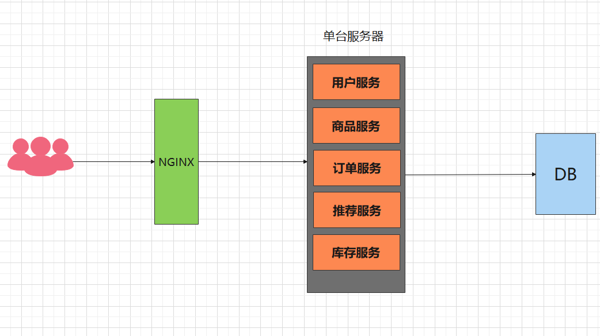
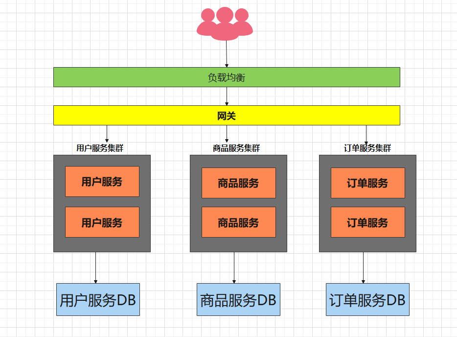
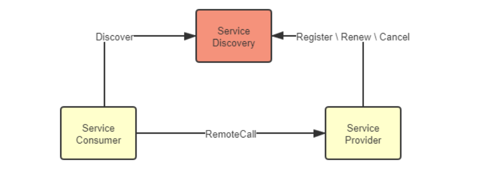
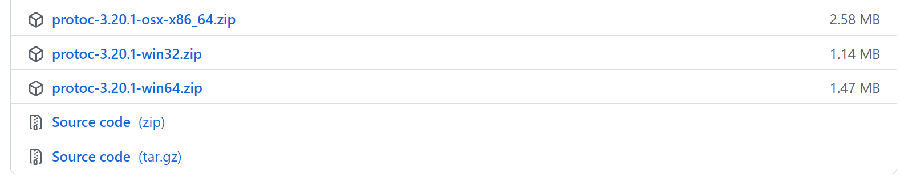
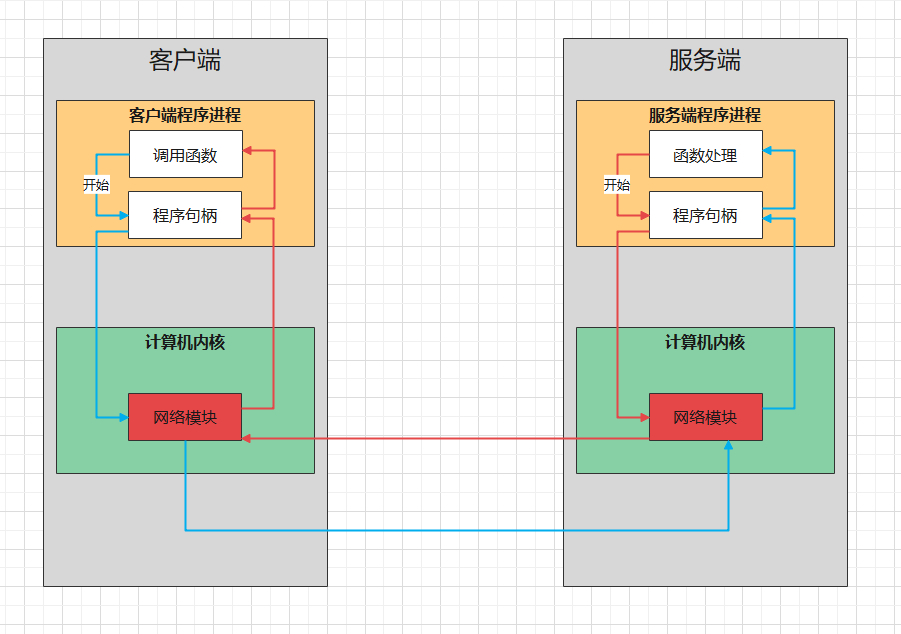
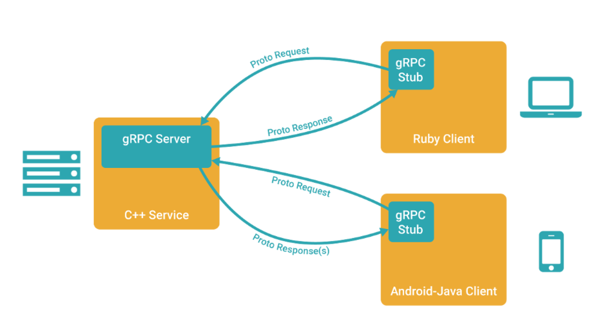
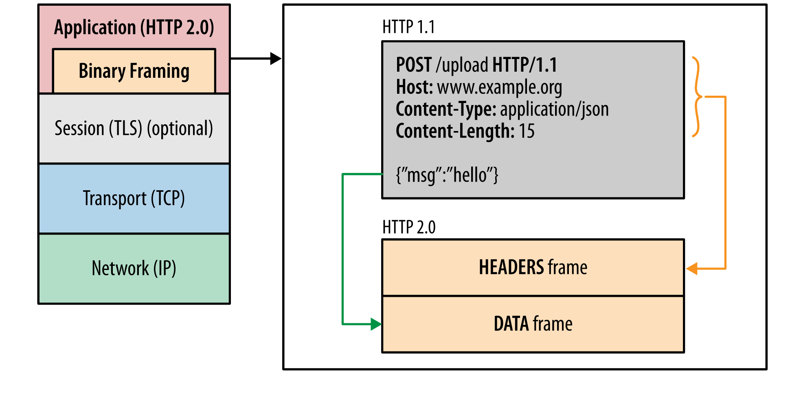
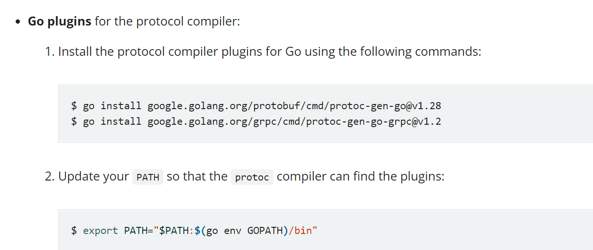

#  gRPC教程

## 1. 什么是微服务

### 1.1 单体架构



有一些致命缺点：

1. 一旦某个服务宕机，会引起整个应用不可用，隔离性差
2. 只能整体应用进行伸缩，浪费资源，可伸缩性差
3. 代码耦合在一起，可维护性差

### 1.2 微服务架构

要想解决上述的单体架构的问题，就需要将服务拆分出来，单独管理和维护。



通过上述的架构，解决了单体架构的弊端。

但同时引入了新的问题：

1. 代码冗余
2. 服务和服务之间存在调用关系

#### 1.2.1 代码冗余问题

> 服务未拆分之前，公共的功能有统一的实现，比如认证，授权，限流等，但是服务拆分之后，每一个服务可能都需要实现一遍

解决方案：

1. 由于为了保持对外提供服务的一致性，引入了网关的概念，由网关根据不同的请求，将其转发到不同的服务（路由功能），由于入口的一致性，可以在网关上实现公共的一些功能
2. 可以将公共的功能抽取出来，形成一个新的服务，比如统一认证中心

#### 1.2.2 服务之间调用

服务拆分后，服务和服务之间发生的是进程和进程之间的调用，服务器和服务器之间的调用。

那么就需要发起网络调用，网络调用我们能立马想起的就是http，但是在微服务架构中，http虽然便捷方便，但性能较低，这时候就需要引入RPC（远程过程调用），通过自定义协议发起TCP调用，来加快传输效率。

> 每个服务由于可能分布在成千上百台机器上，服务和服务之间的调用，会出现一些问题，比如，如何知道应该调用哪台机器上的服务，调用方可能需要维护被调用方的地址，这个地址可能很多，增加了额外的负担，这时候就需要引入服务治理.

服务治理中有一个重要的概念`服务发现`，服务发现中有一个重要的概念叫做`注册中心`。



每个服务启动的时候，会将自身的服务和ip注册到注册中心，其他服务调用的时候，只需要向注册中心申请地址即可。

> 当然，服务和服务之间调用会发生一些问题，为了避免产生连锁的雪崩反应，引入了服务容错，为了追踪一个调用所经过的服务，引入了链路追踪，等等这些就构建了一个微服务的生态

## 2. gRPC

> 上面我们讲到，服务和服务之间调用需要使用RPC，`gRPC`是一款**语言中立**、**平台中立**、开源的远程过程调用系统，`gRPC`客户端和服务端可以在多种环境中运行和交互，例如用`java`写一个服务端，可以用`go`语言写客户端调用

数据在进行网络传输的时候，需要进行序列化，序列化协议有很多种，比如xml, json，protobuf等

gRPC默认使用`protocol buffers`，这是google开源的一套成熟的结构数据序列化机制。

在学习gRPC之前，需要先了解`protocol buffers`

**序列化**：将数据结构或对象转换成二进制串的过程。

**反序列化**：将在序列化过程中所产生的二进制串转换成数据结构或对象的过程。

## 3. protobuf

protobuf是谷歌开源的一种数据格式，适合高性能，对响应速度有要求的数据传输场景。因为profobuf是二进制数据格式，需要编码和解码。数据本身不具有可读性。因此只能反序列化之后得到真正可读的数据。

优势：

1. 序列化后体积相比Json和XML很小，适合网络传输
2. 支持跨平台多语言
3. 消息格式升级和兼容性还不错
4. 序列化反序列化速度很快

### 3.1 安装

- 第一步：下载通用编译器

  地址：https://github.com/protocolbuffers/protobuf/releases

  根据不同的操作系统，下载不同的包，我是windows电脑，解压出来是`protoc.exe`

  

- 第二步：配置环境变量

  ![image-20220423002031614](data:image/png;base64,iVBORw0KGgoAAAANSUhEUgAAAakAAAArCAYAAADCI3c8AAAG3UlEQVR4nO3dsW6jSBgH8D+n61PsK4AiF34AeAMsF1Roq+gq0GmlO1OsdI0rNyulMHvS6mSqU0oqF5Z5A/MAFJYFD5F9Al+BwWMz2NiOY+L7/6QUFgN8w5D5YGbiKK+vr2sA+PuffzH8608QEdF9+PnzZ+22Hz9+AAC+fPlSW+bh4QGjb9/xx++/vXlsTf1yszMTEREdwSRFREStxSRFREStdfskFblQDB/ZdQ4OV3ERXeXY9O4yH4ZiwL/OzVJ3UviGArfuJrpJTET/HyckqfyXVVHEn7oEEMG9q1/ce6pPBPdo+yF/eCjL7dddPMax65KXNW5x8XbqIKurGNs9tTHR/Tj5TcqZr7Feb37mQE+RPWWa+DoGwtm9/Ma/Z32OPLlffOwprE37zZ0APemJIrijDtKynbvwtKKTz+AbPSTjVLKtWg9FmQLOG4WvDrBYLzBQG5SNXChiHdYTmPsR+iME5acz2/iUmIjoZJcN95kTrNMxkl61k1L7NhDOrjSM9/7uoz4qBottZ21aDpCsJHUyMVkMUPa7pgUHCVYZgGyGMHYwLHpl8yvGeoBpJUupGCzy5GBdpS6HZPBHCcYvQh0qRXw8hTbGQgK9jzYmui+Xz0mpfdhFJyWOz6t92PDwXOm8xKEiBUovOLjd8DMUT+WGMBaT+YYwlyXbR2bv3DtDQMUbzG6Z8kVDWp8j++xvr4l3G0cEV9HgxUDQa1L+0DU7LpoG0O1+fUe+LYgAXTyqANIlYscS3kpUPHaBZHVZ1x65Ytx5fcrrWMxbZj6MnWtlwPfdar2zGULYwHPdNcngP3noDgd4FIOovWe3MVXauGlMRHSWKy6cUDEYOgh2HrEjuEoPEIYM5ztDQRFcZYROWmxPYYca3Cg/Vlw+5WaYhTGc4QBq7T778eTnLoepyuHK3Q4/6G2Hw9ZzB0H5liirz7F99rYvinjr4jAxWacY65th1aPl5fVaHBp7ynwYmw50ah0pW5TvBXDm+RtYtkoOlz+T1tERL9P8QzRFoutl4qtPpjG8pZXXOx0D3lP+gJQuEccelta6ug1A5GoI7RST/fG/C9r4aExEdJY3SlI6Ohqq4/OmBSeYbn+ZoykCfYyvQudgWkKWiqYIEMPTiifW/K0iWWX5seIQM2HIyTKP7CPanPtF7JQlQ1VFZyzdvl+fJvvsb28YR+O4ZdvzHeWLG9QBFpvO1poqB1dWZr4BRQthp+uyQ1cfuzWlT1GNTe3b0DfXNpomsF+G6IYzZMiwSnTYfVky1TEubia1D1sXNwn3mTrA0Inz+abIRS+RXa+NM9u4UUxEdLLLk1T0DA82pH0ITFhOgNEpj5L6WJjsFt8MTFibjiabhcD467bTqN2n0QnzBNvIGfVp7JQ4mpQ3MSmvh3xi35zMt4l/T+Qq0JZD+b4781gZVgnQfTxl5YAkNrUPW0+wyiJMExt9VUMHIWZRPnQnv79qaB3Ic0MKfxQAsQdtkyR7ARB7mpCsr9nGRHSqy5JU5ELpCRPUkr8ZMfMlU3kHYFpwYnHMP8s7jbLw/nYgcrfDKvmxnvEcYvtkfWSf/WM/icFJEqw41JP5T/CKNzZZfRruc04cjctX6h/Br+tgMx+GK8Y6QqBvjiO2XeZjFDiYV8fD8rcIcd4meoaHzVvLRX8zpKJvA+HTCEH3EWrxeRQCTebNdg6Vzy2V1yzzMQp02H1zs5hjd7hZH6ebodWiihe2MRG9mZOTVNATJvBHHaTHlt+qfdgontZNTOaOcIwnwBYnpUxM0jES4RxTSxhmUfuwESDoDoVzHtlHPPZ6jq6nCYs2gPlidwWYg2m5XfO6mO8vXd6pT8N9TopDRd/WhYUTx8rv13+Kx7oGUQd46Yx2Y11IVsClS8QI0NtZrFEsFlAxeBHOJ7mG51L7NhDHcDa9f/4ZNUN9B4+EwUK4ZpqH7vyEZeIXtzERvRXlPb4FPfONfOhI9mTeGhl8Q8NyuJZMqO+VLOujNd6HPpaPcc8SHcZvQW9IHQylk9Ef1b3Vh6rYxkTt8Ov7nMbEZH1PT6RFfTKsbh0KXcm93bNEH9M7JamPIP+GhOvvQ0RETd3+W9CJiIhqVN6kDk20ERHRx/Dw8HDrEN5EJUndS8WIiKjep0+fbh1CI5yTIiL6H/r8+fOtQ2iEc1JERNRaTFJERNRaTFJERNRaTFJERNRaTFJERNRaTFJERNRaTFJERNRaTFJERNRaTFJERNRaTFJERNRaTFJERNRaTFJERNRaTFJERNRaTFJERNRaTFJERNRaTFJERNRa/KeHRER36h7+0/pOkhp9+36rOIiIiCqU19fX9a2DICIikuGcFBERtRaTFBERtdZ/tyATAYaZiKEAAAAASUVORK5CYII=)

- 第三步：安装go专用的protoc的生成器

```go
go get github.com/golang/protobuf/protoc-gen-go
```

安装后会在`GOPATH`目录下生成可执行文件，protobuf的编译器插件`protoc-gen-go`，执行`protoc`命令会自动调用这个插件

> 如何使用protobuf呢？

1. 定义了一种源文件，扩展名为 `.proto`，使用这种源文件，可以定义存储类的内容(消息类型)
2. protobuf有自己的编译器 `protoc`，可以将 `.proto` 编译成对应语言的文件，就可以进行使用了

### 3.2 hello world

> 假设，我们现在需要传输用户信息，其中有username和age两个字段

```protobuf
// 指定的当前proto语法的版本，有2和3
syntax = "proto3";
//option go_package = "path;name"; ath 表示生成的go文件的存放地址，会自动生成目录的
// name 表示生成的go文件所属的包名
option go_package="../service";
// 指定等会文件生成出来的package
package service;

message User {
  string username = 1;
  int32 age = 2;
}
```

**运行protoc命令编译成go中间文件**

```go
# 编译user.proto之后输出到service文件夹
protoc --go_out=../service user.proto
```

**测试**

```go
package main

import (
	"fmt"
	"google.golang.org/protobuf/proto"
	"testProto/service"
)

func main()  {
	user := &service.User{
		Username: "mszlu",
		Age: 20,
	}
	//转换为protobuf
	marshal, err := proto.Marshal(user)
	if err != nil {
		panic(err)
	}
	newUser := &service.User{}
	err = proto.Unmarshal(marshal, newUser)
	if err != nil {
		panic(err)
	}
	fmt.Println(newUser.String())
}
```

### 3.3 proto文件介绍

#### 3.3.1 message介绍

`message`：`protobuf`中定义一个消息类型是通过关键字`message`字段指定的。

消息就是需要传输的数据格式的定义。

message关键字类似于C++中的class，Java中的class，go中的struct

例如：

```protobuf
message User {
  string username = 1;
  int32 age = 2;
}
```

在消息中承载的数据分别对应于每一个字段。

其中每个字段都有一个名字和一种类型 。

#### 3.3.2 字段规则

- `required`:消息体中必填字段，不设置会导致编解码异常。（例如位置1）
- `optional`: 消息体中可选字段。（例如位置2）
- `repeated`: 消息体中可重复字段，重复的值的顺序会被保留（例如位置3）在go中重复的会被定义为切片。

```protobuf
message User {
  string username = 1;
  int32 age = 2;
  optional string password = 3;
  repeated string address = 4;
}
```

#### 3.3.3 字段映射

| **.proto Type** | **Notes**                                                    | **C++ Type** | **Python Type** | **Go Type** |
| --------------- | ------------------------------------------------------------ | ------------ | --------------- | ----------- |
| double          |                                                              | double       | float           | float64     |
| float           |                                                              | float        | float           | float32     |
| int32           | 使用变长编码，对于负值的效率很低，如果你的域有 可能有负值，请使用sint64替代 | int32        | int             | int32       |
| uint32          | 使用变长编码                                                 | uint32       | int/long        | uint32      |
| uint64          | 使用变长编码                                                 | uint64       | int/long        | uint64      |
| sint32          | 使用变长编码，这些编码在负值时比int32高效的多                | int32        | int             | int32       |
| sint64          | 使用变长编码，有符号的整型值。编码时比通常的 int64高效。     | int64        | int/long        | int64       |
| fixed32         | 总是4个字节，如果数值总是比总是比228大的话，这 个类型会比uint32高效。 | uint32       | int             | uint32      |
| fixed64         | 总是8个字节，如果数值总是比总是比256大的话，这 个类型会比uint64高效。 | uint64       | int/long        | uint64      |
| sfixed32        | 总是4个字节                                                  | int32        | int             | int32       |
| sfixed32        | 总是4个字节                                                  | int32        | int             | int32       |
| sfixed64        | 总是8个字节                                                  | int64        | int/long        | int64       |
| bool            |                                                              | bool         | bool            | bool        |
| string          | 一个字符串必须是UTF-8编码或者7-bit ASCII编码的文 本。        | string       | str/unicode     | string      |
| bytes           | 可能包含任意顺序的字节数据。                                 | string       | str             | []byte      |

#### 3.3.4 默认值

protobuf3 删除了 protobuf2 中用来设置默认值的 default 关键字，取而代之的是protobuf3为各类型定义的默认值，也就是约定的默认值，如下表所示：

| 类型     | 默认值                                                       |
| :------- | :----------------------------------------------------------- |
| bool     | false                                                        |
| 整型     | 0                                                            |
| string   | 空字符串""                                                   |
| 枚举enum | 第一个枚举元素的值，因为Protobuf3强制要求第一个枚举元素的值必须是0，所以枚举的默认值就是0； |
| message  | 不是null，而是DEFAULT_INSTANCE                               |

#### 3.3.5 标识号

`标识号`：在消息体的定义中，每个字段都必须要有一个唯一的标识号，标识号是[0,2^29-1]范围内的一个整数。

```protobuf
message Person { 

  string name = 1;  // (位置1)
  int32 id = 2;  
  optional string email = 3;  
  repeated string phones = 4; // (位置4)
}
```

以Person为例，name=1，id=2, email=3, phones=4 中的1-4就是标识号。

#### 3.3.6 定义多个消息类型

一个proto文件中可以定义多个消息类型

```go
message UserRequest {
  string username = 1;
  int32 age = 2;
  optional string password = 3;
  repeated string address = 4;
}

message UserResponse {
  string username = 1;
  int32 age = 2;
  optional string password = 3;
  repeated string address = 4;
}
```

#### 3.3.7 嵌套消息

可以在其他消息类型中定义、使用消息类型，在下面的例子中，Person消息就定义在PersonInfo消息内，如 ：

```protobuf
message PersonInfo {
    message Person {
        string name = 1;
        int32 height = 2;
        repeated int32 weight = 3;
    } 
	repeated Person info = 1;
}
```

如果你想在它的父消息类型的外部重用这个消息类型，你需要以PersonInfo.Person的形式使用它，如：

```protobuf
message PersonMessage {
	PersonInfo.Person info = 1;
}
```

当然，你也可以将消息嵌套任意多层，如 :

```protobuf
message Grandpa { // Level 0
    message Father { // Level 1
        message son { // Level 2
            string name = 1;
            int32 age = 2;
    	}
	} 
    message Uncle { // Level 1
        message Son { // Level 2
            string name = 1;
            int32 age = 2;
        }
    }
}
```

#### 

如果想要将消息类型用在RPC系统中，可以在.proto文件中定义一个RPC服务接口，protocol buffer 编译器将会根据所选择的不同语言生成服务接口代码及存根。

```protobuf
service SearchService {
	//rpc 服务的函数名 （传入参数）返回（返回参数）
	rpc Search (SearchRequest) returns (SearchResponse);
}
```

上述代表表示，定义了一个RPC服务，该方法接收SearchRequest返回SearchResponse

## 4. gRPC实例

### 4.1 RPC和gRPC介绍

RPC（Remote Procedure Call）远程过程调用协议，一种通过网络从远程计算机上请求服务，而不需要了解底层网络技术的协议。RPC它假定某些协议的存在，例如TCP/UDP等，为通信程序之间携带信息数据。在OSI网络七层模型中，RPC跨越了传输层和应用层，RPC使得开发包括网络分布式多程序在内的应用程序更加容易。

过程是什么？ 过程就是业务处理、计算任务，更直白的说，就是程序，就是像调用本地方法一样调用远程的过程

RPC采用客户端/服务端的模式，通过request-response消息模式实现



gRPC 里*客户端*应用可以像调用本地对象一样直接调用另一台不同的机器上*服务端*应用的方法，使得您能够更容易地创建分布式应用和服务。与许多 RPC 系统类似，gRPC 也是基于以下理念：定义一个*服务*，指定其能够被远程调用的方法（包含参数和返回类型）。在服务端实现这个接口，并运行一个 gRPC 服务器来处理客户端调用。在客户端拥有一个*存根*能够像服务端一样的方法。



官方网站：https://grpc.io/

底层协议：

- HTTP2: https://github.com/grpc/grpc/blob/master/doc/PROTOCOL-HTTP2.md
- GRPC-WEB ： https://github.com/grpc/grpc/blob/master/doc/PROTOCOL-WEB.md

#### 4.1.1 HTTP2



- HTTP/1里的header对应HTTP/2里的 HEADERS frame
- HTTP/1里的payload对应HTTP/2里的 DATA frame

gGRPC把元数据放到HTTP/2 Headers里，请求参数序列化之后放到 DATA frame里

**基于HTTP/2 协议的优点**

1. 公开标准
2. HTTP/2的前身是Google的[SPDYopen in new window](https://en.wikipedia.org/wiki/SPDY) ，有经过实践检验
3. HTTP/2 天然支持物联网、手机、浏览器
4. 基于HTTP/2 多语言客户端实现容易
   1. 每个流行的编程语言都会有成熟的HTTP/2 Client
   2. HTTP/2 Client是经过充分测试，可靠的
   3. 用Client发送HTTP/2请求的难度远低于用socket发送数据包/解析数据包
5. HTTP/2支持Stream和流控
6. 基于HTTP/2 在Gateway/Proxy很容易支持
   1. nginx和envoy都有支持
7. HTTP/2 安全性有保证
   1. HTTP/2 天然支持SSL，当然gRPC可以跑在clear text协议（即不加密）上。
   2. 很多私有协议的rpc可能自己包装了一层TLS支持，使用起来也非常复杂。开发者是否有足够的安全知识？使用者是否配置对了？运维者是否能正确理解？
   3. HTTP/2 在公有网络上的传输上有保证。比如这个[CRIME攻击open in new window](https://en.wikipedia.org/wiki/CRIME)，私有协议很难保证没有这样子的漏洞。
8. HTTP/2 鉴权成熟
   1. 从HTTP/1发展起来的鉴权系统已经很成熟了，可以无缝用在HTTP/2上
   2. 可以从前端到后端完全打通的鉴权，不需要做任何转换适配

**基于HTTP/2 协议的缺点**

- rpc的元数据的传输不够高效

  尽管HPAC可以压缩HTTP Header，但是对于rpc来说，确定一个函数调用，可以简化为一个int，只要两端去协商过一次，后面直接查表就可以了，不需要像HPAC那样编码解码。 可以考虑专门对gRPC做一个优化过的HTTP/2解析器，减少一些通用的处理，感觉可以提升性能。

- HTTP/2 里一次gRPC调用需要解码两次

  一次是HEADERS frame，一次是DATA frame。

- HTTP/2 标准本身是只有一个TCP连接，但是实际在gRPC里是会有多个TCP连接，使用时需要注意。

gRPC选择基于HTTP/2，那么它的性能肯定不会是最顶尖的。但是对于rpc来说中庸的qps可以接受，通用和兼容性才是最重要的事情。

- 官方的benchmark：https://grpc.io/docs/guides/benchmarking.html
- https://github.com/hank-whu/rpc-benchmark

gRPC目前是k8s生态里的事实标准，而Kubernetes又是容器编排的事实标准。gRPC已经广泛应用于Istio体系，包括:

- Envoy与Pilot(现在叫istiod)间的XDS协议
- mixer的handler扩展协议
- MCP(控制面的配置分发协议)

在Cloud Native的潮流下，开放互通的需求必然会产生基于HTTP/2的RPC。

### 4.2 实例

#### 4.2.1 服务端

```go
// 这个就是protobuf的中间文件

// 指定的当前proto语法的版本，有2和3
syntax = "proto3";
option go_package="../service";

// 指定等会文件生成出来的package
package service;

// 定义request model
message ProductRequest{
	int32 prod_id = 1; // 1代表顺序
}

// 定义response model
message ProductResponse{
	int32 prod_stock = 1; // 1代表顺序
}

// 定义服务主体
service ProdService{
    // 定义方法
    rpc GetProductStock(ProductRequest) returns(ProductResponse);
}
```

生成：

```bash
protoc --go_out=plugins=grpc:./ .\product.proto
```

服务端：

```go
import "google.golang.org/grpc"

func main()  {
	server := grpc.NewServer()
	service.RegisterProdServiceServer(server,service.ProductService)

	listener, err := net.Listen("tcp", ":8002")
	if err != nil {
		log.Fatal("服务监听端口失败", err)
	}
	_ = server.Serve(listener)
}
```

#### 4.2.2 客户端

新建client目录，把上述生成的product.pb.go copy过来

```go
func main()  {
	// 1. 新建连接，端口是服务端开放的8002端口
	// 没有证书会报错
	conn, err := grpc.Dial(":8002", grpc.WithTransportCredentials(insecure.NewCredentials()))
	if err != nil {
		log.Fatal(err)
	}

	// 退出时关闭链接
	defer conn.Close()

	// 2. 调用Product.pb.go中的NewProdServiceClient方法
	productServiceClient := service.NewProdServiceClient(conn)

	// 3. 直接像调用本地方法一样调用GetProductStock方法
	resp, err := productServiceClient.GetProductStock(context.Background(), &service.ProductRequest{ProdId: 233})
	if err != nil {
		log.Fatal("调用gRPC方法错误: ", err)
	}

	fmt.Println("调用gRPC方法成功，ProdStock = ", resp.ProdStock)
}
```

# 认证

> 客户端和服务端之间调用，我们可以通过加入证书的方式，实现调用的安全性

TLS（Transport Layer Security，安全传输层)，TLS是建立在`传输层`TCP协议之上的协议，服务于应用层，它的前身是SSL（Secure Socket Layer，安全套接字层），它实现了将应用层的报文进行加密后再交由TCP进行传输的功能。

TLS协议主要解决如下三个网络安全问题。

- 保密(message privacy)，保密通过加密encryption实现，所有信息都加密传输，第三方无法嗅探；
- 完整性(message integrity)，通过MAC校验机制，一旦被篡改，通信双方会立刻发现；
- 认证(mutual authentication)，双方认证,双方都可以配备证书，防止身份被冒充；

## 1. 生成自签证书

> 生产环境可以购买证书或者使用一些平台发放的免费证书

- 安装openssl

  网站下载：http://slproweb.com/products/Win32OpenSSL.html

  （mac电脑 自行搜索安装）

- 生成私钥文件

  ```bash
  ## 需要输入密码
  openssl genrsa -des3 -out ca.key 2048
  ```

  1
  2

- 创建证书请求

  ```bash
  openssl req -new -key ca.key -out ca.csr
  ```

  1

- 生成ca.crt

  ```bash
  openssl x509 -req -days 365 -in ca.csr -signkey ca.key -out ca.crt
  ```

  1

找到openssl.cnf 文件

1. 打开copy_extensions = copy

2. 打开 req_extensions = v3_req

3. 找到[ v3_req ],添加 subjectAltName = @alt_names

4. 添加新的标签 [ alt_names ] , 和标签字段

   ```ini
   [ alt_names ]
   
   DNS.1 = *.mszlu.com
   ```

   1
   2
   3

5. 生成证书私钥server.key

   ```bash
   openssl genpkey -algorithm RSA -out server.key
   ```

   1

6. 通过私钥server.key生成证书请求文件server.csr

   ```bash
   openssl req -new -nodes -key server.key -out server.csr -days 3650 -config ./openssl.cnf -extensions v3_req
   ```

   1

7. 生成SAN证书

   ```bash
   openssl x509 -req -days 365 -in server.csr -out server.pem -CA ca.crt -CAkey ca.key -CAcreateserial -extfile ./openssl.cnf -extensions v3_req
   ```

   1

- **key：** 服务器上的私钥文件，用于对发送给客户端数据的加密，以及对从客户端接收到数据的解密。
- **csr：** 证书签名请求文件，用于提交给证书颁发机构（CA）对证书签名。
- **crt：** 由证书颁发机构（CA）签名后的证书，或者是开发者自签名的证书，包含证书持有人的信息，持有人的公钥，以及签署者的签名等信息。
- **pem：** 是基于Base64编码的证书格式，扩展名包括PEM、CRT和CER。

什么是 SAN？

SAN（Subject Alternative Name）是 SSL 标准 x509 中定义的一个扩展。使用了 SAN 字段的 SSL 证书，可以扩展此证书支持的域名，使得一个证书可以支持多个不同域名的解析。

## 2. 服务端应用证书

将`server.key`和`server.pem` copy到程序中

```go
func main()  {

	//添加证书
	file, err2 := credentials.NewServerTLSFromFile("keys/mszlu.pem", "keys/mszlu.key")
	if err2 != nil {
		log.Fatal("证书生成错误",err2)
	}
	rpcServer := grpc.NewServer(grpc.Creds(file))

	service.RegisterProdServiceServer(rpcServer,service.ProductService)

	listener ,err := net.Listen("tcp",":8002")
	if err != nil {
		log.Fatal("启动监听出错",err)
	}
	err = rpcServer.Serve(listener)
	if err != nil {
		log.Fatal("启动服务出错",err)
	}
	fmt.Println("启动grpc服务端成功")
}
```

## 3. 客户端认证

公钥copy到客户端

```go
func main()  {
	file, err2 := credentials.NewClientTLSFromFile("client/keys/mszlu.pem", "*.mszlu.com")
	if err2 != nil {
		log.Fatal("证书错误",err2)
	}
	conn, err := grpc.Dial(":8002", grpc.WithTransportCredentials(file))

	if err != nil {
		log.Fatal("服务端出错，连接不上",err)
	}
	defer conn.Close()

	prodClient := service.NewProdServiceClient(conn)

	request := &service.ProductRequest{
		ProdId: 123,
	}
	stockResponse, err := prodClient.GetProductStock(context.Background(), request)
	if err != nil {
		log.Fatal("查询库存出错",err)
	}
	fmt.Println("查询成功",stockResponse.ProdStock)
}
```

上述认证方式为单向认证：


中间人攻击

## 4. 双向认证


上面的server.pem和server.key 是服务端的 公钥和私钥。

如果双向认证，客户端也需要生成对应的公钥和私钥。

私钥：

```bash
openssl genpkey -algorithm RSA -out client.key
```

证书:

```bash
openssl req -new -nodes -key client.key -out client.csr -days 3650 -config ./openssl.cnf -extensions v3_req
```

SAN证书：

```bash
openssl x509 -req -days 365 -in client.csr -out client.pem -CA ca.crt -CAkey ca.key -CAcreateserial -extfile ./openssl.cnf -extensions v3_req
```

服务端：

```go
func main()  {

	//添加证书
	//file, err2 := credentials.NewServerTLSFromFile("keys/mszlu.pem", "keys/mszlu.key")
	//if err2 != nil {
	//	log.Fatal("证书生成错误",err2)
	//}
	// 证书认证-双向认证
	// 从证书相关文件中读取和解析信息，得到证书公钥、密钥对
	cert, err := tls.LoadX509KeyPair("keys/mszlu.pem", "keys/mszlu.key")
	if err != nil {
		log.Fatal("证书读取错误",err)
	}
	// 创建一个新的、空的 CertPool
	certPool := x509.NewCertPool()
	ca, err := ioutil.ReadFile("keys/ca.crt")
	if err != nil {
		log.Fatal("ca证书读取错误",err)
	}
	// 尝试解析所传入的 PEM 编码的证书。如果解析成功会将其加到 CertPool 中，便于后面的使用
	certPool.AppendCertsFromPEM(ca)
	// 构建基于 TLS 的 TransportCredentials 选项
	creds := credentials.NewTLS(&tls.Config{
		// 设置证书链，允许包含一个或多个
		Certificates: []tls.Certificate{cert},
		// 要求必须校验客户端的证书。可以根据实际情况选用以下参数
		ClientAuth: tls.RequireAndVerifyClientCert,
		// 设置根证书的集合，校验方式使用 ClientAuth 中设定的模式
		ClientCAs: certPool,
	})

	rpcServer := grpc.NewServer(grpc.Creds(creds))

	service.RegisterProdServiceServer(rpcServer,service.ProductService)

	listener ,err := net.Listen("tcp",":8002")
	if err != nil {
		log.Fatal("启动监听出错",err)
	}
	err = rpcServer.Serve(listener)
	if err != nil {
		log.Fatal("启动服务出错",err)
	}
	fmt.Println("启动grpc服务端成功")
}
```

客户端：

```go
func main()  {
	//file, err2 := credentials.NewClientTLSFromFile("client/keys/mszlu.pem", "*.mszlu.com")
	//if err2 != nil {
	//	log.Fatal("证书错误",err2)
	//}
	// 证书认证-双向认证
	// 从证书相关文件中读取和解析信息，得到证书公钥、密钥对
	cert, _ := tls.LoadX509KeyPair("client/keys/test.pem", "client/keys/test.key")
	// 创建一个新的、空的 CertPool
	certPool := x509.NewCertPool()
	ca, _ := ioutil.ReadFile("client/keys/ca.crt")
	// 尝试解析所传入的 PEM 编码的证书。如果解析成功会将其加到 CertPool 中，便于后面的使用
	certPool.AppendCertsFromPEM(ca)
	// 构建基于 TLS 的 TransportCredentials 选项
	creds := credentials.NewTLS(&tls.Config{
		// 设置证书链，允许包含一个或多个
		Certificates: []tls.Certificate{cert},
		// 要求必须校验客户端的证书。可以根据实际情况选用以下参数
		ServerName: "*.mszlu.com",
		RootCAs:    certPool,
	})

	conn, err := grpc.Dial(":8002", grpc.WithTransportCredentials(creds))

	if err != nil {
		log.Fatal("服务端出错，连接不上",err)
	}
	defer conn.Close()

	prodClient := service.NewProdServiceClient(conn)

	request := &service.ProductRequest{
		ProdId: 123,
	}
	stockResponse, err := prodClient.GetProductStock(context.Background(), request)
	if err != nil {
		log.Fatal("查询库存出错",err)
	}
	fmt.Println("查询成功",stockResponse.ProdStock)
}
```

## 5. Token认证

### 5.1 服务端添加用户名密码的校验

```go
func main()  {
	var authInterceptor grpc.UnaryServerInterceptor
	authInterceptor = func(
		ctx context.Context,
		req interface{},
		info *grpc.UnaryServerInfo,
		handler grpc.UnaryHandler,
	) (resp interface{}, err error) {
		//拦截普通方法请求，验证 Token
		err = Auth(ctx)
		if err != nil {
			return
		}
		// 继续处理请求
		return handler(ctx, req)
	}
	server := grpc.NewServer(grpc.UnaryInterceptor(authInterceptor))
	service.RegisterProdServiceServer(server,service.ProductService)

	listener, err := net.Listen("tcp", ":8002")
	if err != nil {
		log.Fatal("服务监听端口失败", err)
	}
	err = server.Serve(listener)
	if err != nil {
		log.Fatal("服务、启动失败", err)
	}
	fmt.Println("启动成功")
}


func Auth(ctx context.Context) error {
	md, ok := metadata.FromIncomingContext(ctx)
	if !ok {
		return fmt.Errorf("missing credentials")
	}
	var user string
	var password string

	if val, ok := md["user"]; ok {
		user = val[0]
	}
	if val, ok := md["password"]; ok {
		password = val[0]
	}

	if user != "admin" || password != "admin" {
		return status.Errorf(codes.Unauthenticated, "token不合法")
	}
	return nil
}
```

### 5.2 客户端实现

客户端需要实现 `PerRPCCredentials` 接口。

```go
type PerRPCCredentials interface {
	// GetRequestMetadata gets the current request metadata, refreshing
	// tokens if required. This should be called by the transport layer on
	// each request, and the data should be populated in headers or other
	// context. If a status code is returned, it will be used as the status
	// for the RPC. uri is the URI of the entry point for the request.
	// When supported by the underlying implementation, ctx can be used for
	// timeout and cancellation. Additionally, RequestInfo data will be
	// available via ctx to this call.
	// TODO(zhaoq): Define the set of the qualified keys instead of leaving
	// it as an arbitrary string.
	GetRequestMetadata(ctx context.Context, uri ...string) (map[string]string, error)
	// RequireTransportSecurity indicates whether the credentials requires
	// transport security.
	RequireTransportSecurity() bool
}
```

`GetRequestMetadata` 方法返回认证需要的必要信息，`RequireTransportSecurity` 方法表示是否启用安全链接，在生产环境中，一般都是启用的，但为了测试方便，暂时这里不启用了。

实现接口：

```go
type Authentication struct {
    User     string
    Password string
}

func (a *Authentication) GetRequestMetadata(context.Context, ...string) (
    map[string]string, error,
) {
    return map[string]string{"user": a.User, "password": a.Password}, nil
}

func (a *Authentication) RequireTransportSecurity() bool {
    return false
}
```

应用：

```go
user := &auth.Authentication{
		User: "admin",
		Password: "admin",
	}
	conn, err := grpc.Dial(":8002", grpc.WithTransportCredentials(insecure.NewCredentials()),grpc.WithPerRPCCredentials(user))
	
```

#  新版本

前面的课程中，我们使用的proto的go生成器，使用的命令是

go get github.com/golang/protobuf/protoc-gen-go，在https://www.grpc.io/docs/languages/go/quickstart/ 中，我们发现



官方使用的和我们使用的并不一致。

github的方式，需要使用`--go_out=plugins=grpc` 来去进行生成，而在golang.org方式中，弃用了这种方式，使用`protoc-gen-go`将不在支持gRPC service的定义，需要使用新的插件`protoc-gen-go-grpc`。

> 所以，这里，我们以新的方式，重新实现一下服务端和客户端

## 1. 使用google.golang.org/protobuf

1. 安装插件

   ```bash
   $ go install google.golang.org/protobuf/cmd/protoc-gen-go@v1.28
   $ go install google.golang.org/grpc/cmd/protoc-gen-go-grpc@v1.2
   ```

   1
   2

   安装完成后会在gopath下的bin目录下生成

   

2. 利用proto文件重新生成go文件

   ```bash
   protoc  --go_out=./service --go-grpc_out=./service  pbfile\product.proto
   ```

   1

3. 修改之前的service实现

   ```go
   package service
   
   import (
   	"context"
   )
   
   var ProductService = &productService{}
   
   type productService struct {
   }
   
   func (p *productService) GetProductStock(ctx context.Context, request *ProductRequest) (*ProductResponse, error) {
   	return &ProductResponse{ProdStock: request.ProdId}, nil
   }
   func (p *productService) mustEmbedUnimplementedProdServiceServer() {}
   ```

   1
   2
   3
   4
   5
   6
   7
   8
   9
   10
   11
   12
   13
   14
   15
   16

4. 测试

## 2. import使用

> 用于导入其他proto文件

```go
// 这个就是protobuf的中间文件

// 指定的当前proto语法的版本，有2和3
syntax = "proto3";
//从执行 protoc这个命令的当前目录开始算起，
import "pbfile/user.proto";

option go_package="../service";

// 指定等会文件生成出来的package
package service;

// 定义request model
message ProductRequest{
  int32 prod_id = 1; // 1代表顺序
}

// 定义response model
message ProductResponse{
  int32 prod_stock = 1; // 1代表顺序
  User user = 2;
}

// 定义服务主体
service ProdService{
  // 定义方法
  rpc GetProductStock(ProductRequest) returns(ProductResponse);
}
```

### 2.1 Any

> 任意类型

```protobuf
// 使用any类型，需要导入这个
import "google/protobuf/any.proto";

// 定义入参消息
message HelloParam{
  // any，代表可以是任何类型
  google.protobuf.Any data = 1;
}
```

```go
// 这个就是protobuf的中间文件

// 指定的当前proto语法的版本，有2和3
syntax = "proto3";
//从执行 protoc这个命令的当前目录开始算起，
import "user.proto";
// 使用any类型，需要导入这个
import "google/protobuf/any.proto";

option go_package="../service";

// 指定等会文件生成出来的package
package service;

// 定义request model
message ProductRequest{
  int32 prod_id = 1; // 1代表顺序
}

message Content {
  string msg = 1;
}
// 定义response model
message ProductResponse{
  int32 prod_stock = 1; // 1代表顺序
  User user = 2;
  google.protobuf.Any data = 3;
}

// 定义服务主体
service ProdService{
  // 定义方法
  rpc GetProductStock(ProductRequest) returns(ProductResponse);
}
```

```go
func (p *productService) GetProductStock(context context.Context, request *ProductRequest) (*ProductResponse, error) {
	//实现具体的业务逻辑
	stock := p.GetStockById(request.ProdId)
	user := User{Username: "mszlu"}
	content := Content{Msg: "mszlu msg..."}
	//转换成any类型
	any, _ := anypb.New(&content)
	return &ProductResponse{ProdStock: stock, User: &user, Data: any}, nil
}
```

## 3. stream

在 HTTP/1.1 的时代，同一个时刻只能对一个请求进行处理或者响应，换句话说，下一个请求必须要等当前请求处理完才能继续进行。

> HTTP/1.1需要注意的是，在服务端没有response的时候，客户端是可以发起多个request的，但服务端依旧是顺序对请求进行处理, 并按照收到请求的次序予以返回。

HTTP/2 的时代，多路复用的特性让一次同时处理多个请求成为了现实，并且同一个 TCP 通道中的请求不分先后、不会阻塞，HTTP/2 中引入了流(Stream) 和 帧(Frame) 的概念，当 TCP 通道建立以后，后续的所有操作都是以流的方式发送的，而二进制帧则是组成流的最小单位，属于协议层上的流式传输。

> HTTP/2 在一个 TCP 连接的基础上虚拟出多个 Stream, Stream 之间可以并发的请求和处理, 并且 HTTP/2 以二进制帧 (frame) 的方式进行数据传送, 并引入了头部压缩 (HPACK), 大大提升了交互效率

### 3.1 定义

```protobuf
 1  // 普通 RPC
 2  rpc SimplePing(PingRequest) returns (PingReply);
 3
 4  // 客户端流式 RPC
 5  rpc ClientStreamPing(stream PingRequest) returns (PingReply);
 6
 7  // 服务器端流式 RPC
 8  rpc ServerStreamPing(PingRequest) returns (stream PingReply);
 9
10  // 双向流式 RPC
11  rpc BothStreamPing(stream PingRequest) returns (stream PingReply);
```

`stream`关键字，当该关键字修饰参数时，表示这是一个客户端流式的 gRPC 接口；当该参数修饰返回值时，表示这是一个服务器端流式的 gRPC 接口；当该关键字同时修饰参数和返回值时，表示这是一个双向流式的 gRPC 接口。

### 3.2 客户端流

定义：

```protobuf
rpc UpdateStockClientStream(stream ProductRequest) returns(ProductResponse);
```

```go
//....	
stream, err := prodClient.UpdateProductStockClientStream(context.Background())
	if err != nil {
		log.Fatal("获取流出错", err)
	}
	rsp := make(chan struct{}, 1)
	go prodRequest(stream, rsp)
	select {
	case <-rsp:
		recv, err := stream.CloseAndRecv()
		if err != nil {
			log.Fatal(err)
		}
		stock := recv.ProdStock
		fmt.Println("客户端收到响应：", stock)
```

```go
func prodRequest(stream service.ProdService_UpdateProductStockClientStreamClient, rsp chan struct{}) {
	count := 0
	for {
		request := &service.ProductRequest{
			ProdId: 123,
		}
		err := stream.Send(request)
		if err != nil {
			log.Fatal(err)
		}
		time.Sleep(time.Second)
		count++
		if count > 10 {
			rsp <- struct{}{}
			break
		}
	}
}
```

```go
func (p *productService) UpdateProductStockClientStream(stream ProdService_UpdateProductStockClientStreamServer) error {
	count := 0
	for {
		//源源不断的去接收客户端发来的信息
		recv, err := stream.Recv()
		if err != nil {
			if err == io.EOF {
				return nil
			}
			return err
		}
		fmt.Println("服务端接收到的流", recv.ProdId, count)
		count++
		if count > 10 {
			rsp := &ProductResponse{ProdStock: recv.ProdId}
			err := stream.SendAndClose(rsp)
			if err != nil {
				return err
			}
			return nil
		}
	}
}
```

### 3.3 服务端流

定义：

```protobuf
rpc GetProductStockServerStream(ProductRequest) returns(stream ProductResponse);
```

```go
func (p *productService) GetProductStockServerStream(request *ProductRequest, stream ProdService_GetProductStockServerStreamServer) error {
	count := 0
	for {
		rsp := &ProductResponse{ProdStock: request.ProdId}
		err := stream.Send(rsp)
		if err != nil {
			return err
		}
		time.Sleep(time.Second)
		count++
		if count > 10 {
			return nil
		}
	}
}
```

```go
request := &service.ProductRequest{
		ProdId: 123,
	}

	stream, err := prodClient.GetProductStockServerStream(context.Background(), request)
	if err != nil {
		log.Fatal("获取流出错", err)
	}

	for {
		recv, err := stream.Recv()
		if err != nil {
			if err == io.EOF {
				fmt.Println("客户端数据接收完成")
				err := stream.CloseSend()
				if err != nil {
					log.Fatal(err)
				}
				break
			}
			log.Fatal(err)
		}
		fmt.Println("客户端收到的流", recv.ProdStock)
	}
```

### 3.4 双向流

```go
stream, err := prodClient.SayHelloStream(context.Background())

	for {
		request := &service.ProductRequest{
			ProdId: 123,
		}
		err = stream.Send(request)
		if err != nil {
			log.Fatal(err)
		}
		time.Sleep(time.Second)
		recv, err := stream.Recv()
		if err != nil {
			log.Fatal(err)
		}
		//websocket
		fmt.Println("客户端收到的流信息", recv.ProdStock)
	}
```

```go
func (p *productService) SayHelloStream(stream ProdService_SayHelloStreamServer) error {
	for {
		recv, err := stream.Recv()
		if err != nil {
			return nil
		}
		fmt.Println("服务端收到客户端的消息", recv.ProdId)
		time.Sleep(time.Second)
		rsp := &ProductResponse{ProdStock: recv.ProdId}
		err = stream.Send(rsp)
		if err != nil {
			return nil
		}
	}
}
```
