# Kotlin程序设计中级篇

我们在前面已经学习了Kotlin程序设计的基础篇，本章我们将继续介绍更多Kotlin特性，以及面向对象编程。

## 函数

其实函数我们在一开始就在使用了：

```kotlin
fun main() {
		println("Hello World")
}
```

我们程序的入口点就是`main`函数，我们只需要将我们的程序代码编写到主函数中就可以运行了，不过这个函数只是由我们来定义，而不是我们自己来调用。当然，除了主函数之外，我们一直在使用的`println`也是一个函数，不过这个函数是标准库中已经实现好了的，现在是我们在调用这个函数：

```kotlin
println("Hello World!");    //直接通过 函数名称(参数...) 的形式调用函数
```

那么，函数的具体定义是什么呢？

> 函数是完成特定任务的独立程序代码单元。

其实简单来说，函数是为了完成某件任务而生的，可能我们要完成某个任务并不是一行代码就可以搞定的，但是现在可能会遇到这种情况：

```kotlin
fun main() {
    var a = 10

    println("H") //比如下面这三行代码就是我们要做的任务
    println("A")
    a += 10

    if (a > 20) {
        println("H") //这里我们还需要执行这个任务
        println("A")
        a += 10
    }

    when (a) {
        30 -> {
            println("H") //这里又要执行这个任务
            println("A")
            a += 10
        }
    }
}
```

我们每次要做这个任务时，都要完完整整地将任务的每一行代码都写下来，如果我们的程序中多处都需要执行这个任务，每个地方都完整地写一遍，实在是太臃肿了，有没有一种更好的办法能优化我们的代码呢？

这时我们就可以考虑使用函数了，我们可以将我们的程序逻辑代码全部编写到函数中，当我们执行函数时，实际上执行的就是函数中的全部内容，也就是按照我们制定的规则执行对应的任务，每次需要做这个任务时，只需要调用函数即可。

我们来看看，如何创建和使用函数。

### 创建和使用函数

Kotlin函数使用`fun`关键字声明：

```kotlin
fun 函数名称([函数参数...]): 返回值类型 {
    //函数体
}
```

其中函数名称也是有要求的，并不是所有的字符都可以用作函数名称，它的命名规则与变量的命名规则基本一致，所以这里就不一一列出了。函数不仅仅需要完成我们的任务，可能某些函数还需要告诉我们结果，我们同样可以将函数返回的结果赋值给变量或是参与运算等等，当然如果我们的函数只需要完成任务，不需要告诉我们结果，返回值类型可以不填，我们先从最简单的开始：

```kotlin
//这个函数用于打印一段文本
fun hello(): Unit {  //本质上应该是返回Unit类型，这个类型表示空，类似于Java中的void，默认情况下可以省略
    println("PHP是世界上最好的语言.kt")
}
```

我们要调用这个函数也很简单，只需要像下面这样就可以了：

```kotlin
fun main() {
    hello()     //调用函数只需使用 函数名() 即可
}
```

不过，有些时候，我们可能需要外部传入一些参数来使用，比如：

```kotlin
fun say(message: String){   //在定义函数时，可以将参数写到
    println("我说：$message")
}
```

这里我们在函数的小括号中填入的就是形式参数，这代表调用函数时需要传入的数据，比如这里就是我们要打印的字符串，而实际在调用函数时，填入的内容就是实际参数：

```kotlin
fun main() {
  	//在调用带参数的函数时，必须填写实参，否则无法编译通过
  	//这里填入的内容就是实际参数
    say("你干嘛")
  	//也可以将变量作为实际参数传入
  	val str: String = "哎哟"
    say(str)
}
```

还有一些时候，我们的函数可能需要返回一个计算的结果给调用者，我们也可以设定函数的返回值：

```kotlin
//这个函数用于计算两个Int数之和
fun sum(a: Int, b: Int) : Int {
    return a + b  //使用return语句将结果返回
}
```

带返回值的函数，调用之后得到的返回值，可以由变量接收，或是直接作为其他函数的参数：

```kotlin
fun main() {
    var result = sum(1, 2)   //获取函数返回值
    println(result)
    println(sum(2, 4))  //直接打印函数返回值
}
```

注意这个`return`关键字在执行之后，是不会继续执行之后的内容的：

```kotlin
fun main() {
    println(test(-2))
    println(test(10))
}

fun test(i: Int): String{
    if(i > 0) return "Hello"
  	println("继续")
    return "World"   //如果满足上面条件，在执行return之后，后续无论有没有执行完，都不会再往下了
}
```

有些时候，我们也可以设计一些参数带有默认值的函数，如果在调用函数时不填入参数，那么就使用我们一开始设置好的默认值作为实际传入的参数：

```kotlin
fun main() {
    test()   //调用函数时，如果对应参数有默认值，可以不填
}

fun test(text: String = "我是默认值"){
    println(text)
}
```

在调用函数时，我们可以手动指定传入的参数对应的是哪一个形式参数：

```kotlin
fun main() {
    test(b = 3)  //这里如果只想填写第二个参数b，我们可以直接指定吧实参给到哪一个形参
  	test(3)   //这种情况就是只填入第一个实参
}

fun test(a: Int = 6, b: Int = 10): Int {
    return a + b
}
```

对于一些内容比较简单的函数，比如上面仅仅是计算两个参数的和，我们可以直接省略掉花括号，像这样编写：

```kotlin
fun test(a: Int = 6, b: Int = 10): Int = a + b   //函数的结果直接缩减为 = a + b 效果跟之前是一样的
fun test(a: Int = 6, b: Int = 10) = a + b  //返回类型可以自动推断，这里可以吧返回类型省掉
```

这里还需要注意一下，函数的形式参数默认情况下为常量，无法进行修改，只能使用：

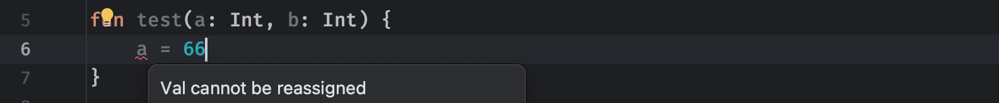

比较奇葩的是，函数内部也可以定义函数：

```kotlin
fun outer(){
    fun inner(){
        //函数内部定义的函数，无限套娃
    }
}
```

函数内的函数作用域是受限的，我们只能在函数内部使用：

```kotlin
fun outer(){
    fun inner(){
    }

    inner()
}
```

内部函数可以访问外部函数中的变量：

```kotlin
fun outer(){
    val a = 10;
    fun inner(){
        println(a)
    }
}
```

最后，我们不能同时编写多个同名函数，这会导致冲突：

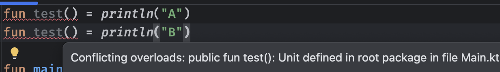

但是，如果多个同名函数的参数不一致，是允许的：

```kotlin
fun test() = println("A")
fun test(str: String) = println("B")  //参数列表不一致
```

我们在调用这个函数时，编译器会根据我们传入的实参自动匹配使用的函数是哪一个：

```kotlin
...

fun main() {
    test("")  //结果为B
}
```

以上适用于形参列表不同的情况，如果仅仅是返回值类型不同的情况，同样是不允许的：


像这种编写同名但不同参数的函数，我们称为*函数的重载*。

### 再谈变量

前面我们学习了如何使用变量，只不过当时我们仅仅是在main函数中使用的局部变量，我们也可以将变量的作用域进行提升，将其直接变成一个顶级定义：

```kotlin
var str: String = "尊嘟假嘟"   //跟定义函数一样，直接写在Kt文件中

fun main() {
    ...
}
```

此时，这个变量可以被所有的函数使用：

```kotlin
var str: String = "尊嘟假嘟"

fun main() = println(str)  //作用域的提升，使得变量可以被随意使用
fun test() = println(str)
```

以上也只是对变量的一些简单使用，现在变量的作用域被提升到顶层，它可以具有更多的一些特性，那么，我们就再来重新认识一下变量，声明一个变量的完整语法如下：

```kotlin
var <propertyName>[: <PropertyType>] [= <property_initializer>]
    [<getter>]
    [<setter>]
```

前面的我们知道，但是这个getter和setter是个什么鬼？对于这种顶层定义的变量（包括后面类中会用到的成员属性变量）可以具有这两个可选的函数，它们本质上是一个get和set函数：

* getter：用于获取这个变量的值，默认情况下直接返回当前这个变量的值
* setter：用于修改这个变量的值，默认情况下直接对这个变量的值进行修改

我们在使用这种全局变量时，对于变量的获取和设定，本质上都是通过其getter和setter函数来完成的，只不过默认情况下不需要我们去编写，程序编译之后，有点像这样的结果：

```kotlin
var name: String = "小明"

fun getName() : String {   //编译时自动生成了对应变量的get函数
    return this.name
}
  
fun setName(name: String) {  //编译时自动生成了set函数
   this.name = name;
}
```

而对于其使用，在编译之后，会变成这样：

```kotlin
fun main() {
    println(getName())   //获取name时本质上是调用getName函数
}
```

是不是感觉好神奇，一个变量都能搞这么多花样，这其实是为了后续多态的一些性质而设计的（下一章讲解）

可以看到，在默认情况下，变量的获取就是直接返回，设置就是直接修改，不过有些时候我们可能希望修改这些变量获取或修改时执行的操作，我们可以手动编写：

```kotlin
var str: String = "尊嘟假嘟"
    get() = field + field   //使用filed代表当前这个变量(字段)的值，这里返回值拼接的结果
```

> 这里使用的field准确的说应该是Kotlin提供的"后备字段"，因为我们使用getter和setter本质上替代了原有的获取和修改方式，使其变得更像是函数的调用，因此，为了能够继续像之前使用一个变量那样去操作它本身，就有了这个后备字段。

最后得到的就是：


甚至还可以写成这样，在获取的时候执行一些操作：

```kotlin
var str: String = "尊嘟假嘟"
    get() {
        println("获取变量的值：")   //获取的时候打印一段文本
        return field + "666"
    }

fun main() = println(str)
```

同样的，设置的时候也可以自定义：

```kotlin
var str: String = "尊嘟假嘟"
    get() = field + field
    set(value) {    //这里的value就是给过来的值
        println("设置变量的值")
        field = value   //注意，对于val类型的变量，没有set函数，因为不可变
    }
```

因此，一个变量有些时候可能会写成这样：

```kotlin
// 原本：val str = "你干嘛"
val str get() = "你干嘛"
```

当然，默认情况下其实没有必要去重写get和set除非特殊需求。

### 递归函数

我们前面学习了如何调用函数，实际上函数自己也可以调用自己。

```kotlin
fun test(){
    test()   //我自己调用自己
}
```

肯定会有小伙伴疑问，函数自己调用自己有什么意义？反而还会导致函数无限的调用下去，无穷无尽，确实，如果不加限制地让函数自己调用自己：

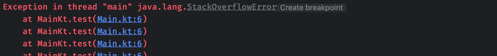

就会出现这种`爆栈`的情况，这是因为程序的内存是有限的，不可能无限制的继续调用下去，因此，在自我调用到一定的深度时，会被强制终止。所以说这玩意有啥用呢？如果我们对递归函数加以一些限制，或许会有意想不到的发现：

```kotlin
fun main() {
    test(5)  //计算0-5的和
}

//这个函数实现了计算0-n的和的功能
fun test(n: Int): Int{
    if(n <= 0) return 0  //当n等于0的时候就不再向下，而是直接返回0
    return n + test(n - 1)  //n不为0就返回当前的n加上test参数n-1的和
}
```

这个函数最终调用起来就像这样：

> test(5) = 5 + test(4) = 5 + 4 + test(3) =  ...  = 5 + 4 + 3 + 2 + 1 + 0

可以看到，只要合理使用递归函数，加以一定的结束条件，反而能够让我们以非常简洁的形式实现一个需要循环来完成的操作。

我们可以再来看一个案例：

> 斐波那契数列是一个非常经典的数列，它的定义是：前两个数是1和1，之后的每个数都是前两个数的和。
>
> 斐波那契数列的前几个数字依次是：1, 1, 2, 3, 5, 8, 13, 21, 34, 55, ...

对于求解斐波那契数列第N个数这类问题，我们也可以使用递归来实现：

```kotlin
fun main() {
    println(fib(5))
}

fun fib(n: Int): Int{
    if(n <= 2) return 1   //我们知道前两个一定是1，所以直接返回
    return fib(n - 1) + fib(n - 2)   //当前fib(n)的结果就是前两个结果之和，直接递归继续找
}
```

是不是感觉递归函数非常神奇？它甚至可以解决一些动态规划问题、一些分治算法等。

不过，这种函数的效率就非常低了，相比循环来说，使用递归解决斐波那契问题，时间复杂度会呈指数倍增长，且n大于20时基本可以说很卡了（可以想象一下，每一个fib(n)都会分两个出去，实际上这个中间存在大量重复的计算）

那么，有没有办法可以将这种尾部作为返回值进行递归的操作优化一下呢？我们可以使用`tailrec`关键字来实现：

```kotlin
tailrec fun test(n: Int, sum: Int = 0): Int {
    if(n <= 0) return sum   //到底时返回累加的结果
    return test(n - 1, sum + n)  //不断累加
}
```

实际上在编译之后，会变成这样：

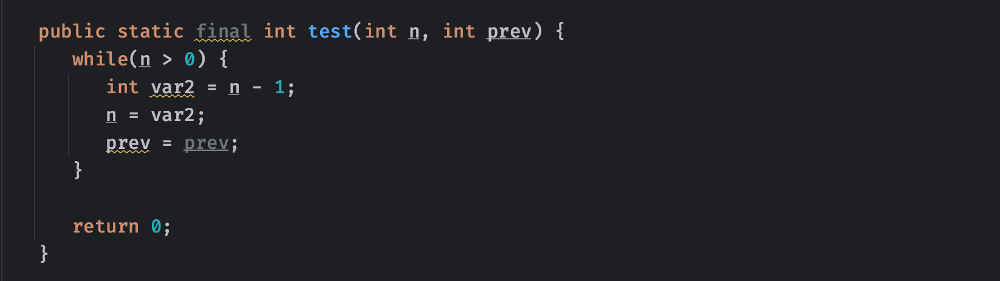

可以看到它变成了一个普通的循环操作，这也是编译器的功劳，同样的，对于斐波那契数列：

```kotlin
tailrec fun fib(n: Int, prev: Int = 0, next: Int = 1): Int {
    return if (n == 0) prev else fib(n - 1, next, prev + next)  //从0和1开始不断向后，直到n为0就返回
}
```

当一个函数被标记为 `tailrec`，编译器会检查这个函数的递归调用是否是尾递归，并进行相应的优化。

尾递归是一种特殊的递归形式，其中递归调用是函数的最后一个操作。这意味着在递归调用之后，函数不再需要进行任何计算或操作。由于这种特性，尾递归可以被编译器优化，从而避免栈溢出的问题。

当一个函数被标记为 `tailrec` 时，Kotlin 编译器会进行以下检查：

1. 递归调用必须是函数的最后一个操作。
2. 递归调用必须是对函数自身的直接调用，而不能是通过其他函数间接调用。

如果函数满足这些条件，编译器会将其优化为一个循环结构，从而避免了递归调用导致的栈溢出问题。这使得使用递归算法时，可以更加放心地编写高效的代码。

需要注意的是，即使一个函数被标记为 `tailrec`，但如果它不满足尾递归的条件，编译器会报错。因此，在使用 `tailrec` 关键字时，需要确保函数确实满足尾递归的要求。

### 实用库函数介绍

Kotlin为我们内置了大量实用的库函数，我们可以使用这些库函数来快速完成某些操作。

比如我们前面使用的`println`就是Kotlin提供的库函数，我们可以使用这个函数快速进行数据打印：

```kotlin
fun main() {
    println("Hello World")  //这里其实就是在调用函数，传入了一个String类型的参数
}
```

那既然现在有输出，能不能让用户输入，然后我们来读取呢？

```kotlin
fun main() {
    val text = readln()
    println("读取到用户输入：$text")
}
```

我们可以在控制台输入一段文本，然后回车结束：


Kotlin提供的运算符实际上只能进行一些在小学数学中出现的运算，但是如果我们想要进行乘方、三角函数之类的高级运算，就没有对应的运算符能够做到，而此时我们就可以使用数学工具类来完成。

```kotlin
import kotlin.math.*    //我们需要使用import来引入某些库，这样才能使用库函数

fun main() {
    1.0.pow(4.0)  //我们可以使用pow方法直接计算a的b次方
    abs(-1);    //abs方法可以求绝对值
    max(19, 20);    //快速取两个数的最大值
    min(2, 4);   //快速取最小值
    sqrt(9.0);    //求一个数的算术平方根
}
```

当然，三角函数肯定也是安排上了的：

```kotlin
fun main() {
    //这里我们可以直接使用库中预设好的PI
    sin(PI / 2);     //求π/2的正弦值，这里我们可以使用预置的PI进行计算
    cos(PI);       //求π的余弦值
    tan(PI / 4);    //求π/4的正切值

    asin(1.0);     //三角函数的反函数也是有的，这里是求arcsin1的值
    acos(1.0);
    atan(0.0);
}
```

可能在某些情况下，计算出来的浮点数会得到一个很奇怪的结果：

```kotlin
fun main() {
    println(sin(Math.PI));
}
```


正常来说，sinπ的结果应该是0才对，为什么这里得到的是一个很奇怪的数？这个E是干嘛的，这其实是科学计数法的10，后面的数就是指数，上面的结果其实就是：

- 1.2246467991473532×10−161.2246467991473532×10−16

其实这个数是非常接近于0，这是因为精度问题导致的，所以说实际上结果就是0。

我们也可以计算对数函数：

```kotlin
fun main() {
    ln(E)    //e为底的对数函数，其实就是ln，我们可以直接使用Math中定义好的e
    log10(100.0)    //10为底的对数函数
  	log2(8.0)    //2为底的对数函数
    //利用换底公式，我们可以弄出来任何我们想求的对数函数
    val a = ln(4.0) / ln(2.0) //这里是求以2为底4的对数，log(2)4 = ln4 / ln2
    println(a)
}
```

还有一些比较特殊的计算：

```kotlin
fun main() {
    ceil(4.5) //通过使用ceil来向上取整
    floor(5.6) //通过使用floor来向下取整
}
```

向上取整就是找一个大于当前数字的最小整数，向下取整就是砍掉小数部分。注意，如果是负数的话，向上取整就是去掉小数部分，向下取整就是找一个小于当前数字的最大整数。

### 高阶函数与lambda表达式

**注意：** 这一部分比较难理解，如果看不懂可以后面回来看。

Kotlin中的函数属于一等公民，它支持很多高级特性，甚至可以被存储在变量中，可以作为参数传递给其他高阶函数并从中返回，就想使用普通变量一样。 为了实现这一特性，Kotlin作为一种静态类型的编程语言，使用了一系列函数类型来表示函数，并提供了一套特殊的语言结构，例如lambda表达式。

那么这里说的高阶函数是什么，lambda表达式又是什么呢？

> 正是得益于函数可以作为变量的值进行存储，因此，如果一个函数接收另一个函数作为参数，或者返回值的类型就是一个函数，那么该函数称为高阶函数。

要声明函数类型，需要按照以下规则：

- 所有函数类型都有一个括号，并在括号中填写参数类型列表和一个返回类型，比如：`(A, B) -> C ` 表示一个函数类型，该类型表示接受类型`A`和`B`的两个参数并返回类型`C`的值的函数。参数类型列表可为空的，比如`() -> A`，注意，即使是`Unit`返回类型也不能省略。

我们可以像下面这样编写：

```kotlin
//典型的函数类型 (参数...) -> 类型  小括号中间是一个剪头一样的符号，然后最后是返回类型
var func0: (Int) -> Unit  //这里的 (Int) -> Unit 表示这个变量存储的是一个有一个int参数并且没有返回值的函数
var func1: (Double, Double) -> String   //同理，代表两个Double参数返回String类型的函数
```

同样的，作为函数的参数也可以像这样表示：

```kotlin
fun test(other: (Int) -> String){
}
```

#### 函数类型变量

函数类型的变量，我们可以将其当做一个普通的函数进行调用：

```kotlin
fun test(other: (Int) -> String){
    println(other(1))  //这里提供的函数接受一个Int参数返回string，那么我们可以像普通函数一样传入参数调用它
}
```

由于函数可以接受函数作为参数，所以说你看到这样的套娃场景也不奇怪：

```kotlin
var func: (Int) -> ((String) -> Double)
```

#### 类型别名

不过这样写可能有些时候不太优雅，我们可以为类型起别名来缩短名称：

```kotlin
typealias HelloWorld = (String) -> Double

fun main() {
    var func: HelloWorld
}
```

那么，函数类型我们知道如何表示了，如何具体表示一个函数呢？我们前面都是通过`fun`来声明函数：

```kotlin
fun test(str: String): Int {
    return 666
}
```

而现在我们的变量也可以直接表示这个函数：

```kotlin
fun main() {
  	//这个变量表示的也是(String) -> Int这种类型的函数
    var func: (String) -> Int = ::test   //使用双冒号来引用一个现成的函数（包括我们后续会学习的成员函数、构造函数等）
}

//这个函数正好与上面的变量表示的函数类型一致
fun test(str: String): Int {
    return 666
}
```

#### 匿名函数

除了引用现成的函数之外，我们也可以使用匿名函数，这是一种没有名称的函数：

```kotlin
fun main() {
    val func: (String) -> Int = fun(str: String): Int {  //这里写了fun关键字后，并没有编写函数名称，这种函数就是匿名函数，因为在这里也不需要什么名字，只需要参数列表函数体
        println("这是传入的内容$str")
        return 666
    }
}
```

匿名函数除了没名字之外，其他的用法跟函数是一样的。

#### 最后一行默认为返回值

最后，我们来看看今天的重量级嘉宾，不要小看了Kotlin的语法，我们也可以使用Lambda表达式来表示一个函数实例：

```kotlin
fun main() {
    var func: (String) -> Int = {  //一个Lambda表达式只需要直接在花括号中编写函数体即可
        println("这是传入的参数$it")   //默认情况下，如果函数只有一个参数，我们可以使用it代表传入的参数
        666   //跟之前的if表达式一样，默认最后一行为返回值
    }
  	func("HelloWorld!")
}
```

是不是感觉特别简便？


对于参数有多个的情况，我们也可以这样进行编写：

```kotlin
fun main() {
    val func: (String, String) -> Unit = { a, b ->   //我们需要手动添加两个参数这里的形参名称，不然没法用他两
        println("这是传入的参数$a, 第二个参数$b")   //直接使用上面的形参即可
    }
  	val func2: (String, String) -> Unit = { _, b ->
        println("这是传入的第二个参数$b")   //假如这里不使用第一个参数，也可以使用_下划线来表示不使用
    }
    func("Hello", "World")
}
```


是不是感觉玩的非常高级？还有更高级的在后面呢！

#### 单参的简写

我们接着来看，如果我们现在想要调用一个高阶函数，最直接的方式就是下面这样：

```kotlin
fun main() {
    val func: (Int) -> String = { "收到的参数为$it" }
    test(func)
}
// 那么参数那去了呢，kotlin提供了it作为参数的默认名称；
// 但只有一个参数时才能这么玩

fun test(func: (Int) -> String) {
    println(func(66))
}
```

当然我们也可以直接把一个Lambda作为参数传入作为实际参数使用：

```kotlin
fun main() {
    test({ "收到的参数为$it" })
}

fun test(func: (Int) -> String) {
    println(func(66))
}
```

不过这样还不够简洁，在Kotlin中，如果函数的最后一个形式参数是一个函数类型，可以把该参数直接写在括号后面，参数同样可以传入，就像下面这样：

```kotlin
fun main() {
  test() { "收到的参数为$it" }
}

fun test(func: (Int) -> String) {
    println(func(66))
}
```

如果小括号里面此时没有其他参数了，还能继续省，直接把小括号也给干掉：

```kotlin
//只有一个形参，且该形参为函数类型
test { "收到的参数为$it" }   //干脆连小括号都省了，这语法真的绝
```

当然，如果在这之前有其他的参数，只能写成这样了：

```kotlin
fun main() {
    test(1) { "收到的参数为$it" }
}

//这里两个参数，前面还有一个int类型参数，但是同样的最后一个参数是函数类型
fun test(i: Int, func: (Int) -> String) {
    println(func(66))
}
```

这种语法也被称为 尾随lambda表达式，能省的东西都省了，不过只有在最后一个参数是函数类型的情况下才可以，如果不是最后一位，就没办法做到尾随了。

最后需要特别注意的是，在Lambda中没有办法直接使用`return`语句返回结果，而是需要用到之前我们学习流程控制时用到的标签：

```kotlin
fun main() {
    val func: (Int) -> String = test@{
        //比如这里判断到it大于10就提前返回结果
        if(it > 10) return@test "我是提前返回的结果"
        println("我是正常情况")
        "收到的参数为$it"
    }
    test(func)
}

fun test(func: (Int) -> String) {
    println(func(66))
}
```

如果是函数调用的尾随lambda表达式，默认的标签名字就是函数的名字：

```kotlin
fun main() {
    testName {  //默认使用函数名称
        if(it > 10) return@testName "我是提前返回的结果"
        println("我是正常情况")
        "收到的参数为$it"
    }
}

fun testName(func: (Int) -> String) {
    println(func(66))
}
```

不过，为什么要这么麻烦呢，还要打标签才能返回，这不多此一举么？这个问题我们会在下一节内联函数中进行讲解。

### 内联函数

使用高阶函数会可能会影响运行时的性能：每个函数都是一个对象，而且函数内可以访问一些局部变量，但是这可能会在内存分配（用于函数对象和类）和虚拟调用时造成额外开销。

为了优化性能，开销可以通过内联Lambda表达式来消除。使用`inline`关键字会影响函数本身和传递给它的lambdas，它能够让方法的调用在编译时，直接替换为方法的执行代码，什么意思呢？比如下面这段代码：

```kotlin
fun main() {
    test()
}

//添加inline表示内联函数
inline fun test(){
    println("这是一个内联函数")
  	println("这是一个内联函数")
  	println("这是一个内联函数")
}
```

由于test函数是内联函数，在编译之后，会原封不动地把代码搬过去：

```kotlin
fun main() {
    println("这是一个内联函数")   //这里是test函数第一行，直接搬过来
  	println("这是一个内联函数")
  	println("这是一个内联函数")
}
```

同样的，如果是一个高阶函数，效果那就更好了：

```kotlin
fun main() {
    test { println("打印：$it") }
}

//添加inline表示内联函数
inline fun test(func: (String) -> Unit){
    println("这是一个内联函数")
    func("HelloWorld")
}
```

由于test函数是内联的高阶函数，在编译之后，不仅会原封不动地把代码搬过去，还会自动将传入的函数参数贴到调用的位置：

```kotlin
fun main() {
    println("这是一个内联函数")   //这里是test函数第一行
  	val it = "HelloWorld"  //这里是函数内传入的参数
    println("打印：$it")  //第二行是调用传入的函数，自动贴过来
}
```

内联会导致编译出来的代码变多，但是同样的换来了性能上的提升，不过这种操作仅对于高阶函数有显著效果，普通函数实际上完全没有内联的必要，也提升不了多少性能。

注意，内联函数中的函数形参，无法作为值给到变量，只能调用：

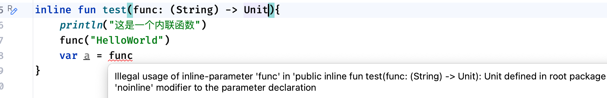

同样的，由于内联，导致代码被直接搬运，所以Lambda中的return语句可以不带标签，这种情况会导致直接返回：

```kotlin
fun main() {
    test { return }  //内联高阶函数的Lambda参数可以直接写return不指定标签
    println("调用上面方法之后")
}

inline fun test(func: (String) -> Unit){
    func("HelloWorld")
    println("调用内联函数之后")
}
```

上述代码的运行结果就是，直接结束，两句println都不会打印，这种情况被称为**非局部返回**。

回到上一节最后我们提出的问题，实际上，在Kotlin中Lambda表达式支持一个叫做"标签返回"（labeled return）的特性，这使得你能够从一个Lambda表达式中返回一个值给外围函数，而不是简单地返回给Lambda表达式所在的最近的封闭函数，就像下面这样：

```kotlin
fun main() {
    test { return@main }  //标签可以直接指定为外层函数名称main来提前终止整个外部函数
    println("调用上面方法之后")
}

inline fun test(func: (String) -> Unit){
    func("HelloWorld")
    println("调用内联函数之后")
}
```

效果跟上面是完全一样的，为了避免这种情况，我们也可以像之前一样将标签写为@test来防止非局部返回。

```kotlin
fun main() {
    test { return@test }  //这样就只会使test返回，而不会影响到外部函数了
    println("调用上面方法之后")
}
```

有些时候，可能一个内联的高阶函数中存在好几个函数参数，但是我们希望其中的某一个函数参数不使用内联，能够跟之前一样随意当做变量使用：

```kotlin
fun main() {
    test({ println("我是一号：$it") }, { println("我是二号：$it") })
}

//在不需要内联的函数形参上添加noinline关键字，来防止此函数的调用内联
inline fun test(func: (String) -> Unit, noinline func2: (Int) -> Unit){
    println("这是一个内联函数")
    func("HelloWorld")
  	var a = func2  //这样就不会报错，但是不会内联了
    func2(666)
}
```

最后编译出来的结果，类似于：

```kotlin
fun main() {
    println("这是一个内联函数")
    val it = "HelloWorld"
    println("打印：$it")
  	//第二个参数由于不是内联，这里依然作为Lambda使用
    val func2: (Int) -> Unit = { println("我是二号：$it") }
    func2(666)
}
```

由于目前知识的学习还不太够，函数我们只能先暂时告一段落，在后续的学习中我们会继续认识更多函数的特性。

***

## 类与对象

在之前，我们一直在使用顶层定义：

```kotlin
val a = 20   //直接在kt文件中定义变量

fun message() {   //直接在kt文件中定义函数
    println("我是测试方法")
}
```

而学习了类之后，这些内容也可以定义到类中，作为类的属性存在。

类的概念我们在生活中其实已经听说过很多了。

人类、鸟类、鱼类... 所谓类，就是对一类事物的描述，是抽象的、概念上的定义，比如鸟类，就泛指所有具有鸟类特征的动物。比如人类，不同的人，有着不同的性格、不同的爱好、不同的样貌等等，但是他们根本上都是人，所以说可以将他们抽象描述为人类。

对象是某一类事物实际存在的每个个体，因而也被称为实例（instance）我们每个人都是人类的一个实际存在的个体。


所以说，类就是抽象概念的人，而对象，就是具体的某一个人。

- A：是谁拿走了我的手机？
- B：是个人。（某一个类型）
- A：我还知道是个人呢，具体是谁呢？
- B：是XXX。（具体某个对象）

而在Kotlin中，也可以像这样进行编程，我们可以定义一个类，然后进一步创建许多这个类的实例对象，像这种编程方式，我们称为**面向对象编程**，我们除了去使用Kotlin给我们提供的类型之外，我们也可以使用自己定义的类。

### 类的定义与对象创建

前面我们介绍了什么是类，什么是对象，首先我们就来看看如何去定义一个类。

Kotlin中的类使用关键字`class`声明，我们可以直接在默认的Main.kt文件中编写：

```kotlin
class Student {
    //在没有任何内容时，花括号可以省略
}
```

我们在对类进行命名时，一般使用英文单词，并且首字母大写，跟变量命名一样，不能出现任何的特殊字符。

除了直接在某个.kt文件中直接编写之外，为了规范，我们一般将一个类单独创建一个文件，我们可以右键`src`目录：


这里选择新建，然后选择Kotlin类/文件选项，然后创建一个类：


文件创建完成后，默认也会为我们生成类的定义，并且类名称与创建的类文件是一模一样的：

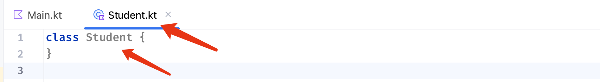

这是一个非常简单的类，但是肯定远远不够。

既然是学生类，那么肯定有学生相关的一些属性，比如名字、性别、年龄等等，那么怎么才能给这个类添加一些属性呢？我们需要指定类的构造函数，构造函数也是函数的一种，但是它是专用于对象的创建，Kotlin中的类可以添加一个*主构造函数*和一个或多个*次要构造函数*。主构造函数是类定义的一部分，像下面这样编写：

```kotlin
class Student constructor(name: String, age: Int) {
    //比如学生有name和age属性，那么我们可以在类名后面constructor的括号中编写，并用逗号隔开
  	//这里跟定义变量差不多，也是变量名称:类型，这些作为类的成员属性，后续可以在类中使用
}
```

如果主构造函数没有任何注释或可见性修饰符，则可以省略`constructor`关键字，如果类中没有其他内容要写，可以直接省略花括号，最后就变成这样了：

```kotlin
class Student(name: String, age: Int)
```

但是，这里仅仅是定义了构造函数的参数，这还不是类的属性，那么我们要怎么才能定义为类的属性呢？我们可以为这些属性添加`var`或`val`关键字来表示这个属性是可变还是不变的：

```kotlin
class Student(var name: String, val age: Int)
```

这跟我们之前使用变量基本一致：

* `val`：不可变属性
* `var`：可变属性

这样才算是定义了类的属性，我们也可以给这些属性设置初始值：

```kotlin
class Student(var name: String, val age: Int = 18)  //默认每个学生18岁
```

除了将属性添加到构造函数中，我们也可以将这些属性直接作为类的成员变量写到类中，但是这种情况必须要配一个默认值，否则无法通过编译：

```kotlin
class Student {
    var name: String = ""   //必须配一个默认值
    var age: Int = 0
}
```

这样我们就可以不编写主构造函数也能定义属性，但是这里仍然会隐式生成一个无参的构造函数，为了构造函数能够方便地传值初始化，也可以像这样写：

```kotlin
class Student(name: String, age: Int) {
    var name: String = name   //通过构造函数传递过来
    var age: Int = age
}
```

当然，如果各位不希望这些属性在一开始就有初始值，而是之后某一个时刻去设定初始值，我们也可以为其添加懒加载：

```kotlin
class Student {
    lateinit var name: String   //懒加载的属性可以不用在一开始赋值，但是在下一次使用之前一定要先完成赋值，否则报错
    var age: Int = 0
}
```

并且，像这样编写的类成员变量，也可以自定义对应的getter和setter属性：

```kotlin
class Shape(var width: Int, var height: Int) {
    val area get() = width * height
}
```

> `ateinit` 关键字用于表示一个非空类型的变量，其初始化值会在稍后的某个时刻被赋值。
>
> 然而，`lateinit` 关键字不能用于基本类型，因为它的值已经明确定义了（不是非空类型），如果你想在 Kotlin 中延迟初始化一个基本类型的变量，你可以考虑使用可空类型（如 `Int?`）并将其初始化为 `null`。然后，你可以在稍后的某个时刻将值赋给这个变量。这样做与使用 `lateinit` 关键字类似，但适用于基本类型。

那么，现在我们定义了主构造函数之后，该怎么去使用它呢？

跟我们调用普通函数一样，这里的函数名称就是类的名称，如果一个类没有编写构造函数，那么这个类默认情况下使用一个无参构造函数创建：

```kotlin
fun main() {
  	//我们可以直接使用 类名() 的形式创建对象
    Student()
}
```

如果是有构造函数的类，我们只需要填写需要的参数即可，调用之后，类的属性就是这里我们给进去的参数了：

```kotlin
fun main() {
  	//我们可以直接使用 类名(参数, 参数...) 的形式创建
    Student("小明", 18)
}
```

这样，我们就成功创建出了一个名字为小明的学生类型对象，但是这个对象仅仅是创建出来还不行，我们肯定需要去使用它。

实际上，我们可以像之前使用基本类型一样，使用对象，我们也可以使用一个变量去接收生成出来的对象：

```kotlin
fun main() {
  	//使用Student类型的变量接收构造方法得到的对象
    var stu: Student = Student("小明", 18)
}
```

有一个我们需要注意的点，这里的stu存放的是对象的引用，而不是本体，我们可以通过对象的引用来间接操作对象。

```kotlin
fun main() {
    val p1 = Student("小明", 18)
    val p2 = p1
}
```

这里，我们将变量p2赋值为p1的值，那么实际上只是传递了对象的引用，而不是对象本身的复制，这跟我们前面的基本数据类型有些不同，p2和p1都指向的是同一个对象（如果你学习过C语言，它就类似于指针一样的存在）


我们可以来测试一下：

```kotlin
fun main() {
    val s1 = Student("小明", 18)
    val s2 = s1
    println(s1 === s2)  //使用 === 可以判断两个变量引用的是不是同一个对象
}
```

但是如果我们像这样去编写：

```kotlin
fun main() {
    val s1 = Student("小明", 18)
    val s2 = Student("小明", 18)   //即使名字和年龄一样，但是由于这里重新创建了一次对象
    println(s1 === s2)  //这里比较的就不是同一个对象了
}
```

我们可以使用`.`运算符来访问对象的属性，比如我们要访问小明这个学生对象的属性：

```kotlin
fun main() {
    val stu = Student("小明", 18)
    println("对象的name = ${stu.name}, age = ${stu.age}")
}
```

获取和修改都是可以的：

```kotlin
fun main() {
    val stu = Student("小明", 18)
    stu.name = "大明"
    stu.age = 10   //由于age属性是val，所以说无法修改，只能读取
}
```

注意，不同对象的属性是分开独立存放的，虽然都是统一由类完成定义，但是每个对象都有一个自己的空间，修改一个对象的属性并不会影响到另一个相同类型的对象：

```kotlin
fun main() {
    val stu1 = Student("小明", 18)
    val stu2 = Student("小明", 18)
    stu1.name = "小红"
    println("${stu1.name}, ${stu2.name}")
}
```

除了直接使用主构造函数创建对象外，我们也可以添加一些次要构造函数，比如我们的学生可以只需要一个名字就能完成创建，我们可以直接在类中编写一个次要构造函数：

```kotlin
class Student(var name: String, val age: Int) {
    constructor(name: String) : this(name, 18)
}
```

如果该类有一个主构造函数，则每个次要构造函数需要通过另一个次要构造函数直接或间接委托给主构造函数。委托到同一类的另一个构造函数是`this`关键字完成的：

```kotlin
class Student(var name: String, val age: Int) {
  	//这里可以使用constructor关键字继续声明次要构造函数
  	//次要构造函数中的参数仅仅是表示传入的参数，不能像主构造函数那样定义属性
  	//这里的this表示是当前这个类，this()就是调用当前类的构造函数
    constructor(name: String) : this(name, 18)  //这里其实是调用主构造函数，并且参数只有name，年龄直接给个默认值18
}
```

如果一个类没有主构造函数，那么我们也可以直接在在类中编写次要构造函数，但是不需要主动委托一次主构造函数，他这里会隐式包含，所以说我们直接写就行了：

```kotlin
class Student {
    constructor(name: String)  //注意，这里的参数不是类属性，仅仅是一个形参！
}
```

次要构造函数和主构造函数一样，都可以用于对象的创建：

```kotlin
fun main() {
    val stu1 = Student("小明", 18)
    val stu2 = Student("小红")
}
```

并且次要构造函数可以编写自定义的函数体：

```kotlin
open class Student {
    constructor(str: String) {   //在使用辅助构造函数初始化对象时，会执行里面的内容
        println("我的名字是: $str")
    }
}
```

因此，主构造函数相比次要（辅助）构造函数：

* **主构造函数：**可以直接在主构造函数中定义类属性，使用更方便，但是主构造函数只能存在一个，并且无法编写函数体，只有为类属性做初始化赋值的效果。
* **辅助（次要）构造函数：**可以存在多个，并且可以自定义函数体，但是无法像主构造函数那样定义类属性，并且当类具有主构造函数时，所有次要构造函数必须直接或间接地调用主构造函数。

Kotlin语言本身比较灵活，类中并不是一定需要主构造函数，全部写辅助构造函数也是可以的，但是再怎么都得有构造函数。

下一部分我们接着来讨论对象的初始化。

### 对象的初始化

在对象创建时，我们可能需要做一些初始化工作，我们可以使用初始化代码块来完成，初始化代码块使用init关键字来完成。假如我们希望对象在创建的时候，如果年龄不足18岁，那么就设定为18岁：

```kotlin
class Student(var name: String, var age: Int) {  //由于主构造函数无法编写函数体
  	//因此我们可以在init的花括号中编写初始化代码
  	//注意这段初始化代码块，是在上面的类属性被赋值之后才执行的，所以说能拿到已经赋值的age属性
    init {
        println("我是初始化操作")
        if(age < 18) age = 18
        println("初始化操作结束")
    }
}
```

这样，我们在创建对象的时候，就会在创建的时候自动执行初始化代码块里面的代码：

```kotlin
fun main() {
    val stu = Student("小明", 15)
    println(stu.age)
}
```

可以看到初始化操作开始执行了：


初始化操作不仅仅可以有一个，也可以有很多个：

```kotlin
class Student {
    //注意，多个初始化操作时，从上往下按顺序执行
    init {
        println("我是一号初始化操作")
    }

    init {
        println("我是二号初始化操作")
    }
}
```

对于将成员属性写到类中的情况，同样是按照顺序向下执行，比如：

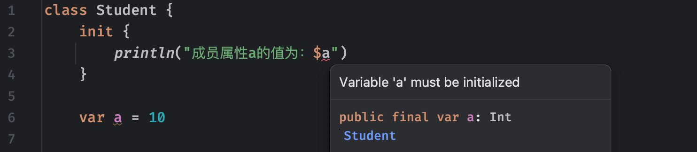

因为成员变量a是在初始化代码块的后面才初始化的，这里会报错。

如果一个类具有次要构造函数，那么我们也可以直接在次要构造函数中编写一些初始化代码：

```kotlin
class Student(var name: String, var age: Int) {
    constructor(name: String) : this(name, 18) {
        println("我是次要构造函数中的语句")
    }
}
```

当我们使用对应的次要构造函数时，就会执行次要构造函数中的初始化代码了。

这里需要注意一下，次要构造函数实际上需要先执行主构造函数，而在执行主构造函数时，会优先将之前我们讲解的初始化代码块执行，比如下面的代码：

```kotlin
class Student(var name: String, var age: Int) {

    init {
        println("我是初始化代码块")
    }

    constructor(name: String) : this(name, 18) {
        println("我是次要构造函数")
    }
}
```

无论是有主构造函数还是没有主构造函数（会生成一个默认的无参构造函数）都会先执行。

### 类的成员函数

现在我们的类有了属性，我们可以为创建的这些对象设定不同的属性值，比如每个人的名字都不一样，性别不一样，年龄不一样等等。只不过光有属性还不行，对象还需要具有一定的行为，就像我们人可以行走，可以跳跃，可以思考一样。

而对象也可以做出一些行为，我们可以通过定义函数来实现，类的函数和我们之前编写的函数有一些区别，它是属于这个类的，我们之前使用的函数都是直接编写在Kt文件中，它们都是顶级函数。

```kotlin
class Student(var name: String, var age: Int) {
    //这个函用于跟大家打招呼
    fun hello(){
        println("大家好啊")
    }
}
```

要使用类的成员函数，我们只能通过对象来进行调用：

```kotlin
fun main() {
    val stu = Student("小明", 18)
  	//调用类中的成员方法，同样使用.运算符即可
    stu.hello()  //让小明这个对象给大家打招呼
}
```

是不是稍微有一些体会了？好像真的是我们在让对象执行一个动作一样。在类的成员函数中，我们可以直接访问当前类对象中的一些属性，比如我们这里的用户名和年龄：

```kotlin
class Student(var name: String, var age: Int) {
    fun hello(){
        println("大家好啊，我叫$name，今年${age}岁了")
    }
}
```

注意，这里我们访问的name和age属性，是当前这个对象的name和age属性。比如：

```kotlin
fun main() {
    val stu = Student("小明", 18)
    stu.hello()  //让小明这个对象给大家打招呼

    val stu2 = Student("小红", 17)
    stu2.hello()  //让小红这个对象给大家打招呼
}
```

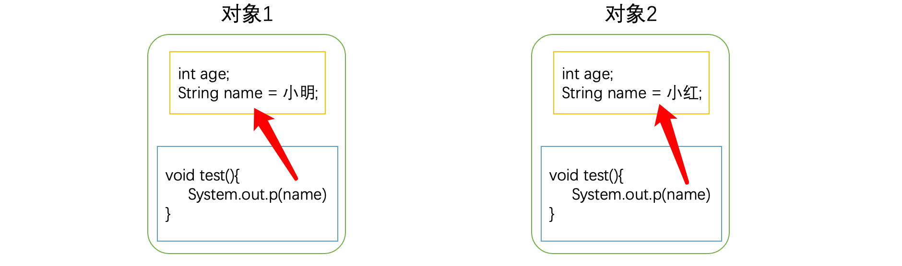

注意，下面这种情况，我们需要特殊处理：

```kotlin
class Student(var name: String, var age: Int) {
    //此时函数的参数也有一个name变量，而类的成员也有一个name属性
    fun hello(name: String){
        //这里得到的name是哪一个？
        println("大家好啊，我叫$name，今年${age}岁了")
    }
}
```

如果函数中的变量存在歧义，那么优先使用作用域最近的一个，比如函数形参的name作用域更近，那么这里的name拿到的一个是形参name，而不是类的成员属性name。

如果我们需要获取的是类中的成员属性，需要使用`this`关键字来表示当前类：

```kotlin
fun hello(name: String){
    //使用this关键字表示当前对象，这样就可以指定这里是类中的this了
    println("大家好啊，我叫${this.name}，今年${age}岁了")
}
```

默认情况下，如果作用域不冲突，使用类中属性`this`可以省略。

在类中，我们同样可以定义多个同名但不同参数的函数实现重载：

```kotlin
class Student(private var name: String, private var age: Int) {
    fun hello() = println("大家好啊，我叫${this.name}，今年${age}岁了")
    fun hello(gender: String) = println("大家好啊，我叫${this.name}，今年${age}岁了，性别${gender}")
}
```

实际上类中的函数使用起来跟我们之前定义的大差不差，只不过多了更多用法而已。

### 再谈基本类型

在Kotlin中，万物皆为对象，实际上我们在上一章学习的全部基本类型，都是官方为我们提供的类。

现在我们学习了类与对象的知识，就可以来重新认识一下这些基本类型，实际上这些基本类型同样是类，也具有一些属性，以及一些类中的成员函数。实际上在上一章中，我们就已经开始使用类和对象了，我们对这些基本类型的操作同样是在操作对象：

```kotlin
fun main() {
    var a = 10   //这里其实是一个Int类型的对象，值为10，而a持有的是对这个Int对象的引用
    var b = a    //这里的b复制了对上面Int类型对象的引用
}
```

> **特别说明：** 在Kotlin中，虽然编码时万物皆对象，但是在最终编译时，会根据上下文进行优化性能，大部分情况下会优先编译为Java原生基本数据类型（不是对象）而另一部分情况下才会编译为Java中的Integer包装类型。因此很容易出现以下迷惑行为：
>
> ```kotlin
> val a: Int = 12345
> val b: Int = 12345
> println(a === b)   //true
> ```
>
> ```kotlin
> val a: Int? = 12345
> val b: Int? = 12345
> println(a === b)   //false
> ```
>
> 各位小伙伴可以在完整学习Java和后续Kotlin内容之后再来探究这个问题。
>
> 注：由于优化，-128-127用===判断也是true

既然这些基本类型也是类，那么肯定同样具有成员属性和成员函数，我们可以使用这些成员方法方便我们的项目开发，比如我们之前遇到的一个很麻烦的问题，不同类型的数无法相互转换：

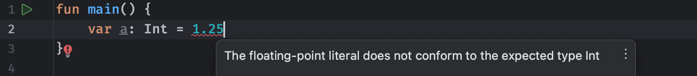

这些时候可能我们需要将对应类型的数据转换为其他类型，那么该怎么办呢，实际上，在这些基本类型中都提供了对应类型转换成员函数，这里我们可以使用`toInt`来直接将Double类型的数据转换为Int类型：

```kotlin
fun main() {
    var a: Int = 1.25.toInt()  //使用类中的类型转换函数
}
```

这样就可以编译通过了。同样的，每个基本类型都有对应的类型转换函数，而且非常全面，比如Int类型：

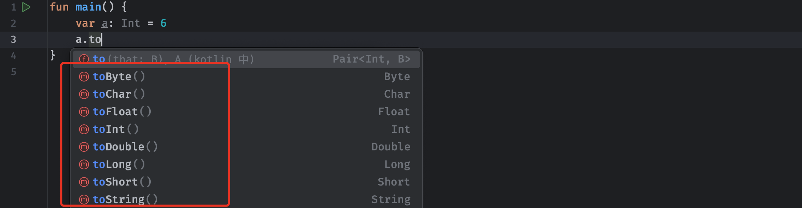

有了这些成员函数，就大幅度方便了我们的类型转换，再比如我们常见的String类型，也有很多函数可以使用：

```kotlin
fun main() {
    val a = "HelloWorld"
  	//使用lowercase和uppercase可以快速将字符串中的字母进行大小写转换
    println(a.lowercase())
    println(a.uppercase())
}
```

不过需要注意的是，我们在前面就说过，字符串一旦创建就是不可变的，因此，字符串中所有的函数得到的新字符串，都是重新创建的一个新的对象，而不是在原本的字符串上进行修改。

我们继续来看看一些有意思的函数，比如我们想批量替换字符串中的某些内容：

```kotlin
fun main() {
    val a = "Hello World!"
    println(a.replace("o", "a"))
}
```

将字符串中所有的字母`o`替换为`a`，直接使用replace函数就能直接生成替换之后的字符串了。又比如我们要判断某个字符串是否以指定文本开头：

```kotlin
fun main() {
    val a = "Hello World!"
    println(a.startsWith("Hel"))
}
```

可以看到这里经过判断得到了一个Boolean类型的结果，还有很多用于判断字符串是否为空、是否有空格等等的函数：

```kotlin
fun main() {
    val a = "Hello World!"
    a.isBlank()
    a.isEmpty()
}
```

我们还发现，这些基本类型中有一些比较特殊的函数，比如`plus`函数：


这个函数在类中定义长这样：

```kotlin
public operator fun plus(other: Long): Long
```

这个函数添加了一个`operator`关键字，这个是什么呢？这其实是运算符重载，能够自定义运算符实现的功能，我们之前使用这些数字进行运算，比如加减乘除，实际上都是这些基本类型在类中重载了运算符实现的，下一部分，我们就来介绍一下运算符重载函数。

### 运算符重载函数

Kotlin支持为程序中已知的运算符集提供自定义实现，这些运算符具有固定的符号表示（如`+`或`*`）以及对应的优先级，要实现运算符重载，请为相应类型提供具有对应运算符指定名称的成员函数，而当前的类对象，则直接作为对应运算符左边的操作数，如果是一元运算符（比如++自增运算符，只需要本事）则直接作为操作数参与运算。

比如，现在我们想要为我们自定义的类型支持加法运算：

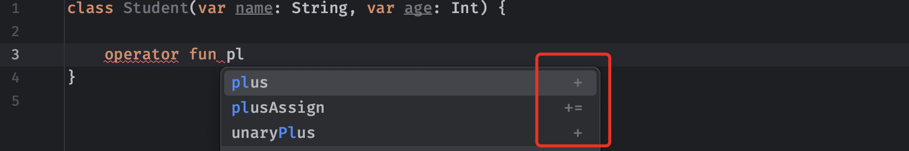

我们可以直接在类定义中添加一个固定名称（名称是预设好的，不能自己想写什么写什么）的函数，这里的加法运算就是`plus`函数，我们直接开始编写就可以了：

```kotlin
class Student(var name: String, var age: Int) {
    //注意，二元运算符必须带一个形参，表示右侧的操作数，返回值为计算出来的结果
  	//形参和结果可以是任意类型，我们还可以提供多次编写同名的运算符重载函数来适配不同的类型
    operator fun plus(another: Student): Student{
        //比如这里我们希望两个学生对象相加，得到的结果为名字相加，年龄相加的一个新学生
        return Student(this.name + another.name, this.age + another.age)
    }
}
```

这样，我们就成功重载了加法运算符，可以直接上手使用：

```kotlin
fun main() {
    val a = Student("小米", 18)
    val b = Student("华为", 19)
    val c = a + b
    println("运算之后得到的新学生，名称：${c.name}，年龄：${c.age}")
}
```

是不是感觉很简单？只需要将我们需要的对应运算符直接重载，编写好对应的计算规则，就可以直接使用对应的运算符进行计算。

我们也可以试试看重载一些一元运算符，比如取反运算符：

```kotlin
class Student(var name: String, var age: Int) {
    //比如取反操作就是把当前学生的名字反过来
    operator fun not() : Student {
        this.name = this.name.reversed()
        //这里可以直接在当前对象上进行操作，然后返回当前对象
        return this
    }
}
```

我们来尝试使用一下：

```kotlin
fun main() {
  	//直接在这里使用!运算符
    val a = !Student("小米", 18)
    println("运算之后得到的新学生，名称：${a.name}，年龄：${a.age}")
}
```

最后，我们列出常见的一些运算符对应的函数名称，首先是一元运算符：

| 符号  | 对应的函数名称   |
| ----- | ---------------- |
| `+a`  | `a.unaryPlus()`  |
| `-a`  | `a.unaryMinus()` |
| `!a`  | `a.not()`        |
| `a--` | `a.dec()`+见下文 |
| `a++` | `a.inc()`+见下文 |

其中`inc()`和`dec()`函数比较特殊，它们必须返回一个值，该值将分配给使用`++`或`--`操作的变量，而不是改变执行`inc`或`dec`操作的对象，意思就是执行后应该得到一个新生成的对象，然后变量的值直接引用到这个新的对象，因为Int类型就是这样的，比如`a++`的操作步骤如下：

- 将`a`的初始值存储到临时存储`a0`。
- 将`a0.inc()`的结果分配给`a`。
- 返回`a0`作为表达式的结果。

同样的，`++a`的操作步骤如下：

- 将`a.inc()`的结果分配给`a`。
- 作为表达式的结果返回`a`的新值。

认识完了一元运算符，我们接着来看一些基本二元运算符：

| 符号                   | 对应的函数名称    |
| ---------------------- | ----------------- |
| `a + b`                | `a.plus(b)`       |
| `a - b`                | `a.minus(b)`      |
| `a * b`                | `a.times(b)`      |
| `a / b`                | `a.div(b)`        |
| `a % b`                | `a.rem(b)`        |
| `a..b`                 | `a.rangeTo(b)`    |
| `a..<b` 或 `a until b` | `a.rangeUntil(b)` |

| 符号      | 对应的函数名称   |
| --------- | ---------------- |
| `a in b`  | `b.contains(a)`  |
| `a !in b` | `!b.contains(a)` |

对于`in`这种运算，必须返回Boolean类型的结果。

还有一些自增简化运算符：

| 符号     | 对应的函数名称     |
| -------- | ------------------ |
| `a += b` | `a.plusAssign(b)`  |
| `a -= b` | `a.minusAssign(b)` |
| `a *= b` | `a.timesAssign(b)` |
| `a /= b` | `a.divAssign(b)`   |
| `a %= b` | `a.remAssign(b)`   |

这类运算符都是将运算结果赋值给左边的操作数，比如`a = a + b`等价于`a += b`，这种情况可能会与上面的基本操作产生歧义，比如下面的情况：

```kotlin
class Student(var name: String, var age: Int) {
		//同时定义plus和plusAssign
    operator fun plus(another: Student) : Student {
        return this
    }

    operator fun plusAssign(another: Student) : Unit{

    }
}
```

可以看到，上面的函数中，`plus`运算符在重载之后，运算结果与当前类型是相同的，这种情况下，就会出现一个问题：

* plus： 算式 a = a + b 可以成立，因为返回类型相同，可以重新赋值给a
* plusAssign：为算式 a = a + b 的缩写，与plus的功能完全一致

此时，两个函数都匹配这里的运算符使用，编译器不知道该用哪一个了，因此就会出现歧义：

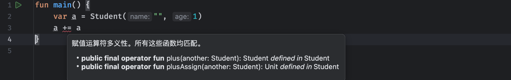

比较运算符只需要实现一个函数即可：

| 运算符   | 对应的函数名称        |
| -------- | --------------------- |
| `a > b`  | `a.compareTo(b) > 0`  |
| `a < b`  | `a.compareTo(b) < 0`  |
| `a >= b` | `a.compareTo(b) >= 0` |
| `a <= b` | `a.compareTo(b) <= 0` |

所有比较都会转换为`compareTo`函数调用，此函数返回`Int`值，这个值用于判断是否满足条件。

Kotlin非常强大，甚至连小括号都能重载：

| 运算符             | 对应的函数名称            |
| ------------------ | ------------------------- |
| `a()`              | `a.invoke()`              |
| `a(i)`             | `a.invoke(i)`             |
| `a(i, j)`          | `a.invoke(i, j)`          |
| `a(i_1, ..., i_n)` | `a.invoke(i_1, ..., i_n)` |

直接使用变量名称+`()`来进行使用，感觉很像函数的调用，但是又不是，就很奇怪，不过确实很强大就是了。

还有一些运算符，以我们目前所学知识还无法进行讲解，后续在各位小伙伴学习之后，可以回顾一下：

| 运算符                 | 对应的函数名称            |
| ---------------------- | ------------------------- |
| `a[i]`                 | `a.get(i)`                |
| `a[i, j]`              | `a.get(i, j)`             |
| `a[i_1, ..., i_n]`     | `a.get(i_1, ..., i_n)`    |
| `a[i] = b`             | `a.set(i, b)`             |
| `a[i, j] = b`          | `a.set(i, j, b)`          |
| `a[i_1, ..., i_n] = b` | `a.set(i_1, ..., i_n, b)` |

这是索引访问运算符，使用方括号进行表示。

### 中缀函数

实际上中缀函数在我们之前很多时候都有出现，比如位运算：

```kotlin
println(i shl 1)
```

这里的`shl`并不是一个运算符，而是一段自定义的英文单词，像这种运算符是怎么做到的呢？

这其实是中缀函数，用`infix`关键字标记的函数被称为中缀函数，在使用时，可以省略调用的点和括号进行调用，Infix函数必须满足以下要求：

- 必须是成员函数。
- 只能有一个参数。
- 参数不能有默认值。

我们可以像下面这样编写：

```kotlin
class Student(var name: String, var age: Int) {
  	//这个中缀函数实现了将给定字符串与当前对象的名字拼接并返回
    infix fun test(string: String) : String{
        return name + string
    }
}
```

我们在使用时，也非常方便，真的就像在使用一个运算符一样：

```kotlin
fun main() {
    val student = Student("小明", 18)
    println(student test "我爱你")
}
```

得到的结果显而易见：


当然，我们也可以把它当做一个普通的函数进行调用，效果是完全等价的：

```kotlin
fun main() {
    val student = Student("小明", 18)
    println(student.test("崴泥"))
}
```

这里需要注意一下：

> 中缀函数调用的优先级低于算术运算符、类型转换和`rangeTo`运算符，例如以下表达式就是等效的：
>
> - `1 shl 2 + 3`相当于`1 shl (2 + 3)`
> - `0 until n * 2`相当于`0 until (n * 2)`
> - `xs union ys as Set<*>`相当于`xs union (ys as Set<*>)`（类型转换会在下一章多态进行介绍）
>
> 另一方面，infix函数调用的优先级高于布尔运算符`&&`和`||`、`is`-和`in`-checks以及其他一些运算符的优先级。这些表达式也是等价的：
>
> - `a && b xor c`相当于`a && (b xor c)`
> - `a xor b in c`相当于`(a xor b) in c`

同时，如果需在类中使用中缀函数，必须明确函数的调用方（接收器）比如：

```kotlin
class MyStringCollection {
    infix fun add(s: String) { /*...*/ }

    fun build() {
        this add "abc"   // 正确
        add("abc")       // 正确
        //add "abc"        // 错误: 没有指定调用方或无法隐式表达
    }
}
```

对于中缀函数的使用还是比较简单的。

### 空值和空类型

所有的变量除了引用一个具体的值之外，还有一种特殊的值可以使用，那就是`null`，它代表空值，也就是不引用任何对象。

在其他语言中，比如Java中`null`是一个非常常见的值，因为在某些情况下，引用类型的变量默认值就是null，这就经常会导致程序中出现一些空指针导致的异常，在Kotlin中，对空值处理是非常严格的，正常情况下，我们的变量是不能直接赋值为`null`的，否则会报错，无法编译通过：

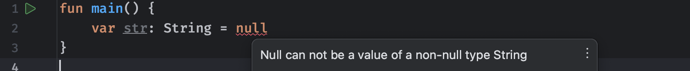

这是因为所有的类型默认都是非空类型，非空类型的变量是不允许被赋值为null的，这直接在编译阶段就避免了其他语言中经常存在的*空指针*问题。

那么，如果我们希望某个变量在初始情况下使用`null`而不去引用某一个具体对象，该怎么做呢，此时我们需要将变量的类型修改为可空类型，只需在类型名称的后面添加一个`?`即可：

```kotlin
fun main() {
    var str: String? = null
}
```

既然现在是可空类型，那么很多问题就会出现了，比如当一个变量为`null`时，此时如果使用类中的一些成员方法或是获取成员属性时，会出现一些问题：

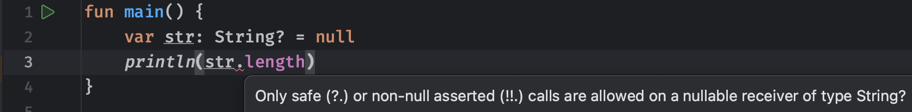

这里由于我们操作的是一个空类型，它有可能值为`null`，我们可以想象一下，如果一个变量不引用任何对象，此时我们又去让对象做一些事情（执行函数）这不是在搞笑吗，压根就没这个对象，难道让空气去执行操作吗？这显然是不对的，这样就会导致我们上面所说的空指针异常。

此时，为了安全，我们就需要对变量进行判断，看看其是否为`null`然后才能去做一些正常情况下该做的事情：

```kotlin
fun main() {
    var str: String? = null
  	//这里直接通过if语句判断str变量是否为null，如果不是才执行
    if (str != null) {
        println(str.length)  //现在就可以编译通过了
    }
}
```

可以看到，我们只要能确保某个空类型变量的值不为空，那么就可以正常执行操作。当然，实际上在这个if内部，因为已经判断不为null了，所以str被智能类型转换为非空类型，这也是Kotlin语言非常人性化的地方。

不过在有些情况下，我们可能已经非常清楚，这里的str一定不为null，即使它是一个可空类型变量，我们可以像这样做，来告诉编译器，我们这里一定是安全的，只管执行就好：

```kotlin
fun main() {
    var str: String? = null
  	//使用非空断言操作符!!.来明确不会出现null问题
    println(str!!.length)
}
```

虽然使用非空断言操作符能够进行强制操作，但是这样实际上并不安全，它同样存在安全问题，也许我们有没考虑到的情况会导致这里为null呢，也说不定吧？对于一些我们拿不定具体会不会出现null的情况，有没有更好的解决办法呢？

Kotlin为我们提供了一种更安全的空类型操作，要安全地访问可能包含`null`值的对象的属性，请使用安全调用运算符`?.`，如果对象的属性为`null`则安全调用运算符返回`null`，像下面这样：

```kotlin
fun main() {
    var str: String? = null
    println(str?.length)
}
```

这里的调用结果存在两种情况：

* 如果str为null，那么这里得到的结果就是null，并且不会正常执行后面的操作
* 如果str不为null，那就正常返回这里本应该得到的结果

因此，使用安全调用运算符后，如果遇到null的情况，那么这里不会正常进行原本的操作，而是直接返回`null`作为结果，这在有些时候非常好用，比如我们希望一个学生类型的变量在为`null`时就不执行对应的语句：

```kotlin
fun main() {
    val stu: Student? = null
    stu?.hello()
}
```

不过在有些时候，可能我们希望如果变量为null，在使用安全调用运算符时，返回一个我们自定义的结果，而不是null，这时该怎么做呢？我们可以使用Elvis运算符：

```kotlin
fun main() {
    val str: String? = null
  	//Elvis运算符 ?: 左侧为空值检测目标，右侧为检测到null时返回的结果
    val len: Int = str?.length ?: 0
}
```

这里我们使用了Elvis运算符来判断左侧是否为null，如果左侧为null，那么这里直接得到右侧的自定义值，这个运算符长得巨像其他语言里面的三元运算符，Kotlin拿来干这事了。

### 解构声明

有时候，我们在使用对象时可能需要访问它们内部的一些属性：

```kotlin
fun main() {
    val student = Student("小明", 18)
    println(student.name)  //访问name属性
    println(student.age)
}
```

这样看起来不太优雅，有没有更好的方式呢，比如这里能不能直接得到Student对象内部的name和age熟悉作为变量使用？当然是可以的，我们可以直接像下面这样编写：

```kotlin
fun main() {
    val student = Student("小明", 18)
    val (a, b) = student   //从Student对象中将其属性解构出来，很优雅
    println("名字: $a, 年龄: $b")
}
```

要让一个类的属性支持解构，我们只需添加约定的函数即可，在Kotlin中，我们可以自定义解构出来的结果，而具体如何获取，需要定义一个componentN函数并通过返回值的形式返回解构的结果：

```kotlin
class Student(var name: String, var age: Int) {
    operator fun component1() = name   //使用component1表示解构出来的第一个参数
    operator fun component2() = age    //使用component2表示解构出来的第二个参数
  	operator fun component3...  //以此类推
}
```

添加用于解构的函数在之后，我们就可以使用解构操作了：

```kotlin
val (a, b) = student   //解构出来的参数按顺序就是componentN的结果了
```

如果我们只想要使用第二个参数，而第一个参数不需要，可以直接使用`_`来忽略掉：

```kotlin
val (_, b) = student
println("年龄: $b")
```

解构同样可以用在Lambda表达式中：

```kotlin
val func: (Student) -> Unit = { (a, b) ->  //使用括号包括结构出来的两个参数
    println("名字: $a, 年龄: $b")
}

val func2: (Student, Int) -> Unit = { (a, b), i ->
    println("名字: $a, 年龄: $b")
    println(i)
}

val func3: (Student, Int) -> Unit = { (_, b), i ->
    println("名字: $a, 年龄: $b")
    println(i)
}
```

解构语法在遍历集合类和数组时同样适用，我们会在后面进行讲解。

### 包和导入

在之前，无论我们创建的是Kotlin源文件还是Kotlin类文件，都是在默认的包下进行的，也就是直接在kotlin/src目录创建的。

但是有些时候，我们可能希望将一些模块按功能进行归类，而不是所有的kt文件都挤在一起，这个时候我们就需要用到包了。


我们可以直接右键新建一个软件包，软件包的包名建议以域名格式进行命名，例如：

* com.baidu
* cn.itbaima

这类似于我们平时在浏览器中访问的网站地址，只不过是反过来的，这样就能很明确是哪一家公司或哪一个人制作的产品了。

这里我们随便创建一个：


我们可以将kt文件直接创建在这个包中：

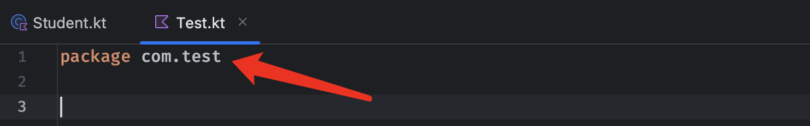

所有不在默认包下kt文件，必须在顶部声明所属的包，比如这里的Test.kt就放在`com.test`这个包中，因此顶部必须使用package关键字进行包声明，IDEA非常智能，在创建时就自动帮助我们生成好了。我们可以继续像之前一样，编写类或是函数：

```kotlin
package com.test

var a = 20

fun message() {
    println("我是测试方法")
}

class User 
```

不过，由于现在kt文件存放在了一个明确的包中，如果我们要在这个包以外的其他地方使用，会出现一些问题：

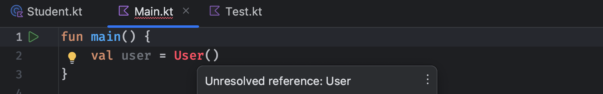

当我们使用其他包中kt文件定义的类或函数时，会直接提示未解析的引用，这是因为默认情况下只有同包内的内容可以相互使用，而现在我们使用的是其他包中的内容，我们需要先进行导入操作：

```kotlin
import com.test.User   //使用import关键字进行导入，导入时需要输入 包名.类型/顶级函数名称 来完成
import com.test.message
import com.test.a

fun main() {
    val user = User()
    message()
}
```

这样，我们在导入之后就可以正常使用了，当然，如果一个包中定义的内容太多，我们需要大量使用，也可以使用`*`一次性导入全部内容：

```kotlin
import com.test.*   //导入此包下的全部内容

fun main() {
    val user = User()
    message()
}
```

实际上官方提供的库，也是来自于不同的包，但是Kotlin在默认情况下会自动导入一些包，不需要我们明确指定：

- [kotlin.*](https://kotlinlang.org/api/latest/jvm/stdlib/kotlin/index.html)
- [kotlin.annotation.*](https://kotlinlang.org/api/latest/jvm/stdlib/kotlin.annotation/index.html)
- [kotlin.collections.*](https://kotlinlang.org/api/latest/jvm/stdlib/kotlin.collections/index.html)
- [kotlin.comparisons.*](https://kotlinlang.org/api/latest/jvm/stdlib/kotlin.comparisons/index.html)
- [kotlin.io.*](https://kotlinlang.org/api/latest/jvm/stdlib/kotlin.io/index.html)
- [kotlin.ranges.*](https://kotlinlang.org/api/latest/jvm/stdlib/kotlin.ranges/index.html)
- [kotlin.sequences.*](https://kotlinlang.org/api/latest/jvm/stdlib/kotlin.sequences/index.html)
- [kotlin.text.*](https://kotlinlang.org/api/latest/jvm/stdlib/kotlin.text/index.html)

比如我们之前用到的一些基本类型，都是在`kotlin`这个包中定义的。

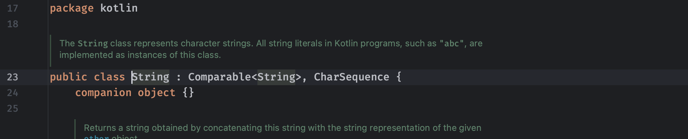

注意：在不同的平台下，还会有更多默认导入的包，比如Java平台下，就会默认导入`java.lang.*`和`kotlin.jvm.*`这两个包。

在有些情况下，可能会出现名称冲突的情况：

```kotlin
import com.test.message

fun main() {
    message()   //这里调用的，到底是导入的message函数，还是当前kt文件定义的函数呢？
}

fun message(){
    println("Goodbye World!")
}
```

结果显而易见，这里会优先使用导入的函数，而不是在当前文件中定义的同名函数。那么该如何去解决这种冲突的情况呢？我们可以使用`as`关键字来为导入的内容起个新的名字：

```kotlin
import com.test.message as outer //将导入的message函数名字改为outer

fun main() {
    message()   //此时这里调用的就是下面的message函数了
}

fun message(){
    println("Goodbye World!")
}
```

这样就可以很好地消除存在歧义的情况了，最后总结一下，使用`import`关键字支持导入以下内容：

- 顶级函数和属性
- 在单例对象中声明的函数和属性（下一章介绍）
- 枚举常量（下一章介绍）

### 访问权限控制

有些时候，我们可能不希望别人使用我们的所有内容，比如：

```kotlin
package com.test

fun message() {
    println("我是测试方法")
}

fun inner(){
    //我们不希望这个函数能够在其他地方被调用
}
```

在上面的例子中，有一个函数是我们不希望被外部调用的，但是经过前面的学习，我们只需要使用`import`关键字就能直接导入，那有没有办法能够控制一下其他地方对于当前文件一些可能私有函数或是其他内容的访问呢？我们可以使用可见性控制来处理。

在类、对象、接口、构造函数和函数，以及属性上，可以为其添加 *可见性修饰符* 来控制其可见性，在Kotlin中有四个可见性修饰符，它们分别是：`private`、`protected`、`internal`和`public`，默认可见性是`public`，在使用顶级声明时，不同可见性的访问权限如下：

- 如果不使用可见性修饰符，则默认使用`public`，这意味着这里声明的内容将在任何地方可访问。
- 如果使用`private`修饰符，那么声明的内容只能在当前文件中可访问。
- 如果使用`internal`修饰符，它将在同一[模块](https://kotlinlang.org/docs/visibility-modifiers.html#modules)中可见（当前的项目中可以随意访问，与public没大差别，但是如果别人引用我们的项目，那么无法使用）
- 顶级声明不支持使用`protected`修饰符。

因此，在默认情况下，我们定义的内容都是可以访问的，而想要实现上面的效果，我们可以为其添加`private`修饰符：

```kotlin
private fun inner(){
    //我们不希望这个函数能够在其他地方被调用
}
```

这样，当其他地方使用时，就会报错：

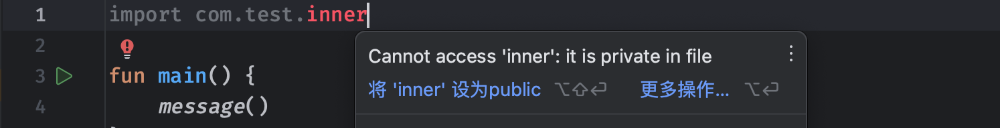

在类中定义成员属性时，不同可见性的访问权限如下：

- `private`意味着该成员仅在此类中可见（包括其所有成员）
- `protected`与`private`的可见性类似，外部无法使用，但在子类中可以使用（子类会在下一章中介绍）
- `internal`意味着本项目中任何地方都会看到其`internal`成员，但是别人引用我们项目时不行。
- `public`意味着任何地方都可以访问。

比如下面的例子：

```kotlin
class Student(private var name: String, //name属性无法被外部访问，因为是私有的
              internal var age: Int) {  //age可以被外部访问，但是无法再其他项目中访问到
    private constructor() : this("", 10)  //这个无参构造无法被外部访问，因为是私有的
}
```

有了访问控制，我们就可以更加明确地表示哪些内容是可以访问，而哪些是内部使用的。

### 内部类

在 Kotlin 中，`inner` 关键字用于声明内部类（也称为嵌套类），它指定了内部类与其外部类之间的关系。使用 `inner` 关键字声明的内部类有以下特点：

1. **实例绑定**：`inner` 类的实例是隐式地绑定到其外部类实例的。这意味着你不能有一个没有外部类实例的 `inner` 类实例。换句话说，你不能直接实例化一个 `inner` 类，而必须先有一个外部类的实例。
2. **访问外部类成员**：`inner` 类可以访问其外部类的所有成员，包括私有成员。这是因为 `inner` 类是外部类的一个“部分”，它们之间的关系非常紧密。
3. **命名和可见性**：`inner` 类在外部类的成员作用域内是可见的，并且可以使用外部类的名称作为其前缀来引用。例如，如果你有一个名为 `Outer` 的外部类和一个 `inner` 类 `Inner`，则可以使用 `Outer.Inner` 来引用这个内部类。
4. **构造器中的 `this`**：在 `inner` 类的构造器中，`this` 关键字引用的是 `inner` 类自身的实例，而如果要引用外部类的实例，则需要使用 `this@外部类名称`。

实际上，没加`innel`修饰的内部类，kotlin会把它定义为静态的内部类，这将导致在内部类中，无法获取外部类的实例对象；加了`innel`关键字后，kotlin才会把它定义为成员内部类。

~~~kotlin
class A {
	fun test() {
		B().hello()
	}

	inner class B {
		fun hello() {
			println(this@A)
		}
	}
}
~~~


## 封装、继承和多态

封装、继承和多态是面向对象编程的三大特性。

> * 封装，把对象的属性和函数结合成一个独立的整体，隐藏实现细节，并提供对外访问的接口。
> * 继承，从已知的一个类中派生出一个新的类，叫子类。子类实现了父类所有非私有化的属性和函数，并根据实际需求扩展出新的行为。
> * 多态，多个不同的对象对同一消息作出响应，同一消息根据不同的对象而采用各种不同的函数。

正是这三大特性，能够让我们的Kotlin程序更加生动形象。

### 类的封装

封装的目的是为了保证变量的安全性，使用者不必在意具体实现细节，而只是通过外部接口即可访问类的成员，如果不进行封装，类中的实例变量可以直接查看和修改，可能给整个程序带来不好的影响，因此在编写类时一般将成员变量私有化，外部类需要使用Getter和Setter函数来查看和设置变量。从这里开始，我们前面学习的权限访问控制就开始起作用了。

我们可以将之前的类进行改进：

```kotlin
class Student(private var name: String, private var age: Int) {
    fun getName(): String = name
    fun getAge(): Int = age
}
```

现在，外部需要获取一个学生对象的属性时，只能使用特定的函数进行获取，而不像之前一样可以随意访问对象的属性：

```kotlin
fun main() {
    var student = Student("", 1)
    //student.name   这样就不行了
    println(student.getName())
}
```

这样的好处显而易见，其他地方只能拿到在内部某个成员属性引用的对象，而没办法像之前那样直接修改Student对象中某个成员属性。

同样的，如果要运行外部对对象中的属性进行修改，那么我们也可以提供对应的set函数：

```kotlin
class Student(private var name: String, private var age: Int) {
    ...
    
    fun setName(name: String){   //使用set函数来修改
        this.name = name
    }
}
```

等等，这不就是我们之前讲的属性的getter和setter函数吗，没错，哪怕我们不手动编写，成员属性也会存在默认的。但是，除了直接赋值之外我们也可以设置更多参数才能给学生改名字：

```kotlin
class Student(private var name: String, private var age: Int) {

    fun setName(name: String, upper: Boolean){
      	//判断是否upper来决定最终赋值的名字大写还是小写
        this.name = if (upper) name.uppercase() else name.lowercase()
    }
}
```

我们自己封装好的名字设置方法暴露给外部使用，而不让外部直接操作名字。

我们甚至还可以将主构造函数改成私有的，需要通过其他的构造函数来构造：

```kotlin
class Student private constructor(private var name: String, private var age: Int) {
    constructor() : this("", 18)
}
```

封装思想其实就是把实现细节给隐藏了，外部只需知道这个函数是什么作用，如何去用，而无需关心实现，要用什么由类自己提供好，而不需要外面来操作类内部的东西去完成（你让我做一件事情，我自己的事情自己做，不要你来帮我安排）封装就是通过访问权限控制来实现的。

### 类的继承

前面我们介绍了类的封装，我们接着来看一个非常重要特性：继承。

在定义不同类的时候存在一些相同属性，为了方便使用可以将这些共同属性抽象成一个父类，在定义其他子类时可以继承自该父类，减少代码的重复定义，根据前面的访问权限等级，子类可以使用父类中所有**非私有**的成员。

比如说我们一开始使用的学生，那么实际上学生根据专业划分，所掌握的技能也会不同，比如体育生会运动，美术生会画画，土木生会搬砖，计算机生会因为互联网寒冬找不到工作，因此，我们可以将学生这个大类根据不同的专业进一步地细分出来：

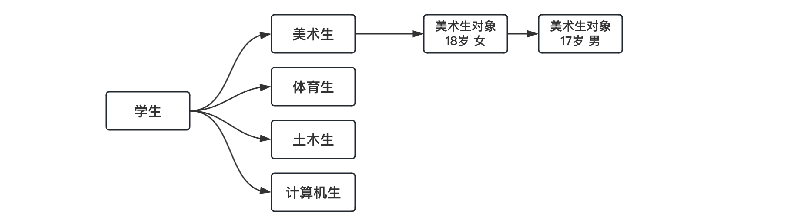

虽然我们划分出来这么多的类，但是其本质上还是学生，也就是说学生具有的属性，这些划分出来的类同样具有，但是，这些划分出来的类同时也会拥有他们自己独特的技能。就好比大学里的学生无论什么专业都会打游戏，都会睡觉，逃课，考试抄答案，四六级过不了，只不过他们专业不同，学的的方向不一样，也就掌握了其他专业不具备的技能。

在Kotlin中，我们可以使用继承操作来实现这样的结构，默认情况下，Kotlin类是“终态”的（不能被任何类继承）要使类可继承，请用`open`关键字标记需要被继承的类：

```kotlin
open class Student {  //被继承的类我们称为父类
  	val xxx = "学生证"
    fun hello() = println("我会打招呼")
}
```

我们可以像下面这样来创建一个继承学生的类：

```kotlin
class ArtStudent : Student() {  //以调用构造函数的形式进行声明
  	//这个类就是Student类的子类
  	fun draw() = println("我会画画")   //子类中也可以继续编写自己独有的函数
}
```

类的继承可以不断向下，但是同时只能继承一个类，在Kotlin中不支持多继承，只不过套娃还是可以的：

```kotlin
open class Student
open class ArtStudent: Student()  //继承了一级，相当于Student的儿子
open class SuperArtStudent: ArtStudent()  //继承了两级，相当于Student的孙子
class SuperBigArtStudent: SuperArtStudent()  //继承了三级，相当于Student的祖孙
```

当一个类继承另一个类时，属性会被继承，可以直接访问父类中定义的属性，除非父类中将属性的访问权限修改为`private`，那么子类将无法访问（但是依然是继承了这个属性的）比如下面的例子：

```kotlin
fun main() {
    var student = ArtStudent()
    student.hello()   //虽然这里是ArtStudent对象，但是由于其继承的是Student，因此包含Student中的属性
  	student.draw()   //自己的属性也可以使用
  	print(student.xxx)   //不止函数，父类中的成员字段也是没有问题的
}
```

是不是感觉非常人性化，子类继承了父类的全部能力，同时还可以扩展自己的独特能力，就像一句话说的： 龙生龙凤生凤，老鼠儿子会打洞。这里需要特别注意一下，因为子类相当于是父类的扩展，但是依然保留父类的特性，所以说，在对象创建并初始化的时候，不仅会对子类进行初始化，也会优先对父类进行初始化：

```kotlin
open class Student() {
    init { println("父类初始化") }
    fun hello() = println("我会打招呼")
}

class ArtStudent() : Student() {
    init { println("子类初始化") }
    fun draw() = println("我会画画")
}
```

实际上这里就是在构造这个子类对象之前，调用了一次父类的构造函数，而我们用于继承指定的构造函数，就是会被调用的那一个。

因此，如果父类存在一个有参构造函数，子类同样必须在构造函数中调用：

```kotlin
open class Student(name: String, age: Int) {
    fun hello() = println("我会打招呼")
}

//子类必须适配其父类的构造函数，因为需要先对父类进行初始化
//其实就是去调用一次父类的构造函数，填入需要的参数即可，这里的参数可以是当前子类构造方法的形参，也可以是直接填写的一个参数
class ArtStudent(name: String, age: Int) : Student(name, 18) {
    fun draw() = println("我会画画")
}
```

如果父类存在多个构造函数，可以任选一个：

```kotlin
open class Student() {
    constructor(str: String) : this()
    constructor(str: String, age: Int) : this()
    fun hello() = println("我会打招呼")
}

class ArtStudent : Student("小明", 18) {  //任选一个父类构造函数即可
    fun draw() = println("我会画画")
}
```

当子类只存在辅助构造函数时，需要使用super关键字来匹配父类的构造函数：

```kotlin
open class Student {
    constructor(str: String)
    constructor(str: String, age: Int)
    fun hello() = println("我会打招呼")
}

//子类不写主构造函数时，可以直接在冒号后面添加父类类名
class ArtStudent : Student {
    constructor(str: String) : super(str)   //使用super来调用父类构造函数,super表示父类（超类）
    constructor(str: String, age: Int) : super(str, age)
    fun draw() = println("我会画画")
}
```

也可以去匹配子类中其他构造函数：

```kotlin
class ArtStudent : Student {
    constructor(str: String) : this(str, 18)   //也可以调用子类其他构造函数，但是其他构造函数依然要间接或直接调用父类构造函数
    constructor(str: String, age: Int) : super(str, age)
    fun draw() = println("我会画画")
}
```

如果子类既有主构造函数，也有辅助构造函数，那么其他辅助构造函数只能直接或间接调用主构造函数：

```kotlin
open class Student() {
    constructor(str: String) : this()
    constructor(str: String, age: Int) : this()
    fun hello() = println("我会打招呼")
}

class ArtStudent() : Student() {
    constructor(str: String) : this()  //正确，必须直接或间接调用主构造函数
    constructor(str: String, age: Int) : super(str, age)   //报错，不能绕过主构造函数去匹配父类构造函数
    fun draw() = println("我会画画")
}
```

是不是感觉玩法太多，都眼花缭乱了？实际上只要各位小伙伴心里面清楚下面的规则，就很好理解上面这一堆写法了：

* 构造函数相当于是这个类初始化的最基本函数，在构造对象时一定要调用
* 主构造函数因为可能存在一些类的属性，所以说必须在初始化时调用，不能让这些属性初始化时没有初始值
* 子类因为是父类的延展，因此，子类在初始化时，必须先初始化父类，就好比每个学生都有学生证，这是属于父类的属性，如果子类在初始化时可以不去初始化父类，那岂不是美术生可以没有学生证？显然是不对的。

优先级关系：父类初始化 > 子类主构造 > 子类辅助构造

### 属性的覆盖

有些时候，我们可以希望子类继承父类的某些属性，但是我们可能希望去修改这些属性的默认实现。比如，美术生虽然也是学生，也会打招呼，但是可能他们打招呼的方式跟普通的学生不太一样，我们能否对打招呼这个函数的默认实现进行修改呢？

我们可以使用`override`关键字来表示对于一个属性的重写（覆盖）就像这样：

```kotlin
open class Student {
  	//注意，跟类一样，函数必须添加open关键字才能被子类覆盖
    open fun hello() = println("我会打招呼")
}

class ArtStudent : Student() {
    fun draw() = println("我会画画")
  	//在子类中编写一个同名函数，并添加override关键字，我们就可以在子类中进行覆盖了，然后编写自己的实现
    override fun hello() = println("哦哈哟")
}
```

覆盖之后，当我们使用子类进行打招呼时，函数会按照我们覆盖的内容执行，而不是原本的：


同样的，类的某个变量也是可以进行覆盖的：

```kotlin
open class Student {
    open val test: String = "测试"
    fun hello() = println("我会打招呼: $test")  //这里拿到的test就会变成被覆盖掉的
}

class ArtStudent : Student() {
  	//对父类的变量进行覆盖，类型必须一样
    override val test: String = "干嘛"
    fun draw() = println("我会画画")
}
```

是不是感觉很神奇？不过对于可变的变量，似乎下面这样来的更方便？

```kotlin
open class Student {
    var test: String = "测试"
    fun hello() = println("我会打招呼: $test")
}

class ArtStudent : Student() {
    init { test = "干嘛" }
    fun draw() = println("我会画画")
}
```

有些时候为了方便，比如在父类中的属性，我们可以直接在子类的主构造函数中直接覆盖：

```kotlin
open class Student {
    open val name: String  = "大明"
    fun hello() = println("我会打招呼，我叫: $name")
}

//在主构造函数中覆盖，也是可以的，这样会将构造时传入的值进行覆盖
class ArtStudent(override val name: String) : Student() {
    fun draw() = println("我会画画")
}
```

```kotlin
fun main() {
    val student = ArtStudent("小红")
    student.hello()
}
```

虽然现在已经很方便了，但是现在又来了一个新的需求，打招呼不仅要有子类的特色，同时也要保留父类原有的实现，这个时候该怎么办呢？我们可以使用`super`关键字来完成：

```kotlin
open class Student {
    open fun hello() = println("我会打招呼")
}

class ArtStudent : Student() {
    fun draw() = println("我会画画")
    override fun hello() {   //覆盖父类函数
        super.hello()   //使用super.xxx来调用父类的函数实现，这里super同样表示父类
        println("哦哈哟")  //再写自己的逻辑
    }
}
```

这样，我们在覆盖原本的函数时，也可以执行原本的实现，在一些对函数内容进行增强的常见，这种用法非常常见：


不过，由于存在我们之前讲解的的初始化顺序，下面的这种情况需要特别注意：

```kotlin
open class Student {
    open val name: String = "小明"
    init { println("我的名字是: ${name.length}") }  //这里拿到的name实际上是还未初始化的子类name
}

class ArtStudent : Student() {
    override val name = "大明"
}
```

```kotlin
fun main() {
    val student = ArtStudent()
}
```

由于父类初始化在子类之前，此时子类还未开始初始化，其覆盖的属性此时没有初始值，根据不同平台的实现，可能会出现一些问题，比如JVM平台下，没有初始化的对象引用默认为`null`，那么这里就会直接报空指针异常：

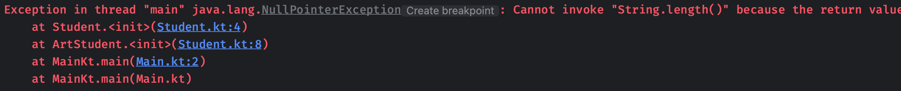

很神奇对吧，这里的`name`属性明明是一个非可空的String类型，居然还会出现`null`的情况报空指针，因此，对于这些使用了`open`关键字的属性（函数、变量等）只要是在初始化函数、构造函数中使用，IDEA都会给出警告：

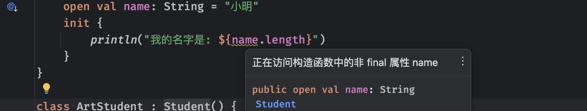

我们接着来讲一个很绕的东西，在使用一些子类的时候，我们实际上可以将其当做其父类来进行使用：

```kotlin
fun main() {
    val student: Student = ArtStudent()   //使用Student类型的变量接收一个ArtStudent类型的对象引用
}
```

之所以支持这样去使用，是因为子类本身就是对父类的延伸，因此将其当做父类使用，也是没有问题的。就好比我们无论是美术生还是体育生，都可以当做学生来用，都可以送去厂里实习打螺丝，不然不给毕业证。

只不过，如果我们将一个对象作为其父类使用，那么在使用时也只能使用其父类的一些属性，就相当于我们在使用一个父类的对象：

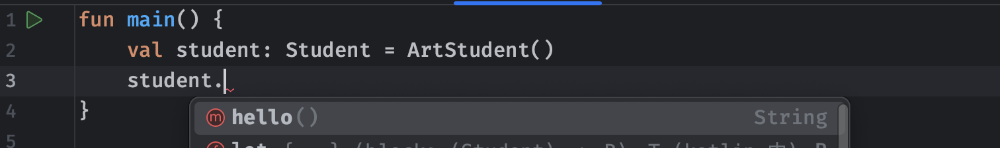

即使我们很清楚这里引用的对象是一个美术生，但是只能当做普通学生来用，这在后面的集合类中会经常用到，因为集合类往往存在多种不同的实现，但是我们只需要关心怎么用就行了，并且为了方便更换实现，所以一般使用集合类对应的接口来作为变量的类型。

那么，如果子类重写了父类的某个函数，此时我们以父类的形式去使用，结果会怎么样？

```kotlin
open class Student {
    open fun hello() = println("大家好")
}

class ArtStudent : Student() {
    override fun hello() = println("我姓🐴我叫🐴牛逼")
}
```


可以看到，虽然当做父类来使用，但是其本质是不会变的，所以说，这里执行的结果依然是子类的覆盖实现。

那么，如果项目中很多这种明明是子类但是拿来当做父类用，我们怎么去判断使用的对象到底是什么类型的呢？我们可以使用`is`关键字来进行类型判断，以下面的三个类为例：

```kotlin
open class Student
class ArtStudent : Student()
class SportStudent : Student() 
```

现在我们进行类型判断：

```kotlin
fun main() {
    val student: Student = ArtStudent()
    println(student is ArtStudent)   //true，因为确实是这个类型
    println(student is SportStudent)   //false，因为不是这个类型
    println(student is Student)   //true，因为是这个类型的子类
}
```

可以看到，使用is关键字可以精准地对类型进行判断，只要判断的对象是这个类或是这个类的子类，那么就会返回true作为结果。

如果我们明确某个变量引用的对象是什么类型，可以使用`as`关键字来进行强制类型转换：

```kotlin
fun main() {
    val student: Student = ArtStudent()
    if(student is ArtStudent) {
        val artStudent = student as ArtStudent;
        artStudent.draw()  //强制类型转换之后，可以直接变回原本的类型去使用
    }
}
```

不过，编译器非常智能，它可以根据当前的语境判断的类型自动进行类型转换：

```kotlin
val student: Student = ArtStudent()
if(student is ArtStudent) {
    student.draw()
}
```

此时IDEA中会出现提示：

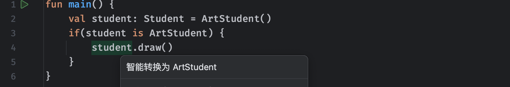

不仅仅是if判断的场景、包括when、while，以及`&&` `||` 等运算符都支持智能转换，只要上下文语境符合就能做到：

```kotlin
fun main() {
    val student: Student? = ArtStudent()
  	//很明显这里是当student为ArtStudent时，根据语境直接智能转换
    while (student is ArtStudent)  student.draw()
    //很明显如果这前面已经判断为真了，那肯定是这个类型，后面也可以智能转换
  	if(student is ArtStudent && student.draw())
}
```

不仅仅是这种场景，比如我们前面讲解的可空类型，同样支持这样的智能转换：

```kotlin
fun main() {
    val student: Student? = ArtStudent()
  	student?.hello()
    if (student != null)   //判断到如果不为null
  			student.hello()  	 //根据语境student智能转换为了非空Student类型
}
```

在处理一些可空类型时，为了防止出现异常，我们可以使用更加安全的`as?`运算符：

```kotlin
fun main() {
    val student: Student? = ArtStudent()
    val artStudent: ArtStudent? = student as? ArtStudent  //当student为null时，不会得到异常，而是返回null作为结果
}
```

有了这些操作，类和对象在我们使用的过程中就逐渐开始千变万化了，后面我们还会继续认识更多的多态特性。

### 顶层Any类

在我们不继承任何类的情况下，实际上Kotlin会有一个默认的父类，所有的类默认情况下都是继承自Any类的。

这个类的定义如下：

```kotlin
/**
 * Kotlin类继承结构中的根类. 所有Kotlin中的类都会直接或间接将Any作为父类
 */
public open class Any {
    /**
     * 判断某个对象是否"等于"当前对象，这里同样是对运算符"=="的重载，而具体判断两个对象相等的操作需要由子类来定义
     * 在一些特定情况下，子类在重写此函数时应该保证以下要求:
     * * 可反身: 对于任意非空值 `x`, 表达式 `x.equals(x)` 应该返回true
     * * 可交换: 对于任意非空值 `x` 和 `y`, `x.equals(y)` 当且仅当 `y.equals(x)` 返回true时返回true
     * * 可传递: 对于任意非空值 `x`, `y`, 和 `z`, 如果 `x.equals(y)` 和 `y.equals(z)` 都返回true, 那么 `x.equals(z)` 也应该返回真
     * * 一致性: 对于任意非空值 `x` 和 `y`, 在多次调用 `x.equals(y)` 函数时，只要不修改在对象的“equals”比较中使用的信息，那么应当始终返回同样的结果
     * * 永不等于空: 对于任意非空值 `x`, `x.equals(null)` 应该始终返回false
     */
    public open operator fun equals(other: Any?): Boolean

    /**
     * 返回当前对象的哈希值，它具有以下约束:
     * 
     * * 对同一对象多次调用该函数时，只要不修改对象上的equals比较中使用的信息，那么此函数就必须始终返回相同的整数 
     * * 如果两个对象通过`equals`函数判断为true，那么这两个对象的哈希值也应该相同
     */
    public open fun hashCode(): Int

    /**
     * 将此对象转换为一个字符串，具体转换为什么样子的字符串由子类自己决定
     */
    public open fun toString(): String
}
```

由于默认情况下类都是继承自Any，因此Any中定义的函数也是被继承到子类中了。

首先我们来看这个`equals`函数，它实际上是对`==`这个运算符的重载，我们之前在使用一些基本类型的时候，就经常使用`==`来判断这些类型是否相同，比如Int类型的数据：

```kotlin
fun main() {
    val a = 10
    val b = 20
    println(a == b)
    println(a.equals(b))  //跟上面的写法完全一样
}
```

经过前面的学习，我们知道这些基本类型本质上也是定义的类，实际上它们也是通过重写这个函数来实现这些比较操作的（一些基本类型会根据不同的平台进行编译优化，没法看源码）

我们可以看到，这个函数接受的参数类型是一个`Any?`类型：

```kotlin
public open operator fun equals(other: Any?): Boolean  //我们上节课说到一个子类也可以被当做父类类型的变量去使用，所以说equals判断接受的参数为了满足不同的类型变量之间进行比较，直接使用顶层Any作为参数（考虑到会用到可空类型，所以说直接用了Any?作为参数类型）
```

到目前为止，我们认识了Kotlin中两种相等的判断方式：

* *结果上* 相等 (`==` 等价于 `equals()`)
* *引用上* 相等 (`===` 判断两个变量是否都是引用的同一个对象)

我们在使用`equals`比较两个可空对象是否相等时，就像这样：

```kotlin
a == b
```

实际上会被翻译为：

```kotlin
a?.equals(b) ?: (b === null)  //a如果为null那就直接判断b是不是也为null，否则直接调用a的equals函数并让b作为参数
```

当然可能会有小伙伴疑问，那不等于判断呢？实际上是一样的：

```kotlin
fun main() {
    val a = "10"
    val b = "20"
    println(a != b)
    println(!a.equals(b))  //等价于上面的写法
}
```

我们也可以为我们自己编写的类型重写`equals`函数，比如我们希望Student类型当名字和年龄相等时，就可以使用`==`来判断为true，我们可以像这样编写：

```kotlin
class Student(val name: String, val age: Int) {
    override fun equals(other: Any?): Boolean {
        if(this === other) return true  //如果引用的是同一个对象，肯定是true不多逼逼
        if(other !is Student) return false //如果要判断的对象根本不是Student类型的，那也不用继续了
        if(name != other.name) return false  //判断名字是否相同
        if(age != other.age) return false  //判断年龄是否相同
        return true   //都没问题，那就是相等了
    }
}
```

此时我们已经将其比较操作重写，我们可以来试试看：

```kotlin
fun main() {
    val a = Student("小明", 18)
    val b = Student("小红", 17)
    val c = Student("小明", 18)
    println(a == a)    //返回true因为就是自己
    println(a == b)    //返回false因为名字和年龄不一样
    println(a == c)    //返回true因为名字和年龄完全一样
}
```

默认情况下，如果我们不重写类的`equals`函数，那么会直接对等号两边的变量进行引用判断`===`判断是否为同一个对象。只不过，可以很清楚地看到IDEA提示我们：


实际上在我们重写类的`equals`函数时，根据约定，必须重写对于的hashCode函数，至于为什么，我们会在后续的集合类部分中进行介绍，这里我们暂时先不对hashCode函数进行讲解。

接着我们来看下一个，`toString`函数用于快速将对象转换为字符串，只不过默认情况下，会像这样：

```kotlin
fun main() {
    val a = Student("小明", 18)
    println(a.toString())
    println(a)  //println默认情况下会直接调用对象的toString并打印，所以跟上面是一样的
}
```


可以看到打印的结果是对象的`类型@十六进制哈希值`的形式，在某些情况下，可能我们更希望的是转换对象的一些成员属性，这样我们可以更直观的看到对象的属性具有什么值：

```kotlin
class Student(val name: String, val age: Int) {
    override fun toString(): String {  //直接重写toString函数
        return "Student(name='$name', age=$age)"
    }
}
```

现在得到的结果，就是我们自定义的结果了：


### 抽象类

有些情况下，我们设计的类可能仅仅是作为给其他类继承使用的类，而其本身并不需要创建任何实例对象，比如：

```kotlin
open class Student protected constructor() {  //无法构造这个父类，要求使用子类
    open fun hello() = println("Hello World!")
}
class ArtStudent: Student() {
    override fun hello() = println("原神")  //两个子类都对hello进行了实现，采用各自的方式
}
class SportStudent: Student() {
    override fun hello() = println("启动")
}
```

可以看到，在上面这个例子中，Student类的`hello`函数在子类中都会被重写，所以说除非在子类中调用父类的默认实现，否则一般情况下，父类中定义的函数永远都不会被调用。

就像我们说一个学生会怎么考试一样，实际上学生怎么考试是一个抽象的概念，但是由于学生的种类繁多，美术生怎么考试和体育生怎么考试，才是具体的一个实现。所以说，我们可以将学生类进行进一步的抽象，让某些函数或字段完全由子类来实现，父类中不需要提供实现。我们可以使用`abstract`关键字来将一个类声明为抽象类：

```kotlin
//使用abstract表示这个是一个抽象类
abstract class Student {
    abstract val type: String  //抽象类中可以存在抽象成员属性
    abstract fun hello()   //抽象类中可以存在抽象函数
  	//注意抽象的属性不能为private，不然子类就没法重写了
}
```

当一个子类继承自抽象类时，必须要重写抽象类中定义的抽象属性和抽象函数：

```kotlin
class ArtStudent: Student() {
    override val type: String = "美术生"
    override fun hello() = println("原神，启动！")
}
```

这是强制要求的，如果不进行重写将无法通过编译。同时，抽象类是不允许直接构造对象的，只能使用其子类：

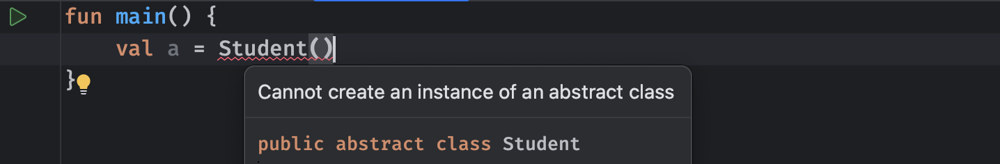

当然，抽象类不仅可以具有抽象的属性，同时也具有普通类的性质，同样可以定义非抽象的属性或函数：

```kotlin
abstract class Student {
    abstract val type: String
    abstract fun hello()
    fun test() = println("不会有人玩到大三了才开始学Java吧")  //定义非抽像属性或函数，在子类中不强制要求重写
}
```

同时，抽象类也可以继承自其他的类（可以是抽象类也可以是普通类）

```kotlin
open class Test   //直接继承一个普通的类
abstract class Student: Test(){
    ...
}
```

虽然抽象类可以继承一个普通的类，但是这依然不改变它是抽象类的本质，子类依然要按照上面的要求进行编写。

### 接口

由于Kotlin中不存在多继承的操作，我们可以使用接口来替代。

前面我们认识了抽象类，它可以具有一些定义而不实现的内容，而接口比抽象类还要抽象，一般情况下，他只代表某个确切的功能！也就是只能包含函数或属性的定义，所有的内容只能是`abstract`的，它不像类那样完整。接口一般只代表某些功能的抽象，接口包含了一系列内容的定义，类可以实现这个接口，表示类支持接口代表的功能。

比如，学生具有以下功能：

* 打游戏
* 睡懒觉
* 逃课
* 考试作弊

我们可以将这一系列功能拆分成一个个的接口，然后让学生实现这些接口，来表示学生支持这些功能。

在Kotlin中，要声明接口，我们可以使用`interface`关键字：

```kotlin
interface A {
    val x: String  //接口中所有属性默认都是abstract的（可省略关键字）
    fun sleep()   //接口中所有函数默认都是abstract的（可省略关键字）
}
interface B {
    fun game()
}
class Student: A, B {   //接口的实现与类的继承一样，直接写到后面，多个接口用逗号隔开
    override val x: String = "测试"   //跟抽象类一样，接口中的内容是必须要实现的
    override fun sleep() = println("管他什么早八不早八的，睡舒服再说")
    override fun game() = println("读大学就该玩游戏玩到爽")
}
```

可以看到，接口相比于抽象类来说，更加的纯粹，它不像类那样可以具有什么确切的属性，一切内容都是抽象的，只能由子类来实现。

只不过，在接口中声明的属性可以是抽象的，也可以为Getter提供默认实现。在接口中声明的属性无法使用`field`后背字段，因此在接口中声明的Setter无法使用`field`进行赋值：

```kotlin
interface A {
    val x: String
        get() = "666"  //只能重写getter，不能直接赋值，因为默认情况下getter是返回的field的值，但是接口里不让用
}
```

```kotlin
interface A {
    var x: String
        get() = "666"
        set(value) {  /* 默认的setter会直接报错，因为使用了field字段 */ }
}
```

为了应对变化多端的需求，接口也可以为函数编写默认实现：

```kotlin
interface A {
    //接口中的函数可以具有默认实现，默认情况下是open的，除非private掉；并且在默认实现里可以修改接口中定义变量的值
    fun sleep() = println("管他什么早八不早八的，睡舒服再说")
}
```

这样一看，这函数可以写默认的实现那接口似乎变得不那么抽象了？这用着感觉好像跟抽象类没啥区别啊？接口跟类的最大区别其实就是状态的保存，这从上面的成员属性我们就可以看的很清楚。

接口也可以继承自其他接口，直接获得其他接口中的定义：

```kotlin
interface A{
    fun sleep() = println("管他什么早八不早八的，睡舒服再说")
}
interface B{
    fun game() = println("读大学就该玩游戏玩到爽")
}
interface C: A, B   //接口的继承写法是一样的，并且接口继承接口是支持多继承的
class Student: C    //直接获得ABC三个接口的功能
```

是不是感觉接口的玩法非常有意思？只不过玩的过程中，可能也会遇到一些麻烦，比如下面的这种情况：

```kotlin
interface A{
    fun sleep() = println("管他什么早八不早八的，睡舒服再说")
}
interface B{
    fun sleep() = println("7点起床学Java了，不能再睡了")
}
class Student: A, B  //由于A和B都具有sleep函数，那现在到底继承谁的呢？
```

这种情况下，我们需要手动解决冲突，比如我们希望Student类采用接口B的默认实现：

```kotlin
class Student: A, B {
    override fun sleep() {  //手动重写sleep函数，自行决定如何处理冲突
        super<B>.sleep()  //使用super关键字然后添加尖括号指定对应接口，并手动调用接口对应函数
    }
}
```

对于接口，我们可以像之前一样，将变量的类型设定为一个接口的类型，当做某一个接口的实现来使用，同时也支持`is`、`as`等关键字进行类型判断和转换：

```kotlin
fun main() {
    val a: A = Student()
    a.sleep()  //直接当做A接口用（只能使用A接口中定义的内容）
    println(a is B)  //判断a引用的对象是否为B接口的实现类
}
```

是不是感觉跟之前使用起来是差不多的？其实只要前面玩熟悉了，后面还是很简单的。

### 类的扩展

Kotlin提供了扩展类或接口的操作，而无需通过类继承或使用*装饰器*等设计模式，来为某个类添加一些额外的函数或是属性，我们只需要通过一个被称为*扩展*的特殊声明来完成。

#### 函数的扩展

例如，您可以从无法修改的第三方库中为类或接口编写新函数，这些函数可以像类中其他函数那样进行调用，就像它们是类中的函数一样，这种机制被称为*扩展函数*。还有*扩展属性*，允许您为现有类定义新属性。

比如我们想为String类型添加一个自定义的操作：

```kotlin
//为官方的String类添加一个新的test函数，使其返回自定义内容
fun String.test() = "666"

fun main() {
    val text = "Hello World"
    println(text.test())  //就好像String类中真的有这个函数一样
}
```


是不是感觉很神奇？通过这种机制，我们可以将那些第三方类不具备的功能强行进行扩展，来方便我们的操作。

注意，类的扩展是静态的，实际上并不会修改它们原本的类，也不会将新成员插入到类中，仅仅是将我们定义的功能变得可调用，使用起来就像真的有一样。同时，在编译时也会明确具体调用的扩展函数：

```kotlin
open class Shape
class Rectangle: Shape()

fun Shape.getName() = "Shape"
fun Rectangle.getName() = "Rectangle"  //虽然这里同时扩展了父类和子类的getName函数

fun printClassName(s: Shape) {  //但由于这里指定的类型是Shape，因此编译时也只会使用Shape扩展的getName函数
    println(s.getName())
}

fun main() {
    printClassName(Rectangle())
}
```

由于类的扩展是静态的，因此在编译出现歧义时，只会取决于形参类型。

如果是类本身就具有同名同参数的函数，那么扩展的函数将失效：

```kotlin
class Test {
    fun hello() = println("你干嘛")
}

fun Test.hello() = println("哎哟")

fun main() {
    Test().hello()   //你干嘛
}
```

不过，我们如果通过这种方式实现函数的重载，是完全没有问题的：

```kotlin
class Test {
    fun hello() = println("你干嘛")
}

fun Test.hello(str: String) = println(str)  //重载一个不同参数的同名函数

fun main() {
    Test().hello("不错")  //有效果
}
```

#### 属性的扩展

同样的，类的属性也是可以通过这种形式来扩展的，但是有一些小小的要求：

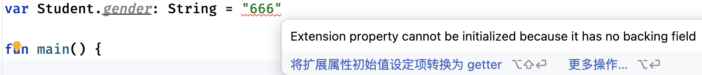

可以看到直接扩展属性是不允许的，前面我们说过，扩展并不是真的往类中添加属性，因此，扩展属性本质上也不会真的插入一个成员字段到类的定义中，这就导致并没有变量去存储我们的数据，我们只能明确定义一个getter和setter来创建扩展属性，才能让它使用起来真的像是类的属性一样：

```kotlin
val Student.gender: String
    get() = "666"

fun main() {
    val stu = Student()
    println(stu.gender)
}
```

> 由于扩展属性并没有真正的变量去存储，而是使用get和set函数来实现，所以，像前面认识的field这种后备字段，就无法使用了。

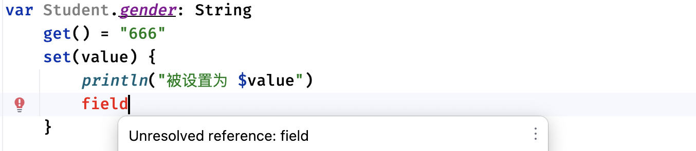

还有一个需要注意的时，我们在不同包中定义的扩展属性，同样会受到访问权限控制，需要进行导入才可以使用：

```kotlin
import com.test.gender

fun main() {
    val stu = Student()
    println(stu.gender)
}
```

除了直接在顶层定义类的扩展之外，我们也可以在一个类中定义其他类的扩展，并且在定义时可以直接使用其他类提供的属性：

```kotlin
class A {
    fun hello() = "Hello World"
}

class B {
    fun A.test() {
        hello()   //直接在类A的扩展函数中调用A中定义的函数
    }
}
```

像这种扩展，由于是在类中定义，因此也仅限于类内部使用，比如：

```kotlin
class A {
    fun hello() = "Hello World"
}

class B (private val a: A){
  	// private不加也只能在类中访问A
    private fun A.test() = hello() + "!!!"
    fun world() = println(a.test())   //只能在类中通过A的实例使用扩展函数
}

fun main() = B(A()).world()	//使用A().test()报错
```

扩展属性无法访问那些本就不应该被当前作用域访问的类属性，即使它是对某个类的扩展，比如下面这种情况：

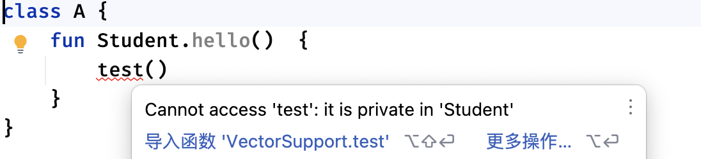

在名称发生冲突时，需要特别处理：

```kotlin
class A {
    fun hello() = "Hello World"
}

class B (private val a: A){
    private fun A.test() {
        hello()   //直接使用优先匹配被扩展类中的方法
        this.hello()   //扩展函数中的this依然指的是被扩展的类对象
        this@B.hello()   //这里调用的才是下面的
    }

    fun hello() = "Bye World"
}
```

定义在类中的扩展也可以跟随类的继承结构，进行重写：

```kotlin
open class A {
    open fun Student.test() = "AAA"
    fun hello() = println(Student().test())
}

class B : A() {
    override fun Student.test() = "BBB"  //对父类定义的扩展函数进行重写
}

fun main() {
    A().hello()
    B().hello()
}
```

局部扩展也是可以的，我们可以在某个函数里面编写扩展，但作用域仅限于当前函数：

```kotlin
fun main() {
    fun String.test() = ""
    "".test()
}
```

如果我们将一个扩展函数作为参数给到一个函数类型变量，那么同样需要再具体操作之前增加类型名称才可以：

```kotlin
fun main() {
  	//因为是对String类型的扩展函数，需要String.前缀
    val func: String.() -> Int = {
        this.length   //跟上面一样，扩展函数中的this依然指的是被扩展的类对象
    }
    println("sahda".func())  //可以直接对符合类型的对象使用这个函数
  	func("Hello")  //如果是直接调用，那么必须要传入对应类型的对象作为首个参数，此时this就指向我们传入的参数
}
```

可以看到，此函数的类型是`String.() -> Int `，也就是说它是专门针对于String类型编写的扩展函数，没有参数，返回值类型为Int，并使用Lambda表达式进行赋值，同时这个函数也是属于String类型的，只能由对象调用，或是主动传入一个相同类型的对象作为参数才能直接调用。可能这里会有些绕不太好理解，需要同学们多去思考。

总结一下，扩展属性更像是针对于原本类编写的外部工具函数，而绝不是对原有类的修改。
