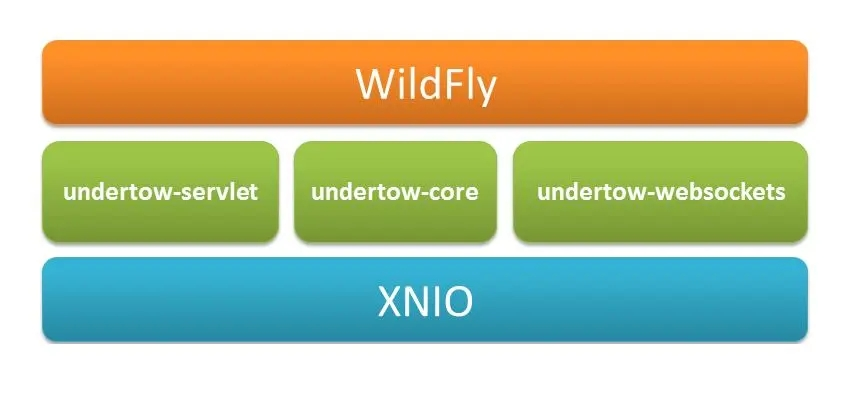

# 补充

# 数据结构和算法

## 行先列后

遍历数组时，外层循环应该先遍历行，内层循环遍历列。这样能充分利用空间的局部性原理，提升程序的性能。

原理：

* cpu 读取内存（速度慢）数据后，会将其放入高速缓存（速度快）当中，如果后来的计算再用到此数据，在缓存中能读到的话，就不必读内存了
* 缓存的最小存储单位是缓存行（cache line），一般是 64 bytes，一次读的数据少了不划算，因此最少读 64 bytes 填满一个缓存行，因此读入某个数据时也会读取其**临近的数据**，这就是所谓**空间局部性**

### 不用charAt

字符串的charAt方法获取字符的效率比较低，可以通过toCharArray方法获取字符数组，再从字符数组中获取单个字符，这样效率有比较大的提升。

# JDK

## 反射

#### 通过方法引用获取属性名

关键：获取到`SerializedLambda`对象，而获取此对象需要先获取`writeReplace`方法，而此方法只有该类实现了`Serializable`接口才会有，所以需要`SFunction`实现序列化接口。

补充：SerializedLambda是Java提供的关于lambda表达式的序列化方案。当需要对实现了Serializable接口的lambda表达式进行序列化时，Java虚拟机会将其转换成SerializedLambda对象，从而进行序列化操作。这个过程中，虚拟机会添加一个writeReplace()方法。SerializedLambda类存储了Lambda表达式的运行时信息，以确保Lambda表达式序列化的正确性和安全性。

~~~java
public class Lambda {
	public static void main(String[] args) throws NoSuchMethodException, InvocationTargetException, IllegalAccessException {
		SFunction<User, String> function = User::getUsername;
		Method method = function.getClass().getDeclaredMethod("writeReplace");
		method.setAccessible(true);
		Object name = method.invoke(function);
		SerializedLambda serializedLambda = (SerializedLambda) name;
		System.out.println(serializedLambda);
		String implMethodName = serializedLambda.getImplMethodName();
        // 获取get方法名
		System.out.println(implMethodName);
	}
}

@FunctionalInterface
interface SFunction<T, R> extends Serializable {
	R apply(T t);
}

class User {
	private String username;

	public String getUsername() {
		return username;
	}

	public void setUsername(String username) {
		this.username = username;
	}
}
~~~

# websocket

导入依赖：springboot版本-2.7.6

~~~xml
dependency>
<groupId>org.springframework.boot</groupId>
<artifactId>spring-boot-starter-websocket</artifactId>
</dependency>
~~~

配置类：

> `@ServerEndpoint`注解来定义WebSocket端点，使用了Java WebSocket API（JSR 356）的注解方式。这种方式无法在自定义ServerEndpointConfig.Configurator的实现类中直接依赖注入一些属性。
>
> 另一种使用方式是使用Spring的WebSocket支持（如`WebSocketConfigurer`、`TextWebSocketHandler`）

~~~kotlin
@Configuration
class WebSocketConfig {
	@Bean	//创建ServerEndpointExporter对象，作为bean放入容器，它可以自动注册使用了@ServerEndPoint注解的bean
	fun serverEndpointExporter(factory: LettuceConnectionFactory): ServerEndpointExporter {
		factory.validateConnection = true	//检查redis的连接是否断开，断开就重连（但检测和重连时间较长）
		return ServerEndpointExporter()
	}
}
~~~

EndPoint类：（不是单例的，建立一个连接就创建一个）

~~~kotlin
@ServerEndpoint("/chat/{username}")
@Component
class ChatEndpoint {

	companion object {
		// 用来存储每一个客户端对象对应的ChatEndpoint
		private val onlineUsers = ConcurrentHashMap<String, Session>()
		private lateinit var msgService: MsgService
	}

	private lateinit var username: String

	@Resource
	fun setMsgService(msgService: MsgService) {
		ChatEndpoint.msgService = msgService
	}

	@OnOpen    // 连接建立时被调用
	fun onOpen(session: Session, @PathParam("username") username: String) {
		onlineUsers[username] = session
		this.username = username
		val msgList = msgService.getList(username)
		//把用户之前不在线时暂存于redis的消息发送给用户
		msgList.forEach { session.basicRemote.sendText(it) }
		msgService.removeList(username)
	}

	@OnMessage    // 接收到客户端发送的数据时被调用
	fun onMessage(message: String, session: Session) {
		val toName = JsonUtils.getStringValue(message, Message::toName)
		//如果是心跳包
		if (toName == "ping") return LogUtils.info("接收到了一个心跳包：${session.requestURI}")
		val toSession = onlineUsers[toName]
		if (toSession == null) {    // 当前用户不在线，先把消息暂存于redis
			try {
				msgService.save(message, toName)
			} catch (e: Exception) {
				// 客户端需检查消息的fromName是否为error，为error代表消息发送失败
				val json = JsonUtils.toJson(Message(username, e.message ?: "发送失败", "error"))
				session.basicRemote.sendText(json)
				LogUtils.error(e.message, e)
			}
		} else {
			toSession.basicRemote.sendText(message)
		}
	}

	@OnClose    // 连接断开时被调用
	fun onClose(session: Session) {
		onlineUsers.remove(username)
	}

	@OnError
	fun onError(session: Session, t: Throwable) {
		LogUtils.error("socket -> ${t.message}", t)
	}
}
~~~

## token

携带token有两种方式，它不是传统的http请求，所以不能直接放到header里。

- 方法1：用query参数，在路径后面加`?token=xxx`
- 方法2：利用`Sec-WebSocket-Protocol`字段。

~~~js
const ws = new WebSocket("ws://localhost:32380/chat/lisi", ['token']);
~~~

> 这种配置方式使用的是Java WebSocket API（JSR 356），不方便给ServerEndpointConfig.Configurator的子类注入属性。

~~~kotlin
class EndpointConfigurator: ServerEndpointConfig.Configurator() {

	override fun modifyHandshake(sec: ServerEndpointConfig, request: HandshakeRequest, response: HandshakeResponse) {
		val tokens = request.headers["Sec-WebSocket-Protocol"]
		val token = tokens?.get(0)
		val template = ApplicationContextProvider.applicationContext.getBean(StringRedisTemplate::class.java)
		if (template.opsForValue().get("$TOKEN_PREFIX:$token") == null) {
			sec.userProperties["status"] = 401
		}
		//注意：Sec-WebSocket-Protocol该字段必须连同值原样返回，连接才能建立成功
		response.headers["Sec-WebSocket-Protocol"] = tokens
	}
}

@Component
class ApplicationContextProvider : ApplicationContextAware {
	companion object {
		lateinit var applicationContext: ApplicationContext
	}

	override fun setApplicationContext(applicationContext: ApplicationContext) {
		ApplicationContextProvider.applicationContext = applicationContext
	}
}

//并且：@ServerEndpoint("/chat/{username}", configurator = EndpointConfigurator::class)
//@onOpen: 
/*if (session.userProperties["status"] == 401) {
	session.basicRemote.sendText("token校验失败，将强制断开连接")
	return session.close()
}*/
~~~

# 算法

## DFA

Deterministic Finite Automaton（确定有穷自动机），可以用于检查文本中是否包含一些敏感词，效率高。

存储：需要一次性把敏感词都存储到map中；`isEnd`表示是否到了词尾。

判断是否包含敏感词：遍历文本的每个字，如果该字在map中，则从该字对应的value（map）中检查isEnd，为0继续检查下一个字是否在该value中，为1则返回true；某次检查到字不在map中，返回false。

例子：冰毒、大麻、大坏蛋。

~~~js
{
    "冰": {
        "毒":{
            "isEnd": 1
        },
        "isEnd": 0
    },
    "大": {
        "麻": {
            "isEnd": 1
        },
        "isEnd": 0,
        "坏": {
            "蛋": {
                "isEnd": 1
            },
            "isEnd": 0
        }
    }
}
~~~

~~~java
public class SensitiveWordUtil {

	public static Map<String, Object> dictionaryMap = new HashMap<>();

	public static void initMap(Collection<String> words) {
		if (words == null) {
			System.out.println("敏感词列表不能为空");
			return;
		}

		// map初始长度words.size()，整个字典库的入口字数(小于words.size()，因为不同的词可能会有相同的首字)
		Map<String, Object> map = new HashMap<>(words.size());
		// 遍历过程中当前层次的数据
		Map<String, Object> curMap = null;

		for (String word : words) {
			curMap = map;
			int len = word.length();
			for (int i = 0; i < len; i++) {
				// 遍历每个词的字
				String key = String.valueOf(word.charAt(i));
				// 当前字在当前层是否存在, 不存在则新建, 当前层数据指向下一个节点, 继续判断是否存在数据
				Map<String, Object> wordMap = (Map<String, Object>) curMap.get(key);
				if (wordMap == null) {
					// 每个节点存在两个数据: 下一个节点和isEnd(是否结束标志)
					wordMap = new HashMap<>(2);
					wordMap.put("isEnd", "0");
					curMap.put(key, wordMap);
				}
				curMap = wordMap;
				// 如果当前字是词的最后一个字，则将isEnd标志置1
				if (i == len - 1) {
					curMap.put("isEnd", "1");
				}
			}
		}
		dictionaryMap = map;
	}

	private static int checkWord(String text, int beginIndex) {
		if (dictionaryMap == null) {
			throw new RuntimeException("字典不能为空");
		}
		boolean isEnd = false;
		int wordLength = 0;
		Map<String, Object> curMap = dictionaryMap;
		int len = text.length();
		// 从文本的第beginIndex开始匹配
		for (int i = beginIndex; i < len; i++) {
			String key = String.valueOf(text.charAt(i));
			// 获取当前key的下一个节点
			curMap = (Map<String, Object>) curMap.get(key);
			if (curMap == null) {
				break;
			} else {
				wordLength++;
				if ("1".equals(curMap.get("isEnd"))) {
					isEnd = true;
				}
			}
		}
		if (!isEnd) {
			wordLength = 0;
		}
		return wordLength;
	}

	public static Map<String, Integer> matchWords(String text) {
		Map<String, Integer> wordMap = new HashMap<>();
		int len = text.length();
		for (int i = 0; i < len; i++) {
			int wordLength = checkWord(text, i);
			if (wordLength > 0) {
				String word = text.substring(i, i + wordLength);
				// 添加关键词匹配次数
				if (wordMap.containsKey(word)) {
					wordMap.put(word, wordMap.get(word) + 1);
				} else {
					wordMap.put(word, 1);
				}

				i += wordLength - 1;
			}
		}
		return wordMap;
	}
}
~~~

# 第三方库

## OCR

### Tess4J

封装了Google开源的OCR引擎：Tesseract-OCR。

可以继续其他语言的训练：https://tesseract-ocr.github.io/tessdoc/

~~~xml
<groupId>net.sourceforge.tess4j</groupId>   <artifactId>tess4j</artifactId>   <version>4.1.1</version>
<!--还需要导入相关语言的字体库-->
~~~

~~~java
//创建Tesseract对象
ITesseract tesseract = new Tesseract();
//设置字体库路径（不包含文件名）
tesseract.setDatapath(dataPath);
//中文识别（参数为字体库文件的名称，不需要后缀）
tesseract.setLanguage(language);
//执行ocr识别
String result = tesseract.doOCR(image);
//替换回车和tal键  使结果为一行
result = result.replaceAll("\\r|\\n", "-").replaceAll(" ", "");
return result;
~~~

# 设计模式

## DDD

参考文章：

- [还在搞三层架构？了解下 DDD 分层架构的三种模式吧 ！ (qq.com)](https://mp.weixin.qq.com/s?__biz=MzU0OTE4MzYzMw==&mid=2247560567&idx=2&sn=2236a4244fde4a859b54a86b172ccb48&chksm=fbb06489ccc7ed9f7f8a086347a2d71fa04a33dc3335032f1d2a979ea1ba64b86e097bb32fed&scene=27)
- [一文读懂DDD，秒懂！ (qq.com)](https://mp.weixin.qq.com/s?__biz=MzU0OTE4MzYzMw==&mid=2247540664&idx=2&sn=1b3d3718f389563f75ae5592600eac4b&chksm=fbb1d646ccc65f503ad99dfb54794111964a3b1b59fc5788fe5d38de1fcc3aad9ca9fed7fae2&scene=27)
- [DDD 架构 | 小傅哥 bugstack 虫洞栈](https://bugstack.cn/md/road-map/ddd.html)

### 概念

DDD（Domain DrivenDesign，领域驱动设计）采用的是松散分层架构，层间关系不那么严格。每层都可能使用它下面所有层的服务，而不仅仅是下一层的服务。每层都可能是半透明的，这意味着有些服务只对上一层可见，而有些服务对上面的所有层都可见。

> 严格分层架构：某层只能与直接位于的下层发生耦合。
>
> 松散分层架构：允许上层与任意下层发生耦合。

分层的作用，从上往下：

- **用户交互层**：web 请求，rpc 请求，mq 消息等外部输入均被视为外部输入的请求，可能修改到内部的业务数据。
- **业务应用层**：与 MVC 中的 service 不同的不是，service 中存储着大量业务逻辑。但在应用服务的实现中，它负责编排、转发、校验等。
- **领域层**：或称为模型层，系统的核心，负责表达业务概念，业务状态信息以及业务规则。即包含了该领域所有复杂的业务知识抽象和规则定义。该层主要精力要放在领域对象分析上，可以从实体，值对象，聚合（聚合根），领域服务，领域事件，仓储，工厂等方面入手。
- **基础设施层**：主要有 2 方面内容，一是为领域模型提供持久化机制，当软件需要持久化能力时候才需要进行规划；一是对其他层提供通用的技术支持能力，如消息通信，通用工具，配置等的实现。

UL（Ubiquitous Language，通用语言）是团队共享的语言，是DDD中最具威力的特性之一。不管你在团队中的角色如何，只要你是团队的一员，你都将使用UL。由于UL的重要性，所以需要让每个概念在各自的上下文中是清晰无歧义的，于是DDD在战略设计上提出了模式BC（BoundedContext，限界上下文）。UL和BC同时构成了DDD的两大支柱，并且它们是相辅相成的，即UL都有其确定的上下文含义，而BC中的每个概念都有唯一的含义。

### MVC问题

简单、容易、好理解，是 MVC 架构的特点，但也正因为简单的分层逻辑，在适配较复杂的场景并且需要长周期的维护时，代码的迭代成本就会越来越高。

MVC 分层结构是一种贫血模型设计，它将”状态“和”行为“分离到不同的包结构中进行开发使用。domain 里写 po、vo、enum 对象，service 里写功能逻辑实现。也正因为 MVC 结构没有太多的约束，让前期的交付速度非常快。但随着系统工程的长期迭代，贫血对象开始被众多 serivice 交叉使用，而 service 服务也是相互调用。这样缺少一个上下文关系的开发方式，让长期迭代的 MVC 工程逐步腐化到严重腐化。

**MVC 工程的腐化根本**，就在于对象、服务、组件的交叉混乱使用。时间越长，腐化的越严重。

### MVC->DDD

经过实践验证，不需要太高成本，MVC 就可以天然的向 DDD 工程分层的模型结构转变。重点是不改变原有的工程模块的依赖关系，将贫血的 domain 对象层，设计为充血的结构。**对于 domain 原本在 MVC 分层结构中，就是一个被依赖层，恰好可以与其他层做依赖倒置的设计方案处理**。具体如图所示：

左侧是我们常见的 MVC 分层结构，右侧是给大家上文讲解过的 DDD 分层结构。从 MVC 到 DDD 的映射，使用了相同颜色进行标注。之后我来介绍一些细节：

在 MVC 分层结构中，所有的逻辑都集中在 service 层，也是文中提到的腐化最严重的层，要治理的也是这一层。所以首先我们要将 service 里的功能进行拆解。

1. service 中具备领域特性的服务实现，抽离到原本贫血模型的 domain 中。在 domain 分层中添加 xxx、yyy、zzz 分层领域包，分别实现不同功能。**注意每个分层领域包内都具备完整的 DDD 领域服务内所需的模块**
2. service 中的基础功能组件，如：缓存Redis、配置中心等，迁移到 dao 层。这里我们把 dao 层看做为基础设施层。它与 domain 领域层的调用关系，为依赖倒置。也就是 domain 层定义接口，dao 层依赖于 domain 定义的接口，做依赖倒置实现接口。
3. service 本身最后被当做 application/case 层，来调用 domain 层做服务的编排处理。

因为恰好，MVC 分层结构中，也是 service 和 dao 依赖于 domain，这和 DDD 分层结构是一致的。所以经过这样的映射拆分代码实现调用结构后，并不会让工程结构发生变化。那么只要工程结构不发生变化，我们的改造成本就只剩下代码编写风格和旧代码迁移成本。

MVC 分层结构中的 export 层是 RPC 接口定义层，由 web 层实现。web 是对 service 的调用。也就是 DDD 分层结构中调用 application 编排好的服务。这部分无需改动。**但如果你原有工程把 domain 也暴露出去了，则需要把对应的包迁移到 export** 因为 domain 包有太多的核心对象和属性，还包括数据库持久化对象。这些都不应该被暴露。

MVC 分层中，因为有需要对外部 RPC 接口的调用，所以会单独有一层 RPC 来封装其他服务的接口。这一层被 domain 领域层使用，可以定义 adapter 适配器接口，通过依赖倒置，在 rpc 层实现 domain 层定义的调用接口。

此外 dao 层，在 MVC 结构中原本是比较单一的。但经过改造后会需要把基础的 Redis 使用、配置中使用，都迁移到 dao 层。因为原本在 service 层的话，domain 层是调用不到的这些基础服务的，而且也不符合服务功能边界的划分。

**综上**，就是从 MVC 到 DDD 重构架构的拆解实现方案。这是一种最低成本的最佳实施策略，完全可以保证 MVC 的结构，又可以应用上 DDD 的架构分层优势。也能运用 DDD 领域驱动设计思想，重构旧代码，增加可维护性。

### 模式

#### 四层架构

Eric Evans在《领域驱动设计－软件核心复杂性应对之道》这本书中提出了传统的四层架构模式，如下图所示：

#### 五层架构

ames O. Coplien和Trygve Reenskaug在2009年发表了一篇论文《DCI架构：面向对象编程的新构想》，标志着DCI架构模式的诞生。DCI目前广泛被看作是对DDD的一种发展和补充。

> James O.Coplien也是MVC架构模式的创造者（年轻时）

引入DCI后，DDD四层架构模式中的Domain层变薄了，以前Domain层对应DCI中的三层，而现在：

1. Domain层只保留了DCI中的Data层和Interaction层，我们在实践中通常将这两层使用目录隔离，即通过两个目录object和role来分离层Data和Interaction。

object-role-dir.png

2. DCI中的Context层从Domain层上移变成Context层。
	因此，DDD分层架构模式就变成了五层，如下图所示：

##### 六层

在面向控制面或管理面且消息交互比较多的系统中，DDD分层架构模式就变成了六层，如下图所示：

DDD六层架构可以看做是DDD五层架构在特定领域的变体，我们统称为DDD五层架构，而DDD五层架构与传统的四层架构类似，都是**限定型松散分层架构** 。

#### 六边形架构

有一种方法可以改进分层架构，即依赖倒置原则(Dependency Inversion Principle,DIP)，它通过改变不同层之间的依赖关系达到改进目的。

根据该定义，DDD分层架构中的低层组件应该依赖于高层组件提供的接口，即无论高层还是低层都依赖于抽象，整个分层架构好像被推平了。如果我们把分层架构推平，再向其中加入一些对称性，就会出现一种具有对称性特征的架构风格，即六边形架构。六边形架构是Alistair Cockburn在2005年提出的，在这种架构中，不同的客户通过“平等”的方式与系统交互。需要新的客户吗？不是问题。只需要添加一个新的适配器将客户输入转化成能被系统API所理解的参数就行。同时，对于每种特定的输出，都有一个新建的适配器负责完成相应的转化功能。

六边形架构也称为端口与适配器，如下图所示：

尽管六边形架构模式已经很好，但是没有最好只有更好，演变没有尽头。在六边形架构模式提出后的这些年，又依次衍生出三种六边形架构模式的变体：

- Jeffrey Palermo在2008年提出了  洋葱架构  ，六边形架构是洋葱架构的一个超集。
- Robert C. Martin在2012年提出了  干净架构  （Clean Architecture），这是六边形架构的一个变体。
- Russ Miles在2013年提出了  Life Preserver  设计，这是一种基于六边形架构的设计。

### 具体结构

#### 四层

如下是 DDD 架构的一种分层结构，也可以有其他种方式，核心的重点在于适合你所在场景的业务开发。（做了简化处理）

- **接口定义 - xfg-frame-api**：因为微服务中引用的 RPC 需要对外提供接口的描述信息，也就是调用方在使用的时候，需要引入 Jar 包，让调用方好能依赖接口的定义做代理。
- **应用封装 - xfg-frame-app**：这是应用启动和配置的一层，如一些 aop 切面或者 config 配置，以及打包镜像都是在这一层处理。你可以把它理解为专门为了启动服务而存在的。
- **领域封装 - xfg-frame-domain**：领域模型服务，是一个非常重要的模块。无论怎么做DDD的分层架构，domain 都是肯定存在的。在一层中会有一个个细分的领域服务，在每个服务包中会有【模型、仓库、服务】这样3部分。
- **仓储服务 - xfg-frame-infrastructure**：基础层依赖于 domain 领域层，因为在 domain 层定义了仓储接口需要在基础层实现。这是依赖倒置的一种设计方式。
- **领域封装 - xfg-frame-trigger**：触发器层，一般也被叫做 adapter 适配器层。用于提供接口实现、消息接收、任务执行等。所以对于这样的操作，小傅哥把它叫做触发器层。
- **类型定义 - xfg-frame-types**：通用类型定义层，在我们的系统开发中，会有很多类型的定义，包括；基本的 Response、Constants 和枚举。它会被其他的层进行引用使用。
- **领域编排【可选】 - xfg-frame-case**：领域编排层，一般对于较大且复杂的的项目，为了更好的防腐和提供通用的服务，一般会添加 case/application 层，用于对 domain 领域的逻辑进行封装组合处理。

# 技术

## 多租户

对于数据库存储数据有三种方案：

- 共享数据共享数据表：每个表需要增加租户id区分是哪个租户的数据
	- 特点：成本低、复杂度高、隔离性差、数据备份和恢复最困难
- 共享数据库独立schema：每个租户一个schema
	- 特点：成本低、复杂度一般、隔离性一般、数据恢复困难
	- schema在mysql中是database，在oracle中是用户（表空间隔离）
- 独立数据库：每个租户一个数据库
	- 特点：成本高、复杂度一般、隔离性最好、数据恢复简单

# spring相关

## 获取request

~~~java
ServletRequestAttributes requestAttributes = (ServletRequestAttributes) RequestContextHolder.getRequestAttributes();
		HttpServletRequest request = requestAttributes.getRequest();
~~~

## map依赖注入

当对`Map<String, 具体类型>`的属性进行依赖注入时，Spring会自动创建一个Map，并且把符合Map的value类型的bean放到Map中，key为该bean的name。

例如以下代码：（为解耦登录的方式，使用策略+工厂模式）

~~~java
// 登录策略接口
public interface LoginStrategy {
	UserDetails doLogin(String username);
}

// 具体的登录策略类
@Service(AuthConstants.LOGIN_TYPE_SYS)
@AllArgsConstructor
public class SysUserLoginStrategy implements LoginStrategy {
	private final LoginSysUserMapper loginSysUserMapper;

	@Override
	public UserDetails doLogin(String username) {
		...
	}
}

// 策略工厂：把所有项目的具有的策略注入到策略Map中
@Component
@RequiredArgsConstructor	//构造注入
public class LoginStrategyFactory {
	private final Map<String, LoginStrategy> loginStrategyMap;

	public LoginStrategy getInstance(String loginType) {
		return loginStrategyMap.get(loginType);
	}
}

// 调用登录策略进行登录
@Service
@RequiredArgsConstructor
public class UserDetailServiceImpl implements UserDetailsService {
	private final LoginStrategyFactory loginStrategyFactory;

	@Override
	public UserDetails loadUserByUsername(String username) throws UsernameNotFoundException {
		ServletRequestAttributes attributes = (ServletRequestAttributes) RequestContextHolder.getRequestAttributes();
		HttpServletRequest request = attributes.getRequest();
		String loginType = request.getParameter(AuthConstants.LOGIN_TYPE);
		// 根据请求类型判断登录请求是哪个系统的
	
		// 为了便于扩展（登录方式可能多种），使用策略模式
		LoginStrategy instance = loginStrategyFactory.getInstance(loginType);
		return instance.doLogin(username);
	}
}
~~~

## feign拦截器

使用feign拦截器解决服务调用之间丢失token的情况。

~~~java
@Component
public class FeignInterceptor implements RequestInterceptor {

	@Override
	public void apply(RequestTemplate requestTemplate) {
		ServletRequestAttributes requestAttributes = (ServletRequestAttributes) RequestContextHolder.getRequestAttributes();
		if (ObjectUtil.isNotNull(requestAttributes)) {
			HttpServletRequest request = requestAttributes.getRequest();
			if (ObjectUtil.isNotNull(request)) {
				String authorization = request.getHeader(AuthConstants.AUTH_HEADER_KEY);
				requestTemplate.header(AuthConstants.AUTH_HEADER_KEY, authorization);
				return;
			}
		}
	}
}
~~~

## webSocket

在有`@ServerEndpoint(value = "/chat", configurator = ServerEndpointConfigurator::class)`和`@Component`的类无法在内部进行属性的依赖注入。

报错：kotlin.UninitializedPropertyAccessException: lateinit property stringRedisTemplate has not been initialized

解决方法：

- 方法：在上下文获取你需要的对象

~~~java
@Repository
/**
 * 获取spring容器
 * 当一个类实现了这个接口ApplicationContextAware之后，这个类就可以方便获得ApplicationContext中的所有bean。
 * 换句话说，这个类可以直接获取spring配置文件中所有有引用到的bean对象
 * 前提条件需作为一个普通的bean在spring的配置文件中进行注册 
 */
public class SpringCtxUtils implements ApplicationContextAware {

    private static ApplicationContext applicationContext;

    @Override
    public void setApplicationContext(ApplicationContext applicationContext) throws BeansException {
    	SpringCtxUtils.applicationContext = applicationContext;
    }

    public static <T> T getBean(Class<T> type) {
        try {
            return applicationContext.getBean(type);
        } catch (NoUniqueBeanDefinitionException e) {   //出现多个，选第一个
            String beanName = applicationContext.getBeanNamesForType(type)[0];
            return applicationContext.getBean(beanName, type);
        }
    }

    public static <T> T getBean(String beanName, Class<T> type) {
        return applicationContext.getBean(beanName, type);
    }
}

// @ServerEndpoint标注的类中
private StringRedisTemplate stringRedisTemplate = SpringUtils.getBean(StringRedisTemplate.class);
~~~

- 方法2：使用static静态对象

~~~java
private static RedisTemplateUtil redisUtil;
 
@Autowired
public void setRedisTemplateUtil(RedisTemplateUtil redisUtil) {
	WebSocketServer.redisUtil = redisUtil;
}
~~~

## jackson

- 从Json字符串中获取某个字符串变量时出现`lisi != lisi`

	- 原因：用`toString`方法会给原本就是字符串变量的值加上多余的引号
	- 解决：换成`asText`方法

	~~~kotlin
	val rootNode = objectMapper.readTree(json)
			// 不能用toString，会给字符串加上引号变成新的字符串: get(name).toString() ×
			return rootNode.get(kProperty1.name).asText()
	~~~

- `ObjectMapper.writeValueAsString`方法转换的Json默认是会加上引号的字符串，这导致Gson无法直接解析为对象，需要先把引号去掉。

- 报错：class java.util.LinkedHashMap cannot be cast to class com.biluo.chat.pojo.User (java.util.LinkedHashMap is in module java.base of loader 'bootstrap'; com.biluo.chat.pojo.User is in unnamed module of loader 'app')
	- 原因：不明（可能是类型擦除）
	- 解决方法：直接把TypeReference也传入；或传入Class

~~~kotlin
object JsonUtils {
	private val objectMapper = ObjectMapper()
	
	fun <T> toObject(json: String): T {
		return objectMapper.readValue(json, object : TypeReference<T>() {})
	}
}

fun getUser(userJson: String): User {
    //直接返回不会报错，可以正常转换
    //return JsonUtils.toObject(userJson)
    
    //不直接返回，有中间过程则转换失败
    val user: User = JsonUtils.toList<User>(userJson)	//执行到这行就会报上述的错误
    println(user.toString)
    return user
}
~~~

## Undertow

Tomcat是Apache基金下的一个轻量级的Servlet容器，支持Servlet和JSP。Tomcat具有Web服务器特有的功能，包括 Tomcat管理和控制平台、安全局管理和Tomcat阀等。Tomcat本身包含了HTTP服务器，因此也可以视作单独的Web服务器。

ApacheHTTP服务器是用C语言实现的HTTP Web服务器。Tomcat是完全免费的，深受开发者的喜爱。

Undertow是Red Hat公司的开源产品, 它完全采用Java语言开发，是一款灵活的高性能Web服务器，支持阻塞IO和非阻塞IO。由于Undertow采用Java语言开发，可以直接嵌入到Java项目中使用。同时， Undertow完全支持Servlet和Web Socket，在高并发情况下表现非常出色。

> 我们在相同机器配置下压测Tomcat和Undertow，得到的测试结果如下所示：
>
> QPS测试结果对比：
>
> - tomcat：
>
> - undertow
>
>   
>
> 内存占用对比：
>
> - tomcat
>
>   
>
> - undertow
>
>   
>
> 通过测试发现，在高并发系统中，Tomcat相对来说比较弱。在相同的机器配置下，模拟相等的请求数，Undertow在性能和内存使用方面都是最优的。并且Undertow新版本默认使用持久连接，这将会进一步提高它的并发吞吐能力。所以，如果是高并发的业务系统，Undertow是最佳选择。

SpingBoot中我们既可以使用Tomcat作为Http服务，也可以用Undertow来代替。Undertow在高并发业务场景中，性能优于Tomcat。所以，如果我们的系统是高并发请求，不妨使用一下Undertow，你会发现你的系统性能会得到很大的提升。引入方法如下：

~~~xml
<dependency>
    <groupId>org.springframework.boot</groupId>
    <artifactId>spring-boot-starter-web</artifactId>
    <exclusions>
        <exclusion>
            <groupId>org.springframework.boot</groupId>
            <artifactId>spring-boot-starter-tomcat</artifactId>
        </exclusion>
    </exclusions>
</dependency>
<dependency>
    <groupId>org.springframework.boot</groupId>
    <artifactId>spring-boot-starter-undertow</artifactId>
</dependency>
~~~

# Idea

## 创建项目卡死

- 方法1：下载archetype-catalog.xml文件 https://repo1.maven.org/maven2/archetype-catalog.xml，打开网址加载完Ctrl+S，**将文件放到maven仓库根目录**
- 方法2：在初始页面创建项目

## 自动重置jdk问题

每次重新加载pom时，Idea都会自动切换模块的默认java语言级别和设置中Java编译器中编译版本为原来的版本，导致运行报错：`java: 警告: 源发行版 11 需要目标发行版 11`

解决方法：

- 修改模块结构中的语言版本和设置中的Java版本，但重新加载pom就会失效
- 在父模块中加上一下配置，永久解决该问题：

~~~xml
<build>
    <plugins>
        <plugin>
            <groupId>org.apache.maven.plugins</groupId>
            <artifactId>maven-compiler-plugin</artifactId>
            <!--<version>3.1</version>-->
            <configuration>
                <source>1.8</source>
                <target>1.8</target>
            </configuration>
        </plugin>
    </plugins>
</build>
~~~

# 其他

## 绕过备案的方法

解决阿里云等域名需要备案才能设置显性隐性URL的问题，从而可以通过多级域名对应端口访问，而不需要输入端口进行访问。

- 通过静态html跳转（显性URL转发）
	- 比如将域名解析到github pages(或其他静态网页托管平台)
	- 解析到或一个免/已备案服务器上，通过该服务器上的静态页面进行跳转（nginx，tomcat等）
	- 跳转方法：[HTML如何实现网页跳转 | w3cschool笔记](https://www.w3cschool.cn/article/62420882.html#:~:text=方法一：meta 标签 用 meta 标签实现网页跳转，可以设置跳转响应时间，如下例子为在 3 秒后跳转到指定网址。  方法二：JavaScript 设置跳转 JavaScript 设置跳转的方式又有两种，一种是直接跳转，另一种是设定时间跳转。 代码如下：)，并且可以通过js代码（this.location.hostname）获取当前域名来实现跳转到不同端口指向的页面。
- 通过cloudflare的DNS加速来绕过备案（需配置页面规则）
- 使用反向代理：比如nginx，监听80端口，根据不同域名进行代理
	- nginx代理，也可以根据不同URI进行代理
- 使用其他dns服务器解析（隐性URL转发）：比如nat123的DNS解析服务

## vmware

#### 无网络

检查它的`vmware dhcp service`和`vmware nat service`服务是否启动。

#### 无相机

检查它的`VMware USB Arbitration Service`服务是否启动。

若检查出来后，连接按钮时灰色的。找到虚拟机的vmx文件，把`usb.restrictions.defaultAllow`的值改为`TRUE`（没有此行则自己加）

## win10没网

情况：网络适配器中只有Ethernet0（不包括蓝牙）

在Ethernet0属性里ipv4使用DHCP（或其他），但DNS一定要自己分配，例如加一个阿里云的：223.5.5.5