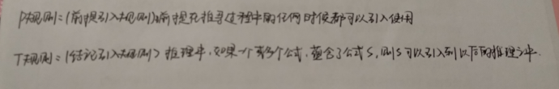
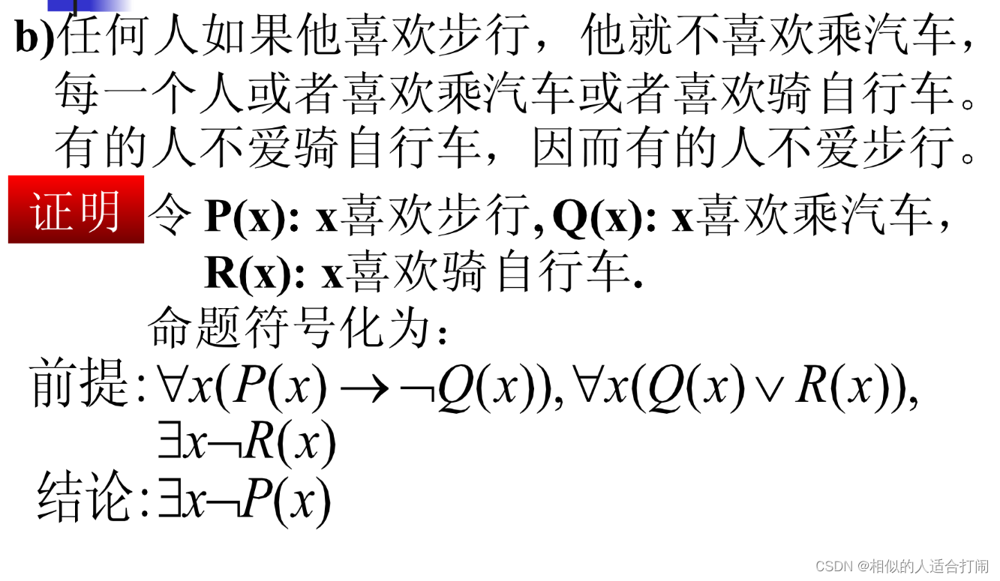
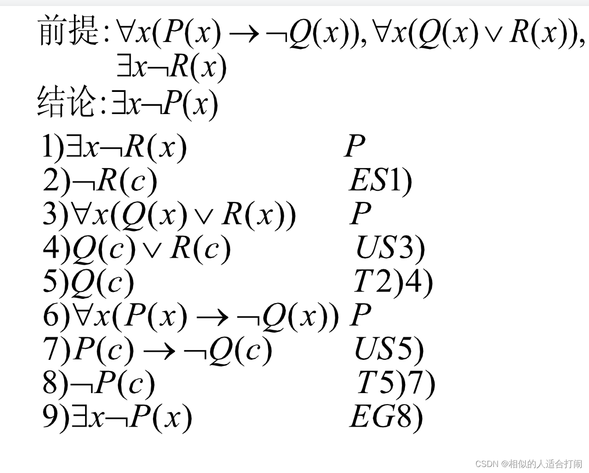

# 一、知识框架图

#  二、数理逻辑

 **1.命题符号化**

​     命题：能判断真假的陈述句

​     命题包含两个要素：陈述句，能判断真假

​     命题题符号化的步骤：       

​         1 )对于不太好理解的联结词或表达方式，如有必要,做适当的文字翻译。
​         2 )找出其中所有的原子命题并符号化。
​         3 )用适当的联结词将原子命题连接起来，如有必要，在适当位置配上括号。

 **2.真值表**

​     设A是一命题公式, P1,P2.... Pn,为出现在A中的所有命题变元,对P1.P2....Pn，各指定-一个[真值](https://so.csdn.net/so/search?q=真值&spm=1001.2101.3001.7020),称为对A的一种指派或赋值。
​     若指定的一种指派使A的值为真,则称这组值为A的成真指派（成真赋值）
​     若指定的一种指派使A的值为真，则称这组值为A的成假指派（成假赋值）

 **3.命题公式的等值演算**

​    设A和B是两个命题公式，设P1，P2....Pn为所有出现于A和B中的原子变元，若给定P1,P2....Pn,任一 组真值指派A和B的真值都相同，则称A和B是等值的或等价的，记为A<=>B。
​    证明两个命题公式等价的方法:
​    方法1:[真值表](https://so.csdn.net/so/search?q=真值表&spm=1001.2101.3001.7020)法。
​    方法2:等值演算法。

 **4.常用等值式**

​     

 **5.命题公式类型**

​     设A是任一命题公式。
​     若对A的任意赋值，其真值永为真，则称命题公式A为重言式或永真式。
​     若对A的任意赋值，其真值永为假，则称命题公式A为矛盾式或永假式。
​     若A不是矛盾式，则称命题公式A为可满足的。
​     由定义可以看出，任何重言式都是可满足的。

 **6.极小项与极大项**

​    极小项：在简单合取式中，每个变元及其否定不同时存在，但两者之一必须出现且仅出现一次，这样的简单合取式叫做布尔合取也叫小项或极小项。两个命题变元p，q所构成的所有小项为: p^q，p^┐q，┐p^q，┐p^┐q

​    极大项：在简单析取式中，每个变元及其否定不同时存在，但两者之一必须出现且仅出现一次,这样的简单析取式叫做布尔析取也叫大项或极大项。两个命题变元p，q所构成的所有大项为:pvq，pv┐q，┐pvq，┐pv┐q

 **7.真值表法求主析取范式**

 **8.真值表法求主合取范式**

 **9.等价演算求主析取范式**

 **10.等价演算求主和取范式**

**11.例题总结上述**

                                                                                            

 **12.自然推理系统**

 

 

 

**13.一阶命题符号化**

**14.一阶逻辑前束范式--即把所有的量词放在最前面**

# 三、集合与关系

 

 

 

 

 

 

# 四、代数系统（待更）

1.二元运算：设S为集合，函数 f：S×S→S 称为S上的二元运算，简称为二元运算。

例：f:N×N→N，f(<x,y>)＝x +y是自然数集合N上的二元运算

​    f:N×N→N，f(<x,y>)＝x - y不是自然数集合N上的二元运算

验证一个运算是否为集合S上的二元运算主要考虑两点：

S中任何两个元素都可以进行这种运算，且运算的结果是唯一的。

S中任何两个元素的运算结果都属于S，即S对该运算是封闭的。

自然数集合N上的加法和乘法是N上的二元运算，但减法和除法不是。

整数集合Z上的加法、减法和乘法都是Z上的二元运算，而除法不是。

非零实数集R*上的乘法和除法都是R*上的二元运算，加法、减法不是。

2.一元运算：设S为集合，函数f：S→S称为S上的一元运算，简称为一元运算。

3.设°为S上的二元运算，如果对于任意的*x,y*∈*S*都有*x*°*y*=*y*°*x*，则称运算°在*S*上满足交换律。

4.设°为S上的二元运算，如果对于任意的*x,y,z*∈S都有 (*x*°*y*)°*z*=*x*°(*y*°*z*)，则称运算°在S上满足结合律。

5.设°为S上的二元运算，如果对于任意的*x*∈*S*有*x*°*x*=*x*，则称运算°在S上满足幂等律。如果S中的某些*x*满足*x*°*x*=*x*，则称*x*为运算°的幂等元。

6.普通的加法和乘法不适合幂等律。但0是加法的幂等元，0和1是乘法的幂等元。

7.设°和*为*S*上两个二元运算，如果对于任意的*x,y,z*∈*S，*有

​                       *x**(*y*°*z*) ＝ (*x***y*) °(*x***z*)     （左分配律）
​                       (*y*°*z*)**x* ＝ (*y***x*) °(*z***x*)     （右分配律）

 则称运算*对运算°满足分配律。 

8.设°和*为*S*上两个可交换的二元运算，如果对于任意的*x,y*∈*S*，都有

​          *x**(*x*°*y*)＝*x*
​          *x*°(*x***y*)＝*x*

则称运算°和*满足吸收律。

9.设°为*S*上的二元运算，如果存在元素*el*（或*er）∈S*，使得对任意*x*∈*S*都有

​          *el*°*x* = *x* (或*x*°*er* = *x*)

 则称*el* (或*er*)是*S*中关于°运算的一个左单位元(或右单位元)。

10.若*e*∈*S*关于°运算既是左单位元又是右单位元，则称*e*为*S*上关于°运算的单位元。单位元也叫做幺元。

设°为*S*上的二元运算，如果存在元素*θl*（或*θr*）∈*S*，使得对任意*x*∈*S*都有 *θl*°*x* = *θl* (或*x*°*θr* = *θr*)，

 则称*θl* (或*θr*)是*S*上关于°运算的左零元(或右零元)。

11.若*θ*∈*S*关于°运算既是左零元又是右零元，则称*θ*为*S*上关于运算°的零元。

12.设°为*S*上的二元运算，*e*Î*S*为°运算的单位元，对于*x*∈*S*，如果存在*yl*（或*yr*）∈*S*使得*yl*°*x*＝*e*（或*x*°*yr*＝*e*）

则称*yl*（或*yr*）是*x*的左逆元（或右逆元）。

13.若*y*∈*S*既是*x*的左逆元又是*x*的右逆元，则称*y*为*x*的逆元。

14.如果*x*的逆元存在，则称*x*是可逆的。

15.设°为*S*上的二元运算，*el*、*er*分别为°运算的左单位元和右单位元，则*el* = *er* = *e* 且*e* 为*S*上关于°运算的唯一的单位元。

16.设°为*S*上的二元运算，*θl*和*θr*分别为°运算的左零元和右零元，则有 *θl* = *θr* = *θ*且*θ*为*S*上关于°运算的唯一的零元。

17.设°为*S*上的二元运算，*e* 和*θ*分别为°运算的单位元和零元，如果*S*至少有两个元素，则*e*!=*θ*。

18.设°为*S*上可结合的二元运算，*e*为该运算的单位元，对于*x*∈*S，*如果存在左逆元*yl*和右逆元*yr*，则*yl* = *yr*= *y*且*y*是*x*的唯一的逆元。

19.设°为*S*上的二元运算，如果对于任意的*x,y,z*∈*S，*满足以下条件：

（1）若*x*°*y* ＝*x*°*z*且*x*!=*θ*，则*y* ＝*z*    （左消去律）

（2）若*y*°*x* ＝ *z*°*x*且*x!=θ* ，则*y*＝*z*    （右消去律）

则称°运算满足消去律。

例如：

   整数集合上的加法和乘法都满足消去律。

   幂集*P*(*S*)上的并和交运算一般不满足消去律。

20.设V＝<S,°>是代数系统，°为二元运算，如果运算是可结合的，则称V为半群（semigroup）。

21.设V＝<S,°>是半群,若e∈S是关于°运算的单位元,则称V是含幺半群，也叫做独异点（monoid）。有时也将独异点V记作V＝<S，°，e>。

  <Z+,+>，<N,+>，<Z,+>，<Q,+>，<R,+>都是半群,+是普通加法。这些半群中除<Z+,+>外都是独异点。

   设n是大于1的正整数,<Mn(R),+>和<Mn(R),·>都是半群,也都是独异点,其中+和·分别表示矩阵加法和矩阵乘法。

   <P(B),Å>为半群,也是独异点,其中Å为集合的对称差运算。

   <Zn,Å>为半群,也是独异点,其中Zn＝{0,1,…,n-1},Å为模n加法。

   <A^A,°>为半群,也是独异点,其中°为函数的复合运算。

22.设<G,°>是代数系统，°为二元运算。如果°运算是可结合的，存在单位元e∈G，并且对G中的任何元素x都有x-1∈G,则称G为群（group）。

   注意:群*V*=<*S*,∘>的定义实际上包含5个条件

   ⑴ S非空；

   ⑵ ∘运算封闭；

   ⑶ ∘运算满足结合律；

   ⑷ ∘运算在s中有单位元；

   ⑸ S中任意元素对∘运算有逆。

​     <Z,+>,<Q,+>,<R,+>都是群,而<Z+,+>和<N,+>不是群。

​     <Mn(R),+>是群,而<Mn(R),·>不是群。因为并非所有的n阶实矩阵都有逆阵。

​     <P(B),Å>是群，因为对任何B的子集A，A的逆元就是A自身。

​     <Zn,Å>是群。0是Zn中的单位元。x∈Zn，若x＝0，x的逆元就是0，若x≠0，则n-x是x的逆元。

​     <A^A,°>，当|A|≥2时不是群。

# 五、图论

**图论基本概念**

1.图：无向图和有向图统称为图

2.图的阶：顶点数称为图的阶，n个顶点的图称作n阶图

3.一条边也没有的图称作零图，一阶图称作平凡图

4.在图的定义中规定顶点集V为非空集，但在的运算中可能产生顶点集为空集的运算结果，为此规定顶点集为空集的图为空图

5.标定图：给每个顶点和每一条边指定一个符号，否则称为非标定图

6.将有向图的各条有向边改成无向边后所得到的无向图称作这个有向图的基图

7.多重图：含平行边的图

8.简单图：不含平行边也不含环的图

9.悬挂顶点：顶点度数为1，与它关联的边称作悬挂边

10.握手定理：在任何图中（有向图&无向图），所有顶点的度数之和等于边数的2倍

11.推论：任何图中，奇度顶点的个数是偶数

12.可图化：当且仅当所有顶点度数和为偶数

13.图的同构必要条件：顶点数、边数、度数列相同

**图的连通性和图的运算**

1.在n阶图G中，若从顶点u到v（u!=v）存在通路，则u到v一定存在长度小于等于n-1的初级通路

2.在n阶图G中，若存在V到自身的的回路，则一定存在V到自身长度小于等于n的初级回路

3.设无向图G，若u，v之间存在通路，则称u，v是连通的

4.连通图：无向图G是平凡图或G中任何两个顶点都是连通的

**欧拉图与哈密顿图**

1.欧拉通路：通过图中所有的边一次且仅一次行遍所有的顶点的通路称作欧拉通路

2.欧拉回路：通过图中所有的边一次且仅一次行遍所有的顶点的回路称作欧拉回路

3.欧拉图：具有欧拉回路的图

4.半欧拉图：具有欧拉通路而没有欧拉回路的图

5.定理1：无向图G是欧拉图当且仅当G是连通图且没有奇度顶点

6.定理2：无向图G是半欧拉图当且仅当G是连通的且恰有两个奇度顶点

7.定理3：有向图G是欧拉图当且仅当G是强连通的且每个顶点的入度等于出度

8.定理4：有向图G是半欧拉图当且仅当G是单向连通的且恰有两个奇度顶点，其中一个顶点的入度比出度大一，另一个顶点的出度比入度大一，其余顶点入度等于出度

9.哈密顿通路：经过图中所有顶点一次且仅一次的通路称作哈密顿通路

10.哈密顿回路：经过图中所有顶点一次且仅一次的回路称作哈密顿回路

11.哈密顿图：具有哈密顿回路的图

12.半哈密顿图：具有哈密顿通路但不具有哈密顿回路的图
