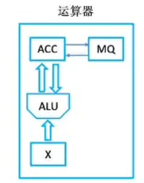
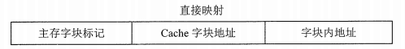
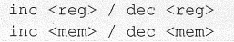
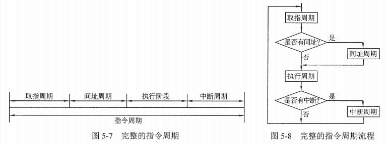

第一章：概述
======

> 计算机硬件唯一能识别的数据：二进制0/1
>
> *   低电平 —— 0
> *   高电平 —— 1

计算机通过很多条电路，可以传递多个二进制数位，每个二进制数位为1bit（比特）

1.计算机的发展
--------

> 计算机系统 = 硬件 + 软件  
> ———————————  
> 软件：
>
> *   系统软件：管理整个计算机系统（包括操作系统、数据库管理系统、标准程序库、语言处理程序、服务程序等）
> *   应用软件：按任务需要编制成的各种程序

第一台**电子数字**计算机：ENIAC（1946）  
逻辑元件：**电子管**

> 摩尔定律：集成电路上课容纳的晶体管数目，约每隔18个月就会增加一倍，整体性能也将提升一倍

2.计算机硬件组成
---------

*   冯诺依曼计算机的结构  
    

> 冯诺依曼计算机的特点：
>
> *   计算机由五大部件组成：运算器、存储器、控制器、输入/输出设备
> *   指令和数据以同等地位存与存储器中，可按地址访问
> *   指令和数据用二进制表示
> *   指令 = 操作码 + 地址码
> *   指令在存储器内按顺序存放
> *   以运算器为中心（输入/输出设备与存储器之间的数据通过运算器完成）

> *   **基本工作方式：控制流驱动驱动方式**
> *   **程序的功能都通过中央处理器执行指令实现**
> *   **指令进而数据用二进制表示，以同等地位存于存储器内，形式上无差别，只在程序执行时具有不同的含义**
> *   **指令按地址访问，数据由指令的地址码指出，除立即寻址外，数据均存放在存储器内**
> *   **在执行程序前，指令和数据需预先存放在存储器中，中央处理器可以从存储器存取代码**

*   现代计算机的结构

> 现代计算机的特点：
>
> *   以存储器为中心
> *   主机 = CPU + 主存储器
> *   CPU = 运算器 + 控制器
> *   存储器 = 内存（主存） + 外存（辅存）

### 2.1 存储器的基本组成

> 存储器 = 主存 + 辅存
>
> *   **CPU能直接访问的是主存**
> *   辅存用于帮助主存记忆更多信息，**辅存中的信息必须调入主存后，才能为CPU所访问**
> *   ps.**相联存储器（按内容寻址的存储器）：既可以按地址寻址又可以按内容寻址**

*   MAR（地址寄存器）：存放欲访存的存储单元地址
*   MDR（数据存储器）：暂存要从存储器中读或写的信息（存放从存储单元取来的数据）

> *   存储元：存放一位二进制信息
> *   存储单元：由若干存储元组成，每个存储单元放一串二进制代码
> *   存储体：由若干存储单元组成，存放二进制信息（存储矩阵）
> *   存储字（word）：存储单元中二进制代码的组合
> *   存储字长：存储单元中二进制代码的位数 （通常是8的倍数）
>
> * * *
>
> **主存储器由许多存储单元组成，每个存储单元包括多个存储元，每个存储元存储一位二进制代码‘0’或‘1’，故存储单元可以存储一串二进制代码，这串代码成为存储字，这串代码的位数称为存储字长，存储字长一般为一个字节（8bit）或字节的偶数倍，许多存储单元构成一个存储体**

> *   **MAR长度 = PC长度**
> *   **存储单元个数 = 2MAR位数**
> *   **MDR位数 = 数据线个数 = 存储字长**

例：  
MAR = 4位，表示共有24个存储单元  
MDR = 16位，表示每个存储单元可以存放16bit  
1个字（word）= 16bit

> 注意：  
> 1Byte（字节）= 8bit（比特）

### 2.2 运算器的基本组成

> *   累加器（ACC）：存放操作数或运算结果
> *   商乘寄存器（MQ）：在乘除运算时，用于存放操作数或运算结果
> *   操作数寄存器（X）：存放操作数
> *   算术逻辑单元（ALU）：通过内部复杂电路实现算术运算和逻辑运算
> *   变址寄存器（IX）
> *   基址寄存器（BR）
> *   程序状态存字寄存器（PSW）

### 2.3 控制器的基本组成

> *   控制单元（CU）：分析指令，给出控制信号
> *   指令寄存器（IR）：存放当前执行的指令
> *   程序计数器（PC）：存放下一条指令地址，有自动加一功能
> *   指令译码器（ID）：对指令进行译码（区分当前指令是什么指令，以形成相应的控制信号）
> *   时序发生器：按时间周而复始的发出节拍信号
> *   微操作控制部件：  
>     微操作：硬件电路中不可再细分的简单操作。（微操作在一个节拍内完成  
>     ）  
>     根据指令的译码结果，结合CP以及时序信号发生器产生的节拍信号，产生该指令执行过程中各节拍所需要的微操作控制信号，并将它们发送给包括控制器本身在内的各个部件，使之协调、分步骤地进行操作，实现指令的执行。

### 2.4 计算机工作过程举例

  

总结：  

> **CPU区分指令和数据的依据：指令周期的不同阶段**
>
> *   取址阶段：指令
> *   执行阶段：数据

> *   存储程序是将指令以代码的形式实现输入计算机主存储器，然后按其在存储器中的首地址执行程序需的第一条指令，以后就按该程序的规定顺序执行其他指令，直至程序执行结束
> *   计算机按存储程序原理应具有五大功能：数据传送功能、数据存储功能、数据处理功能、操作控制功能、操作判断功能

3.计算机软件
-------

### 3.1 系统软件

*   保证计算机系统高效、正确运行的**基础软件**，通常作为系统资源提供给用户使用。
*   主要包括：操作系统（OS）、数据库管理系统（DBMS）、语言处理系统、分布式软件系统、网络软件系统、标准库程序、服务性程序等

### 3.2 应用软件

*   是用户为解决某个领域中的各类问题而编制的程序
*   如**数据系统(DBS)**、各种科学计算类程序、工程设计类程序、数据统计与处理程序等

### 3.3 三个级别的语言

*   机器语言：**计算机唯一可以直接识别的语言**
*   汇编语言：必须通过**汇编程序**的翻译将棋转换为机器语言后，才能在计算机的硬件系统上运行
*   高级语言：要经过**编译程序**编译成汇编语言，再通过汇编操作得到机器语言

4.软件与硬件的关系
----------

*   **软件和硬件在逻辑上是等效的，不是等价的**
*   硬件具有更高的执行速度
*   软件实现具有更好的灵活性
*   **执行频繁、硬件实现代价不是很高的功能通常由硬件实现**

5.计算机系统的层次结构
------------

> *   **上下层是可分割的，上层是下层的功能实现**，只有下层没有上层也是可以的
> *   **上层实现对下城的功能扩展，下层对上层有限制作用**
> *   CPU存取速度：寄存器 > Cache > 内存
> *   解释程序执行速度比编译程序慢
> *   编译程序（C/C++）：将高级语言**一次性**翻译成**目标程序**，每次执行程序时，只需执行目标程序，只要源程序不变，就无须重新编译
> *   解释程序（JavaScripr、Python）：**翻译一句执行一句，不生成目标程序**

6.计算机的性能指标
----------

> **实际软件的运行情况**能全面代表计算机的性能

### 6.1 机器字长

> *   计算机进行一次整数运算所能处理的二进制数据的位数
> *   **一般等于内部寄存器的大小**
> *   一般为字节（8位）的整数倍
> *   **决定计算机的运算精度**：字长越长，数的表示范围越大，计算精度越高
> *   通常与CPU的寄存器位数、加法器有关

### 6.2 数据通路带宽

> *   数据总线一次所能并行传送信息的位数

### 6.3 主存容量：

> *   表示主存储器所能存储信息的最大容量
> *   MAR的位数反映存储单元的个数，也反映可寻址范围的最大值
> *   总容量 = 存储单元个数 \* 存储字长 （bit）
> *   总容量 = 2MAR位数 \* MDR位数  
>     eg：MAR为32位，MDR为8位。总容量 = 232 \* 8 bit = 4GB

> K:210B；M:220B；G:230B；T:240B

### 6.4 运算速度

> *   吞吐量：系统在单位时间内处理请求的数量
> *   响应时间：从用户向计算机发送一个请求，到系统对该请求作出响应并获得它所需要的结果的等待时间
> *   CPU周期：又称机器周期，从内存读取一条指令字的最短时间，**一个指令周期通常由若干个机器周期构成**
> *   主频：CPU内数字脉冲信号震荡的频率，单位：HZ  
>     CPU主频（时钟频率）= 1/CPU时钟周期
> *   CPI：执行一条指令所需的时钟周期数（不同的指令的CPI不同，甚至相同的指令CPI也可能不同）
> *   执行一条指令的时间 = CPI \* CPU时钟周期
> *   **CPU执行时间 = CPU时钟周期数/主频 = （指令条数 \* CPI）/主频**

*   IPS（每秒执行多少条指令）= 指令条数/执行时间 = **主频/平均CPI**
*   FLOPS（每秒执行多少次浮点运算）= 浮点运算次数/执行时间

> 前面会有K/M/G/T等字母，代表数量单位  
> K（千）=103；M（百万）=106；G（十亿）=109；T（万亿）=1012

### 6.5 几个专业术语

*   系列机：具有**基本相同的体系结构**，使用**相同基本指令系统**的多个不同型号的计算机组成的一个产品系列
*   兼容：计算机软件或硬件的通用性
*   软件可移植性
*   固件：将程序固定在ROM中组成的部件，**是一种具有软件特性的硬件**，执行速度快于软件，灵活性优于硬件

  

* * *

第三章：存储系统
========

1.存储器的分类
--------

*   按在计算机中的作用（层次）分类

> 1.  主存储器（主存/内存）：
>
> *   **用来存放计算机运行期间所需的大量程序和数据**
> *   CPU可以直接随机地对其进行访问，也可以和告诉缓冲存储器（Cache）以及辅助存储器交换数据
> *   特点：容量小，存取速度快，每位价格较高

> 2.  辅助存储器（辅存/外存）：
>
> *   **用来存放当前暂时不用的程序和数据，以及一些需要永久性保存的信息**
> *   不能与CPU进行直接交换信息
> *   特点：容量极大，存取速度慢，单位成本低

> 3.  高速缓冲存储器（Cache）：
>
> *   同于主存和CPU之间，**用来存放正在执行的程序段和数据**，以便CPU能更高速地使用它们
> *   Cache的存取速度可与CPU的速度相匹配
> *   热点：存取容量小，价格高

*   按存储介质分类

> 1.  磁表面存储器（磁盘。磁带）
> 2.  磁芯存储器
> 3.  半导体存储器
> 4.  光存储器（光盘）

*   按存取方式分类

> 1.  随机存储器（**RAM**）:
>
> *   **存储器的任何一个单元的内容都可以随机存取，且存取时间与存储单元的物理位置无关**
> *   优点：读写方便，使用灵活
> *   缺点：**断电信息丢失**
> *   静态RAM：以触发器原理寄存信息，**常用作Cache**
> *   动态RAM：以电容充电原理寄存信息，**常用作主存**

> 2.  只读存储器（ROM）：
>
> *   **存储器的内容只能随机读出而不能写入**
> *   信息一旦写入就固定不变，断电内容不会丢失（常用来存放固定不变的程序、常数、汉字字库，甚至用于操作系统的固化）
> *   **ROM与RAM一起构成了主存，且都支持随机存取**
> *   优点：结构简单，位密度比可读写存储器的高；可靠性高（非易失性）
> *   包括掩膜型只读存储器（MROM）、可编程只读存储器（PROM）、可擦除可编程只读存储器（EPROM）、电可擦除可编程只读存储器（EEPROM）、快擦除读写存储器（Flash Memory），名称中有E表示可擦除的

**注：**

*   **ROM和RAM都有随机存取的特性（直接访问存储器中的任何一个存储单元）**
*   **CDROM特指光盘，只有只读特性，没有随机存取特性**

> 3.  串行访问存储器：
>
> *   对存储单元进行读/写操作室，需要按照其物理位置的先后顺序寻址
> *   顺序存取存储器（如磁带）：只能按照某种顺序存取内容，**存取时长与信息在存储体上的物理位置有关**，存取速度慢
> *   直接存取存储器（如磁盘）：**存取信息时先寻找整个存储器中的某个小区域（磁盘上的磁道）（这个过程叫作寻道），再在小区域内顺序查找（在磁道旋转）**

*   按信息的可保存性分类

> 1.  易失性存储器：断电后存储信息消失（如RAM）
> 2.  非易失性存储器：断电后信息仍保持（如ROM、磁表面存储器、光存储器）
> 3.  破坏性读出：读出信息后原信息被破坏，**具有破坏性读出性能的存储器，每次读出操作后，必须紧接一个再生的操作，以便恢复被破坏的信息**
> 4.  非破坏性读出：读出信息后原有信息不被破坏

2.存储器的性能指标
----------

**大容量、低成本、高速度**

> 1.  存储容量 = **存储字数 \* 字长**
>
> *   存储字数表示存储器的地址空间大小，即存储器的存储单元数目
> *   字长即存储字长，表示一次存取操作的数据量

> 2.  单位成本：每位价格 = 总成本/总容量

> 3.  存储速度：**数据传输率 = 数据的带宽/存储周期**
>
> *   存取时间（Ta）：**从启动一次存储器操作到完成该操作所经历的时间，分为读出时间和写入时间**
> *   存取周期（Tm）：又称读写周期或访问周期，**指存储器进行一次完整的读写操作所需要的全部时间，==即连续两次访问存储器操作（读/写操作）之间所需的最小时间间隔**

**注：**

*   **存取时间不等于存储周期，通常存储周期 > 存储时间**
*   **对任何一种存储器，在读写操作后，总要一段恢复内部状态的复原时间（破坏性读出的存储器所需的复原时间更长）**  
    

3.存储器的层次化结构
-----------

**多级存储系统**  

> 1.  "Cache - 主存"层次：
>
> *   解决CPU和主存速度不匹配的问题
> *   速度接近于Cache，容量和价格接近于主存
> *   **Cache和主存间的数据调动是由硬件自动完成，对所有程序员透明**
>
> * * *
>
> 2.  "主存 - 辅存"层次：
>
> *   解决存储系统的容量问题
> *   速度接近于主存，容量和价格接近于辅存
> *   **主存和辅助间的数据局调动由硬件和操作系统共同完成，对应用程序员透明**

> *   Cache、主存可以直接与CPU交换信息
> *   辅存需要通过主存与CPU交换信息
> *   主存与CPU、Cache、辅存都能交换信息
>
> 

**在两个层次中，上一层中的内容都只是下一层中内容的副本，即Cache中的内容只是主存中内容的一部分（或主存中的内容只是辅存中内容的一部分）**

> 寄存器：
>
> *   是有限存储容量的告诉存储部件，可以用来暂存指令、数据等
> *   通常制作在CPU芯片内
> *   寄存器中的数直接在CPU内部参与运算
> *   速度最快，价格最贵，容量最小

> 存储器带宽：
>
> *   单位时间内存储器存取的信息量
> *   **\= 每个存储周期可访问的位数 / 存储周期**  
>     **1s = 103 ms = 106 us = 109 ns = 1012 ps**

4.半导体随机存储器
----------

>   
> 

> *   地址线是单向的
> *   数据线是双向的
> *   片选线：用于选择存储芯片
> *   读/写控制线：进行读/写操作

> **存储器的工作：保持存储信息、读文件和写数据**

### 4.1 静态随机存储器（SRAM）

> 存储元：
>
> *   存放一个二进制的物理器件
> *   **是存储器最基本的构件**
> *   **地址码相同**的多个存储元构成一个存储单元，若干存储单元的几个构成存储体

*   SRAM的存储元是用==双稳态触发器（六晶体管MOS）==来记忆信息，**信息被读出后，它仍保持原状态而不需要再生 （非破坏性读出）**
*   **存取速度快，但集成度低，功耗较大，所以一般用来组成Cache**

### 4.2 动态随机存储器（DRAM）

*   用存储元电路中栅极电容上的电荷来存储信息==（破坏性读出）==
*   DRAm的基本存储元通常只用一个晶体管，所以比SRAM密度高
*   **采用地址复用技术，地址线是原来的一半，且与地址信号分行、列两次传送 (片选线变为行通选+列通选)**
*   **容易集成、价位低、容量大、功耗低，但存取速度慢，一般用来组成大容量主存系统**

> DRAM电容上的电荷一般只能维持1~2ms，因此即使电源不断电，信息也会自动消失，因此每隔一段时间必须刷新，通常取2ms（刷新周期）

**注：易失性存储器是指断电后数据丢失，S/DRAM都满足断电内容消失，但需要刷新的只有DRAM，SRAM不需要刷新**

> 常用的刷新方式：
>
> *   **由于存储体是矩阵形式，因此每次刷新都是对行进行刷新**
> *   刷新的实质就是读出后再按原样写入
> *   没有特殊说明时刷新一行的时间等于一个存储周期（读周期/写周期）
> *   若题目说明了刷新操作由读操作和写操作一起执行，则刷新一行的周期按两倍的存储周期计算
>
> * * *
>
> 1.  集中刷新：将刷新操作集中到一段时间内集中进行
>
> *   一个刷新周期内，利用一段固定的时间，依次对存储器的所有行进行逐一再生，在此期间停止对存储器的读写操作，称为“死时间”，又称访存“死区”
> *   优点：读写操作时不受刷新工作的影响，因此系统的存取速度较快
> *   缺点：在集中刷新期间（死区）不能访问存储器
>
> * * *
>
> 2.  分散刷新：将刷新操作分散、周期性地进行
>
> *   把对每行的刷新分散到各个工作周期中，将存储器的系统工作分为两部分：牵绊部分用于正常读、写或保持；后半部分用于刷新某一行
> *   此时的存储周期不再等于读/写周期，而等于读/写周期 + 刷新一行的周期
> *   这种刷新方式增加了系统的存取周期，系统的存取周期为芯片的存储周期的两倍
> *   优点：没有死区
> *   缺点：加长了系统的存取周期，降低了整机的速度
>
> * * *
>
> 3.  异步刷新：前两周方法的结合
>
> *   即可以缩短“死时间”，又能充分利用最大刷新间隔为2ms的特点
> *   将刷新周期除以行数，得到两次刷新操作之间的时间间隔t，利用逻辑电路每隔时间t产生一次刷新的请求
> *   避免使CPU连续等待过长的时间，且减少了刷新的次数，从根本上提高了整机的工作效率
> *   若将刷新安排在不需要访问存储器的译码阶段，则既不会加长存储周期，又不会产生“死时间”，这是分散刷新的发展，也称“透明刷新”
> *   注意：刷新对CPU是透明的，即刷新不依赖于外部的访问；刷新操作时仅需要行地址；刷新操作类似于读操作，但又不同。刷新操作仅给栅极电容补充电荷，不需要信息输出。刷新时不需要选片，即整个存储器中的所有芯片同时被刷新
>
> 

### 4.3 存储器的度、写周期

> RAM的读周期：  
> 
>
> *   读周期时间（tRC）：存储芯片进行两次连续读操作的最小时间间隔
> *   读时间（tA）:从给出有效地址开始，到读出所有选中单元的内容并在外部数据总线上稳定地出现所需的时间
> *   **读周期 >= 读时间**
> *   tOC：片选的保持时间

> RAM的写周期  
> 
>
> *   **写周期 >= 写时间**

5.只读存储器（ROM）
------------

> 1.  掩膜型只读存储器（MROM）
>
> *   制造时写入程序，此后只能读而不能写入
> *   基本原理：以元件的“有/无”来表示“1/0”
>
> * * *
>
> 2.  可编程只读存储器（PROM）
>
> *   用户可根据自己需求填入内容，一旦写入，内容无法改变，属于一次性写入的存储器
> *   用熔丝存储数据
>
> * * *
>
> 3.  可擦除可编程只读存储器（EPROM）
>
> *   使用高压写入数据，当需要修改时，用紫外线将其内容全部擦除（不能局部擦除）
> *   写入时间长，速度慢。且改写次数有限，**不能代替RAM**
> *   用悬浮栅存储数据
>
> * * *
>
> 4.  电可擦除可编程只读存储器（EEPROM）
>
> *   使用高压写入、擦除数据（可局部擦除）
>
> * * *
>
> 5.闪存（Flash Memory）
>
> *   可以在不加电的情况下长期保存信息
> *   可以在线进行快速擦除和重写
> *   价格便宜，集成度高，擦写速度快
> *   存储元由MOS管组成  
>     

6.主存储器与CPU的链接
-------------

### 6.1 存储器容量的扩充

**若要将容量为 a \* b 的芯片组成为容量为 c \* d 的芯片，需要的芯片数量 n = (c \* d) / (a \* b)**

ps：a是字线，连接地址线；b是位线，连接数据线

> 1.  位扩充（增加b）：**增加存储字长**
>
> *   所有存储芯片的片选信号线是连在一起的  
>     
>
> * * *
>
> 2.  字扩充（增加a）：**增加存储单元的个数**
>
> *   片选信号线分开连接
> *   每个芯片都应和所有数据线连接  
>     
>
> * * *
>
> 3.  字位扩充（同时增加a、b）：**既增加存储字的数量，有增加存储字长**
>
> *   个芯片连接地址先的方式相同，而连接数据线的方式不同，且需要通过片选信号或采用译码器设计连接到相应的芯片  
>     

7.双口RAM和多模块存储器
--------------

### 7.1 双端口RAM

**寄存器有左右两个独立的窗口，分别具有两组相互独立的地址线、数据线和读写控制线，允许两个独立的控制器同时异步访问存储单元**

> 两端口对同一主存的操作：
>
> *   两端口不同时对同一地址单元存取数据：不出错
> *   两端口同时对同一地址单元读出数据：不出错
> *   两端口同时对同一地址单元写入数据：写入出错
> *   两端口同时对同一地址单元，一个写入数据，一个读出数据：读出出错
>
> **解决方法：** 通过“BUSY”标志，由判断逻辑决定暂时关闭一个端口，为关闭的端口正常访问，被关闭的端口延长一个很短的时间段后再访问（延时）

### 7.2 多模块存储器

（用于提高访存速度）

#### (1) 单体多字存储器

**指令和数据在主存内必须连续存放，一旦遇到转移指令，或操作数不能连续存放，这种方法的效果就不明显**  
  
把存储器的存储字长增加n倍（上图中n=4），以存放n个指令字或数据字，于是单体多字存储器的最大带宽比单体单字存储器的最大带宽提高n倍

#### (2) 多体并行存储器

采用多个模块组成的存储器，每个模块具有相同的容量和存取速度，各模块都有独立的地址寄存器、数据寄存器、地址译码器和读/写电路。每个模块都可以看做一个独立的存储器，它们既可以并行工作，也可以交叉工作  
分为**高位交叉编制（顺序方式）** 和**低位交叉编址（交叉方式）** 两种

##### (2.1) 高位交叉编址：

> *   每个模块内的体内地址顺序是连续的（一个体存满后，再存入下一个体）
> *   **高位地址表示体号，地位地址表示体内地址**
> *   可以同一时间使得不同的请求源同时访问不同的体，进而实现个体的并行工作
> *   优点：利于存储器的扩充，只需将存储单元的编号往后加
> *   缺点：由于各个模块一个接一个地串行工作，因此存储器的带宽受到了限制

##### (2.2) 低位交叉编址：

> *   **低位地址表示体号，高位地址表示体内地址**
> *   连续地址分布在相邻的不同模块内，而同一个模块的地址都是不连续的
> *   可以实现**多模块流水线式并行存取**，大大提高存储器的带宽
>
>   
> 

##### (2.3) 总结

> *   高位交叉编址中的并行体现在**不同的请求源**并行访问不同的体
> *   复位交叉编址中的并行体现在**同一请求源**并行访问不同的体

8.高速缓冲存储器（Cache）
----------------

> **一般Cache采用高速度SAMR制作（主存一般使用DRAM）** ，速度更快，容量更小，价格更高

### 8.1 Cache的工作原理

**原理：利用程序访问的局部性原理，将CPU近期需要的程序提前存放到Cache中**

> 1.  时间局部性：如果某个数据或指令被使用，那么不久将可能再被使用
> 2.  空间局部性：如果某个数据或指令被使用，那么附近数据也可能被引用

> C << M
>
> *   **命中率：** CPU要访问的信息在Cache中的比例
> *   **平均访问时间：** 设命中率为h，命中时Cache的访问时间为tc，未命中时访问主存的时间为tm，则Cache-主存的平均访问时间\*\*ta =h\*tc + (1-h)\*tm\*\*
> *   **Cache-主存系统效率：e=tc/ta**
>
> 

> **注：**
>
> *   **Cache的命中率只与Cache的容量、Cache的字块长度有关**
> *   CPU与Cache之间传送数据的基本单位是**字**，主存与Cache之间传送数据的基本单位是**块（一个块包含多个字）**
> *   CPU访问主存时，会将地址同时送给Cache和主存，Cache控制逻辑依据地址判断此字是否在Cache中，若在，则立即传送给CPU，否则，用主存**读周期**把此字从主存读出并送到CPU。同时，把含有这个字的**整个数据块（是整个包含此字的数据块，不仅仅是这个字）** 从主存读出并送到Cache中

  
  

### 8.2 Cache和主存之间的映射方式（CPU送来的主存地址如何转换成Cache的地址）

1.  直接映射  
    

> **i = j mod C**  
> i为Cache的块号，j为主存中的块号，C为Cache的块数
>
> *   优点：实现简单
> *   缺点：不够灵活，冲突概率高（抖动）

> **操作原理：**  
> 先访问存储地址中间的c位，找到对应的Cache行，将对应Cache行中的标记和主存地址的t位进行比较，若相等且有效位为1，则访问Cache“命中”，此时根据b位在对应的Cache行中存取信息；若不相等或有效位为0，则“不命中”，需要从主存中读取所需要的块来替换Cache中旧的块，同时将信息送往CPU，并修改Cache的标记，若原来有效位为0，需要将有效位置1

2.  全相联映射  
    

> 主存中的每一块可以装入Cache的任何位置，每行的标记用于指出该行取自主存的哪一行。
>
> *   **Cache标记位数 = log2主存的行数**
> *   优点：提高了Cache的命中率；减小了块的冲突率；提高了Cache的利用率
> *   缺点：tag位数增加，标记的比较速度慢。这种比较常用 **按内容寻址** 的相联存储器完成

> **操作原理：**  
> CPU访存指令指出一个内存地址，该内存地址包含块号、字等字段。Cache的所有行的标记位和内存地址的块号一同送入比较器中比较，如果块号命中，则直接从Cache命中的块号中读取所需的字；若不命中，则按内存地址读取这个字，同时把内存块读入Cache行中

3.  组相联映射  
    

> **i = j mod Q**  
> i是Cache行的组号，j是主存的块号，Q是Cache的组数  
> 将Cache分为Q组，主存的一个数据块可以装入一组内的任何一个位置，即组间采用直接映射，组内采用全相联映射

> 
>
> *   **块内字地址 = log2块大小**
> *   **组号 = log2Cache组数**
> *   **标记 tag = 主存地址的其余位**

4.  总结  
    

> **操作原理：**  
> CPU访存指令指出一个内存地址，该内存地址包含块号、字等字段。然后通过组好找出Cache中对应的组，再将Cache改组中所有行的标记tag位和内存地址的tag一同送入比较器中比较，如果命中，通过内存地址的低b位确定需要该块中的哪一个字，再进行存取操作；若不命中，则去内存址读取需要的字，同时把内存块读入Cache行中

### 8.3 Cache中主存块的替换算法（若Cache中的内容已满，如何腾出位置）

* * *

第四章：指令系统
========

1.指令格式
------

> **指令：是计算机运行的最小功能单位**
>
> **指令系统（指令集）：一台计算机的所有指令的集合，位于软件和硬件的交界面上**
>
> **指令 = 操作码 + 地址码**
>
> *   操作码：指出指令应该执行什么性质的操作和具有何种功能，是识别指令、了解指令功能、区分操作数地址内容的组成和使用方法等的关键信息
> *   地址码：给出被操作的信息（指令或数据）的地址，包括参加运算的操作数所在的地址、运算结构保存的地址、程序的转移地址、被调用的子程序的入口地址等

> **指令的长度：一条指令中所包含的二进制代码的位数**
>
> *   指令字长取决于操作码的长度、操作数地址码的长度、操作数地址的个数
> *   指令长度一般为字节的整数倍

### 1.1 指令的分类

**指令操作数的直接寻址范围 = 2地址码位数**

**n位操作码字段的指令最大能表示2n条指令**

> 按指令长度与机器字长的关系分：
>
> *   单字长指令：指令长度=机器字长
> *   半字长指令：指令长度=半个机器字长
> *   双字长指令：指令长度=两个机器字长

> 按指令长度是否相等分：
>
> *   定长指令字结构：指令系统中所有指令的长度都相等（执行速度快，控制简单）
> *   变长指令字结构：各种指令的长度随指令功能各异

> 按指令中操作数的地址码的数目分：
>
> *   零地址指令：只给操作码OP，无显式地址
>
>     1.不需要操作数的指令：空操作指令、停机指令、关中断指令等
>
>     2.零地址的运算类指令**仅用在堆栈计算机中**，通常参与运算符的两个操作数隐含地从**栈顶和次栈顶**弹出，送到运算器进行运算，运算结果再隐含地压入堆栈
>
> *   一地址指令：
>
>     1.OP(A1)→A1：只有目的操作数的单操作数指令，按A1地址读取操作数，进行OP操作后，结果存回原地址（加一、减一、求反、求补等）
>
>     2.(ACC)OP(A1)→ACC：隐含约定目的地址的双操作指令，按指令地址A1可读去源操作数，指令可隐含约定另一个操作数由**ACC**提供，运算结果也存放在ACC中
>
> *   二地址指令：
>
>     (A1)OP(A2)→A1：给出目的操作数和源操作数，运算结果存于目的操作数地址
>
> *   三地址指令：
>
>     (A1)OP(A2)→A3
>
> *   四地址指令：
>
>     (A1)OP(A2)→A3，A4 = 下一条将要执行指令的地址
>

### 1.2 扩展操作码指令格式

变长度操作码：全部指令的操作码字段的位数不固定，且分散地放在指令字的不同位置上

常见的变长操作码方法：**扩展操作码**（操作码的长度随地址码的减少而增加）

> *   **不允许短码是长码的前缀，即短操作码不能与长操作码的前面部分的代码相同**
>
> *   **各指令的操作码一定不能重复**
>
> *   **通常情况下，对使用频率较高的指令分配较短的操作码，对使用频率较低的指令分配较长的操作码**
>
> *   **地址长度为n，上层留出m种状态，下一层可扩展出m×2n种状态**
>
>     eg.二地址指令条数最大值 = (2三地址指令操作码位数 - 三地址指令条数) × 2二地址操作码位数-三地址操作码位数
>

2.指令的寻址方式
---------

### 2.1指令寻址

**寻找下一条将要执行的指令地址**

*   顺序寻址：  
    通过程序计数器（PC）加1（1个指令字长），自动形成下一条指令的地址
*   跳跃寻址  
    通过转移类指令实现，是否跳跃受**状态寄存器和操作数**的控制，而跳跃到的地址分为绝对地址和相对地址，**跳跃的结果是当前指令修改PC值**

### 2.2 数据寻址

**寻找操作数的地址**  
  
寻址特征：指明属于那种寻址方式

> 1.  隐含寻址：  
>     不明显地给出操作数地址，而在指令中隐含操作数地址
>
> *   优点：利于缩短指令字长，可以简化地址结构
> *   缺点：需增加存储操作数或隐含地址的硬件
>
> * * *
>
> eg.累加器（ACC）对单地址指令格式来说是隐含寻址  
> 

> 2.  立即寻址：  
>     指令的地址字段直接指出操作数本身，又称立即数
>
> *   优点：在执行阶段不访问主存，**指令执行时间最短**
> *   缺点：A的位数限制了立即数的范围  
>     

> 3.  直接寻址：  
>     指令字中的形式地址A是操作数的真实地址EA，EA = A
>
> *   优点：简单，指令在执行阶段只访问一次主存，不需要专门计算操作的地址
> *   缺点：A的位数决定了该指令操作数的寻址范围，操作数的地址不易修改  
>     **无条件转移指令的功能是将指令中的地址码送入PC中**  
>     

> 4.  间接寻址：  
>     指令的地址字段给出的形式地址不是操作数的真正地址，而是操作数地址的地址，EA = (A)
>
> *   优点：扩大寻址范围（EA位数 > A位数）；便于编制程序（用间接选址可方便地完成子程序返回）
> *   缺点：访问速度慢，指令在执行阶段要多次访存
> *   间接寻址可以是一次间接寻址，也可以是多次间接寻址  
>     

> 5.  寄存器寻址：  
>     指令字中直接给出操作数所在的寄存器变化，EA = Ri
>
> *   优点：执行速度快，支持向量/矩阵运算；指令在执行阶段不访问主存，只访问寄存器，地址段位数短
> *   缺点：计算机中寄存器个数有限  
>     

> 6.  寄存器间接寻址：  
>     在寄存器Ri中给出的不是一个操作数，而是操作数所在的主存单元的地址，EA = (Ri)
>
> *   比一般间接寻址更快，但指令的执行阶段需要访问主存  
>     

> 7.  相对寻址：  
>     把程序计数器（PC）的内容加指令格式中形式地址A二形成操作数的有效地址，EA = (PC) + A**(A是补码表示！！！)**
>
> *   优点：操作数的地址不固定，随PC值变化，且与指令地址之间总差一个固定值，因此便于程序浮动，是多道程序设计中最重要的寻址方式
> *   **广泛应用于转移指令**
> *   **注意：由于读取指令后PC自动加1，所以A是相对于下一条指令地址的偏移量**  
>     

> ps.对于转移指令 JMP A，当CPU从存储器中取出一字节时，会自动执行(PC) + 1 → PC，若转移指令的地址为X，却占2B，在取出该指令后，PC的值会增2，即(PC) = X + 2，这样执行完该指令后，会自动跳转到X + 2 + A的地址继续执行

> 8.  基址寻址：  
>     将CPU中基址寄存器（BR）的内容加上指令格式中的形式地址A而形成操作数的有效地址，EA = (BR) + A
>
> *   寄存器可以是专用寄存器，也可以是通用寄存器
> *   基址寄存器是**面向操作系统**的，其内容由**操作系统或管理程序**确定，主要用于解决程序逻辑空间与存储器物理空间的无关性
> *   **采用通用寄存器时，可由用户决定哪个寄存器作为基址寄存器，但其内容仍由操作系统决定**
> *   优点：扩大寻址范围，用户不必考虑自己的程序存于主存中哪个空间区域，利于多道程序设计，并可用于编制浮动程序，但偏移量（形式地址A）的位数较短  
>     

> 9.  变址寻址：  
>     有效地址EA等于指令字中的形式地址A与变址寄存器IX的内容之和，EA = (IX) + A
>
> *   IX为变址寄存器（专用），也可用通用寄存器作为变址寄存器
> *   变址寄存器是**面向用户的**，在程序执行过程中，变址寄存器的内容可由用户改变（作为偏移量），形式地址A不变（作为基地址）
> *   优点：扩大寻址范围，适合编制**循环程序**  
>     

**变址寻址与基址寻址的区别：**

*   基址寻址面向系统，主要用于为多道程序或数据分配存储空间，因此基址寄存器的内容通常由操作系统或管理程序确定，程序的执行过程中其值不可变，而指令字中的A是可变的**（BR为基地址，A为偏移量）**
*   变址寻址面向用户，主要用于处理数组问题，变址寄存器的内容由用户设定，程序执行过程中其值可变，而指令字中的A是不可变的**（A为基地址，IX为偏移量）**  
    

> 10.  堆栈寻址：
>
> *   堆栈：  
>     存储器（或专用寄存器组）中一块特定的，按后进先出（LIFO）原则管理的存储区，该存储区中读写单元的地址由堆栈指针（SP）给出。  
>     硬堆栈：寄存器堆栈  
>     软堆栈：从主存中划出一段区域来做堆栈
> *   采用堆栈结构体的计算机系统中，大部分指令表面上都表现为**无操作数指令**的形式，因为**操作数地址都隐含使用 了SP**。通常情况下，**在读写堆栈中的一个单元前后都伴有自动完成对SP内容的增量或减量操作**

**总结：**  

3.X86汇编指令入门
-----------

*   X86处理器有8个32位的通用寄存器  
    

> *   <reg>表示任意寄存器，后面的数字表示其位数
>
> *   <mem>表示内存地址
>
> *   <con>表示常数，后面的数字表示其位数
>
> *   byte：单字节（Byte）
>
> *   word：双字节（2Byte）
>
> *   dword：四字节（4Byte）
>

**汇编指令通常可以分为数据传送指令、逻辑计算指令、控制流指令**

### 3.1 数据传送指令

> 1.  mov指令：  
>     将第二个操作数（_寄存器的内容、内存中的内容或常数值_）复制到第一个操作数（_寄存器或内存_），但不能用于直接从内存复制到内存  
>     

> 2.  push指令：  
>     将操作数压入内存的栈，常用于函数调用。ESP是栈顶，压栈前将ESP的值-4（栈增长方向与内存地址增长方向相反）或+4（栈增长方向与内存地址增长方向相同），然后将操作数压入ESP指示的地址  
>     

> 3.  pop指令：  
>     执行出栈操作，出栈前先将ESP指示的地址中的内容出栈，然后ESP值+4或-4  
>     

### 3.2 算术和逻辑运算指令

> 1.  add/sub指令：  
>     用于两个操作数相加/相减，结果保存到第一个操作数中  
>     

> 2.  inc/dec指令：  
>     将操作数自加1/自减1  
>     

> 3.  imul指令：  
>     带符号整数相乘
>
> *   两个操作数：两数相乘后结果保留至第一个操作数中
> *   三个操作数：将第二个和第三个操作数相乘后结果保存至第一个操作数中（_第一个操作数必须是寄存器_）  
>     

> 4.  idiv指令：  
>     只有一个操作数，即除数，被除数为edx:eax中的内容，操作结果有两部分：商和余数，商送到eax，余数送到edx  
>     

> 5.  and/or/xor指令：  
>     逻辑与、逻辑或、逻辑异或操作还做了，操作结果放在第一个操作数中  
>     

> 6.  not指令：  
>     位翻转指令，0→1,1→0  
>     

> 7.  neg指令：  
>     取负指令  
>     

> 8.  shl/shr指令：  
>     逻辑左移/右移指令，第一个操作数表示被操作数，第二个操作数百奥赛位移的位数  
>     

### 3.3 控制流指令

**IP：指示当前执行指令的指令指针，一条指令执行后，此指针自动指向下一条指令。IP寄存器不能直接操作，但可以用控制流指令更新**

> 1.  jmp指令：  
>     控制IP转移到label所指示的地址  
>     

> 2.  jcondition指令：  
>     条件转移指令，依据处理机状态字中的一系列条件状态转移。处理机状态字中包括指示最后一个算术运算结果是否为0，运算结果是否为负数等  
>     

> 3.  cmp指令：  
>     比较两个操作数的值，并根据比较结果设置处理机状态字中的条件码  
>     

> 4.  call/ret指令：  
>     实现子程序（过程、函数等）的调用及返回。
>
> *   call指令将当前执行指令地址入栈，然后无条件转移到由标签指示的指令，**call指令保存调用之前的地址信息**（当call指令结束后，返回调用之前的地址）
> *   ret指令实现子程序的返回机制，ret指令弹出栈中保存的指令地址，然后无条件转移到保存的指令地址执行  
>     

4.CISC和RISC
-----------

### 4.1 复杂指令系统计算机（CISC）

设计思路：一条指令完成一个复杂的基本功能  
代表：x86架构，主要用于笔记本、台式机等

> 特点：
>
> *   指令系统复杂庞大，指令数目一般为200条以上
> *   指令的长度不固定，指令格式多，寻址方式多
> *   可以访存的指令不受限制
> *   各种指令使用频度差别大
> *   各种指令执行时间差别大，大多数指令需要多个时钟周期才能完成
> *   控制器大多数采用微程序控制，有些指令十分复杂，无法采用硬连线控制
> *   难以用优化编译器生成高效的目标代码

### 4.2 精简指令系统计算机（RISC）

设计思路：一条指令完成一个基本的动作，多条指令组合完成一个复杂的基本功能  
代表：ARM架构，主要用于手机、平板等

> 特点
>
> *   选取使用频率较高的一些简单指令，复杂指令的功能由简单指令的组合来实现
> *   指令长度固定，指令格式种类少，寻址方式种类少
> *   只有Load/Store指令访存，其余指令的操作都在寄存器之间进行
> *   CPU中通用寄存器的数量相当多
> *   RISC一定采用指令流水线技术，大部分指令在一个时钟周期内完成
> *   以硬布线控制为主，不用或少用微程序控制
> *   特别重视编译优化工作，减少程序执行时间

### 4.3 比较

> RISC优点：
>
> *   能冲扥利用VLSI芯片面积
> *   能提高运算速度
> *   便于设计，可降低成本，提高可靠性
> *   有利于编译程序代码优化

5.总结
----

1.  常见指令寻址方式的特点及适用情况

> *   立即寻址操作数获取便捷，常用于给寄存器赋初值
> *   直接寻址相对于立即寻址缩短了指令长度
> *   间接寻址扩大了寻址范围，便于编制程序，**易于完成子程序返回**
> *   寄存器寻址的指令字较短，执行速度较快
> *   寄存器间接寻址扩大了寻址范围
> *   基址寻址扩大了操作数寻址范围，**适用于多道程序设计**，常用于为程序或数据分配存储空间
> *   变址寻址主要用于处理**数组问题**，适合编制**循环程序**
> *   相对寻址用于控制的程序的**执行顺序、转移等**

2.  基址寻址和变址寻址的区别

> *   基址寻址面向系统，内容通常由操作系统或管理程序确定，程序的执行过程中其值不可变，而指令字中的A是可变的**（BR为基地址，A为偏移量）**
> *   变址寻址面向用户，内容由用户设定，程序执行过程中其值可变，而指令字中的A是不可变的**（A为基地址，IX为偏移量）**  
>     

3.  在指令中给出操作数的地址

> 地址指定方式：
>
> *   大端方式：指令中给出的地址是操作数最高有效字节（MSB）所在的地址
> *   小端方式：指令中给出的地址是操作数最低有效字节（LSB）所在的地址

* * *

第五章：中央处理器
=========

1.CPU的功能和基本结构
-------------

> **CPU=运算器+控制器**
>
> *   运算器：对数据进行加工
> *   控制器：协调并控制计算机各部件执行程序的指令序列，包括取指令、分析指令和执行指令

**CPU的功能：**

1.  **指令控制：** 控制器能自动形成指令地址，并发出指令命令，将对应此地址的指令取到控制器中
2.  **操作控制：** 取指令后，产生完成每条指令所需的控制命令
3.  **时间控制：** 控制命令产生后，需要对各种控制命令加以时间上的控制
4.  **中断处理：** 对计算机运行过程中出现的异常情况和特殊请求进行处理

**CPU的基本结构：**  
指令控制、操作控制、时间控制由**控制单元（CU）完成**；数据加工由**ALU**完成；中断处理由**中断系统**完成，最后再加上一些**寄存器**，就构成了CPU

> 1.  运算器中的寄存器
>
> *   暂存寄存器：  
>     **暂存从主存读来的数据**，次数据不能放在通用寄存器中，否则会破坏其原有内容。暂存寄存器对应用程序员是透明的
> *   累加寄存器（ACC）：  
>     是一个通用寄存器，**存放ALU运算的结果信息**
> *   通用寄存器组：  
>     **存放操作数（包括源操作数、目的操作数、中间结果）和各种地址信息等。** 常见的通用寄存器有AX,BX,CX,DX,以及SP（指示栈顶指针）等。通用寄存器对程序员不透明，程序员编程时可以充分利用通用寄存器以提高程序效率
> *   条件状态寄存器（PSW）：  
>     **保存由算术指令和逻辑指令运行或测试的结果而建立的各种状态信息，如运算结果进位标志（C）、运算结果溢出标志（V）、运算结果为零标志（Z）、运算结果为负标志（N）等。** 这些标志位通常分别由以为触发器保存。此外，还可以**保存中断和系统工作状态等信息**，使CPU和系统能及时了解机器运行状态和程序运行状态
>
> 2.控制器中的寄存器
>
> *   程序计数器（PC）  
>     **功能：寄存信息、计数**  
>     保存将要执行的下一条指令的地址（遇到转移指令则需从指令的地址段获取）  
>     PC位数=存储器地址位数=存储器的容量
> *   指令寄存器（IR）  
>     **用于保存正在执行的指令**  
>     执行指令时，先将其从内存取到MDR中，之后再传送至IR中  
>     IR位数=指令字长
> *   存储器数据寄存器（MDR）  
>     也叫数据缓冲存储器  
>     **暂存由主存读出或存入主存的一条指令或一个数据字**  
>     **作为CPU、内存和外存设备之间信息传送的中转站**  
>     **补偿CPU、内存和外存设备之间在操作速度上的差别**  
>     在**单累加器结构**的运算器中，还可以兼作操作数寄存器
> *   存储器地址寄存器（MAR）  
>     **保存当前CPU所访问的内存单元的地址**  
>     当CPU和内存进行信息交换时，都要使用MAR和MDR  
>     信息的存入一般采用**点位-脉冲**方式

**用户可见寄存器**：用户可以改变其内容（如PC，用户可以通过转移指令或调动子程序等方式改变其内容）

条件转移指令执行时，需对**标志寄存器**的内容进行测试，判断是否满足转移条件

通用寄存器位数=机器字长

2.指令执行过程
--------

### 2.1 指令周期

**指令周期：CPU完成一条指令的时间**

*   指令周期被划分为几个不同的阶段，每个阶段所需的时间称为**机器周期（CPU工作周期）**，通常等于取指时间（访存时间）
*   **时钟周期（T周期/节拍脉冲）**处理操作的**最基本的单位**  
    

*   一个机器周期内包含的时钟周期个数由该机器周期内完成动作所需的时间决定
    
*   一个指令周期内包含的及其周期个数与指令所要求的动作有关  
    
    
*   间接寻址时，需要多访问一次存储器取出有效地址，因此有**间址周期**
    
*   当CPU采用中断方式实现主存与I/O交换信息时，CPU在每条指令的执行周期结束前，都要发出中断查询信号，检测是否有I/O提出请求，若有请求则CPU需要进入中断响应阶段，即**中断周期**  
    
    

### 2.2 指令执行方案

> 1.  单指令周期
>
> *   所有指令都选用相同的执行时间完成
> *   每一条指令都在固定的时钟周期内完成，指令之间**串行执行**，即下一条指令只能在前一条指令结束后才能启动
>
> 2.  多指令周期
>
> *   对不同类型的指令选用不同的执行步骤
> *   **串行执行**，但可以选用不同个数的时钟周期来完成不同指令的执行过程
>
> 3.流水线方案
>
> *   指令之间可以**并行执行**的方案
> *   在每个时钟脉冲周期完成一条指令的执行过程（理想情况）
> *   通过在每个时钟周期启动一条指令，尽可能让多条指令同时运行，但各自处在不同的执行步骤中

### 2.3 指令的执行过程与信息流

*   **信息流**：根据指令要求一次访问的数据序列，在指令执行的不同阶段，要求访问的数据序列不同，对不同的指令，其数据流往往也不同

1.  取指周期

*   CPU到哪个单元存取指令？
*   如何形成后继指令地址？
*   **按PC内容取出指令，并将PC内容递增，当出现转移情况时，指令地址在执行周期被修改**  
    

2.  间址周期（并非所有指令的执行都有间址周期）

*   取出操作数的有效地址  
    

3.  执行周期
4.  中断周期  
    

### 5.3 数据通路的功能和基本结构

*   **数据通路**：数据在功能部件之间传送的路径。描述了信息从什么地方开始，中间经过哪个寄存器或多路开关，最后传送到哪个寄存器

1.  数据通路的功能  
    实现CPU内部的运算器和寄存器，以及寄存器之间的数据交换
2.  数据通路的基本结构：

> ① CPU内部总线方式
>
> *   将所有寄存器的输入端与实处段都连接到一条或多条公共的通路上
> *   结构简单，但数据传输存在较多冲突现象，性能能较低  
>     

> ② 专用数据通路方式
>
> *   根据指令执行过程中的数据和地址的流动安排接线路，避免使用共享的总线，性能比较高，但硬件量较大  
>       
>     

3.  常见数据通路的数据传送

> ① 寄存器之间的数据传送
>
> *   一般通过CPU内部总线完成

* * *

第六章：总线
======

* * *

第七章：输入/输出系统
===========

* * *
