第一章
===

1\. 什么是[计算机系统](https://so.csdn.net/so/search?q=%E8%AE%A1%E7%AE%97%E6%9C%BA%E7%B3%BB%E7%BB%9F&spm=1001.2101.3001.7020)
---------------------------------------------------------------------------------------------------------------------

计算机系统包含

*   软件
    *   系统软件
        *   用来管理整个计算机系统
        *   例如操作系统，数据库管理系统DBMS，标准程序库，网络软件，语言处理程序，服务程序
    *   应用软件
        *   按任务需要编制成的各种程序
        *   例如各种桌面软件
*   硬件
    *   略

2\. 硬件的发展
---------

第一代：电子管  
第二代：[晶体管](https://so.csdn.net/so/search?q=%E6%99%B6%E4%BD%93%E7%AE%A1&spm=1001.2101.3001.7020)  
第三代：中小规模[集成电路](https://so.csdn.net/so/search?q=%E9%9B%86%E6%88%90%E7%94%B5%E8%B7%AF&spm=1001.2101.3001.7020)  
第四代：大规模，超大规模集成电路

3\. 计算机硬件的基本组成
--------------

包含五大部分：

*   输入设备：将信息转化成机器能够识别的形式
*   输出设备：将结果转化为人们熟悉的形式
*   主存储器：存放数据和程序
*   运算器：算术运算，逻辑运算
*   控制器：指挥各部件，使程序运行

### 冯诺依曼结构

冯诺依曼计算机的特点：

*   首次提出“存储程序”概念
*   以运算器为中心
*   指令和数据以同等地位存储于存储器中，可以按地址寻访
*   指令和数据用二进制表示
*   指令由操作码和地址码组成

冯诺依曼计算机结构框图：  
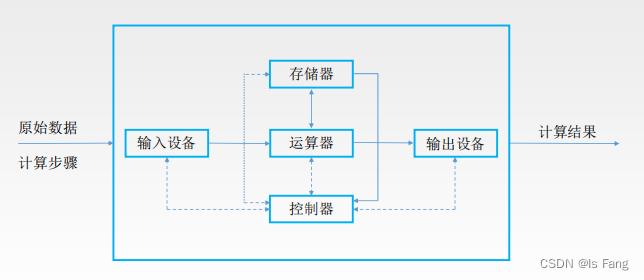

*   方框前为软件，方框中的部分为硬件
*   在计算机系统中，软件和硬件在逻辑上是等效的，例如对于乘法运算，可以设计一个专门的硬件电路来实现，也可以用软件的方法，执行多次加法运算来实现

### 现代计算机结构

特点：

*   以存储器为中心
*   CPU = 运算器 + 控制器

现代计算机结构框图：  

当前计算机结构框图

*   两个存储器对于的其实就是内存和硬盘

### 主存储器

*   cpu与主存储器通过地址总线进行交流
*   读数据时需要将地址信息放到MAR
*   写数据时需要将地址信息和数据信息分别放到MAR和MDR

名词解释：

*   MAR：由译码器进行地址译码后找到相应的存储单元 【反应存储单元的个数】
*   MDR：暂存要从存储器中读或写的信息
*   存储单元：每个存储单元存放一串二进制代码
*   存储字（word）：存储单元中二进制代码的组合
*   存储字长：存储单元中二进制的位数
*   存储元：即存储二进制的电子元件（电容），每个存储单元可以存1bit

例子：  
  
例如宽带是用100Mbps表示，而下载速度一般用10MB/s表示

### 运算器

用来实现算术运算和逻辑运算

*   ACC：累加器，用于存放操作数，或运算结果
*   MQ：乘商存储器，在乘除运算时，用于存放操作数或运算结果
*   X：通用操作数寄存器，用于存放操作数
*   ALU：算术逻辑单元，通过内部复杂电路实现算数运算，逻辑运算

### 控制器

*   CU：控制单元：分析指令，给出控制信息
*   IR：指令存储器，存放当前执行的指令
*   PC：程序技术器，存放下一条指令地址，有自动加一功能

所以CPU完成一条指令的步骤如下：

*   取指令 PC
*   分析指令 IR
*   执行指令 CU

### 工作过程实例

如图所示：  
  

  

总结：  

总结：  
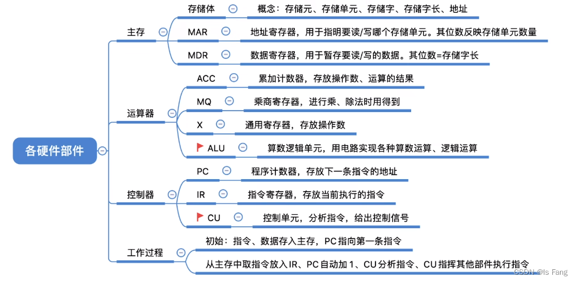  
注意：现在的计算机通常把MAR、MDR也集成在CPU内  

4\. 计算机系统的层次结构
--------------

### 五层结构

*   下层是上层的基础
*   上层是下层的扩展
*   汇编语言和机器语言一一对应

### 三种级别的语言

高级语言 ，汇编语言， 机器语言

三种程序：

*   汇编程序：将汇编语言翻译成机器语言
*   解释程序：将源程序一条语句翻译成对应的机器语言的语句，并立即执行，每次执行都要翻译，没有生成可执行文件
*   编译程序：将源程序全部语句编译成对应的机器语言的语句，而后再执行机器语言程序，只需要翻译一次

5\. 计算机的性能指标
------------

### 存储器的容量

*   MAR位数反应存储单元的个数
*   MDR位数反应每个存储单元大小=存储字长

### CPU

*   时钟周期：CPU最小的时间单位，每个当做至少要1个时钟周期
*   主频（时钟频率）：= 周期的倒数，单位为：Hz
*   CPI：执行一条指令所需的时钟周期数
*   `CPU执行时间：运行一个程序所花费的时间`
    *   `（指令条数*CPI）/主频`
    *   指令条数取决于硬件设计，例如是否用多次加法取代乘法
*   IPS：每秒执行多少条指令 = 主频 / 平均CPI
*   FLOPS：每秒执行多少次浮点运算

### 其他

*   数据通路宽度：数据总线一次所能并行传送信息的位数（个硬件不见通过数据总线传输数据）
    
*   吞吐量：指的是单位时间内处理请求的数量
    
    *   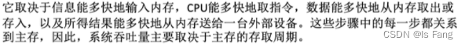
*   相应时间
    
*   基准程序：测量计算机处理速度的一种实用程序【跑分软件】
    

### 常用时间单位

第二章
===

1\. 进制转换
--------

  
为什么计算机采用二进制

*   可以使用两个稳定状态的物理器件表示
*   1和0正好对应逻辑值真与假，方便实现逻辑运算
*   可以很方便的使用逻辑门电路实现算术运算

各种进制常见的书写方式  
  
真值与机器数  

2\. 字符与字符串
----------

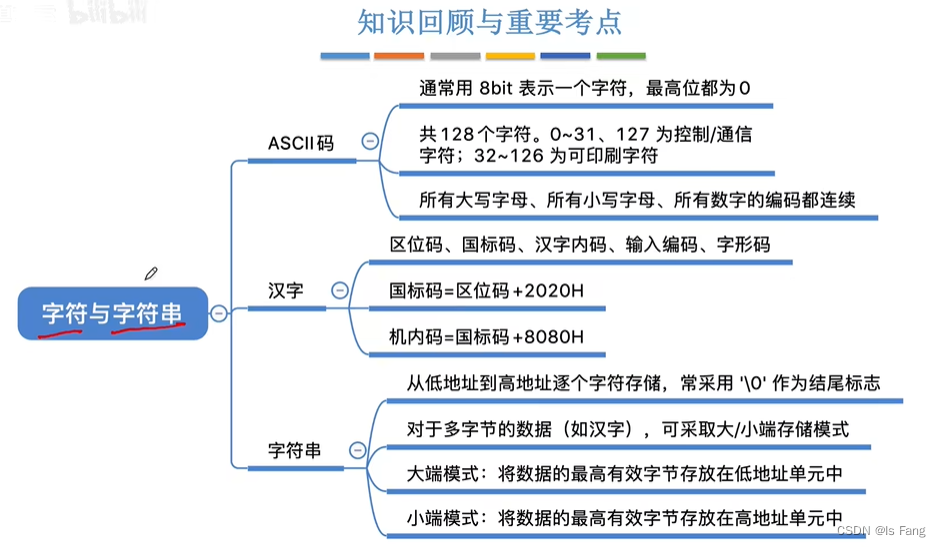

3\. 校验码
-------

### 校验原理

位错误：某个比特位发生错误  
码字：由若干位代码组成的一个字【分为合法码字和非法码字】  
两个码字的距离：将两个码字`逐位进行对比`，具有`不同的位的个数`则成为两个码字间的距离  
码距：一个编码方案可能有若干个合法码字，各`合法码字`的最小距离成为码距

*   当码距 = 1时，无检错能力
*   当码距 = 2时，有检错能力
*   当码距 = 3时，可能具有检错，纠错能力

注意：采用三个比特位传输数据，当位错误有1个时，可以检错，但位错误为2时，可能没有检错能力，这就循环冗余校验的由来

### 奇偶校验码

奇校验：整个校验码（有效信息位和校验位）中1的个数为奇数  
偶校验：整个校验码（有效信息位和校验位）中1的个数为偶数

偶校验码的硬件实现：各信息进行异或（模2加）运算，得到的结果即为偶校验位

*   异或运算====》》异得1，同得0

偶校验的实现：所有位（包含校验位）进行异或运算，若结果为1则表示出错（两个比特位发生错误也可能导致结果为0）

### 海明校验码

海明码设计思路：将信息位分组进行偶校验->多个校验位，可以携带多种信息（对与错，错误位置）

求解步骤：

*   确定校验位个数（k个校验位，n个信息位）  
    
    
*   确定校验位分布
    
    *   p1，p2，p3分别在1，2，4，8，16
    *   空出来的其他位置依次填入信息位
    *   例如n=4的时候，k=3，此时分布情况如下  
        
*   求校验位
    
    *   将信息位的位置序号用k位二进制数表示
    *   校验位pi与位置序号第i位`为1`的信息位归为同一组，进行偶校验
    *   例如：  
        
*   纠错  
    
    
    *   例如校验方程如下：  
        

补充：

*   海明码有1位纠错，2位检错能力
    
*   为了区分1位错和2位错，还需要添加“全校验位”对整体进行偶检验
    
*   例如：
    
*   注意编号的顺序
    

### 循环冗余校验码

实例：  
  
计算校验位：模2除看被除数最高位为1则商为1，最高位为0则商为0。模2减也是异或运算，得到余数  
  
  
循环冗余校验可以检验错误，同时也可以纠错（前提是信息位不能过多），实际应用中常用来检错  
满足：  

循环冗余的体现  

4\. 定点数的表示
----------

对比：  
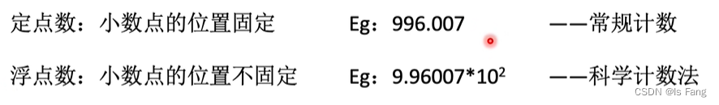  
二进制的定点数与浮点数也类似

### 无符号数

*   n位无符号数表示范围为0到2的n次方减1
*   通常只有无符号整数，没有无符号小数

### 有符号数

#### 原码

关于小数点的位置，是用来确定尾数的位权  
  
例子：

  
原码的取值范围：  

#### 反码

*   正数的反码和原码一样
*   负数的反码在原码的基础上数值位取反
*   定点整数和定点小数都一样
*   反码只是原码到补码的中间状态，实际上没有用处

反码的取值范围：  

#### 补码

*   正数的补码和原码一样
*   负数的补码是反码的末尾+1（要考虑进位）
*   补码真值0只有一种表示形式
*   

补码的取值范围：  

`在定点整数和定点小数中，负数的补码转化到原码的步骤和负数的原码转化到补码的步骤一样，通过取反+1`

#### 移码

*   在补码的基础上将符号位取反，注意，移码只用于整数不用于小数
*   移码的真值0也只有一种表示方式

移码的取值范围：  
  
移码的特性（真值的递增和移码的递增相同）适用于比较两个二进制数的大小，先出现1的大  

#### 原码、反码、补码、移码之间的对比

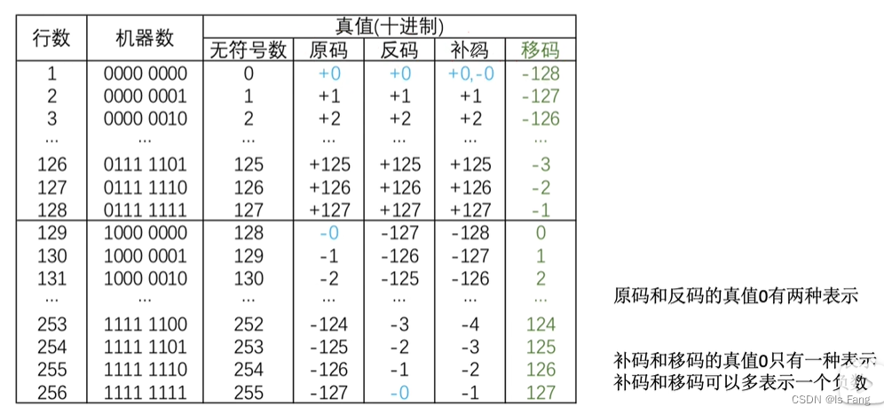  
取值范围之间的对比：

技巧：  

#### 原码、补码、移码的作用

对于原码计算，运算器需要针对负数的符号位采用减法器进行计算，需要在硬件上设计，较为麻烦  

通过取模求余数的方式  
关于模运算的性质  

*   模 = a的绝对值+a的补数
*   模n可以把余数分为0到n，也就是取值范围，

对于上述的14-14可以用加法替换，假设计算的位数为8位，也就是说取值范围为0到2的8次方-1，那么就意味着是模2的8次方，所以-14的补数 = 2的8次方-14的绝对值 = -14的补码

  
补码的作用：使用补码可以将减法操作转变为等价的加法，ALU中无须集成减法器，执行加法操作时，符号位一起参加运算

5\. 定点数的运算
----------

### 移位运算

#### 算数移位：

  
  

总结：  
  
由于位数有限，有时候无法精确的等效乘除法

#### 逻辑移位：

  
应用在颜色RGB值计算

#### 循环移位：

带进位位应用于大于8比特的值，移出的位放在进位位，原进位位补上空缺  
  
应用于大端存储和小端存储之间的转化

### 加减运算

#### 原码的加减法：

#### 补码的加减法：

*   补码的加减法都会转化为加法，符号位也参与运算

#### 溢出判断：

设计硬件实现溢出的判断  
  
方法一：  
方法二：  
  
方法三：

#### 符号扩展：

短数据扩展为长数据  
int - > long  

### 乘法运算

#### 乘法运算的思想

二进制手算乘法  

#### 原码的一位乘法

略

#### 补码的一位乘法

略

### 除法运算

略

6\. 强制类型转换
----------

c语言中定点整数都是用补码的形式存储的

实例：无符号数转有符号数，长整数转短整数，短整数转长整数  
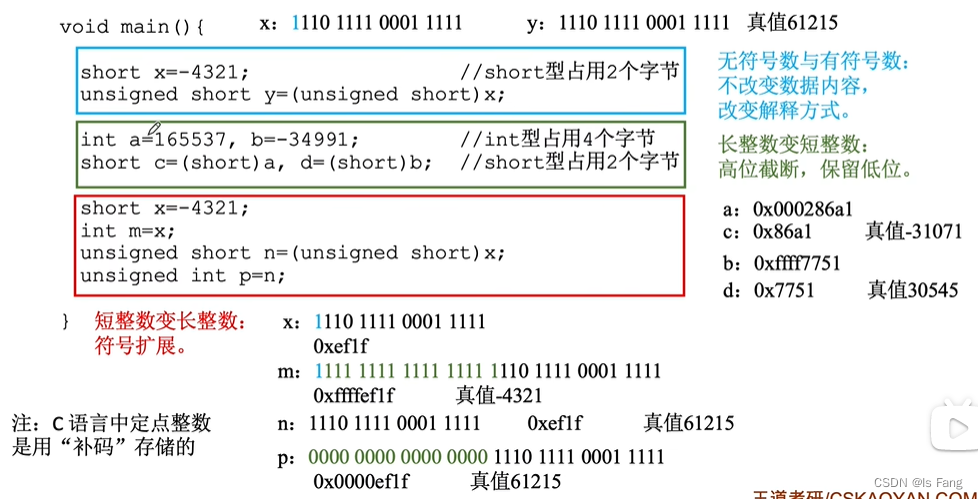

7\. 数据的存储和排列
------------

大小端模式的区别：

*   大端模式便于人类阅读
*   小端模式便于机器处理，CPU的运算操作可以从小字节序开始处理

边界对其

*   拿时间换空间
*   字地址转化为字节地址，逻辑左移2位  
    

8\. 浮点数的表示
----------

略

9\. 浮点数的运算
----------

略

第三章
===

主存简单模型和寻址概念
-----------

存储体内部名词概念  
  
译码器：完成n位地址到2的n次方个控制信号的转换【该控制信号的特点是只有1个存储字长有效，其他无效】  
主存的简单模型如下：

  
总容量与地址线的位数和数据线的位数有关  
  
地址线的位数表示存储单元的个数  
数据线的位数表示存储字长的大小

  
寻址：按照不同大小的单元来切分存储器能够切分成多少分  

存储器RAM
------

半导体存储芯片的基本结构  
  
片选线配合译码器可以实现容量扩充  
两种RAM的比较  
  
现在计算机采用的主存大多数是SDRAM

ROM(只读存储器)
----------

因为RAM里面的数据容易丢失，所以采用ROM替代，指挥CPU去辅存里面将开机指令放到RAM中  

*   系统程序用ROM
*   用户程序用RAM

ROM的分类  

存储器基本概念
-------

各硬件关系图  
  
高速缓冲存储器（cache）  
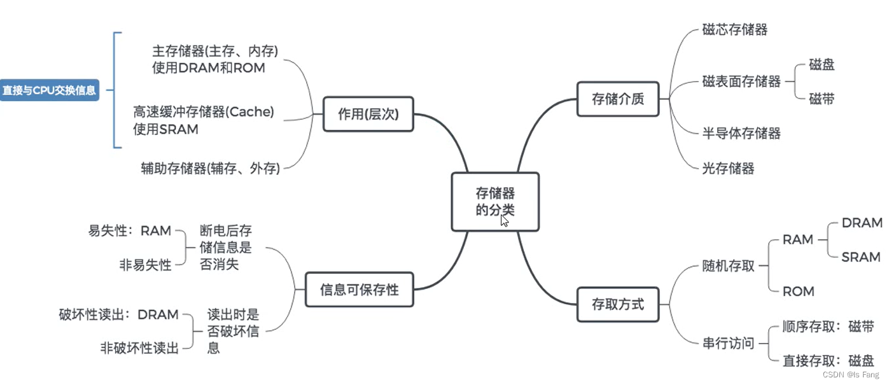  
存储器的层次化结构  

CPU中还有寄存器  

主存与CPU的连接
---------

地址总线并行  
因为存储芯片只能传输1位数据，而8个存储芯片可以组成一个存储器，容量就是8KB = 64 Kbit  

通过非门的设计可以使得一个地址线有两种状态，进而控制两个存储芯片的片选信号  
译码片选法（译码器）：将n条线转化为2的n次方个片选信号

  
译码器中，地址线的信号与控制线的信号的关系是：地址线的真值表示信号中的位

  
字位同时扩展

*   选择存储器芯片
*   与cpu进行连接

双端口RAM和多模块存储器
-------------

存储周期=存取时间+恢复时间

提高存储器工作速度，加快主存与CPU之间的连接  

高速缓冲存储器的局部性原理及性能分析
------------------

存储体系变为： “cache - 主存” 层次  
时间缩短的原理是因为已经有一部分数据放到cache中，cpu与cache进行数据传输

Cache 地址映射
----------

略

Cache 替换算法及写策略
--------------

略

虚拟存储器
-----

第四章
===

指令系统
----

指令：操作码（定长操作码与扩展操作码）+地址码

指令寻址方式

*   给出下一条指令地址
*   给出操作的对象的地址

CISC和RISC

  
对比：  
  
指令流水线：同一个时刻让不同的指令占用不同的硬件资源

第五章
===

CPU的功能和基本结构
-----------

CPU的五大功能  

控制器的作用：  
  
专用数据通路：通用寄存器组与cpu的运算器连接，用于存放操作数：  
  
采用单总线方式的运算器：  
  
cpu内部的控制器：  
  
cpu运算器和控制器图  
  
cpu的基本结构可以分为四个部分

*   组合逻辑电路
*   时序逻辑电路
*   寄存器
*   中断系统

可见即可以编程  

指令周期的数据流
--------

指令周期 = 取值周期 + 执行周期  
一个指令周期包含多个机器周期，而一个机器周期又可以包含若干个时钟周期  
  
间接周期：也就是译码之后得到的不是操作对象，而是操作对象的地址  

指令周期流程（通过触发器来判断执行到哪一步）  

取指周期  
  
间址周期（下图表示的是将取值周期完成之后IR值传送到MAR，为了读操作对象）  

中断周期

  
指令执行方案  
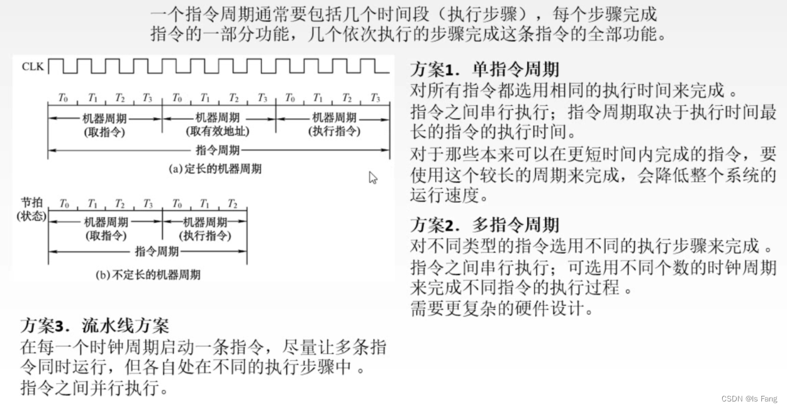

数据通路——CPU内部单总线方式
----------------

数据通路：  

内部总线与系统总线：  
  
数据通路的三类描述  

数据通路——专用数据通路
------------

控制器——硬布线
--------

控制器——微程序
--------

指令流水线的概念及性能指标
-------------

  
各功能部件的利用率提升了

影响流水线的元素和分类
-----------

第六章
===

总线的概念和分类
--------

总线的特点  
  
线路：真实的导线  
数据通路：不同指令阶段，数据流动形成的路径

为什么要用总线？  
  
总线的特性：  

### 总线的分类：

#### 按数据传输格式

串行与并行的优缺点  

#### 按总线功能

  
关于系统总线：  

#### 按时序控制方式

略

### 系统总线的结构

#### 单总线结构

  
一组总线包含地址，数据，控制总线

#### 双总线结构

  
优点是CPU可以将任务交给通道（也是处理器，会将存放在主存中的任务指令拿出来，去操作IO接口），如此低速IO设备就会从总线上分离出来

#### 三总线结构

考虑到IO设备的速度有不尽相同，高速外设需要快速获取主存中的数据，所以增加DMA  

#### 四总线结构

性能指标
----

  
关于总线带宽的计算  
  
关于串行总线与并行总线的速度问题  
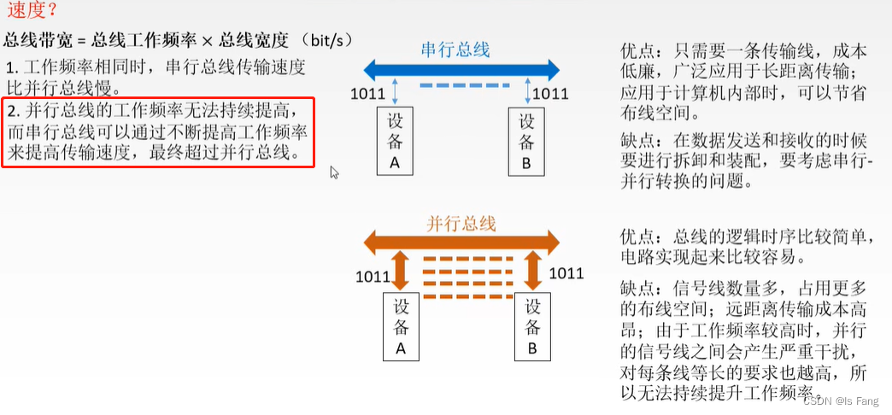

总线仲裁
----

总线仲裁的分类：

*   集中仲裁方式
    
    *   链式查询方法
    *   计数器定时查询方法
    *   独立请求方式
*   分布仲裁方式
    

### 链式查询方式

三条线：总线允许，总线忙，总线请求  
优先级是固定的！

### 计数器定时查询方法

  
解决优先级固定问题，改为设备地址

### 独立请求方式

  
总结：  
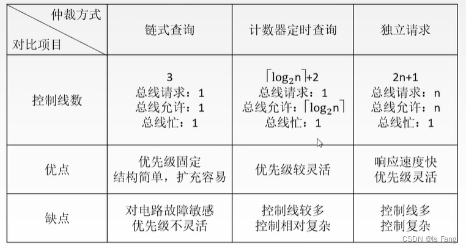  
分布仲裁方式  

总线操作和定时
-------

总线标准
----

第七章
===

IO系统基本概念
--------

> IO的演变过程是为了释放CPU压力

IO系统的演变过程  

中断方式是为了避免CPU采用程序查询的方式，造成CPU被占用

而DMA方式为了避免高速外设采用中断方式造成CPU不断的停止，DMA总线利用DMA方式可以直接与主存交换信息，无须调用中断服务程序

DMA方式是在外设发出DMA请求时不对主存进行访问，此时外设对该主存占用  
  
IO方式简介  

输入与输出
-----

外部设备定义  
  
主机包含cpu和主存

关于显示器的一些概念  
  
刷新频率大于30Hz才不会感到闪烁

外存储器
----

磁盘存储器  
  
磁盘性能之平均存取时间

  
固态硬盘  
  
固态硬盘基于闪存，而闪存又是基于E2PROM

IO接口
----

这里的io接口是与设备控制器连接的部分  
  
I/O接口的基本结构  
  
基本流程  
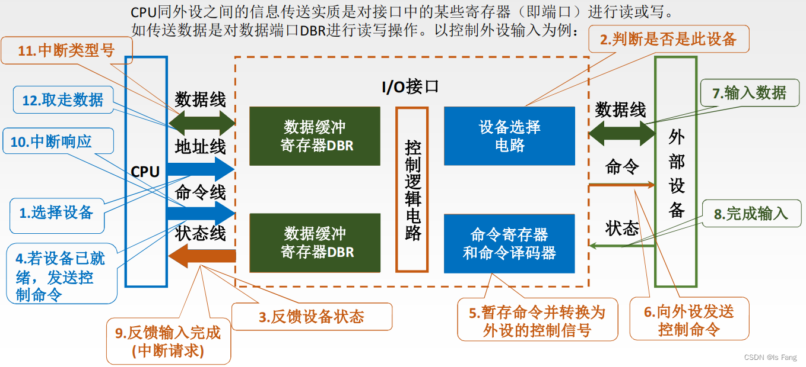  
CPU访问的是IO接口中的端口（即寄存器）  
  
编址——IO端口  

IO方式
----

### 程序查询方式

CPU查询等待和CPU控制数据传送是通过程序执行的方式（软件），导致CPU无法执行主程序  
  
缺点是CPU需要查询等待  

### 中断系统

中断请求的分类2种方式  

  
中断请求标记  
  
中断判优（软硬件设计）  
  
关于优先级的设定  
  
中断处理阶段  
  
中断隐指令  
  
关于硬件向量法  
  
向量地址是由中断向量地址形成部件完成的，  
向量地址包含各个中断程序的中断向量地址  
设计向量地址的目的是为了无须修改中断向量地址形成部件，只需要修改主存中的中断向量

中断服务程序

  
单重中断和多重中断  

### 程序中断方式

程序中断的作用  
  
程序中断方式过程  

### DMA方式

DMA 控制器的功能  
  
CPU让出的系统总线交给DMA控制器进行控制，此时CPU不能访存

DMA结构

  
DMA传输过程  
  
传输过程与数据传递细化  

解决冲突  

DMA方式的特点  
  
中断与DMA对比  
